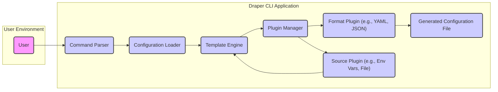

# Project Design Document: Draper - Application Configuration Management

**Version:** 1.1
**Date:** October 26, 2023
**Author:** Gemini (AI Language Model)

## 1. Introduction

This document provides an enhanced and detailed design overview of the Draper project, a tool designed to streamline the generation and management of application configurations. This document serves as a foundational reference for understanding the system's architecture, individual components, and the flow of data within it. This detailed understanding is crucial for subsequent threat modeling exercises.

Draper's primary objective is to simplify the often complex process of creating and maintaining configuration files across diverse application environments. It achieves this by enabling users to define reusable configuration templates and then generate environment-specific configurations by substituting predefined variables.

## 2. Goals and Objectives

*   **Enhanced Configuration Management:** To provide a more intuitive and efficient method for managing application configurations across various deployment environments.
*   **Robust Template-Based Generation:** To facilitate the creation of configuration files from highly reusable and maintainable templates.
*   **Flexible Variable Substitution:** To empower users with a flexible system for defining and substituting variables into templates, enabling environment-specific customization.
*   **Extensible Plugin Architecture:** To offer a well-defined plugin architecture that allows for seamless integration of support for new configuration file formats, data sources, and functionalities.
*   **User-Friendly Command-Line Interface (CLI):** To provide a clear and intuitive command-line interface for all interactions with the Draper system.
*   **Improved Error Handling and Reporting:** To provide more informative error messages and better handle unexpected situations during configuration generation.

## 3. System Architecture

### 3.1. High-Level Architecture

The Draper system is architected around the following core components:

*   **User:** The individual or system interacting with Draper through the command-line interface to generate configuration files.
*   **Draper CLI:** The primary entry point for users, responsible for accepting commands and orchestrating the configuration generation process.
*   **Command Parser:**  This component is responsible for interpreting user commands, extracting arguments, and validating the syntax.
*   **Configuration Loader:**  Loads and validates various configuration files required by Draper, including the project configuration and variable definitions.
*   **Template Engine:**  Processes template files, identifying placeholders and substituting them with corresponding variable values.
*   **Plugin Manager:**  A central component that manages the discovery, loading, and execution of both Format and Source plugins.
*   **Format Plugin (e.g., YAML, JSON):**  Specialized plugins responsible for rendering the final configuration data into a specific file format.
*   **Generated Configuration File:** The resulting output file containing the application configuration, formatted according to the selected plugin.
*   **Source Plugin (e.g., Env Vars, File):** Plugins that provide mechanisms for loading variable data from external sources.

### 3.2. Component-Level Architecture

#### 3.2.1. Draper CLI

*   **Purpose:** To provide the main interface through which users interact with the Draper application.
*   **Responsibilities:**
    *   Receiving and interpreting commands entered by the user.
    *   Performing initial validation of user-provided input.
    *   Delegating specific tasks to the appropriate core logic components.
    *   Presenting feedback and output to the user.
    *   Handling command-line arguments and options.
*   **Key Modules:**
    *   `cli.py`:  Contains the main entry point for the CLI application and defines the command structure.
    *   `commands/`:  A directory containing modules that implement specific Draper commands (e.g., `generate`, `validate`, `list-plugins`).
    *   `utils/`:  Utility functions for common tasks like output formatting and error handling.

#### 3.2.2. Core Logic

*   **Purpose:** To encapsulate the core business logic and workflows for configuration generation.
*   **Responsibilities:**
    *   Managing the loading and processing of all configuration data.
    *   Orchestrating the interaction between the Template Engine and Plugin Manager.
    *   Handling variable resolution and precedence.
    *   Implementing error handling and reporting for core operations.
*   **Key Modules:**
    *   `config/`:  Handles loading and validation of Draper project configuration files.
    *   `templating.py`:  Implements the logic for loading and processing template files, including variable substitution.
    *   `variables.py`:  Manages the loading, merging, and resolution of variables from different sources.
    *   `plugins/manager.py`:  The Plugin Manager, responsible for discovering, loading, and managing available plugins.

#### 3.2.3. Plugin Architecture

*   **Purpose:** To provide a flexible and extensible mechanism for supporting diverse configuration file formats and variable sources.
*   **Responsibilities:**
    *   Defining a clear interface for developing and integrating new plugins.
    *   Allowing users to extend Draper's capabilities without modifying the core codebase.
    *   Providing a mechanism for discovering and loading available plugins.
*   **Plugin Types:**
    *   **Format Plugins:**  Responsible for converting the processed configuration data into a specific output format (e.g., YAML, JSON, INI, XML). These plugins must implement a `render(data)` method.
    *   **Source Plugins:** Responsible for loading variable data from external sources (e.g., environment variables, files, HashiCorp Vault, AWS Secrets Manager). These plugins must implement a `load()` method that returns a dictionary of variables.
*   **Plugin Interface:**
    *   Format plugins are expected to implement a `render(data: dict) -> str` method.
    *   Source plugins are expected to implement a `load() -> dict` method.
    *   Plugins should be self-contained and easily distributable.

#### 3.2.4. Configuration Files

*   **Draper Project Configuration (`draper.yaml` or `.draper.yaml`):** Defines the settings and structure for a specific Draper project.
    *   Specifies the location of template files and variable directories.
    *   Defines default variable values.
    *   Configures which plugins to use and their specific settings.
    *   May define environment-specific configurations.
*   **Template Files (`*.tpl` or similar):** Contain the structure of the target configuration file, using a templating language (e.g., Jinja2) to define placeholders for variables.
    *   Templates can include logic for conditional rendering and loops.
*   **Variable Files (`*.yaml`, `*.json`, etc.):** Contain definitions for variables that will be substituted into the templates.
    *   Support for various file formats is provided through Source Plugins.

## 4. Data Flow

```mermaid
graph LR
    subgraph "User Interaction"
        A("User Command (e.g., `draper generate`)")
    end
    subgraph "Draper CLI"
        B("Command Parser") --> C("Load Draper Project Config")
        C --> D("Plugin Manager: Load Source Plugins")
        D --> E("Source Plugin: Load Variables")
        E --> F("Load Variable Files")
        F --> G("Variable Manager: Merge Variables")
        G --> H("Load Template File")
        H --> I("Plugin Manager: Select Format Plugin")
        I --> J("Template Engine: Process Template with Variables")
        J --> K("Format Plugin: Render Configuration Data")
        K --> L("Generated Configuration File")
    end
    A --> B
    style A fill:#f9f,stroke:#333,stroke-width:2px
    style B fill:#ccf,stroke:#333,stroke-width:2px
    style C fill:#ccf,stroke:#333,stroke-width:2px
    style D fill:#ccf,stroke:#333,stroke-width:2px
    style E fill:#ccf,stroke:#333,stroke-width:2px
    style F fill:#ccf,stroke:#333,stroke-width:2px
    style G fill:#ccf,stroke:#333,stroke-width:2px
    style H fill:#ccf,stroke:#333,stroke-width:2px
    style I fill:#ccf,stroke:#333,stroke-width:2px
    style J fill:#ccf,stroke:#333,stroke-width:2px
    style K fill:#ccf,stroke:#333,stroke-width:2px
    style L fill:#ccf,stroke:#333,stroke-width:2px
```

The process of generating a configuration file involves the following steps:

*   The user initiates the process by issuing a command to the Draper CLI.
*   The Command Parser interprets the command and extracts relevant parameters.
*   The Draper project configuration is loaded, defining the project's settings.
*   The Plugin Manager loads the configured Source Plugins.
*   Source Plugins are invoked to load variables from their respective sources (e.g., environment variables, files).
*   Variable files specified in the project configuration are loaded.
*   The Variable Manager merges variables from all sources, handling precedence rules.
*   The specified template file is loaded into the Template Engine.
*   The Plugin Manager selects the appropriate Format Plugin based on the desired output format.
*   The Template Engine processes the template, substituting variables from the Variable Manager.
*   The processed configuration data is passed to the selected Format Plugin.
*   The Format Plugin renders the final configuration file in the specified format.

## 5. Key Technologies

*   **Core Programming Language:** Python 3.8+
*   **Templating Engine:** Jinja2 (for template processing and variable substitution)
*   **CLI Framework:** Click (for building user-friendly command-line interfaces)
*   **Plugin Management:** Python's `setuptools` entry points for dynamic plugin discovery and loading.
*   **Configuration File Parsing:**
    *   PyYAML for parsing YAML configuration files.
    *   json standard library for parsing JSON configuration files.
    *   Potentially `configparser` for INI files if supported.
*   **Testing Framework:** pytest (for unit and integration testing).
*   **Logging:** Python's `logging` module for application logging.

## 6. Deployment

Draper is designed to be deployed as a command-line tool, typically installed on developer workstations or within CI/CD pipelines.

*   **Installation:** Users can install Draper using `pip`: `pip install draper-cli`.
*   **Distribution:**  Packaged and distributed via Python Package Index (PyPI).
*   **Execution:** Users execute Draper commands directly from their terminal using the `draper` command.
*   **Dependencies:**  Installation will automatically handle dependencies specified in the `setup.py` file.

## 7. Security Considerations

This section outlines key security considerations for the Draper project. This information will be further elaborated upon during the dedicated threat modeling process.

*   **Input Validation and Sanitization:**
    *   The Draper CLI must rigorously validate all user inputs, including command arguments and configuration file paths, to prevent command injection and path traversal vulnerabilities.
    *   Variable data loaded from external sources should be sanitized to prevent unexpected behavior during template rendering.
*   **Template Security:**
    *   The templating engine (Jinja2) should be used in a way that prevents the execution of arbitrary code within templates. Avoid using features that allow for direct code execution.
    *   Consider implementing a "safe" or "sandboxed" environment for template rendering.
*   **Secret Management:**
    *   Directly embedding secrets (API keys, passwords) within templates or configuration files is strongly discouraged.
    *   Draper should provide mechanisms or guidance for integrating with secure secret management solutions (e.g., HashiCorp Vault, AWS Secrets Manager, environment variables with restricted access).
    *   Source Plugins for secret management should be designed with security best practices in mind.
*   **Plugin Security:**
    *   Plugins represent a potential attack surface. A mechanism for verifying the authenticity and integrity of plugins should be considered (e.g., signing).
    *   Plugins should operate with the least privileges necessary.
    *   Consider sandboxing plugins to limit their access to system resources.
    *   Clearly document the security responsibilities of plugin developers.
*   **File System Access Control:**
    *   Draper requires read access to template and configuration files and write access to the output directory. Permissions should be configured to adhere to the principle of least privilege.
    *   Care should be taken to prevent Draper from writing to arbitrary file system locations.
*   **Dependency Management:**
    *   All project dependencies should be regularly reviewed and updated to patch known security vulnerabilities.
    *   Use tools like `pip-audit` or `safety` to scan for vulnerabilities in dependencies.
*   **Error Handling and Information Disclosure:**
    *   Error messages should be informative but should not reveal sensitive information about the system's internal workings or configuration.
    *   Implement proper logging and monitoring to detect and respond to potential security incidents.
*   **Secure Defaults:**
    *   Draper should be configured with secure defaults. For example, features that could introduce security risks should be disabled by default.

## 8. Future Considerations

*   **Graphical User Interface (GUI):**  Explore the feasibility of developing a GUI for users who prefer a visual interface for managing configurations.
*   **Centralized Configuration Management Integration:** Investigate options for integrating Draper with centralized configuration management systems like Consul or etcd.
*   **Version Control System Integration:**  Provide built-in support for integrating with version control systems (e.g., Git) to track changes to templates and configurations.
*   **Advanced Templating Features:**  Consider adding more advanced templating features, such as custom filters and functions, while maintaining security.
*   **Configuration Validation and Testing:** Implement features for validating generated configurations against predefined schemas or running tests against them.
*   **Role-Based Access Control (RBAC) for Plugin Management:**  For larger deployments, consider implementing RBAC for managing and deploying plugins.

This improved design document provides a more comprehensive and detailed understanding of the Draper project's architecture and functionality. It serves as a solid foundation for conducting thorough threat modeling and ensuring the security of the system.
