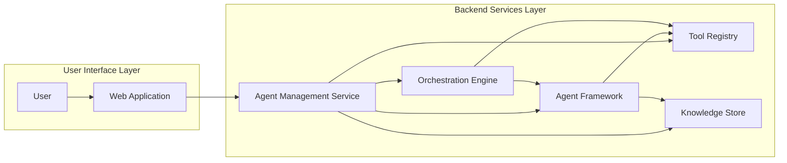
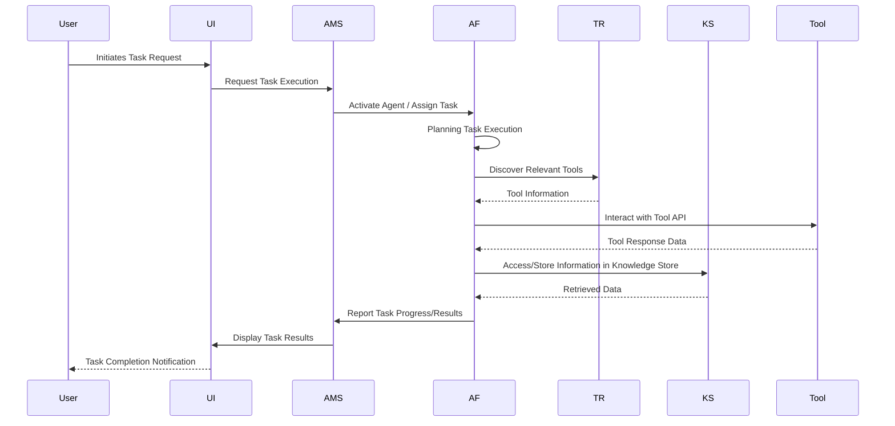
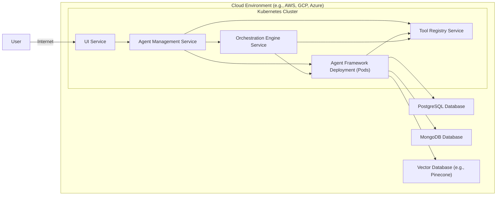

## Project Design Document: Draper - AI Agent Platform

**Version:** 1.1
**Date:** October 26, 2023
**Prepared By:** Gemini AI Architect

### 1. Introduction

This document provides an enhanced design specification for the Draper project, an open-source platform designed for the creation and management of AI agents. This document details the system's architecture, individual components, and data flow, serving as a foundational reference for subsequent threat modeling activities and ongoing development.

### 2. Goals and Objectives

The core goals of the Draper project are:

*   To establish a versatile and extensible framework for the development of sophisticated AI agents.
*   To empower agents with the ability to interact seamlessly with a diverse range of tools and data sources.
*   To offer an intuitive user interface for efficient agent management and activity monitoring.
*   To cultivate a thriving community focused on the advancement of AI agent development.

Key objectives include:

*   Developing a robust core agent framework incorporating essential functionalities such as planning, memory management (both short-term and long-term), and action execution.
*   Creating a standardized and secure mechanism for integrating external tools and APIs, ensuring controlled access and data handling.
*   Implementing a secure, scalable, and resilient platform architecture capable of handling a growing number of agents and interactions.
*   Providing comprehensive documentation, tutorials, and illustrative examples to facilitate developer adoption and contribution.

### 3. High-Level Architecture

The Draper platform is structurally composed of the following key components, each with distinct responsibilities:

*   **User Interface (UI):** A web-based application providing users with a graphical interface to interact with the platform, manage agents, and observe their operations.
*   **Agent Management Service (AMS):**  The central service responsible for the complete lifecycle management of AI agents, including creation, deployment, monitoring, and termination.
*   **Agent Framework (AF):** The foundational library and runtime environment where AI agents are instantiated and executed. This includes core modules for reasoning, memory, and action execution.
*   **Tool Registry (TR):** A curated repository containing metadata and access information for a variety of tools that agents can leverage to perform tasks.
*   **Knowledge Store (KS):** A persistent storage solution for agents to store and retrieve various forms of information, including memories, learned knowledge, configurations, and contextual data.
*   **Orchestration Engine (OE):**  The component responsible for managing the execution flow of agents, including scheduling tasks, coordinating interactions between agents and tools, and handling concurrent operations.

### 4. Detailed Component Design

#### 4.1. User Interface (UI)

*   **Purpose:** To provide a user-friendly and intuitive interface for interacting with the Draper platform's functionalities.
*   **Functionality:**
    *   **Agent Definition and Configuration:** Allows users to define agent properties, goals, and initial configurations.
    *   **Agent Lifecycle Management:** Enables users to deploy, start, stop, restart, and delete agents.
    *   **Activity Monitoring and Logging:** Provides real-time views of agent activities, logs, and performance metrics.
    *   **Memory and Knowledge Inspection:** Offers the ability to inspect agent memory contents and stored knowledge.
    *   **Tool Integration Management:** Facilitates the management of tool integrations and access permissions.
    *   **User Authentication and Authorization:** Securely manages user access and permissions within the platform.
*   **Key Technologies:** Likely a modern reactive JavaScript framework such as React, Vue.js, or Angular, utilizing component-based architecture and potentially a state management library like Redux or Vuex.
*   **Communication:** Communicates with the Agent Management Service via a well-defined API, likely employing RESTful principles or GraphQL for data fetching and manipulation. Authentication tokens (e.g., JWT) will be used for secure communication.

#### 4.2. Agent Management Service (AMS)

*   **Purpose:** To orchestrate and manage the entire lifecycle of AI agents within the Draper ecosystem.
*   **Functionality:**
    *   **Agent Registration and Deregistration:** Handles the registration of new agents and the removal of existing ones.
    *   **Configuration Management:** Stores and manages agent-specific configurations and dependencies.
    *   **Deployment Orchestration:**  Initiates the deployment of agents to the Agent Framework for execution.
    *   **Health Monitoring and Status Reporting:** Continuously monitors agent health and provides status updates.
    *   **Resource Allocation:** Manages resource allocation for agents, potentially interacting with an underlying infrastructure manager.
    *   **User Authentication and Authorization for Agent Actions:** Enforces access control policies for agent-related operations.
*   **Key Technologies:**  Likely a microservice architecture built using a framework like Flask (Python) with gunicorn for production deployment, or Spring Boot (Java). A database like PostgreSQL or MySQL would be used for persistent storage of agent metadata and configurations.
*   **Communication:** Communicates with the UI, Agent Framework, Tool Registry, Knowledge Store, and Orchestration Engine via secure API endpoints. Message queues (e.g., RabbitMQ or Kafka) could be used for asynchronous communication and event handling.

#### 4.3. Agent Framework (AF)

*   **Purpose:** To provide the core runtime environment and libraries necessary for the execution and operation of AI agents.
*   **Functionality:**
    *   **Agent Base Class/Interface:** Defines the structure and interfaces for creating custom AI agents.
    *   **Planning Module:** Implements algorithms and logic for agents to plan sequences of actions to achieve their goals (e.g., using techniques like goal decomposition or hierarchical planning).
    *   **Memory Management Module:** Provides mechanisms for agents to store and retrieve information, including:
        *   **Short-Term Memory:**  For immediate context and working memory.
        *   **Long-Term Memory:** For persistent storage of learned knowledge and experiences, potentially using vector embeddings for semantic search.
    *   **Action Execution Module:** Handles the execution of actions, including interacting with tools and external systems via their APIs.
    *   **Observation Processing Module:**  Processes and interprets information received from the environment or tools, converting it into a usable format for the agent.
    *   **State Management:** Manages the internal state of each running agent.
    *   **Logging and Debugging:** Provides tools and mechanisms for logging agent behavior and debugging issues.
*   **Key Technologies:** Primarily implemented in Python, leveraging libraries such as Langchain or similar agent development frameworks. May utilize libraries for natural language processing (e.g., NLTK, SpaCy), machine learning (e.g., scikit-learn, TensorFlow, PyTorch), and reasoning.
*   **Communication:** Communicates with the Agent Management Service for task assignment and status updates, the Tool Registry for tool discovery, and the Knowledge Store for memory access.

#### 4.4. Tool Registry (TR)

*   **Purpose:** To serve as a central catalog and management system for available tools that agents can utilize.
*   **Functionality:**
    *   **Tool Registration and Discovery:** Allows for the registration of new tools and provides an interface for agents to discover available tools based on their capabilities.
    *   **Metadata Storage:** Stores detailed metadata about each tool, including its description, input/output parameters, API endpoints, authentication requirements, and usage guidelines.
    *   **Access Control:**  Manages access permissions for tools, ensuring that only authorized agents can utilize specific tools.
    *   **Tool Health Monitoring (Optional):** May include mechanisms to monitor the health and availability of registered tools.
*   **Key Technologies:** Could be implemented as a lightweight service with a database backend (e.g., PostgreSQL or a NoSQL database like MongoDB). API documentation standards like OpenAPI (Swagger) could be used to describe tool interfaces.
*   **Communication:** Communicates with the Agent Management Service for tool registration and management, and with the Agent Framework for tool discovery and access information retrieval.

#### 4.5. Knowledge Store (KS)

*   **Purpose:** To provide a robust and persistent storage solution for agent knowledge, memories, and configurations.
*   **Functionality:**
    *   **Memory Storage:** Stores both short-term and long-term memories for agents, potentially using different storage mechanisms based on access patterns and data volume.
    *   **Knowledge Graph Storage (Optional):** May support the storage of structured knowledge in the form of knowledge graphs.
    *   **Configuration Storage:** Stores agent-specific configurations and settings.
    *   **Efficient Querying and Retrieval:** Provides efficient mechanisms for querying and retrieving information, including semantic search capabilities using vector embeddings.
    *   **Data Persistence and Backup:** Ensures the durability and availability of stored data through appropriate persistence and backup strategies.
*   **Key Technologies:**  Likely a combination of database technologies. A vector database like Pinecone or Weaviate could be used for efficient similarity searches in long-term memory. A traditional relational database like PostgreSQL or a document database like MongoDB could be used for other types of data.
*   **Communication:** Communicates with the Agent Management Service for storing and retrieving agent configurations, and with the Agent Framework for accessing and updating agent memories and knowledge.

#### 4.6. Orchestration Engine (OE)

*   **Purpose:** To manage the execution flow of agents, coordinate interactions, and ensure efficient resource utilization.
*   **Functionality:**
    *   **Task Scheduling and Assignment:** Schedules agent tasks and assigns them to available agents or Agent Framework instances.
    *   **Concurrency Management:** Manages concurrent execution of multiple agents and tasks.
    *   **Inter-Agent Communication (Optional):** May facilitate communication and data exchange between different agents.
    *   **Workflow Management:**  Allows for the definition and execution of complex workflows involving multiple agents and tools.
    *   **Resource Management:**  Optimizes the utilization of resources allocated to agents.
    *   **Monitoring and Tracking:** Monitors the progress of tasks and agent activities.
*   **Key Technologies:** Could be implemented using a workflow engine like Apache Airflow or a custom-built service leveraging message queues and task management libraries.
*   **Communication:** Communicates with the Agent Management Service for receiving task requests and reporting status, and with the Agent Framework for initiating and monitoring agent execution.

### 5. Data Flow

The following describes a typical data flow scenario for an agent executing a task initiated by a user:

1. **User Task Initiation:** A user interacts with the UI to initiate a specific task or requests an agent to perform an action.
2. **Request to AMS:** The UI sends a request to the Agent Management Service, specifying the desired task and potentially the target agent.
3. **Agent Selection and Activation:** The AMS identifies the appropriate agent (or creates a new one if necessary) and ensures it is active and ready for execution.
4. **Task Assignment to AF:** The AMS (or the Orchestration Engine, depending on the complexity of the task) assigns the task to the designated agent within the Agent Framework.
5. **Planning and Tool Discovery:** The agent within the Agent Framework utilizes its planning capabilities to determine the necessary steps to complete the task. If external tools are required, the agent queries the Tool Registry to discover suitable options.
6. **Tool Interaction:** The agent interacts with the identified tools by sending requests to their respective APIs, adhering to the tool's specified protocols and authentication methods.
7. **Memory Access and Updates:** The agent accesses the Knowledge Store to retrieve relevant information needed for the task or to store new information learned or generated during the process.
8. **Action Execution and Observation:** The agent executes actions based on its plan and observes the outcomes or responses from the environment or tools.
9. **Progress and Result Reporting to AMS:** The agent reports its progress, status updates, and final results back to the Agent Management Service.
10. **Response to UI:** The Agent Management Service relays the information back to the UI, providing the user with the results of the task.

### 6. Technology Stack (Anticipated)

*   **Primary Programming Languages:** Python (strongly anticipated for the Agent Framework and potentially for backend services), JavaScript/TypeScript (likely for the UI).
*   **Frontend Web Framework:**  Likely React, Vue.js, or Angular for building the interactive user interface, potentially with associated libraries for state management and routing.
*   **Backend Frameworks:** Flask or FastAPI (Python) for building RESTful APIs for backend services, or Spring Boot (Java) as an alternative.
*   **Database Technologies:**
    *   **Relational Database:** PostgreSQL or MySQL for storing structured data like agent metadata and configurations.
    *   **NoSQL Database:** MongoDB for flexible data storage, potentially for agent logs or unstructured data.
    *   **Vector Database:** Pinecone, Weaviate, or Milvus for efficient similarity search in agent long-term memory.
*   **Message Broker (Optional):** RabbitMQ or Kafka for asynchronous communication between services and event-driven architectures.
*   **Containerization Technology:** Docker for packaging and deploying individual components as containers.
*   **Container Orchestration:** Kubernetes for managing and scaling containerized applications.
*   **Cloud Provider (Likely):** AWS, Google Cloud Platform (GCP), or Azure for hosting the platform infrastructure and utilizing managed services.

### 7. Deployment Architecture

The Draper platform is envisioned to be deployed as a microservices architecture, leveraging containerization and orchestration technologies for scalability and resilience. A potential deployment scenario involves:

*   **UI Deployment:** The web application is deployed on a web server or a Content Delivery Network (CDN) for efficient content delivery.
*   **Backend Services Deployment:** Containerized instances of the Agent Management Service, Tool Registry Service, and Orchestration Engine Service are deployed within a Kubernetes cluster. Load balancers distribute traffic across multiple instances for high availability.
*   **Agent Framework Deployment:** The Agent Framework could be integrated within the Agent Management Service or deployed as a separate pool of scalable worker nodes within the Kubernetes cluster, allowing for dynamic scaling based on demand.
*   **Knowledge Store Deployment:**  The Knowledge Store components (relational, NoSQL, and vector databases) could be deployed as managed database services provided by the cloud provider or as dedicated database clusters within the Kubernetes environment.

### 8. Security Considerations (Preliminary)

As a precursor to a dedicated threat modeling exercise, the following preliminary security considerations are identified:

*   **Secure Authentication and Authorization:** Implementing robust mechanisms for verifying user and agent identities and enforcing granular access control to platform resources and agent functionalities. This includes secure password management, multi-factor authentication (MFA), and role-based access control (RBAC).
*   **API Security:** Securing inter-component APIs using authentication (e.g., API keys, JWT), authorization (e.g., OAuth 2.0), and rigorous input validation to prevent injection attacks and unauthorized access. TLS encryption should be enforced for all API communication.
*   **Data Security and Encryption:** Ensuring the confidentiality and integrity of sensitive data stored in the Knowledge Store and during transmission. This involves implementing encryption at rest (e.g., using database encryption features) and in transit (TLS). Data masking and anonymization techniques should be considered for sensitive data.
*   **Tool Interaction Security:** Implementing safeguards to ensure that agents interact with external tools securely and prevent malicious tool usage. This may involve sandboxing agent execution environments, implementing strict permission controls for tool access, and validating tool responses.
*   **Agent Security and Isolation:** Preventing agents from performing unauthorized actions or accessing sensitive information beyond their designated scope. This could involve using containerization to isolate agent execution environments and implementing security policies within the Agent Framework.
*   **Infrastructure Security:** Securing the underlying infrastructure (servers, networks, containers, Kubernetes cluster) against vulnerabilities through regular patching, security hardening, and network segmentation.
*   **Input Validation and Sanitization:**  Thoroughly validating and sanitizing all user inputs and data received from external sources to prevent injection attacks (e.g., SQL injection, cross-site scripting).
*   **Rate Limiting and Abuse Prevention:** Implementing rate limiting on API endpoints to protect against denial-of-service attacks and abuse.
*   **Comprehensive Logging and Monitoring:** Implementing centralized logging and monitoring of all platform components and agent activities to detect and respond to security incidents promptly. Security Information and Event Management (SIEM) systems can be used for advanced threat detection.

### 9. Future Considerations

*   **Enhanced Scalability and Performance:** Continuously optimizing the platform architecture and components to handle a growing number of agents, users, and interactions with minimal performance impact.
*   **Advanced Extensibility Mechanisms:**  Developing more flexible and standardized ways to add new tools, agent functionalities, and integrations, potentially through a plugin architecture.
*   **Agent Collaboration and Coordination:**  Implementing features to enable agents to collaborate and coordinate on complex tasks, potentially through inter-agent communication protocols and shared knowledge spaces.
*   **Sophisticated Memory Management Techniques:** Exploring and implementing more advanced memory models for agents, such as episodic memory and reflective learning capabilities.
*   **Improved Observability and Debugging Tools:**  Providing richer tools and dashboards for monitoring, debugging, and analyzing agent behavior and platform performance.
*   **Federated Learning and Agent Training:** Investigating the potential for incorporating federated learning techniques to train agents collaboratively while preserving data privacy.

This enhanced design document provides a more detailed and comprehensive overview of the Draper project's architecture and components. It serves as an improved foundation for understanding the system and will be instrumental in conducting a thorough threat modeling exercise to identify and mitigate potential security vulnerabilities.