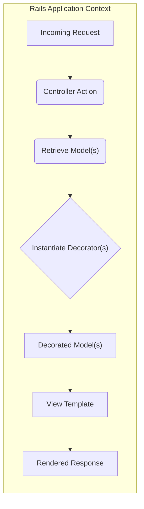
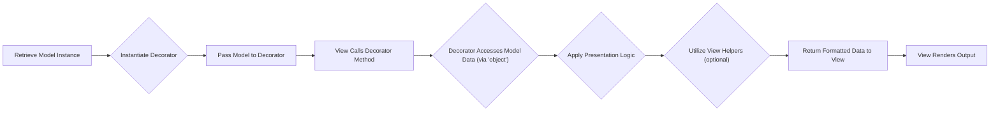
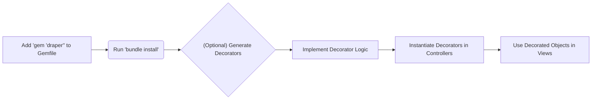

# Project Design Document: Draper Gem

**Project Name:** Draper

**Project Repository:** [https://github.com/drapergem/draper](https://github.com/drapergem/draper)

**Version:** 1.1

**Date:** October 26, 2023

**Author:** AI Software Architect

## 1. Project Overview

Draper is a lightweight and powerful Ruby gem designed to enhance the presentation layer of Ruby on Rails applications. It promotes the separation of concerns by introducing decorators, which encapsulate view-specific logic for model objects. This approach keeps models focused on business logic and views clean and readable. By moving formatting, display logic, and other presentation-related concerns into decorators, Draper improves code organization, testability, and maintainability of the view layer. It helps avoid "fat models" and "fat helpers" by providing a structured way to manage presentation logic.

## 2. Architecture Diagram

**Diagram Explanation:**

*   **Incoming Request:** Represents a user request to the Rails application.
*   **Controller Action:** Handles the incoming request and orchestrates the application logic.
*   **Retrieve Model(s):** The controller interacts with the application's data layer to fetch the necessary model objects.
*   **Instantiate Decorator(s):** The controller creates instances of the appropriate Draper decorator(s), passing the model object(s) to them.
*   **Decorated Model(s):** The decorator object(s) wrap the model(s), providing access to presentation-specific methods.
*   **View Template:** The Rails view template receives the decorated model(s).
*   **Rendered Response:** The view template utilizes methods from the decorator(s) to render the final output for the user.

## 3. Key Components

*   **Decorator Class:**
    *   A Ruby class that inherits from `Draper::Decorator`.
    *   Responsible for encapsulating presentation logic for a specific model.
    *   Instantiated with a model object, providing access to its attributes and methods.
    *   Can define methods that format data, generate URLs, or perform other view-specific tasks.
    *   Example: A `ProductDecorator` might have methods like `formatted_price` or `display_availability`.
*   **`decorates` Method:**
    *   A class method used within a decorator to explicitly declare the model it decorates.
    *   Ensures type safety and clarity about the decorator's purpose.
    *   Example: `class ProductDecorator < Draper::Decorator; decorates :product; end`.
*   **`helpers` Proxy:**
    *   Provides access to Rails' built-in and application-specific view helpers within the decorator.
    *   Allows decorators to leverage existing view logic for tasks like generating links or formatting dates.
    *   Example: `helpers.link_to('View Details', object)`.
*   **`object` Method:**
    *   A method available within the decorator that returns the underlying decorated model instance.
    *   Provides direct access to the model's attributes and methods when needed.
    *   Example: `object.name`.
*   **Collection Decorators:**
    *   Facilitate the decoration of collections of model objects.
    *   Provide methods like `decorate_collection` to efficiently decorate multiple items.
    *   Useful for displaying lists of data in the view.
    *   Example: `ProductDecorator.decorate_collection(products)`.
*   **Context:**
    *   Allows passing arbitrary data to the decorator during instantiation.
    *   Enables conditional logic within the decorator based on the provided context.
    *   Example: Passing a `current_user` object to customize the presentation based on user roles.

## 4. Data Flow

When using Draper, data flows through the following stages:

1. **Model Retrieval:** The controller fetches data from the application's data store, resulting in one or more model instances.
2. **Decorator Instantiation:** The controller instantiates the appropriate decorator class, passing the model instance(s) as arguments. This wraps the model with presentation logic.
3. **Data Access via Decorator:** The view receives the decorated object. Instead of directly accessing model attributes, the view calls methods on the decorator.
4. **Presentation Logic Execution:** The decorator's methods access the underlying model data (using the `object` method) and apply formatting, transformations, or other presentation-specific logic.
5. **Helper Method Invocation:** Decorator methods may utilize Rails view helpers (via the `helpers` proxy) to further process or generate output.
6. **Formatted Data Return:** The decorator methods return the formatted or processed data to the view.
7. **View Rendering:** The view uses the data provided by the decorator to render the final HTML or other output.

## 5. Security Considerations

While Draper primarily focuses on the presentation layer, its interaction with models and views introduces several security considerations that are important for threat modeling:

*   **Over-Exposure of Sensitive Data:** Decorators might inadvertently expose sensitive model attributes in the view if not carefully designed. For example, a decorator might expose a user's unencrypted password hash if the developer isn't mindful of what data is being presented. **Mitigation:** Carefully review the methods defined in decorators and ensure they only expose necessary data. Implement proper access control at the model level to restrict access to sensitive attributes.
*   **Logic Complexity and Vulnerabilities:**  While decorators should primarily handle presentation, overly complex logic within them can become a maintenance and potential security risk. Complex logic might introduce vulnerabilities like injection flaws if it involves string manipulation or external data. **Mitigation:** Keep decorators focused on presentation logic. Move complex business logic to service objects or model methods. Thoroughly test decorator methods, especially those involving data manipulation.
*   **Abuse of Helper Methods:**  Careless use of helper methods within decorators could introduce vulnerabilities if those helpers are not properly secured. For example, using a helper to generate a URL without proper input sanitization could lead to cross-site scripting (XSS) vulnerabilities. **Mitigation:** Be cautious when using helper methods within decorators, especially those that generate HTML or URLs. Ensure that any data passed to helpers is properly sanitized and escaped.
*   **Context Injection Risks:** If context is used to pass data to decorators, ensure that the data passed in the context is sanitized and validated. Malicious input in the context could be used to manipulate the decorator's behavior or introduce vulnerabilities. **Mitigation:** Sanitize and validate any data passed through the decorator's context. Treat context data as untrusted input.
*   **Inconsistent Encoding/Escaping:** Decorators are often responsible for formatting data for display. If not handled correctly, this can lead to encoding issues or a failure to escape potentially malicious content, resulting in XSS vulnerabilities. **Mitigation:** Ensure that decorators properly escape output, especially when displaying user-generated content or data from external sources. Leverage Rails' built-in escaping mechanisms.
*   **Authorization Bypass:** While Draper doesn't handle authorization directly, poorly designed decorators might inadvertently bypass authorization checks if they expose data that the current user should not have access to. **Mitigation:** Enforce authorization at the controller or model level before data reaches the decorator. Decorators should not be the primary mechanism for enforcing access control.

## 6. Deployment

Draper is deployed as a standard Ruby gem within a Rails application. The deployment process typically involves:

*   **Gem Inclusion:** Adding the `gem 'draper'` line to the application's `Gemfile`.
*   **Dependency Installation:** Running `bundle install` to install the gem and its dependencies.
*   **Decorator Generation (Optional):** Using Draper's generator (`rails generate draper:decorator model_name`) to create initial decorator files.
*   **Code Implementation:** Implementing the necessary decorator classes and logic within the application.
*   **Controller Integration:** Instantiating decorators in controllers to wrap model objects before passing them to the views.
*   **View Usage:** Calling methods on the decorated objects within the view templates to access the formatted data.
*   **No Specific Deployment Configuration:** Draper itself doesn't require specific deployment configurations beyond the standard Rails application setup.

## 7. Threat Model Scope

The scope of the threat model for the Draper gem primarily focuses on:

*   **Data Handling within Decorators:** How decorators access, process, and format data from the underlying models.
*   **Interaction with View Helpers:** The security implications of using Rails view helpers within decorators.
*   **Context Data:** The potential risks associated with passing data through the decorator's context.
*   **Output Encoding and Escaping:** Ensuring that decorators properly handle output encoding to prevent injection vulnerabilities.
*   **Potential for Information Disclosure:** Preventing the unintentional exposure of sensitive data through decorator methods.

The threat model will generally *not* cover:

*   **Core Ruby or Rails Framework Vulnerabilities:** Unless directly related to Draper's usage.
*   **Database Security:** Security of the underlying data store.
*   **Network Security:** Security of the network infrastructure.
*   **Authentication and Authorization:** While interactions exist, the primary focus is on how Draper handles data *after* authorization.