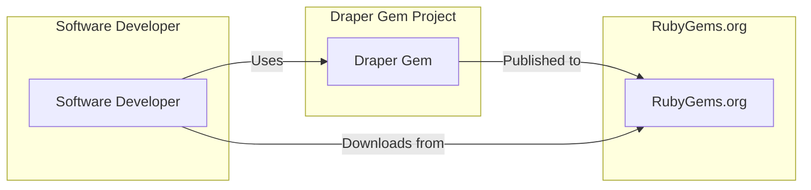
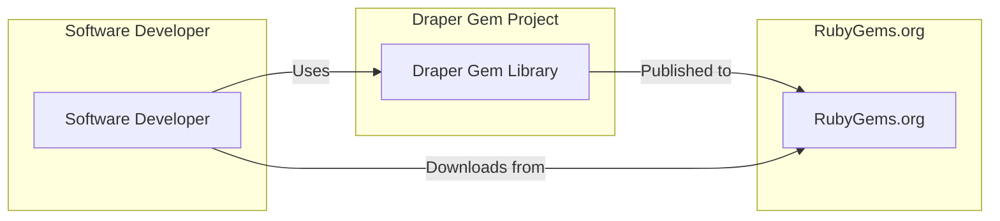
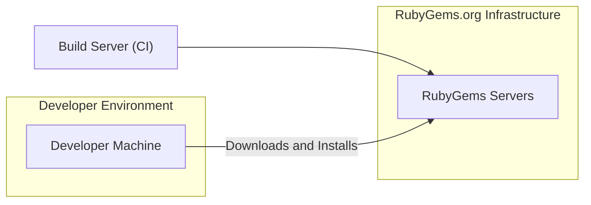
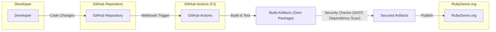

# BUSINESS POSTURE

This project, Draper Gem, aims to provide a Ruby library that simplifies the creation of diagrams, specifically C4 diagrams, for software architecture documentation. The primary business goal is to enhance software development practices by enabling developers to easily create and maintain clear and consistent architectural diagrams. This leads to improved communication within development teams, better understanding of system design, and more effective onboarding of new team members.

The most important business risks associated with this project are:

- Risk of low adoption: If the gem is not user-friendly, lacks essential features, or is poorly documented, developers may not adopt it, hindering its intended benefits.
- Risk of security vulnerabilities in dependencies: As a Ruby gem, Draper relies on external dependencies. Vulnerabilities in these dependencies could pose a security risk to projects using Draper.
- Risk of supply chain compromise: If the gem itself is compromised during the build or publishing process, it could introduce malicious code into developer environments.

# SECURITY POSTURE

## Existing Security Controls

- security control: Code hosted on GitHub: Provides version control and transparency. Implemented in: GitHub repository.
- security control: Open Source License (MIT): Allows for community review and contribution. Implemented in: LICENSE file in repository.
- security control: RubyGems.org for distribution: Leverages RubyGems security infrastructure for package distribution. Implemented in: RubyGems publishing process.

## Accepted Risks

- accepted risk: Reliance on open-source dependencies: Accepting the inherent risks associated with using open-source libraries, which may contain vulnerabilities.
- accepted risk: Community-driven development: Accepting the risk that security vulnerabilities might be introduced by community contributions if not properly reviewed.

## Recommended Security Controls

- recommended security control: Implement automated dependency scanning: Regularly scan gem dependencies for known vulnerabilities using tools like Bundler Audit or Dependabot.
- recommended security control: Implement Static Application Security Testing (SAST): Integrate SAST tools into the CI/CD pipeline to automatically scan the gem's code for potential security flaws.
- recommended security control: Implement Software Bill of Materials (SBOM) generation: Generate SBOM for each release to track dependencies and facilitate vulnerability management.
- recommended security control: Enable GitHub Security Features: Utilize GitHub's security features like Dependabot and code scanning to proactively identify and address vulnerabilities.

## Security Requirements

- Authentication: Not applicable. Draper Gem is a client-side library and does not require authentication.
- Authorization: Not applicable. Draper Gem is a client-side library and does not require authorization.
- Input Validation: Input validation is relevant when the gem processes user-provided data to generate diagrams. The gem should validate inputs to prevent unexpected behavior or potential vulnerabilities, such as injection attacks if diagram generation involves external commands or interpreters (though unlikely in this case).
- Cryptography: Not applicable. Draper Gem is not expected to handle sensitive data or require cryptographic operations. However, if future features involve secure storage or transmission of diagrams, cryptography might become relevant.

# DESIGN

## C4 CONTEXT

### C4 Context Elements

- Element:
    - Name: Software Developer
    - Type: Person
    - Description: Software developers who use Draper Gem to create diagrams for software documentation.
    - Responsibilities: Uses Draper Gem in their projects to generate C4 diagrams.
    - Security controls: Local development environment security controls.

- Element:
    - Name: Draper Gem
    - Type: Software System
    - Description: Ruby gem library for generating C4 diagrams.
    - Responsibilities: Provides functionality to define and generate C4 diagrams from Ruby code.
    - Security controls: Input validation (of diagram definitions), secure build and release process.

- Element:
    - Name: RubyGems.org
    - Type: External System
    - Description: Public repository for Ruby gems, used for distributing Draper Gem.
    - Responsibilities: Hosts and distributes Draper Gem packages.
    - Security controls: RubyGems.org security controls, package signing and verification.

## C4 CONTAINER

### C4 Container Elements

- Element:
    - Name: Software Developer
    - Type: Person
    - Description: Software developers who use Draper Gem to create diagrams for software documentation.
    - Responsibilities: Uses Draper Gem in their projects to generate C4 diagrams.
    - Security controls: Local development environment security controls.

- Element:
    - Name: Draper Gem Library
    - Type: Container (Library)
    - Description: Ruby gem library containing Ruby code to define and generate C4 diagrams.
    - Responsibilities: Provides classes and methods for developers to programmatically create C4 diagrams.
    - Security controls: Input validation (of diagram definitions), secure coding practices, dependency management.

- Element:
    - Name: RubyGems.org
    - Type: External System
    - Description: Public repository for Ruby gems, used for distributing Draper Gem.
    - Responsibilities: Hosts and distributes Draper Gem packages.
    - Security controls: RubyGems.org security controls, package signing and verification.

## DEPLOYMENT

Draper Gem is a library and does not have a traditional deployment architecture in the sense of servers and infrastructure. It is deployed as a package to RubyGems.org and then downloaded and used by developers in their local development environments or CI/CD pipelines.

Deployment Architecture: RubyGems Package Distribution

### Deployment Elements

- Element:
    - Name: Developer Machine
    - Type: Environment
    - Description: Developer's local computer where they install and use Draper Gem.
    - Responsibilities: Running Ruby code that utilizes Draper Gem to generate diagrams.
    - Security controls: Developer machine security controls, antivirus, OS hardening.

- Element:
    - Name: RubyGems Servers
    - Type: Infrastructure
    - Description: Servers hosting RubyGems.org, responsible for storing and distributing Ruby gems.
    - Responsibilities: Hosting and serving Draper Gem package files.
    - Security controls: RubyGems.org infrastructure security controls, access control, intrusion detection, regular security audits.

- Element:
    - Name: Build Server (CI)
    - Type: Environment
    - Description: Continuous Integration server used to build and publish Draper Gem.
    - Responsibilities: Automating the build, test, and publishing process of Draper Gem to RubyGems.org.
    - Security controls: CI server security controls, access control, secrets management, secure build pipelines.

## BUILD

The build process for Draper Gem likely involves the following steps, focusing on security:

### Build Elements

- Element:
    - Name: Developer
    - Type: Person
    - Description: Software developer contributing code to Draper Gem.
    - Responsibilities: Writing code, committing changes to the repository.
    - Security controls: Developer workstation security, secure coding practices, code review.

- Element:
    - Name: GitHub Repository
    - Type: Code Repository
    - Description: GitHub repository hosting the Draper Gem source code.
    - Responsibilities: Version control, code storage, collaboration platform.
    - Security controls: GitHub access controls, branch protection, audit logs.

- Element:
    - Name: GitHub Actions
    - Type: CI/CD System
    - Description: GitHub's CI/CD platform used to automate the build, test, and release process.
    - Responsibilities: Automated build, testing, security scanning, and publishing of the gem.
    - Security controls: GitHub Actions security controls, workflow security, secrets management, secure runners.

- Element:
    - Name: Build Artifacts (Gem Package)
    - Type: Artifact
    - Description: The packaged Ruby gem file (.gem) created during the build process.
    - Responsibilities: Contains the compiled and packaged code of Draper Gem.
    - Security controls: Integrity checks (checksums), signing (if implemented).

- Element:
    - Name: Secured Artifacts
    - Type: Artifact
    - Description: Build artifacts after undergoing security checks like SAST and dependency scanning.
    - Responsibilities: Represents artifacts that have been validated for security vulnerabilities.
    - Security controls: Results of SAST and dependency scanning, vulnerability remediation process.

- Element:
    - Name: RubyGems.org
    - Type: Package Registry
    - Description: Public Ruby gem registry where Draper Gem is published.
    - Responsibilities: Distributing Draper Gem packages to developers.
    - Security controls: RubyGems.org security controls, package verification.

# RISK ASSESSMENT

- Critical Business Process: Enabling developers to create and maintain software architecture documentation effectively. Disruption to this process would primarily impact developer productivity and communication, potentially leading to misunderstandings in system design and slower development cycles.
- Data Sensitivity: Low. Draper Gem itself does not handle sensitive user data. The diagrams generated by Draper Gem might contain information about system architecture, which could be considered sensitive in some contexts, but the gem itself is not directly involved in managing or storing this sensitive data. The primary data being protected is the integrity and availability of the Draper Gem package itself to ensure developers are using a safe and reliable tool.

# QUESTIONS & ASSUMPTIONS

## Questions

- What is the intended scope of diagram types beyond C4 diagrams that Draper Gem might support in the future?
- Are there any specific compliance requirements or industry standards that Draper Gem needs to adhere to?
- Is there a dedicated security team or individual responsible for overseeing the security of the Draper Gem project?
- Are there plans to implement specific security features in Draper Gem itself, such as secure diagram generation or data handling (if applicable in the future)?

## Assumptions

- BUSINESS POSTURE: The primary business goal is to provide a useful and user-friendly diagramming tool for software developers to improve documentation and communication.
- SECURITY POSTURE: Security is important, but the primary focus is on ensuring the gem itself is secure and does not introduce vulnerabilities into projects that use it. Standard open-source security practices are considered acceptable.
- DESIGN: The current design is focused on providing a Ruby library. Future enhancements might include more advanced diagram generation features or integrations with other tools. The deployment model is based on RubyGems.org for distribution. The build process is assumed to be automated using CI/CD practices.