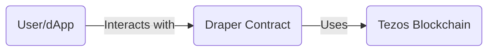
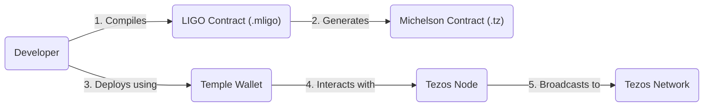
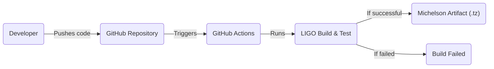

Okay, let's create a detailed design document for the Draper project, focusing on aspects relevant for threat modeling.

# BUSINESS POSTURE

Draper is positioned as a foundational tool for building decentralized applications (dApps) on the Tezos blockchain.  It aims to simplify the development process by providing a readily available, secure, and well-documented smart contract template.  The project's success hinges on adoption by developers, which in turn depends on its reliability, security, and ease of use.

Business Priorities:

*   Enable rapid dApp development on Tezos.
*   Provide a secure and reliable foundation for smart contracts.
*   Foster a community of developers around the project.
*   Reduce the barrier to entry for Tezos dApp development.
*   Maintain a high level of code quality and documentation.

Business Goals:

*   Become a widely used and recognized template for Tezos smart contracts.
*   Attract a significant number of developers to use Draper.
*   Minimize security vulnerabilities and potential exploits in deployed contracts.
*   Ensure long-term maintainability and adaptability of the project.

Most Important Business Risks:

*   Critical smart contract vulnerabilities leading to financial loss for users.
*   Lack of adoption due to complexity or perceived insecurity.
*   Inability to keep up with Tezos protocol updates and evolving best practices.
*   Reputational damage due to security incidents or poor code quality.
*   Competition from other smart contract templates or development frameworks.

# SECURITY POSTURE

The project appears to be in its early stages, and the repository provides a basic smart contract template.  A comprehensive security posture assessment requires more information, but we can infer some initial aspects and make recommendations.

Existing Security Controls:

*   security control: Use of LIGO, a strongly typed language for Tezos smart contracts, which helps prevent some common programming errors. (Described in the README and evident in the contract code.)
*   security control: Basic documentation including a README and some comments within the code. (Present in the repository.)
*   security control: Example tests, using `testing.mligo` (Present in the repository.)

Accepted Risks:

*   accepted risk: The project is under active development, and the provided contract is a template; it is the responsibility of developers using Draper to thoroughly audit and test their implementations.
*   accepted risk: Reliance on the security of the underlying Tezos blockchain and the LIGO compiler.
*   accepted risk: Limited formal verification or external security audits have been conducted (as far as is publicly visible).

Recommended Security Controls (High Priority):

*   security control: Implement comprehensive unit and integration tests, covering all critical contract functions and edge cases.
*   security control: Integrate static analysis tools (SAST) into the development workflow to identify potential vulnerabilities early.
*   security control: Conduct a formal security audit by a reputable third-party firm specializing in smart contract security.
*   security control: Establish a clear vulnerability disclosure and patching process.
*   security control: Provide detailed security guidelines and best practices for developers using Draper.
*   security control: Consider formal verification of critical contract logic.

Security Requirements:

*   Authentication:
    *   The contract template itself doesn't handle user authentication in the traditional sense. Authentication on Tezos is managed at the account level via cryptographic signatures. Developers using Draper must ensure that any operations requiring authorization are properly validated using these signatures.
*   Authorization:
    *   The provided `owner` pattern in the template demonstrates a basic form of authorization.  Developers should carefully define roles and permissions within their contracts, ensuring that only authorized accounts can perform sensitive operations.  Access control should follow the principle of least privilege.
*   Input Validation:
    *   All input parameters to contract entry points must be rigorously validated. This includes checking data types, ranges, and any other relevant constraints.  The LIGO language provides some type safety, but additional validation is often necessary.
*   Cryptography:
    *   The contract relies on the cryptographic primitives provided by the Tezos blockchain (e.g., for signatures and hashing). Developers should avoid implementing custom cryptographic functions and instead use the well-vetted built-in functions.  Any use of cryptographic keys must follow secure key management practices.

# DESIGN

## C4 CONTEXT

Element Descriptions:

*   Element:
    *   Name: User/dApp
    *   Type: External Entity (Person or Software System)
    *   Description: Represents a user interacting with a dApp built using the Draper contract, or the dApp itself.
    *   Responsibilities: Initiates transactions, provides input data, receives output data.
    *   Security controls: Relies on Tezos account security (private key management).

*   Element:
    *   Name: Draper Contract
    *   Type: Software System
    *   Description: The Tezos smart contract based on the Draper template.
    *   Responsibilities: Manages state, executes contract logic, interacts with the Tezos blockchain.
    *   Security controls: LIGO type safety, input validation (to be implemented by developers), authorization checks (e.g., owner pattern), reliance on Tezos blockchain security.

*   Element:
    *   Name: Tezos Blockchain
    *   Type: External System
    *   Description: The Tezos blockchain, providing the underlying infrastructure for the smart contract.
    *   Responsibilities: Provides consensus, transaction processing, data storage, cryptographic primitives.
    *   Security controls: Tezos blockchain's inherent security mechanisms (e.g., proof-of-stake consensus, cryptographic signatures).

## C4 CONTAINER

In this simple case, the container diagram is essentially the same as the context diagram, as the "Draper Contract" is a single container.

Element Descriptions:

*   Element:
    *   Name: User/dApp
    *   Type: External Entity (Person or Software System)
    *   Description: Represents a user interacting with a dApp built using the Draper contract, or the dApp itself.
    *   Responsibilities: Initiates transactions, provides input data, receives output data.
    *   Security controls: Relies on Tezos account security (private key management).

*   Element:
    *   Name: Draper Contract
    *   Type: Container (Smart Contract)
    *   Description: The Tezos smart contract based on the Draper template.  This is the single container.
    *   Responsibilities: Manages state, executes contract logic, interacts with the Tezos blockchain.
    *   Security controls: LIGO type safety, input validation (to be implemented by developers), authorization checks (e.g., owner pattern), reliance on Tezos blockchain security.

*   Element:
    *   Name: Tezos Blockchain
    *   Type: External System
    *   Description: The Tezos blockchain, providing the underlying infrastructure for the smart contract.
    *   Responsibilities: Provides consensus, transaction processing, data storage, cryptographic primitives.
    *   Security controls: Tezos blockchain's inherent security mechanisms (e.g., proof-of-stake consensus, cryptographic signatures).

## DEPLOYMENT

Possible Deployment Solutions:

1.  Manual Deployment using a Tezos Wallet (e.g., Temple, Kukai).
2.  Deployment via a Script (e.g., using `tezos-client`).
3.  Deployment as part of a larger dApp deployment pipeline (e.g., using Truffle or other tools).

Chosen Solution (for detailed description): Manual Deployment using a Tezos Wallet (Temple).

Element Descriptions:

*   Element:
    *   Name: Developer
    *   Type: Person
    *   Description: The individual deploying the smart contract.
    *   Responsibilities: Writes the LIGO code, compiles it to Michelson, initiates the deployment transaction.
    *   Security controls: Secure management of their Tezos account private key.

*   Element:
    *   Name: LIGO Contract (.mligo)
    *   Type: File
    *   Description: The source code of the smart contract written in LIGO.
    *   Responsibilities: Contains the contract logic.
    *   Security controls: Code review, static analysis.

*   Element:
    *   Name: Michelson Contract (.tz)
    *   Type: File
    *   Description: The compiled smart contract code in Michelson, the low-level language of Tezos.
    *   Responsibilities: Executable code on the Tezos blockchain.
    *   Security controls: Generated from the LIGO code, relies on the correctness of the LIGO compiler.

*   Element:
    *   Name: Temple Wallet
    *   Type: Software (Browser Extension)
    *   Description: A Tezos wallet used to interact with the Tezos blockchain.
    *   Responsibilities: Manages private keys, signs transactions, interacts with Tezos nodes.
    *   Security controls: Secure storage of private keys, user authentication (password/biometrics).

*   Element:
    *   Name: Tezos Node
    *   Type: Software
    *   Description: A node in the Tezos network.
    *   Responsibilities: Receives transactions, participates in consensus, maintains the blockchain state.
    *   Security controls: Tezos network security protocols.

*   Element:
    *   Name: Tezos Network
    *   Type: Distributed System
    *   Description: The entire Tezos blockchain network.
    *   Responsibilities: Maintains the distributed ledger, validates transactions, executes smart contracts.
    *   Security controls: Tezos blockchain's inherent security mechanisms.

## BUILD

The repository currently lacks an automated build system.  A basic build process can be described, along with recommendations for improvement.

Current (Manual) Build Process:

1.  Developer writes LIGO code (`.mligo` files).
2.  Developer manually compiles the LIGO code using the `ligo compile contract` command.
3.  Developer manually deploys the resulting Michelson code (`.tz` file) using a wallet or `tezos-client`.

Recommended Build Process (using GitHub Actions):

Element Descriptions:

*    Element:
    *   Name: Developer
    *   Type: Person
    *   Description: The individual developing the smart contract.
    *   Responsibilities: Writes the LIGO code, initiates the build process (e.g., by pushing to GitHub).
    *   Security controls: Secure coding practices, code review.

*    Element:
    *   Name: GitHub Repository
    *   Type: Version Control System
    *   Description: The repository hosting the project's source code.
    *   Responsibilities: Stores code, tracks changes, triggers build workflows.
    *   Security controls: Access controls, branch protection rules.

*    Element:
    *   Name: GitHub Actions
    *   Type: CI/CD Platform
    *   Description: The automation platform used to build and test the code.
    *   Responsibilities: Executes build steps, runs tests, reports results.
    *   Security controls: Secure configuration of workflows, access controls.

*    Element:
    *   Name: LIGO Build & Test
    *   Type: Build Step
    *   Description: The step that compiles the LIGO code and runs tests.
    *   Responsibilities: Compiles code, runs unit and integration tests, performs static analysis.
    *   Security controls: Use of a specific LIGO compiler version, integration of SAST tools (e.g., snyk, MythX).

*    Element:
    *   Name: Michelson Artifact (.tz)
    *   Type: Build Artifact
    *   Description: The compiled Michelson code, ready for deployment.
    *   Responsibilities: Represents the deployable output of the build process.
    *   Security controls: Integrity checks (e.g., checksums).

*    Element:
    *   Name: Build Failed
    *   Type: Status
    *   Description: Indicates that the build process failed (e.g., due to compilation errors or failed tests).
    *   Responsibilities: Prevents deployment of faulty code.
    *   Security controls: Notifications to developers.

Security Controls in the Build Process:

*   security control: Use of a specific, pinned version of the LIGO compiler to ensure consistent and reproducible builds.
*   security control: Integration of static analysis tools (SAST) to identify potential vulnerabilities during the build.
*   security control: Automated unit and integration tests to verify contract functionality and prevent regressions.
*   security control: Code review process enforced through pull requests.

# RISK ASSESSMENT

Critical Business Processes to Protect:

*   Deployment of secure and reliable smart contracts.
*   Integrity of the contract's state and data.
*   User funds and assets managed by the contract.
*   Reputation of the Draper project and its contributors.

Data to Protect and Sensitivity:

*   Smart contract source code (LIGO): High sensitivity - vulnerabilities can lead to exploits.
*   Compiled Michelson code: High sensitivity - represents the executable logic on the blockchain.
*   Contract state data: Variable sensitivity - depends on the specific dApp and the data it manages.  Could include user balances, ownership records, or other sensitive information.
*   User private keys (not directly handled by Draper, but crucial for users interacting with dApps): Extremely high sensitivity - compromise leads to complete loss of funds.

# QUESTIONS & ASSUMPTIONS

Questions:

*   What specific types of dApps are envisioned to be built using Draper? This will influence the specific security requirements and risk assessment.
*   What is the intended level of security assurance? (e.g., informal testing, formal verification, external audits)
*   What is the process for handling updates and bug fixes to the Draper template?
*   Are there any plans to integrate with specific Tezos development tools or frameworks?
*   What level of support and documentation will be provided to developers using Draper?

Assumptions:

*   BUSINESS POSTURE: Assumes that the primary goal is to provide a secure and easy-to-use template for basic Tezos smart contracts.
*   SECURITY POSTURE: Assumes that developers using Draper will have some familiarity with Tezos and smart contract security principles. Assumes reliance on the underlying security of the Tezos blockchain.
*   DESIGN: Assumes a relatively simple contract structure, as demonstrated by the provided template. Assumes deployment to the Tezos mainnet or testnets.