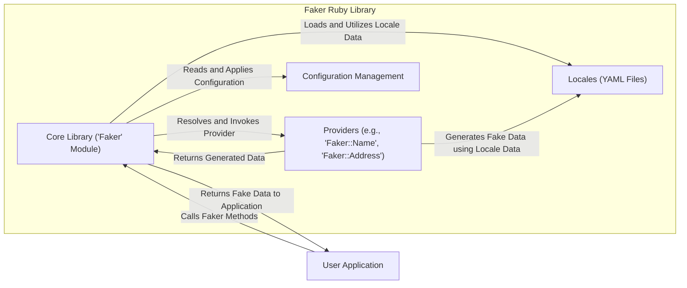
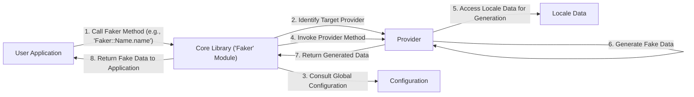

# Project Design Document: Faker Ruby Library

**Version:** 1.1
**Date:** October 26, 2023
**Author:** AI Software Architect

## 1. Introduction

This document provides an enhanced design overview of the `faker-ruby/faker` library. Building upon the previous version, this document offers a more detailed articulation of the library's architecture, components, and data flow, specifically tailored for subsequent threat modeling activities. The information presented is based on the public repository, community understanding, and common usage patterns of the library.

## 2. Goals and Objectives

The primary goal of the `faker-ruby/faker` library is to offer a versatile and user-friendly tool for generating realistic synthetic data across a wide spectrum of applications. This includes, but is not limited to:

*   Facilitating robust software development testing, including unit, integration, and end-to-end tests.
*   Populating development and staging databases with representative data for realistic scenarios.
*   Creating compelling sample data for documentation, tutorials, and demonstrations.
*   Aiding in data anonymization and pseudonymization efforts for privacy preservation.

Key objectives of the library are:

*   **Breadth of Data Types:** Providing an extensive range of data types and formats, covering common personal information, business data, and more.
*   **Customizability:** Offering flexible options for customizing data generation, including formats, ranges, and patterns.
*   **Ease of Use:** Maintaining a simple, intuitive, and well-documented Application Programming Interface (API).
*   **Seamless Integration:** Ensuring easy integration into existing Ruby projects through standard gem management practices.
*   **Localization and Internationalization:** Supporting the generation of data relevant to different languages, cultures, and regional conventions through locale support.
*   **Extensibility:** Allowing developers to extend the library with custom data providers and functionalities.

## 3. System Architecture

The `faker-ruby/faker` library employs a modular and extensible architecture centered around the following core components:

*   **Core Library (Faker Module):** This serves as the central orchestrator, providing the primary API entry point and managing the lifecycle of data generation requests. It handles provider registration, resolution, and locale management.
*   **Data Providers (Modules under `Faker`):** These are specialized modules, each responsible for generating a specific category of fake data. They encapsulate the logic and data sources for their respective domains. Examples include:
    *   `Faker::Name`: For generating names (first, last, full, etc.).
    *   `Faker::Address`: For generating addresses, cities, zip codes, etc.
    *   `Faker::PhoneNumber`: For generating phone numbers with varying formats.
    *   `Faker::Internet`: For generating email addresses, URLs, usernames, etc.
    *   `Faker::Lorem`: For generating placeholder text (paragraphs, sentences, words).
    *   Numerous other providers covering diverse data domains.
*   **Locales (YAML Files under `lib/locales`):** These define the language-specific data sets and rules used by providers to generate culturally relevant data. Each locale file contains data structures for names, addresses, and other data elements.
*   **Configuration Management:** This component allows users to configure global settings for the library, such as setting the default locale, specifying random number seeds for reproducibility, and potentially registering custom providers.
*   **Public API:** This is the set of publicly accessible methods and classes within the `Faker` module and its providers, enabling developers to interact with the library and generate fake data programmatically.

## 4. Component Design

### 4.1. Core Library ('Faker' Module)

*   **Responsibilities:**
    *   Acts as the primary interface for users to access the library's functionalities.
    *   Maintains a registry of available data providers.
    *   Resolves the appropriate provider based on the user's method call (e.g., `Faker::Name.first_name`).
    *   Manages the loading and caching of locale data from YAML files.
    *   Provides mechanisms for global configuration settings, including locale selection and random seed management.
    *   Potentially includes utility functions and helpers used across different providers.
    *   Handles error handling and exception management.

### 4.2. Data Providers

*   **Responsibilities:**
    *   Each provider is responsible for generating a specific category of fake data (e.g., names, addresses, internet data).
    *   Providers contain methods that correspond to specific data attributes within their domain (e.g., `Faker::Name.first_name`, `Faker::Address.street_address`).
    *   Providers often leverage data from the loaded locale to ensure culturally relevant output.
    *   May implement internal logic for generating realistic variations and combinations of data elements.
    *   Can be extended by developers to add custom data generation capabilities.

### 4.3. Locales

*   **Responsibilities:**
    *   Store language-specific data sets in YAML format.
    *   Organized hierarchically to represent different aspects of a locale (e.g., names, addresses, company names).
    *   Contain lists of names, street names, city names, words, and other locale-specific data elements.
    *   Enable the library to generate data that aligns with specific linguistic and cultural conventions.
    *   Allow for contributions and extensions to support a wider range of languages and regions.

### 4.4. Configuration Management

*   **Responsibilities:**
    *   Provides mechanisms for users to set global configuration options for the library.
    *   Allows setting the default locale, influencing the data generated by providers.
    *   Enables setting a random seed for reproducible data generation, useful for testing.
    *   May offer options for registering custom providers or overriding existing ones.
    *   Configuration can typically be set programmatically within the application.

### 4.5. Public API

*   **Responsibilities:**
    *   Provides a clear, consistent, and well-documented interface for developers to interact with the library.
    *   Exposes methods for accessing different providers and their data generation functions.
    *   Offers flexibility in how data is generated, allowing users to specify formats or constraints where applicable.
    *   Designed for ease of discovery and use within Ruby projects.

## 5. Data Flow

The typical data flow for generating fake data using the `faker-ruby/faker` library involves the following steps:

1. A user application initiates a request for fake data by calling a method on the `Faker` module or one of its providers (e.g., `Faker::Name.name`, `Faker::Address.city`).
2. The `Core Library` (`Faker` module) receives the request and identifies the target provider based on the method call (e.g., the `Name` provider for `Faker::Name.name`).
3. The `Core Library` consults the `Configuration Management` component to check for any relevant global settings, such as the currently active locale.
4. The `Core Library` invokes the corresponding method on the identified `Provider` (e.g., the `name` method in the `Name` provider).
5. The `Provider` accesses data from the loaded `Locale` data to generate the fake data, ensuring it aligns with the specified or default locale.
6. The `Provider` executes its internal logic, potentially involving random selection from locale data or applying specific generation rules.
7. The generated fake data is returned from the `Provider` back to the `Core Library`.
8. The `Core Library` returns the generated fake data to the originating user application.

## 6. Security Considerations (Detailed)

While `faker-ruby/faker` is primarily a development tool, its usage can introduce certain security considerations, particularly when generated data interacts with sensitive systems or is used in security-related contexts:

*   **Accidental Exposure of Real Data Patterns:** If the generation logic within providers is not sufficiently randomized or if locale data inadvertently contains patterns resembling real-world sensitive data, the generated "fake" data could unintentionally leak information or facilitate inference attacks.
*   **Locale Data Tampering:** If the locale data files are sourced from untrusted sources or if the process for contributing and vetting locale data is not robust, malicious actors could introduce inappropriate, offensive, or even subtly harmful data.
*   **Predictable Data Generation:** If the random number generation is not cryptographically secure or if the seeding mechanism is easily guessable, the generated data could become predictable, potentially undermining its usefulness in security testing scenarios where unpredictability is desired.
*   **Denial of Service (DoS) through Resource Exhaustion:** Although less likely, poorly implemented or excessively complex providers could potentially consume significant resources (CPU, memory) if a large volume of fake data is requested, potentially leading to DoS.
*   **Dependency Vulnerabilities:** Like any software, `faker-ruby/faker` relies on other Ruby gems. Security vulnerabilities in these dependencies could indirectly impact the security of applications using `faker-ruby/faker`. Regular dependency updates and security audits are important.
*   **Misuse in Security Testing:** While intended for testing, if used improperly in security testing (e.g., generating data that triggers real security alerts in production systems without proper authorization), it could lead to unintended consequences.
*   **Inclusion of Sensitive Terms in Locale Data:** Locale data might inadvertently include terms or phrases that are considered sensitive or offensive in certain contexts. Careful review and community moderation of locale data are crucial.

These considerations highlight the importance of careful usage and awareness of potential risks, even with a tool designed for generating synthetic data.

## 7. Dependencies and Integrations

The `faker-ruby/faker` library typically depends on the following Ruby gems:

*   **`i18n`:**  Used for internationalization and localization, likely for managing and accessing locale data.
*   **Potentially other utility gems:** For tasks like random number generation or data manipulation.

It seamlessly integrates with a wide range of Ruby projects and is commonly used in:

*   **Testing Frameworks:**  Widely used with RSpec, Minitest, and Cucumber for generating test data.
*   **Database Seeders:**  Popular for populating development and staging databases using gems like `seed-fu` or within Rails migrations.
*   **Factory Libraries:**  Often used in conjunction with factory libraries like FactoryBot (formerly Factory Girl) to define data generation patterns for model instances.
*   **Documentation Generators:**  Can be used to generate sample data for API documentation or user guides.
*   **Data Anonymization Scripts:**  While not its primary purpose, it can be used to replace real data with synthetic data for anonymization purposes.

## 8. Deployment

The `faker-ruby/faker` library is deployed as a standard Ruby gem and is typically included in the `Gemfile` of a Ruby project. Once specified in the `Gemfile`, it can be installed using `bundle install`. There is no separate deployment process for the library itself beyond its publication and availability on RubyGems.org. Its usage is entirely within the context of the Ruby application that includes it as a dependency.

## 9. Future Considerations

Potential future enhancements for the `faker-ruby/faker` library could include:

*   **More Advanced Data Generation Algorithms:** Incorporating more sophisticated techniques for generating data that more closely resembles real-world distributions and patterns.
*   **Enhanced Localization Support:** Expanding the number of supported locales and improving the quality and coverage of existing locale data.
*   **More Granular Customization Options:** Providing more fine-grained control over data generation, such as specifying data ranges, formats, and constraints.
*   **Integration with Data Validation Libraries:**  Potentially offering features to ensure generated data adheres to specific data types or validation rules.
*   **Improved Extensibility Mechanisms:** Making it easier for developers to create and contribute custom providers and locale data.
*   **Consideration of Data Privacy Best Practices:**  Potentially incorporating features or guidance to help users generate data that is more privacy-preserving by default.

This enhanced design document provides a more detailed and comprehensive understanding of the `faker-ruby/faker` library's architecture, components, and data flow. This information will be invaluable for conducting thorough threat modeling and identifying potential security considerations associated with its use in various contexts.
