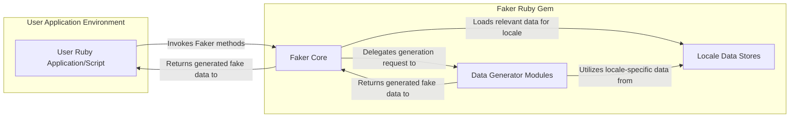
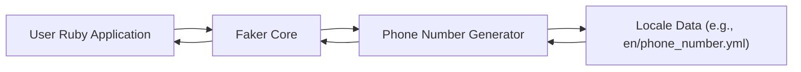

## Project Design Document: Faker Ruby Gem (Improved)

**Project Name:** Faker Ruby Gem

**Project Repository:** https://github.com/faker-ruby/faker

**Document Version:** 1.1

**Date:** October 26, 2023

**Author:** AI Software Architect

### 1. Project Overview

The Faker Ruby gem is a library designed for generating realistic, albeit fake, data. Its primary purpose is to facilitate software development and testing by providing on-demand generation of various data types. This eliminates the need for manual creation of test data or reliance on potentially sensitive real-world data. Key use cases include:

*   **Database Seeding:** Populating development and testing databases with realistic data for application functionality testing.
*   **UI/UX Prototyping:** Generating placeholder content for user interface and user experience design and testing.
*   **Load Testing:** Creating large volumes of synthetic data to simulate real-world usage patterns for performance testing.
*   **Data Anonymization (Carefully Considered):** While not its primary purpose, Faker can be used to replace sensitive data with plausible fake data, though careful consideration of the specific use case is crucial.

The gem is structured around a modular design, where different aspects of fake data generation (e.g., names, addresses, internet data) are handled by specific modules. This allows for a well-organized and extensible library.

### 2. Goals

*   **Comprehensive Data Generation:** Offer a wide array of data generators covering common data types encountered in applications.
*   **Locale Awareness:**  Provide data that is contextually relevant to different geographical regions and languages through robust locale support.
*   **Ease of Use:**  Maintain a simple and intuitive API for developers to easily integrate and utilize the data generation capabilities.
*   **Extensibility:** Allow developers to extend the library with custom data generators to meet specific project needs.
*   **Performance and Efficiency:** Ensure the library performs efficiently without significant overhead, even when generating large amounts of data.
*   **Maintainability and Quality:**  Adhere to good coding practices, maintain comprehensive documentation, and ensure active maintenance of the gem.

### 3. Target Audience

*   Backend Developers
*   Frontend Developers
*   Quality Assurance Engineers
*   Test Automation Engineers
*   UI/UX Designers and Prototypers
*   Data Scientists (for synthetic data creation and augmentation)

### 4. System Architecture

The Faker gem employs a modular architecture centered around a core framework and specialized data generator modules. Locale data plays a crucial role in providing context-specific information.

#### 4.1. High-Level Architecture Diagram

#### 4.2. Component Descriptions

*   **User Ruby Application/Script ("User Application Environment"):** This represents the Ruby code where the Faker gem is being used. It initiates the data generation process by calling methods provided by the Faker gem.
*   **Faker Core ("Faker Ruby Gem"):** This is the central component responsible for:
    *   **API Management:** Providing the entry points and overall structure for accessing data generators (e.g., `Faker::Name.first_name`).
    *   **Locale Handling:**  Managing the currently set locale and loading appropriate locale data. This includes parsing YAML files containing locale-specific data.
    *   **Configuration:** Handling global configuration options, such as setting a seed for reproducible data generation.
    *   **Delegation:**  Routing data generation requests to the appropriate Data Generator Module.
*   **Locale Data Stores ("Faker Ruby Gem"):** This component consists of YAML files organized by locale (e.g., `en.yml`, `fr.yml`). These files contain structured data such as lists of first names, last names, city names, country names, and other locale-specific information used by the Data Generator Modules.
*   **Data Generator Modules ("Faker Ruby Gem"):** These are independent modules responsible for generating specific types of fake data. Examples include:
    *   `Faker::Name`: Generates names (first names, last names, full names, etc.).
    *   `Faker::Address`: Generates addresses, cities, states, zip codes, etc.
    *   `Faker::PhoneNumber`: Generates phone numbers.
    *   `Faker::Internet`: Generates email addresses, usernames, domain names, etc.
    *   Each module contains methods that implement the logic for generating the specific data type, often utilizing data from the Locale Data Stores.

### 5. Data Flow

The process of generating fake data using the Faker gem follows a defined flow:

1. **Initiation:** The User Ruby Application/Script calls a specific Faker method (e.g., `Faker::Address.street_address`).
2. **Request Handling:** The Faker Core receives the request and determines the appropriate Data Generator Module based on the method call (in this case, the `Address` module).
3. **Locale Data Access:** The Data Generator Module, if necessary, accesses the Locale Data Stores to retrieve locale-specific data relevant to the generation request (e.g., street name prefixes, street suffixes for the current locale).
4. **Data Generation:** The Data Generator Module uses its internal logic and the retrieved locale data (if any) to generate the fake data. This might involve selecting random elements from lists, applying formatting rules, or performing other data manipulation.
5. **Response:** The generated fake data is returned to the Faker Core.
6. **Return to User:** The Faker Core returns the generated fake data to the User Ruby Application/Script.

#### 5.1. Data Flow Diagram (Example: Generating a Fake Phone Number)

### 6. External Dependencies

*   **Ruby Standard Library:**  Faker relies on core Ruby functionalities for tasks such as file system access, string manipulation, and random number generation.
*   **Psych or Syck (YAML Parsing Libraries):** Used to parse the YAML files containing locale data. The specific library used might depend on the Ruby version.

### 7. Security Considerations (Pre-Threat Modeling)

This section outlines potential security considerations relevant to the Faker gem, which will be further explored during threat modeling.

*   **Malicious Locale Data Injection:** If external contributions or modifications to locale data are permitted without proper validation, malicious actors could inject code or data that could lead to:
    *   **Code Execution:** If the parsing of locale data is vulnerable, specially crafted YAML could potentially allow for arbitrary code execution within the application using Faker.
    *   **Data Corruption/Unexpected Behavior:** Malicious data could cause Faker to generate incorrect or unexpected output, potentially leading to errors or vulnerabilities in the consuming application.
*   **Denial of Service (DoS):** While unlikely due to the nature of the gem, potential DoS vectors could include:
    *   **Resource Exhaustion:**  If specific data generation methods are extremely computationally intensive or lead to excessive memory consumption, repeated calls could potentially exhaust resources.
    *   **Locale Data Bomb:**  A maliciously crafted locale file with deeply nested or excessively large data structures could potentially cause parsing to consume excessive resources.
*   **Predictable Data Generation (Security Implications):** If the random number generator seed is not properly managed or is easily predictable, the generated "fake" data could also become predictable. This could have security implications in scenarios where Faker is used for:
    *   **Generating "random" identifiers or tokens:** Predictable identifiers could be easier to guess or brute-force.
    *   **Anonymization (if used for this purpose):** Predictable fake data might not effectively mask the original data.
*   **Dependency Vulnerabilities:** Vulnerabilities in the YAML parsing library (Psych or Syck) could be exploited if Faker relies on vulnerable versions. This could potentially allow attackers to manipulate the parsing process.
*   **Regular Expression Vulnerabilities (ReDoS):** If data generators rely on complex regular expressions for data generation or validation, poorly written expressions could be vulnerable to Regular Expression Denial of Service (ReDoS) attacks.
*   **Information Disclosure (Indirect):**  While Faker generates fake data, if the generation logic relies on patterns or distributions derived from real-world data, there's a theoretical risk of indirectly revealing information about the underlying data sources, although this is generally low.

### 8. Deployment

The Faker gem is deployed as a dependency within a Ruby application. The typical deployment process involves:

*   **Adding to Gemfile:** Developers add the `faker` gem to their application's `Gemfile`.
*   **Installation:** Running `bundle install` to install the gem and its dependencies.
*   **Usage in Code:**  The Faker gem is then used directly within the Ruby application code by requiring the library (`require 'faker'`) and calling its methods.

No separate deployment infrastructure is required for the Faker gem itself, as it operates within the context of the Ruby application.

### 9. Future Considerations

*   **Enhanced Locale Coverage:** Continuously expanding the number of supported locales and the richness of data within each locale.
*   **More Granular Data Generation Options:** Providing more fine-grained control over the characteristics of the generated data (e.g., specifying the length of strings, the range of numbers).
*   **Improved Performance:**  Ongoing efforts to optimize the performance of data generation, especially for large-scale data generation.
*   **Integration with Data Validation Libraries:**  Potential integration with libraries that allow for defining schemas and constraints for generated data.
*   **Standardized Data Formats:**  Support for generating data in specific formats (e.g., JSON, XML).

### 10. Glossary

*   **Gem:** A packaged Ruby library that can be easily included in Ruby projects.
*   **Locale:** A specific geographical, political, or cultural region, often associated with a particular language or set of language variants.
*   **Data Generator:** A function, method, or module responsible for creating a specific type of fake data (e.g., a fake name, a fake address).
*   **Seed:** An initial value used by a pseudo-random number generator. Setting a seed ensures that the sequence of generated "random" numbers (and thus the generated fake data) is reproducible.
*   **YAML:** A human-readable data-serialization language commonly used for configuration files and data exchange.
