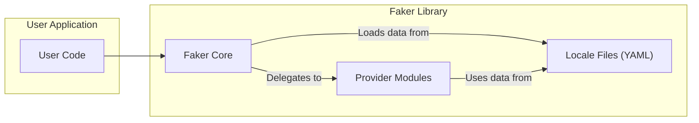
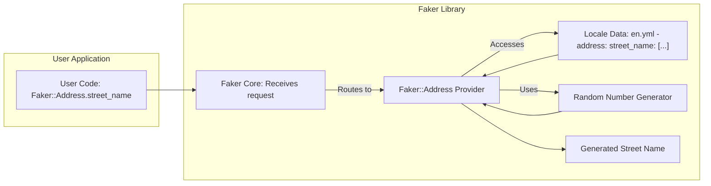

## Project Design Document: Faker Ruby (Improved)

**1. Introduction**

This document provides an enhanced design overview of the Faker Ruby library (https://github.com/faker-ruby/faker). It aims to offer a more detailed and structured understanding of the library's architecture, components, and data flow, specifically tailored for subsequent threat modeling activities. This improved document clarifies interactions and potential vulnerabilities to facilitate a more comprehensive security analysis.

**2. Goals**

*   Provide a clear, concise, and more detailed description of the Faker Ruby library's architecture and functionality.
*   Identify key components and their interactions within the library with greater specificity.
*   Outline the data flow within the library, from request to response, with enhanced clarity on data sources and transformations.
*   Serve as a robust and well-defined foundational document for threat modeling and security analysis, enabling more targeted identification of potential risks.

**3. Non-Goals**

*   This document does not delve into the intricate implementation details of every individual method within the Faker library. The focus remains on architectural understanding.
*   This document does not perform a security assessment or identify specific, actionable vulnerabilities. Its purpose is to provide the necessary context for such an assessment.
*   This document does not cover the library's testing methodologies, continuous integration/continuous deployment (CI/CD) pipelines, or release processes.

**4. High-Level Architecture**

The Faker Ruby library is structured as a modular system centered around the concept of "providers." These providers are specialized modules responsible for generating specific categories of fake data. The core `Faker` module acts as a central hub, managing configuration, locale settings, and the loading and access of these provider modules.

*   **User Application:** The external software or script that utilizes the Faker library to generate synthetic data. This is the initiator of data generation requests.
*   **Faker Core:** The central module of the library. It's responsible for:
    *   Providing the primary interface for accessing Faker functionality.
    *   Managing the currently active locale, influencing the generated data.
    *   Handling global configuration settings, such as the random seed.
    *   Dynamically loading and managing available provider modules.
    *   Routing data generation requests to the appropriate provider.
*   **Provider Modules:**  Independent modules, organized under the `Faker` namespace (e.g., `Faker::Name`, `Faker::Address`, `Faker::Internet`). Each provider:
    *   Focuses on generating a specific category of fake data.
    *   Contains methods that implement the logic for data generation.
    *   Often relies on data loaded from locale files to ensure culturally relevant output.
    *   May incorporate internal algorithms or logic for data manipulation and combination.
    *   Supports extension with custom providers.
*   **Locale Files (YAML):** YAML files stored within the `lib/locales` directory. These files:
    *   Contain the raw data sets (e.g., lists of names, street suffixes, email providers) used by the provider modules.
    *   Are structured hierarchically to support different data categories within each locale.
    *   Enable internationalization by providing data specific to different languages and cultural contexts.

**5. Detailed Design**

The Faker library's operation involves several key components and their interactions:

*   **`Faker` Module (Entry Point):**
    *   Provides the primary namespace for accessing Faker functionality (e.g., `Faker.name`, `Faker::Name`).
    *   Manages the global state, including the current locale (`Faker::Config.locale`).
    *   Offers methods for configuring the library, such as setting the random seed (`Faker::Config.seed`).
    *   Dynamically loads provider modules as needed.
    *   Provides a mechanism for registering and accessing custom providers.

*   **Provider Modules (Data Generators):**
    *   Organized into logical namespaces (e.g., `Faker::Name`, `Faker::Address`, `Faker::Company`).
    *   Each module contains methods for generating specific types of fake data (e.g., `Faker::Name.first_name`, `Faker::Address.street_address`, `Faker::Internet.email`).
    *   Methods within providers often:
        *   Access data from the loaded locale files based on the current locale.
        *   Utilize random number generation to select elements from lists or generate values within a range.
        *   Implement logic to combine or manipulate data (e.g., combining a first name and a last name).
        *   May delegate to other providers for related data (e.g., `Faker::Company.name` might use `Faker::Name.last_name`).

*   **Locale Management Subsystem:**
    *   Responsible for loading and managing locale data.
    *   Locale data is stored in YAML files under the `lib/locales` directory (e.g., `en.yml`, `fr.yml`, `de.yml`).
    *   The `Faker::Config.locale` setting determines the active locale.
    *   Locale files are parsed and their data is made accessible to provider modules.
    *   The structure of locale files typically involves nested hashes and arrays representing different data categories (e.g., `names: { first_name: [...] }`).

*   **Data Generation Workflow:**
    1. User code initiates a request for fake data by calling a method on the `Faker` module or a specific provider module (e.g., `Faker::Name.first_name`).
    2. The `Faker` core or the invoked provider method determines the appropriate data to generate based on the method signature and the current locale setting.
    3. The provider module accesses the relevant data from the loaded locale files corresponding to the active locale.
    4. The provider applies its internal logic, potentially using random number generation, to select or generate the fake data. This might involve picking a random element from a list in the locale file or combining multiple data points.
    5. The generated fake data is returned to the calling user code.

*   **Configuration Mechanism:**
    *   The `Faker::Config` module provides a centralized way to configure the library's behavior.
    *   Key configuration options include:
        *   Setting the active locale (`Faker::Config.locale = 'fr'`).
        *   Setting the random seed for reproducible results (`Faker::Config.seed = 1234`).
    *   Configuration can be done programmatically.

*   **Random Number Generation Implementation:**
    *   Faker relies on a random number generator (typically Ruby's built-in `Random` class) for making random selections and generating values.
    *   Setting the seed ensures that the sequence of random numbers generated is consistent, allowing for reproducible fake data.

**6. Data Flow**

The following diagram illustrates the detailed data flow during a typical fake data generation request:

1. **User Code Request:** The user application requests a specific type of fake data (e.g., `Faker::Address.street_name`).
2. **Faker Core Reception:** The `Faker` core receives the request and identifies the target provider module (`Faker::Address`).
3. **Provider Invocation:** The `Faker::Address` provider module is invoked to handle the request.
4. **Locale Data Access:** The provider accesses the relevant data from the loaded locale file (e.g., `en.yml`) under the `address: street_name:` key.
5. **Random Number Generation:** The provider utilizes the random number generator to select a random street name from the list retrieved from the locale data.
6. **Data Generation:** The provider selects a street name based on the random number.
7. **Generated Data Return:** The generated fake street name is returned to the user application.

**7. Key Components (File System Perspective)**

*   **`lib/faker.rb`:** The primary entry point for the library, defining the `Faker` module and handling autoloading of other components.
*   **`lib/faker/base.rb`:** Contains the base class for provider modules, providing common functionality and helper methods.
*   **`lib/faker/config.rb`:** Implements the `Faker::Config` module for managing global configuration settings like locale and seed.
*   **`lib/faker/default/en.rb`:**  Defines the default English locale data programmatically. This serves as a fallback and an example for YAML-based locales.
*   **`lib/faker/modules/*.rb`:**  A directory containing individual provider modules, each in its own file (e.g., `lib/faker/modules/name.rb`, `lib/faker/modules/address.rb`).
*   **`lib/locales/*.yml`:**  The directory containing YAML files for different locales. Each file defines the data sets for that specific locale (e.g., `lib/locales/en.yml`, `lib/locales/fr.yml`).
*   **`lib/faker/version.rb`:**  Defines the current version of the Faker library.

**8. Security Considerations (Detailed for Threat Modeling)**

This section expands on potential security considerations, providing more specific examples relevant for threat modeling:

*   **Malicious Locale Data Injection:**
    *   **Threat:** If locale files are sourced from untrusted locations or can be modified by malicious actors (e.g., through a compromised dependency or insecure file permissions), they could inject malicious data.
    *   **Example:** A compromised `en.yml` file could replace legitimate first names with executable code snippets or strings designed to exploit vulnerabilities in applications that process the generated data.
    *   **Impact:**  Cross-site scripting (XSS) vulnerabilities in web applications, command injection if the generated data is used in system calls, or denial of service if the injected data causes parsing errors or excessive resource consumption.

*   **Vulnerabilities in Provider Code:**
    *   **Threat:** Bugs or vulnerabilities within the provider modules themselves could lead to unexpected behavior or security flaws.
    *   **Example:** A poorly written provider method might be susceptible to regular expression denial of service (ReDoS) if it uses complex regular expressions on untrusted locale data. Another example could be a provider that incorrectly handles edge cases in locale data, leading to unexpected outputs or errors.
    *   **Impact:**  Denial of service, unexpected application behavior, or potentially information disclosure if the flawed logic reveals internal data or patterns.

*   **Predictable Random Number Generation:**
    *   **Threat:** If the underlying random number generator is predictable or poorly seeded, the generated "random" data might be guessable.
    *   **Example:** If the default seed is used or if the seeding process is flawed, an attacker might be able to predict the sequence of generated data.
    *   **Impact:**  In scenarios where Faker is used to generate seemingly random but security-sensitive values (though this is generally discouraged), predictability could lead to security breaches. For instance, if used to generate "random" API keys (which is not its intended use), these keys could be predicted.

*   **Dependency Vulnerabilities:**
    *   **Threat:** Faker relies on other Ruby gems. Vulnerabilities in these dependencies could indirectly affect the security of applications using Faker.
    *   **Example:** A vulnerability in a YAML parsing library used by Faker could be exploited through maliciously crafted locale files.
    *   **Impact:**  The impact depends on the nature of the vulnerability in the dependency. It could range from denial of service to remote code execution.

*   **Denial of Service (DoS) through Resource Exhaustion:**
    *   **Threat:** While less likely, a malicious actor could attempt to cause a DoS by repeatedly requesting specific types of fake data that trigger computationally expensive operations within the provider modules.
    *   **Example:** A provider that performs complex string manipulations or accesses external resources (though unlikely in the core Faker library) could be targeted to exhaust server resources.
    *   **Impact:**  Application unavailability or performance degradation.

*   **Information Disclosure through Pattern Recognition:**
    *   **Threat:** In highly sensitive environments, even seemingly random fake data could inadvertently reveal patterns or information if not carefully considered.
    *   **Example:** If Faker is used to generate names and email addresses for testing purposes, and the email address generation logic consistently follows a predictable pattern based on the generated name, this pattern could be exploited to infer information about real users if the test data is exposed.
    *   **Impact:**  Unintentional disclosure of information or patterns that could be exploited.

**9. Future Considerations**

*   **Enhanced Extensibility and Plugin Architecture:**  Developing a more robust and well-documented plugin system to facilitate the creation and integration of custom providers by the community.
*   **More Sophisticated and Context-Aware Data Generation:**  Implementing more advanced algorithms and data relationships within providers to generate more realistic and contextually relevant fake data. This could involve understanding dependencies between different data types.
*   **Improved Locale Management and Customization:**  Providing more granular control over locale data, potentially allowing users to override or extend existing locale data without modifying the core library files.
*   **Formal Security Review and Hardening:**  Conducting a thorough security audit of the codebase and implementing best practices to mitigate potential vulnerabilities.

This improved design document provides a more detailed and structured understanding of the Faker Ruby library, making it a more effective foundation for conducting comprehensive threat modeling activities. The enhanced descriptions of components, data flow, and security considerations aim to facilitate a more thorough identification and analysis of potential risks.