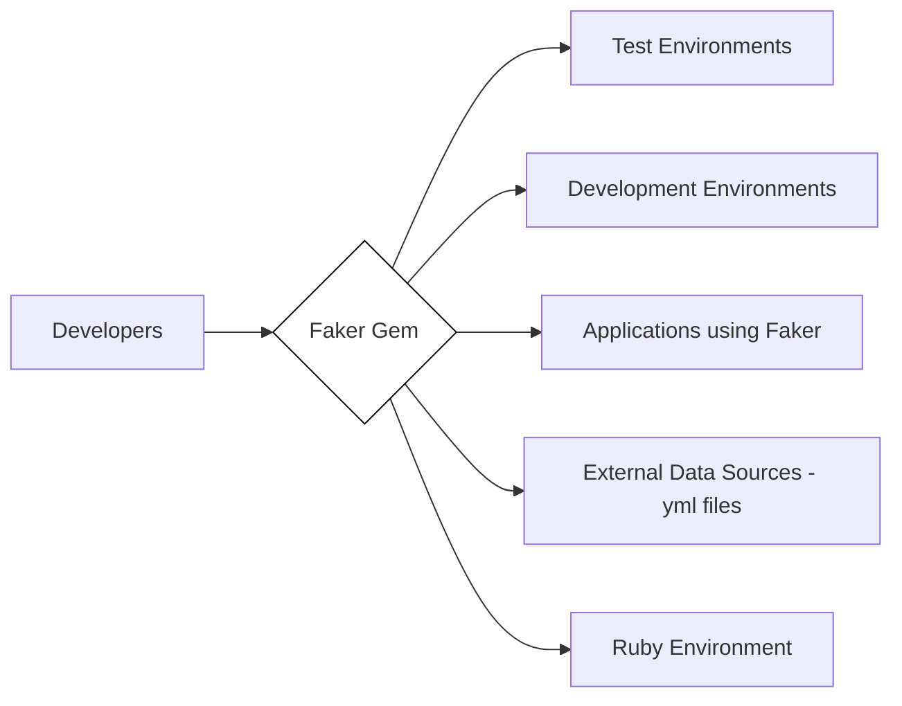
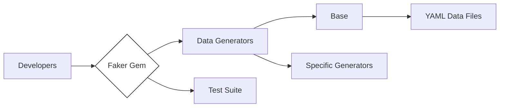
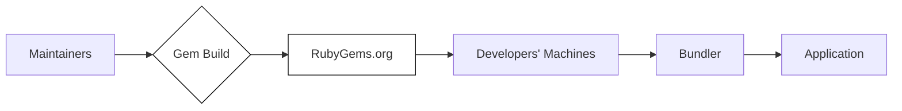
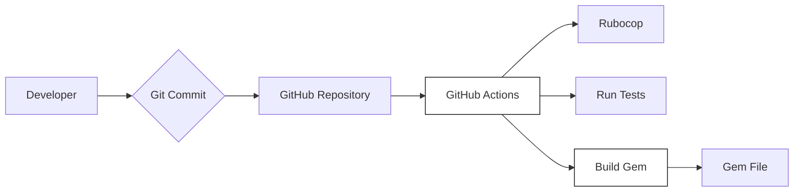

Okay, let's create a design document for the Faker Ruby gem, focusing on aspects relevant to threat modeling.

# BUSINESS POSTURE

Business Priorities and Goals:

*   Provide a readily available, easy-to-use library for generating fake data for development and testing purposes.
*   Maintain a high level of data quality and realism across a wide variety of data types (names, addresses, etc.).
*   Ensure the library is easily extensible to support new locales and data types.
*   Foster a strong community around the project, encouraging contributions and maintaining the library's relevance.
*   Minimize maintenance overhead and ensure long-term sustainability of the project.

Business Risks:

*   Data quality issues: Inaccurate or unrealistic data could lead to flawed testing and development outcomes.
*   Maintenance burden: Lack of maintainers or insufficient community contributions could lead to the project becoming outdated or abandoned.
*   Lack of extensibility: Inability to easily add new locales or data types could limit the library's usefulness.
*   Security vulnerabilities: While primarily a data generation tool, vulnerabilities in the library could potentially be exploited, especially if used in production environments (which is not recommended). This is a lower priority risk given the intended use case.
*   Legal and compliance issues: Inadvertent generation of data that infringes on copyrights or trademarks, or violates privacy regulations (though this is unlikely given the nature of the generated data).

# SECURITY POSTURE

Existing Security Controls:

*   security control: Code Reviews: Pull requests are reviewed by maintainers before merging. (Described in CONTRIBUTING.md and visible in GitHub's pull request history).
*   security control: Automated Testing: A comprehensive test suite is used to ensure data quality and prevent regressions. (Described in CONTRIBUTING.md and visible in the `test` directory).
*   security control: Dependency Management: Dependencies are managed using Bundler, and their versions are tracked. (Visible in `Gemfile` and `Gemfile.lock`).
*   security control: Static Analysis: Rubocop is used for static code analysis to enforce coding standards and identify potential issues. (Described in CONTRIBUTING.md and configured in `.rubocop.yml`).
*   security control: Community Vigilance: A large and active community helps identify and report potential issues. (Visible in GitHub's issue tracker and community forums).

Accepted Risks:

*   accepted risk: Production Use: The library is not designed for production use, and using it in production could expose sensitive data or create other issues. This is explicitly warned against in the documentation.
*   accepted risk: Data Bias: The generated data may reflect biases present in the underlying data sources or algorithms.
*   accepted risk: Limited Input Validation: Faker primarily focuses on generating data, not validating it. While some basic validation might exist, it's not a primary focus.
*   accepted risk: No formal security audits: There is no mention of regular, formal security audits.

Recommended Security Controls:

*   security control: Dependency Scanning: Implement automated dependency scanning (e.g., using tools like Dependabot or Snyk) to identify and address known vulnerabilities in dependencies.
*   security control: Fuzz Testing: Consider incorporating fuzz testing to identify potential edge cases and vulnerabilities in data generation logic.
*   security control: Security Policy: Create a `SECURITY.md` file to provide clear instructions for reporting security vulnerabilities.

Security Requirements:

*   Authentication: Not applicable, as Faker is a library and does not involve user authentication.
*   Authorization: Not applicable, as Faker does not manage access control.
*   Input Validation: While not a primary focus, any user-provided input (e.g., options for data generation) should be validated to prevent unexpected behavior or potential vulnerabilities. This is a lower priority requirement.
*   Cryptography: Not directly applicable, as Faker does not handle sensitive data or encryption. However, if random number generation is used, it should be cryptographically secure where appropriate (e.g., for generating unique identifiers).
*   Data Sensitivity: Faker should not generate real personally identifiable information (PII) or sensitive data. The focus should be on generating realistic but *fake* data.

# DESIGN

## C4 CONTEXT

Element Descriptions:

*   Element:
    *   Name: Developers
    *   Type: User
    *   Description: Software developers who use the Faker gem to generate fake data.
    *   Responsibilities: Integrate Faker into their applications, configure data generation, and use the generated data for testing and development.
    *   Security controls: None specific to Faker.

*   Element:
    *   Name: Faker Gem
    *   Type: Software System
    *   Description: The Faker Ruby gem, a library for generating fake data.
    *   Responsibilities: Provide an API for generating various types of fake data, manage data sources, and handle locale-specific data.
    *   Security controls: Code reviews, automated testing, static analysis, dependency management, community vigilance.

*   Element:
    *   Name: Test Environments
    *   Type: System
    *   Description: Environments where software is tested using fake data generated by Faker.
    *   Responsibilities: Execute tests, validate application behavior, and report test results.
    *   Security controls: Standard testing environment security practices.

*   Element:
    *   Name: Development Environments
    *   Type: System
    *   Description: Environments where software is developed and where Faker may be used for generating sample data.
    *   Responsibilities: Support development activities, provide tools for debugging and testing.
    *   Security controls: Standard development environment security practices.

*   Element:
    *   Name: Applications using Faker
    *   Type: System
    *   Description: Applications that integrate the Faker gem to generate fake data.
    *   Responsibilities: Utilize Faker's API to generate data as needed.
    *   Security controls: Application-specific security controls.

*   Element:
    *   Name: External Data Sources - yml files
    *   Type: System
    *   Description: YAML files containing the data used by Faker to generate fake data.
    *   Responsibilities: Store data for various locales and data types.
    *   Security controls: File system permissions, access control to the repository.

*   Element:
    *   Name: Ruby Environment
    *   Type: System
    *   Description: The Ruby runtime environment required to execute the Faker gem.
    *   Responsibilities: Provide the necessary libraries and runtime support for Faker.
    *   Security controls: Standard Ruby environment security practices.

## C4 CONTAINER

Element Descriptions:

*   Element:
    *   Name: Developers
    *   Type: User
    *   Description: Software developers who use the Faker gem.
    *   Responsibilities: Integrate Faker into their applications, configure data generation, and use the generated data.
    *   Security controls: None specific to Faker.

*   Element:
    *   Name: Faker Gem
    *   Type: Container (Library)
    *   Description: The main entry point for the Faker library.
    *   Responsibilities: Provide the public API, manage data generators, and handle locale selection.
    *   Security controls: Code reviews, automated testing, static analysis.

*   Element:
    *   Name: Data Generators
    *   Type: Container (Module)
    *   Description: A collection of modules responsible for generating specific types of data.
    *   Responsibilities: Generate data for names, addresses, phone numbers, etc.
    *   Security controls: Code reviews, automated testing.

*   Element:
    *   Name: Base
    *   Type: Container (Module)
    *   Description: Provides core functionality and base classes for data generators.
    *   Responsibilities: Define common methods and data structures used by specific generators.
    *   Security controls: Code reviews, automated testing.

*   Element:
    *   Name: Specific Generators
    *   Type: Container (Module)
    *   Description: Modules that implement specific data generation logic (e.g., Name, Address, PhoneNumber).
    *   Responsibilities: Generate data for a particular type, using data from YAML files and algorithms.
    *   Security controls: Code reviews, automated testing.

*   Element:
    *   Name: YAML Data Files
    *   Type: Container (Data Store)
    *   Description: YAML files containing the data used by the generators.
    *   Responsibilities: Store data for various locales and data types.
    *   Security controls: File system permissions, access control to the repository.

*   Element:
    *   Name: Test Suite
    *   Type: Container (Test Framework)
    *   Description: The suite of tests that verify the functionality of the Faker gem.
    *   Responsibilities: Execute tests, validate data generation, and report test results.
    *   Security controls: None specific to the test suite itself.

## DEPLOYMENT

Possible Deployment Solutions:

1.  RubyGems: The standard deployment method for Ruby gems.
2.  Bundler: Used within Ruby projects to manage dependencies, including Faker.
3.  Docker: Faker could be included in a Docker image as part of a larger application.

Chosen Solution (RubyGems):

Element Descriptions:

*   Element:
    *   Name: Maintainers
    *   Type: User
    *   Description: The maintainers of the Faker gem.
    *   Responsibilities: Develop, test, and release new versions of the gem.
    *   Security controls: Access control to the repository, code review process.

*   Element:
    *   Name: Gem Build
    *   Type: Process
    *   Description: The process of building the Faker gem package.
    *   Responsibilities: Package the code, data files, and metadata into a .gem file.
    *   Security controls: Build environment security, code signing (optional).

*   Element:
    *   Name: RubyGems.org
    *   Type: System (Package Repository)
    *   Description: The central repository for Ruby gems.
    *   Responsibilities: Host and distribute the Faker gem.
    *   Security controls: RubyGems.org's security measures (e.g., HTTPS, access control).

*   Element:
    *   Name: Developers' Machines
    *   Type: System
    *   Description: The machines where developers are working on projects that use Faker.
    *   Responsibilities: Download and install the Faker gem.
    *   Security controls: Standard development machine security practices.

*   Element:
    *   Name: Bundler
    *   Type: System (Dependency Manager)
    *   Description: The dependency manager used in Ruby projects.
    *   Responsibilities: Download and install the Faker gem and its dependencies.
    *   Security controls: Bundler's security features (e.g., verifying gem checksums).

*   Element:
    *   Name: Application
    *   Type: System
    *   Description: The application that uses the Faker gem.
    *   Responsibilities: Integrate and use the Faker gem.
    *   Security controls: Application-specific security controls.

## BUILD

Build Process Description:

1.  Developer commits code changes to the local Git repository.
2.  Changes are pushed to the GitHub repository.
3.  GitHub Actions is triggered by the push event.
4.  Rubocop runs to enforce code style and identify potential issues.
5.  The test suite is executed to ensure code quality and prevent regressions.
6.  If all checks pass, the gem is built.
7.  The built gem file (.gem) is created as a build artifact.  While not explicitly shown in the repository's workflows, this is the standard process for Ruby gems.  The release process likely involves manual steps or a separate workflow to push the gem to RubyGems.org.

Security Controls:

*   security control: GitHub Actions: Automates the build and testing process, ensuring consistency and reducing manual errors.
*   security control: Rubocop: Enforces coding standards and identifies potential code quality issues.
*   security control: Automated Testing: Ensures code quality and prevents regressions.
*   security control: Branch Protection Rules (GitHub): Can be configured to require code reviews and passing builds before merging to the main branch.

# RISK ASSESSMENT

Critical Business Processes:

*   Software Development: Faker is primarily used to support software development and testing.
*   Data Generation: The core process is generating realistic fake data.

Data Protection:

*   Data Sensitivity: Faker itself does not handle sensitive data. The data it *generates* should be considered non-sensitive, as it is intended to be fake. The YAML files containing the data used for generation are not inherently sensitive, but should be protected from unauthorized modification.
*   Data Types: Names, addresses, phone numbers, company names, lorem ipsum text, etc.

# QUESTIONS & ASSUMPTIONS

Questions:

*   Are there any specific compliance requirements (e.g., GDPR, CCPA) that need to be considered, even though Faker generates fake data? (Assumption: No, given the intended use case.)
*   Are there any plans to use Faker in production environments? (Assumption: No, as this is strongly discouraged.)
*   Is there a specific process for handling community contributions and ensuring their quality? (Assumption: Yes, based on the CONTRIBUTING.md file and GitHub activity.)
*   What is the process for releasing new versions of the gem? (Assumption: Standard RubyGems release process, likely involving manual steps.)
*   Are there any specific security concerns related to the use of external data sources (YAML files)? (Assumption: No, as long as the files are protected from unauthorized modification.)

Assumptions:

*   BUSINESS POSTURE: The primary goal is to provide a reliable and easy-to-use tool for generating fake data for development and testing.
*   SECURITY POSTURE: Security is important, but the primary focus is on data quality and maintainability. The risk of using Faker in production is accepted, as it is explicitly discouraged.
*   DESIGN: The design is relatively simple, with a clear separation of concerns between data generators and data sources. The deployment process follows standard Ruby gem practices.