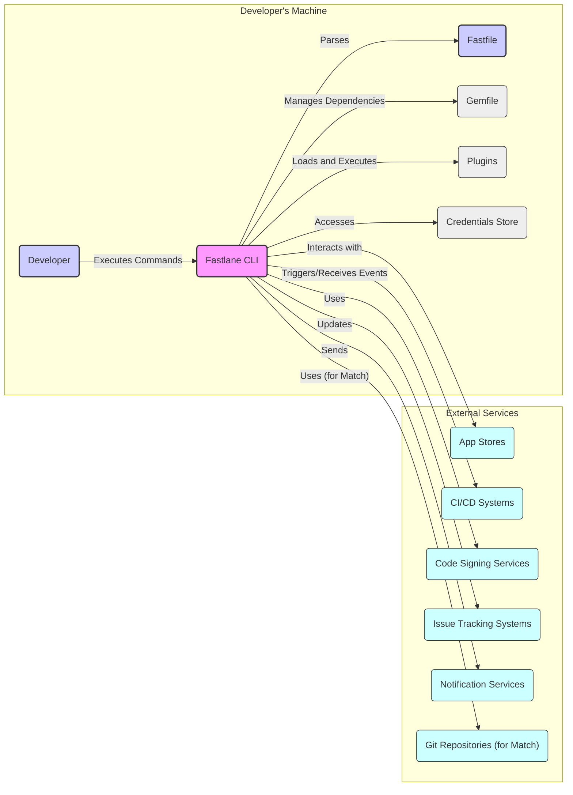
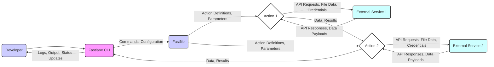

# Project Design Document: Fastlane

**Version:** 1.1
**Date:** October 26, 2023
**Author:** AI Software Architect

## 1. Introduction

This document provides a detailed design overview of the Fastlane project, an open-source toolchain designed to automate building, testing, and releasing mobile applications. This document aims to provide a comprehensive understanding of Fastlane's architecture, components, and data flow, which will serve as the foundation for subsequent threat modeling activities. This version includes clarifications and expansions based on the initial design.

## 2. Goals

The primary goals of this design document are to:

*   Clearly articulate the architecture and key components of the Fastlane project, providing more granular detail where necessary.
*   Describe the interactions between different components and external systems, including the types of data exchanged.
*   Identify the data flow within the Fastlane ecosystem, highlighting potential points of interest for security analysis.
*   Provide sufficient detail to enable effective threat modeling of the Fastlane project, considering various attack vectors.

## 3. Scope

This document covers the core functionality of the Fastlane toolchain, including:

*   The Fastlane command-line interface (CLI) and its core functionalities.
*   The `Fastfile` configuration, including its structure and capabilities.
*   Lanes and Actions, detailing their execution context and data handling.
*   The Plugin architecture, including the lifecycle and potential risks.
*   Credentials management, encompassing various methods and their security implications.
*   Integration with external services (e.g., app stores, CI/CD systems), focusing on authentication and authorization.

This document does not cover:

*   Specific implementation details of individual Fastlane actions or plugins beyond their general purpose and data interaction.
*   The intricacies of the underlying Ruby codebase, focusing on the architectural aspects.
*   The historical evolution of the project or its detailed development roadmap.

## 4. High-Level Architecture

Fastlane operates as a command-line tool that orchestrates various tasks involved in mobile app development and deployment. It uses a declarative configuration defined in a `Fastfile` to execute sequences of actions, known as "lanes." The system interacts with the developer's environment and various external services.

*   **Developer:** The user who interacts with Fastlane through the CLI, providing commands and configuration.
*   **Fastlane CLI:** The command-line interface that interprets user commands, loads the `Fastfile`, manages dependencies, executes plugins, and interacts with external services.
*   **Fastfile:** A Ruby file that defines the automation workflows (lanes) and the actions to be performed within those lanes. It can contain sensitive information and custom logic.
*   **Gemfile:** A file that specifies the Ruby dependencies required by Fastlane and its plugins, representing potential supply chain dependencies.
*   **Plugins:** Extensions that provide additional actions and functionality to Fastlane, potentially introducing security risks if not vetted.
*   **Credentials Store:** Represents various mechanisms used to store sensitive information like API keys, passwords, and certificates.
*   **App Stores:** Platforms where mobile applications are published and distributed, requiring secure authentication for interaction.
*   **CI/CD Systems:** Tools used for continuous integration and continuous delivery pipelines, often triggering Fastlane executions and receiving results.
*   **Code Signing Services:** Services used to manage and apply digital signatures to mobile app binaries, requiring secure access to signing identities.
*   **Issue Tracking Systems:** Platforms used for managing bugs and feature requests, which Fastlane can interact with to update issue statuses.
*   **Notification Services:** Services used to send notifications to developers or users, potentially triggered by Fastlane actions.
*   **Git Repositories (for Match):** Used by the `match` tool to store and synchronize code signing identities, requiring secure access and management.

## 5. Detailed Design

### 5.1. Fastlane CLI

*   **Purpose:** The central interface for user interaction and the orchestrator of Fastlane's functionality.
*   **Functionality:**
    *   **Command Parsing and Validation:** Interprets user commands and ensures they conform to the expected syntax.
    *   **Fastfile Loading and Interpretation:** Reads and parses the `Fastfile`, executing the Ruby code within it.
    *   **Dependency Management:** Utilizes Bundler to manage Ruby gem dependencies defined in the `Gemfile`.
    *   **Plugin Management:** Handles installation, updates, and loading of Fastlane plugins.
    *   **Action Execution:** Executes individual actions within a lane, passing parameters and handling results.
    *   **Credentials Access:** Retrieves credentials from configured storage mechanisms.
    *   **External Service Interaction:** Makes API calls and interacts with external services based on action configurations.
    *   **Logging and Output:** Provides feedback to the user through console output and log files.
    *   **Error Handling and Reporting:** Manages exceptions and provides error messages to the user.
    *   **Context Management:** Maintains the execution context, including environment variables and parameter values.

### 5.2. Fastfile

*   **Purpose:** Defines the automation workflows using a Ruby-based DSL, specifying the sequence of actions to be performed.
*   **Structure:**
    *   **Lanes:** Named blocks of code that define specific automation tasks.
    *   **Actions:** Calls to predefined or plugin-provided actions with specific parameters.
    *   **Parameters:** Configuration values passed to actions, potentially including sensitive information.
    *   **Conditional Logic:** Ruby code for controlling the flow of execution based on conditions.
    *   **Environment Variables:** Access to environment variables, which can be a source of configuration.
    *   **Ruby Code:** Allows embedding arbitrary Ruby code for more complex logic and data manipulation.
*   **Security Considerations:** The `Fastfile` can contain sensitive information directly or indirectly (e.g., through environment variable access). Its contents should be treated as sensitive.

### 5.3. Lanes

*   **Purpose:** To organize and structure a series of actions into logical automation workflows.
*   **Functionality:**
    *   **Sequential Execution:** Actions within a lane are typically executed in the order they are defined.
    *   **Parameterization:** Lanes can accept parameters, allowing for customization of their behavior.
    *   **Error Handling:** Mechanisms for handling errors that occur during action execution within the lane.
    *   **Lane Calling:** One lane can call another, enabling modularity and reuse of automation logic.
    *   **Context Propagation:** The execution context (e.g., parameters, environment variables) is typically propagated within a lane.

### 5.4. Actions

*   **Purpose:** To perform specific, atomic tasks within a Fastlane workflow.
*   **Types:**
    *   **Core Actions:** Built-in actions provided by Fastlane for common tasks (e.g., building, testing, deploying).
    *   **Plugin Actions:** Actions provided by external plugins, extending Fastlane's capabilities.
*   **Functionality:**
    *   **External Tool Interaction:** Execute command-line tools (e.g., `xcodebuild`, `gradle`).
    *   **API Interaction:** Make requests to external APIs (e.g., app store APIs, CI/CD APIs).
    *   **File System Operations:** Read, write, and manipulate files and directories.
    *   **Data Transformation:** Process and transform data.
    *   **Credential Usage:** Access and utilize stored credentials for authentication.
    *   **Error Handling:** Handle errors that occur during the execution of the action.
*   **Security Considerations:** Actions, especially plugin actions, can introduce security vulnerabilities if they interact with external systems insecurely or process data improperly.

### 5.5. Plugins

*   **Purpose:** To extend Fastlane's functionality by providing new actions and integrations.
*   **Structure:**
    *   Ruby gems that adhere to the Fastlane plugin API.
    *   Can define new actions, modify existing ones, or provide entirely new features.
    *   Managed through the Fastlane CLI using commands like `fastlane add_plugin`.
*   **Lifecycle:**
    *   **Installation:** Plugins are installed as Ruby gems.
    *   **Loading:** Fastlane loads installed plugins at runtime.
    *   **Execution:** Plugin actions are executed like core actions.
    *   **Updates:** Plugins can be updated to newer versions.
*   **Security Considerations:** Plugins represent a significant security surface area due to their external origin and potential access to sensitive data and system resources.

### 5.6. Credentials Management

*   **Purpose:** To securely store and manage sensitive credentials required for interacting with external services.
*   **Mechanisms:**
    *   **`.env` files:** Simple text files storing environment variables, generally discouraged for highly sensitive credentials.
    *   **`fastlane match`:** A tool for synchronizing code signing identities across teams using Git repositories, relying on encryption and secure Git access.
    *   **Keychain Access:** Utilizing the operating system's keychain for secure storage of credentials.
    *   **Third-party Credential Management Services:** Integration with services like HashiCorp Vault or cloud provider secret managers.
    *   **Environment Variables:** Credentials can be passed as environment variables, but their security depends on the environment's security.
*   **Security Considerations:** The security of the chosen credential management mechanism is paramount. Weak storage or insecure access can lead to credential compromise.

### 5.7. Data Flow

The typical data flow within Fastlane involves the following steps, with a focus on data types and potential security implications:

1. **Developer Interaction:** The developer provides commands and potentially sensitive configuration data to the Fastlane CLI.
2. **Configuration Loading:** The CLI reads and parses the `Fastfile`, which contains action definitions and parameters, some of which might be sensitive.
3. **Lane Execution:** The specified lane is executed, processing actions sequentially.
4. **Action Execution:** Each action performs its designated task, potentially sending API requests, file data, and credentials to external services.
5. **Data Exchange:** Actions exchange data with external services, receiving API responses and data payloads. This data can be sensitive.
6. **Data Passing:** Data and results can be passed between actions within a lane.
7. **Output and Reporting:** Fastlane provides logs, output, and status updates to the developer, potentially including sensitive information.

## 6. Key Security Considerations

Based on the architecture and data flow, the following are key security considerations for Fastlane:

*   **Sensitive Data Exposure in `Fastfile`:** The `Fastfile` can contain sensitive information directly or indirectly. Secure storage and access control for `Fastfile` are crucial.
*   **Insecure Credential Management:** Weakly configured or insecure credential storage mechanisms can lead to credential compromise.
*   **Malicious Plugins:** Untrusted or compromised plugins can execute arbitrary code, access sensitive data, and compromise the system.
*   **Supply Chain Attacks:** Compromised dependencies (Ruby gems) can introduce vulnerabilities into Fastlane.
*   **Insecure Communication with External Services:** Failure to use HTTPS or other secure protocols for communication with external services can expose sensitive data in transit.
*   **Insufficient Input Validation:** Lack of proper input validation in actions can lead to injection vulnerabilities.
*   **Overly Permissive Access Control:** Insufficient restrictions on who can modify `Fastfile` or access credentials can increase the risk of unauthorized access.
*   **Logging Sensitive Information:** Logging sensitive information can expose it to unauthorized individuals.
*   **Code Signing Identity Compromise:** If the code signing identities managed by `match` are compromised, attackers can sign and distribute malicious apps.
*   **Man-in-the-Middle Attacks:** If communication with external services is not properly secured, attackers can intercept and modify data.

## 7. Future Considerations

This design document provides a snapshot of the current architecture. Future enhancements and changes may include:

*   Enhanced plugin security mechanisms, such as plugin signing and sandboxing.
*   More robust and integrated credential management options with better security defaults.
*   Improved logging and auditing capabilities with options for secure log storage and analysis.
*   Stricter input validation and sanitization within core actions.
*   Integration with security scanning tools to identify potential vulnerabilities in `Fastfile` configurations and plugin code.
*   More granular access control mechanisms for managing permissions within Fastlane workflows.

This document will be used as a basis for conducting a thorough threat model of the Fastlane project to identify potential vulnerabilities and develop appropriate mitigation strategies. The enhanced details in this version aim to provide a more comprehensive understanding for effective threat modeling.