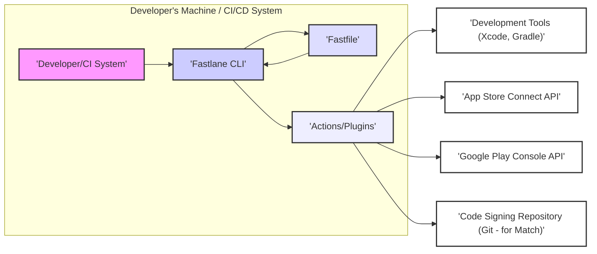
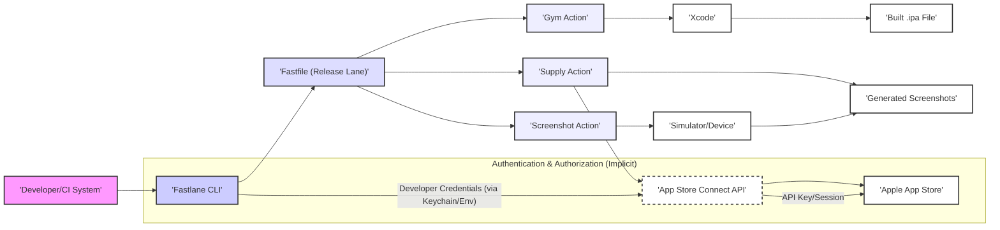

# Project Design Document: Fastlane

**Version:** 1.1
**Date:** October 26, 2023
**Author:** Gemini (AI Model)

## 1. Introduction

This document provides a detailed design overview of the Fastlane project, an open-source platform designed to automate the build, test, and release processes for mobile applications. This document serves as a foundational resource for subsequent threat modeling activities.

## 2. Goals and Objectives

*   **Primary Goal:** To automate repetitive and error-prone tasks within mobile app development and deployment workflows, leading to increased efficiency and reduced manual intervention.
*   **Key Objectives:**
    *   **Screenshot Automation:**  Simplify the generation of localized screenshots for app store listings across various device sizes.
    *   **Code Signing Management:** Automate the complex process of code signing and provisioning profile management for iOS applications.
    *   **App Store Submission:** Streamline and automate the submission of application binaries and metadata to the Apple App Store and Google Play Store.
    *   **Tool and Service Integration:** Provide seamless integration with a wide array of development tools, testing frameworks, and backend services.
    *   **Workflow Standardization:**  Establish consistent and reliable workflows for mobile development teams, ensuring repeatable and predictable processes.
    *   **Extensibility:** Offer a flexible architecture through plugins and custom actions, allowing users to tailor Fastlane to their specific needs.
    *   **Improved Developer Experience:** Reduce the cognitive load on developers by automating mundane tasks, allowing them to focus on core development activities.

## 3. Target Audience

*   Mobile application developers (specifically those working on iOS and Android platforms).
*   DevOps engineers responsible for building and maintaining mobile application CI/CD pipelines.
*   Quality assurance engineers involved in automated testing and release verification processes.
*   Technical project managers seeking to optimize and standardize mobile app delivery.
*   Security engineers performing threat assessments on mobile development and deployment workflows.

## 4. System Architecture

Fastlane operates primarily as a command-line interface (CLI) tool executed within a developer's local environment or integrated into a Continuous Integration/Continuous Delivery (CI/CD) system. It orchestrates interactions with various external tools and services through their respective APIs and command-line interfaces.

### 4.1. Key Components

*   **Fastlane CLI:** The central executable (`fastlane`) that parses the `Fastfile`, interprets the defined workflows (lanes), and executes the corresponding actions. It acts as the orchestrator of the entire automation process.
*   **Fastfile:** A Ruby file located at the root of a mobile project. This file defines the automation workflows (known as "lanes") using a declarative syntax. It specifies the sequence of actions to be executed for a particular task (e.g., beta deployment, production release).
*   **Actions:**  Modular, pre-built Ruby scripts that perform specific, atomic tasks. Examples include building the application binary (`gym`), uploading to the app store (`supply`), running tests (`scan`), and managing code signing (`match`). Actions encapsulate the logic for interacting with external tools and services.
*   **Plugins:** Extensions that enhance Fastlane's functionality by adding new actions or modifying existing ones. Plugins enable integration with third-party services, custom tools, or specific project requirements. They extend the core capabilities of Fastlane.
*   **Match:**  A specialized component focused on synchronizing code signing certificates and provisioning profiles across a development team. It securely stores these sensitive assets in a private Git repository and ensures consistent code signing configurations for all team members.
*   **Supply:**  A component dedicated to automating the process of uploading app metadata (descriptions, keywords, screenshots), localized text, and the application binary to the Apple App Store Connect and Google Play Console.
*   **Scan:**  A component designed to execute automated tests (unit tests, UI tests) for both iOS and Android applications. It integrates with various testing frameworks and provides reports on test results.
*   **Gym:**  An action specifically for building and packaging iOS applications (`.ipa` files). It simplifies the process of invoking Xcodebuild with the correct settings and configurations.
*   **Gradle:**  While not a direct Fastlane component, Fastlane interacts with the Gradle build system for Android applications, leveraging its capabilities for building and managing Android projects.

### 4.2. High-Level Data Flow

### 4.3. Detailed Data Flow Example (App Store Release)

## 5. Security Considerations

*   **Sensitive Credential Management:** Fastlane interacts with highly sensitive credentials, including:
    *   Apple Developer Program credentials (usernames, passwords, API keys).
    *   Google Play Console credentials (usernames, passwords, service account keys).
    *   API keys and tokens for various integrated services.
    *   Code signing certificates and private keys.
    *   Provisioning profiles.
    Secure storage and handling of these credentials are paramount to prevent unauthorized access and misuse. Potential threats include credential theft, exposure through insecure storage, and unauthorized access via compromised CI/CD systems.
    *   **Mitigation:** Utilizing environment variables (with proper scoping and access controls), leveraging the system keychain (Fastlane's Keychain Access), and employing `match` for secure storage in a private Git repository are recommended practices. Secrets management tools should be considered in CI/CD environments.
*   **Code Signing Security:** The code signing process relies on private keys and certificates, which are critical for establishing the authenticity and integrity of the application. Compromise of these assets could lead to the distribution of malicious software under a legitimate developer's identity.
    *   **Mitigation:**  `match` helps to centralize and secure code signing assets. Access control to the Git repository storing these assets is crucial. Regular audits of access logs and secure key generation practices are important.
*   **Plugin Security Risks:** Fastlane's extensibility through plugins introduces potential security vulnerabilities. Malicious or poorly written plugins could:
    *   Expose sensitive data.
    *   Execute arbitrary code on the developer's machine or CI/CD server.
    *   Tamper with the build or release process.
    *   Introduce supply chain attacks.
    *   **Mitigation:**  Users should exercise caution when installing third-party plugins and rely on trusted sources. Code reviews of plugin code, where feasible, and awareness of reported vulnerabilities are essential. Fastlane's plugin management could benefit from features like plugin signing or sandboxing.
*   **Fastfile Security:** The `Fastfile`, being a Ruby script, can potentially execute arbitrary commands if not carefully constructed. Vulnerabilities in the `Fastfile` could be exploited to gain unauthorized access or manipulate the development environment.
    *   **Mitigation:**  Adhering to secure coding practices when writing `Fastfile` logic is crucial. Input validation, avoiding the execution of untrusted external commands, and regular reviews of `Fastfile` contents are recommended.
*   **Network Communication Security:** Fastlane communicates with external services (app stores, APIs) over the network. Insecure communication channels could expose sensitive data transmitted during these interactions.
    *   **Mitigation:**  Fastlane primarily uses HTTPS for communication with external services. Ensuring that TLS certificates are valid and not subject to man-in-the-middle attacks is important.
*   **Dependency Vulnerabilities:** Fastlane relies on various Ruby gems. Vulnerabilities in these dependencies could be exploited to compromise the Fastlane environment.
    *   **Mitigation:**  Regularly updating Fastlane and its dependencies using `bundle update` is crucial. Employing dependency scanning tools to identify and address known vulnerabilities is recommended.
*   **Access Control in CI/CD:** When integrated into CI/CD systems, proper access controls are essential to prevent unauthorized users or processes from modifying Fastlane configurations or triggering deployments.
    *   **Mitigation:**  Leveraging the access control mechanisms provided by the CI/CD platform and adhering to the principle of least privilege are important.
*   **Data Security and Privacy:** Fastlane handles application binaries, metadata, and potentially user data during the build and release process. Ensuring the confidentiality and integrity of this data is vital.
    *   **Mitigation:**  Secure storage of build artifacts and adherence to data privacy regulations are necessary. Avoiding the storage of sensitive user data within Fastlane configurations is recommended.

## 6. Technologies Used

*   **Primary Programming Language:** Ruby
*   **Dependency Management:** RubyGems, Bundler
*   **Supported Operating Systems:** macOS (primary), Linux, Windows (with some limitations)
*   **Version Control System (for `match`):** Git
*   **Key APIs:** Apple App Store Connect API, Google Play Console API, and various third-party service APIs (depending on configured actions and plugins).
*   **Build Tools Integration:** Xcode (for iOS), Gradle (for Android)

## 7. Deployment Model

Fastlane is typically deployed as a command-line tool in the following scenarios:

*   **Local Development Environment:** Developers install Fastlane on their individual machines using RubyGems to automate tasks during development.
*   **Continuous Integration/Continuous Delivery (CI/CD) Systems:** Fastlane is integrated into CI/CD pipelines (e.g., Jenkins, GitLab CI, GitHub Actions, Bitrise) by installing it within the CI/CD environment's build agents. This enables automated builds, tests, and deployments.

## 8. Future Considerations

*   **Enhanced Plugin Security Mechanisms:** Implementing features like plugin signing, sandboxing, or a more robust plugin review process to improve the security and trustworthiness of the plugin ecosystem.
*   **Improved Credential Management Integrations:** Exploring deeper integrations with dedicated secrets management solutions (e.g., HashiCorp Vault, AWS Secrets Manager, Azure Key Vault) for more secure credential handling.
*   **Formal Security Audits and Penetration Testing:** Conducting regular security audits and penetration testing of the Fastlane codebase to identify and address potential vulnerabilities proactively.
*   **More Granular Access Control:** Implementing more fine-grained access control mechanisms within Fastlane itself to restrict access to sensitive actions or configurations based on user roles or permissions.
*   **Enhanced Error Handling and Security Logging:** Providing more detailed and actionable error messages for security-related failures and improving security logging capabilities for auditing and incident response.
*   **Support for Emerging Mobile Platforms and Technologies:** Continuously expanding support to new mobile platforms, frameworks, and development tools to maintain relevance and broad applicability.
*   **Consideration of a GUI or Web Interface (Optional):** While currently CLI-focused, exploring the potential for a graphical user interface or web-based interface for easier configuration and management, while carefully considering the security implications of such an approach.

This document provides a detailed and improved overview of the Fastlane project's architecture, data flows, and security considerations. It serves as a valuable resource for understanding the system's design and for conducting thorough threat modeling activities.
