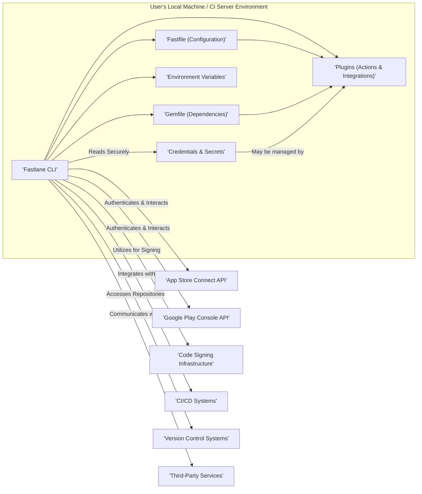
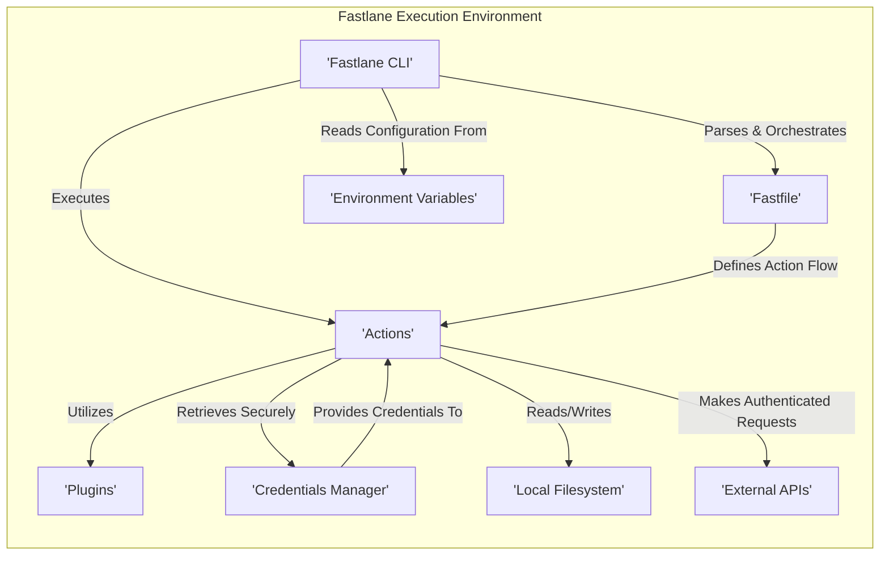

## Project Design Document: Fastlane (Improved)

**1. Introduction**

This document provides an enhanced architectural design of the Fastlane project, an open-source automation toolchain meticulously designed to simplify and streamline the build, test, and release process for mobile applications, primarily targeting iOS and Android platforms. This improved document aims to offer a more granular and comprehensive understanding of Fastlane's intricate components, data flow pathways, and critical interactions, thereby serving as a robust and detailed foundation for subsequent threat modeling activities. We will delve deeper into the security implications of each component and interaction.

**2. Goals and Objectives**

The core goals underpinning the design and functionality of Fastlane are:

* **Robust Automation:** To automate the often complex and repetitive tasks inherent in mobile app development and deployment lifecycles, minimizing manual intervention.
* **Enhanced Efficiency:** To significantly reduce the manual effort and time expenditure associated with build, rigorous testing, and seamless release processes.
* **Workflow Consistency:** To ensure the establishment and adherence to consistent and repeatable workflows across diverse development environments and collaborative teams.
* **Platform Extensibility:** To provide a highly flexible and extensible platform through a rich ecosystem of plugins, encompassing both specialized actions and broad integrations.
* **Simplified Configuration Management:** To offer a user-centric and intuitive configuration mechanism primarily facilitated through the declarative `Fastfile`.

**3. High-Level Architecture**

Fastlane operates as a command-line interface (CLI) tool that intelligently orchestrates a series of predefined actions and integrations. The fundamental architecture can be visually represented as follows:

**4. Component Details**

* **Fastlane CLI:** This serves as the primary interaction point for users. It's responsible for parsing user commands, meticulously loading configuration details, and orchestrating the execution of defined workflows.
* **Fastfile (Configuration):** A Ruby-based file that declaratively defines the automation workflows (referred to as 'lanes') and their corresponding sequence of actions. It acts as the central repository for Fastlane's configuration.
* **Gemfile (Dependencies):** A standard Ruby dependency management file that explicitly lists the required Fastlane gems and their specific version constraints, ensuring consistent execution environments.
* **Plugins (Actions & Integrations):** These are modular and reusable units of code that perform specific tasks or facilitate integration with external services.
    * **Actions:** Represent individual commands designed to perform discrete operations (e.g., `gym` for building iOS applications, `supply` for uploading application binaries to the Google Play Store).
    * **Integrations:** Provide pre-built connections and interfaces to interact with external services and APIs (e.g., App Store Connect API, Google Play Console API, Slack API).
* **Environment Variables:** Used to dynamically configure Fastlane's behavior and to securely pass sensitive information without hardcoding it in configuration files.
* **Credentials & Secrets:** This encompasses sensitive data crucial for authenticating and interacting with external services. Examples include API keys, signing certificates, provisioning profiles, and passwords. These are often managed through dedicated tools like `match` or secure environment variable management systems.

**5. Data Flow**

The typical data flow within a Fastlane execution can be broken down into the following stages:

1. **User Invocation:** A user initiates a Fastlane process by executing a command through the CLI (e.g., `fastlane ios beta`).
2. **Configuration and Dependency Loading:** The Fastlane CLI meticulously loads the `Fastfile`, parses the `Gemfile` to resolve dependencies, and incorporates relevant environment variables.
3. **Lane Execution and Orchestration:** The specified lane within the `Fastfile` is executed sequentially, with each action called in the defined order.
4. **Action Execution and Interaction:** Each action performs its designated task, which may involve:
    * **Configuration Retrieval:** Accessing configuration parameters from the `Fastfile` or environment variables.
    * **Local System Interaction:** Executing shell commands, reading from and writing to the local file system.
    * **External API Communication:** Making authenticated requests to external APIs (e.g., App Store Connect API, Google Play Console API). This necessitates secure credential management.
    * **Data Transformation and Manipulation:** Processing and transforming data, such as generating build numbers or creating release notes.
    * **File System Operations:** Creating, modifying, and deleting files, including build artifacts, screenshots, and temporary files.
5. **Plugin Utilization:** Actions may leverage plugins to extend their core functionality or to facilitate interaction with specific third-party services.
6. **Secure Credential Access:** Fastlane securely accesses stored credentials, often through integrations with tools like `match` or by retrieving them from securely managed environment variables, to authenticate with external services.
7. **Output, Logging, and Reporting:** Fastlane provides real-time output to the console and generates detailed logs documenting the execution process, including successes, failures, and relevant information.

A more detailed data flow diagram:

**6. Security Considerations (Expanded)**

Security is a paramount concern when utilizing Fastlane, given its access to sensitive credentials and its role in the deployment pipeline. Key security considerations include:

* **Robust Credential Management:** The secure storage, retrieval, and handling of sensitive credentials (API keys, signing certificates, provisioning profiles, passwords) are of utmost importance. Employing tools like `match` (which utilizes Git repositories for secure storage and sharing of certificates and profiles) or leveraging secure environment variable management practices is crucial. Avoid hardcoding credentials in the `Fastfile`.
* **Plugin Security and Vetting:** Plugins, being external code contributions, can introduce potential vulnerabilities if not thoroughly vetted. Users should exercise caution when selecting and installing plugins, prioritizing those from trusted sources and actively maintained repositories. Regularly review plugin dependencies for known vulnerabilities.
* **Fastfile Security and Access Control:** The `Fastfile` contains the core automation logic and may inadvertently include sensitive information. Implementing appropriate access controls and ensuring secure storage of the `Fastfile` within version control systems is essential. Consider using encrypted repositories for sensitive `Fastfile` content.
* **Dependency Management and Vulnerability Scanning:**  Vulnerabilities present in the Ruby gems used by Fastlane (as specified in the `Gemfile`) can pose a significant security risk. Regularly updating dependencies to their latest secure versions and employing vulnerability scanning tools for Ruby dependencies is a critical security practice.
* **API Key Security and Scoping:** API keys used to interact with external services should be treated as highly sensitive secrets. Implement strict access controls and consider scoping API keys to the minimum necessary permissions to limit potential damage in case of compromise.
* **Code Signing Infrastructure Security:** Protecting code signing certificates and provisioning profiles is absolutely critical to prevent unauthorized signing and distribution of applications. Secure key management practices and restricted access to signing infrastructure are essential.
* **Execution Environment Security Hardening:** The security posture of the environment where Fastlane is executed (whether a developer's local machine or a CI/CD server) directly impacts the overall security. Hardening these environments, implementing proper access controls, and keeping software up-to-date are crucial steps.
* **Secure Logging and Information Disclosure Prevention:** Logs generated by Fastlane may inadvertently contain sensitive information. Implement secure log management practices, including redacting sensitive data before storage and transit, and restricting access to log files.
* **Secrets Management Integration:** Leverage dedicated secrets management solutions (e.g., HashiCorp Vault, AWS Secrets Manager) to securely store and retrieve sensitive credentials used by Fastlane, rather than relying solely on environment variables.
* **Regular Security Audits and Penetration Testing:** Periodically conduct security audits and penetration testing of Fastlane configurations and the environments where it operates to identify and address potential vulnerabilities proactively.

**7. Deployment Scenarios**

Fastlane is commonly deployed and utilized in the following primary scenarios:

* **Local Development Environments:** Individual developers leverage Fastlane on their local machines to automate repetitive tasks during the development phase, such as building, testing, and preparing releases.
* **Continuous Integration/Continuous Delivery (CI/CD) Pipelines:** Fastlane is frequently integrated into CI/CD pipelines (e.g., Jenkins, GitHub Actions, GitLab CI, CircleCI) to automate the entire build, rigorous testing, and seamless deployment process as part of the software delivery lifecycle.

**8. Future Considerations**

* **Enhanced Built-in Security Features:**  Exploring and implementing more robust built-in security features within Fastlane itself, such as automated vulnerability scanning for plugins and dependencies, could significantly enhance its security posture.
* **Improved Monitoring, Alerting, and Auditing Capabilities:**  Developing more comprehensive monitoring, alerting, and auditing capabilities within Fastlane could provide better visibility into its operations and facilitate quicker detection of potential security incidents.
* **Native Secrets Management Integration:**  Deepening the integration with various secrets management solutions to provide a more seamless and secure way to handle sensitive credentials.
* **Formal Security Audits and Certifications:**  Undergoing formal security audits and pursuing relevant security certifications could further enhance trust and demonstrate a commitment to security best practices.

This improved document provides a more detailed and security-focused overview of the Fastlane project's architecture, serving as a more robust foundation for conducting thorough threat modeling activities. By gaining a deeper understanding of the individual components, intricate data flows, and potential security vulnerabilities, security professionals can more effectively identify, assess, and mitigate potential risks associated with the utilization of Fastlane within the mobile application development lifecycle.