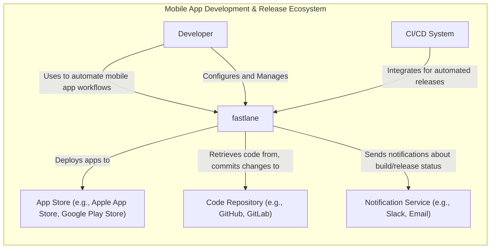
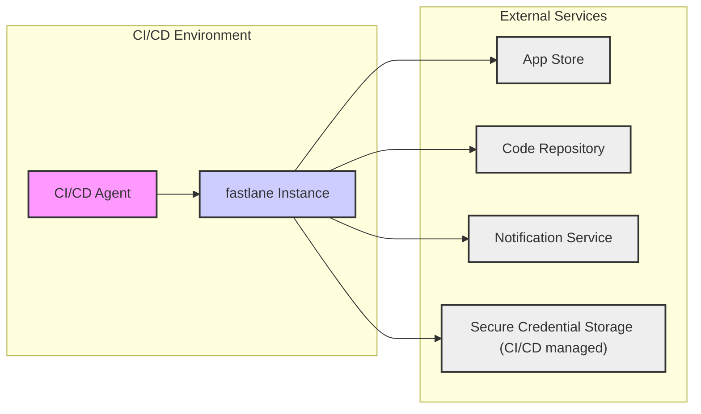

# BUSINESS POSTURE

This project, fastlane, aims to streamline and automate the build, test, and release process for mobile applications (iOS and Android).

- Business Priorities and Goals:
  - Accelerate mobile app release cycles.
  - Reduce manual effort and potential errors in the deployment process.
  - Improve consistency and reliability of app releases.
  - Enable faster iteration and delivery of new features and bug fixes.
  - Enhance developer productivity by automating repetitive tasks.

- Most Important Business Risks:
  - Disruption of app release pipeline due to fastlane malfunction or misconfiguration.
  - Exposure of sensitive credentials (API keys, signing certificates) if fastlane is compromised or misconfigured.
  - Unintended or unauthorized app releases due to automation errors or security vulnerabilities.
  - Dependency on a third-party open-source tool, with potential risks related to maintenance, security updates, and community support.
  - Compatibility issues with evolving mobile platforms, development tools, and app stores, potentially breaking the automation workflows.

# SECURITY POSTURE

- Existing Security Controls:
  - security control: Open Source Project - publicly available code allows for community review and scrutiny. Implemented: GitHub repository.
  - security control: Code Review - contributions are reviewed by maintainers before merging. Implemented: GitHub pull request process.
  - security control: Dependency Management - uses Bundler for Ruby dependency management, helping to manage and track dependencies. Implemented: Gemfile and Gemfile.lock.
  - security control: HTTPS for communication - communication with app stores and other services should be over HTTPS. Implemented: within fastlane code, leveraging underlying libraries.
  - security control: Credential Management - encourages the use of environment variables or secure credential storage solutions (like Keychain or environment managers) for sensitive information. Implemented: documented best practices and examples.
  - security control: Plugin System - modular architecture allows for extending functionality, but also introduces potential risks from third-party plugins. Implemented: fastlane plugin architecture.
  - security control: Documentation - provides documentation on usage and best practices, including security considerations. Implemented: fastlane official documentation website.

- Accepted Risks:
  - accepted risk: Reliance on community for security vulnerability discovery and patching.
  - accepted risk: Potential vulnerabilities in third-party plugins.
  - accepted risk: Misconfiguration by users leading to security issues (e.g., insecure credential storage).
  - accepted risk: Dependency vulnerabilities in underlying Ruby libraries and gems.

- Recommended Security Controls:
  - security control: Automated Dependency Scanning - Implement automated scanning of dependencies for known vulnerabilities as part of the CI/CD pipeline for fastlane development.
  - security control: Static Application Security Testing (SAST) - Integrate SAST tools into the development process to automatically identify potential security vulnerabilities in the fastlane codebase.
  - security control: Dynamic Application Security Testing (DAST) - Consider DAST for testing fastlane in a runtime environment, although applicability might be limited for a CLI tool.
  - security control: Security Audits - Periodic security audits of the fastlane codebase by security experts.
  - security control: Plugin Security Review Process - Establish guidelines and potentially automated checks for plugin security before they are officially recommended or promoted.
  - security control: Secure Credential Storage Guidance - Provide more detailed and prescriptive guidance on secure credential storage options and discourage insecure practices in documentation and examples.
  - security control: Supply Chain Security - Implement measures to ensure the integrity and authenticity of fastlane releases and dependencies.

- Security Requirements:
  - Authentication:
    - Requirement: Fastlane itself does not directly handle user authentication. Authentication is delegated to the services it interacts with (e.g., app stores, Git repositories).
    - Requirement: When interacting with services, fastlane should support secure authentication methods like API keys, tokens, and certificate-based authentication, as recommended by the respective service providers.
  - Authorization:
    - Requirement: Fastlane should respect the authorization models of the services it interacts with.
    - Requirement: Users configuring fastlane should have appropriate permissions to perform actions in connected services (e.g., deploy apps to app stores).
  - Input Validation:
    - Requirement: Fastlane should validate all inputs, including configuration files (Fastfile), command-line arguments, and responses from external services, to prevent injection attacks and other input-related vulnerabilities.
    - Requirement: Input validation should be applied to data formats, data types, and allowed values.
  - Cryptography:
    - Requirement: Fastlane should use cryptography appropriately to protect sensitive data in transit and at rest, where applicable.
    - Requirement: Securely handle and store cryptographic keys and certificates used for code signing and secure communication.
    - Requirement: Utilize established and well-vetted cryptographic libraries and algorithms.

# DESIGN

## C4 CONTEXT



- Context Diagram Elements:
  - - Name: fastlane
    - Type: Software System
    - Description: A command-line tool that automates mobile app build, test, and release workflows. It simplifies tasks like code signing, building, testing, and deploying mobile applications.
    - Responsibilities:
      - Automating mobile app build, testing, and deployment processes.
      - Interacting with app stores to upload and manage app releases.
      - Managing code signing certificates and profiles.
      - Integrating with CI/CD systems for automated workflows.
      - Providing a plugin system to extend functionality.
    - Security controls:
      - Input validation of configuration files and command-line arguments.
      - Secure handling of credentials through environment variables or secure storage.
      - HTTPS communication with external services.

  - - Name: Developer
    - Type: Person
    - Description: Software engineers who use fastlane to automate their mobile app development and release tasks.
    - Responsibilities:
      - Writing mobile application code.
      - Configuring fastlane for their projects.
      - Triggering fastlane workflows locally or in CI/CD.
      - Monitoring build and release processes.
    - Security controls:
      - Securely storing their development machine and credentials.
      - Following secure coding practices.
      - Reviewing and understanding fastlane configurations.

  - - Name: CI/CD System
    - Type: Software System
    - Description: Continuous Integration and Continuous Delivery platforms (e.g., Jenkins, GitHub Actions, GitLab CI) that integrate with fastlane to automate the build, test, and release pipeline.
    - Responsibilities:
      - Running automated builds and tests.
      - Triggering fastlane workflows based on code changes or schedules.
      - Managing the deployment pipeline.
      - Providing logs and reports on build and release status.
    - Security controls:
      - Access control to CI/CD system and pipelines.
      - Secure storage of credentials used by CI/CD to interact with fastlane and other services.
      - Audit logging of CI/CD activities.

  - - Name: App Store (e.g., Apple App Store, Google Play Store)
    - Type: Software System
    - Description: Platforms for distributing mobile applications to end-users. fastlane interacts with these stores to upload and manage app releases.
    - Responsibilities:
      - Hosting and distributing mobile applications.
      - Managing app listings and metadata.
      - Handling app reviews and approvals.
      - Providing APIs for developers to interact with the store.
    - Security controls:
      - Authentication and authorization for developer accounts.
      - App signing and verification processes.
      - Security scanning of uploaded applications.
      - Data protection and privacy measures for user data.

  - - Name: Code Repository (e.g., GitHub, GitLab)
    - Type: Software System
    - Description: Version control systems used to store and manage the source code of mobile applications and fastlane configurations.
    - Responsibilities:
      - Storing and versioning source code.
      - Managing branches and merges.
      - Providing access control to code repositories.
      - Triggering CI/CD pipelines based on code changes.
    - Security controls:
      - Authentication and authorization for repository access.
      - Access control lists and permissions.
      - Audit logging of repository activities.
      - Encryption of data at rest and in transit.

  - - Name: Notification Service (e.g., Slack, Email)
    - Type: Software System
    - Description: Communication platforms used to send notifications about the status of fastlane workflows, such as build successes or failures, and release updates.
    - Responsibilities:
      - Sending and delivering notifications.
      - Integrating with other systems via APIs.
    - Security controls:
      - Authentication and authorization for accessing notification service APIs.
      - Secure transmission of notification data.
      - Access control to notification channels and settings.

## C4 CONTAINER

```mermaid
graph LR
    subgraph "fastlane"
        CLI["Command-Line Interface"]
        Core["Core Engine"]
        Plugins["Plugins"]
        Configuration["Configuration Files (Fastfile)"]
        CredentialManager["Credential Manager"]
    end

    Developer -->|Executes commands| CLI
    CLI --> Core
    Core --> Configuration
    Core --> CredentialManager
    Core --> Plugins
    Plugins -->|Extends functionality| Core
    Core -->|Interacts with external services (App Stores, etc.)| Network["Network"]
    CredentialManager -->|Securely stores credentials| SecureStorage["Secure Storage (e.g., Keychain, Environment Variables)"]
```

- Container Diagram Elements:
  - - Name: Command-Line Interface (CLI)
    - Type: Application
    - Description: The entry point for users to interact with fastlane. It parses commands, arguments, and options provided by the developer.
    - Responsibilities:
      - Accepting user commands and input.
      - Validating user input.
      - Invoking the Core Engine to execute actions.
      - Displaying output and feedback to the user.
    - Security controls:
      - Input validation of command-line arguments.
      - Secure handling of sensitive input (e.g., passwords, API keys passed directly via command line - discouraged).

  - - Name: Core Engine
    - Type: Application
    - Description: The central component of fastlane that orchestrates the execution of workflows. It reads configuration, manages plugins, and interacts with external services.
    - Responsibilities:
      - Reading and interpreting configuration files (Fastfile).
      - Managing and loading plugins.
      - Executing actions defined in workflows.
      - Handling errors and exceptions.
      - Interacting with external services (App Stores, code repositories, etc.) via network requests.
    - Security controls:
      - Securely managing and using credentials retrieved from Credential Manager.
      - Input validation of configuration files.
      - Secure communication with external services (HTTPS).
      - Plugin isolation and security checks (to some extent).

  - - Name: Plugins
    - Type: Library/Extension
    - Description:  Extend fastlane's functionality by providing custom actions and integrations. Plugins can be developed by the fastlane team or the community.
    - Responsibilities:
      - Providing reusable actions for specific tasks or integrations.
      - Encapsulating logic for interacting with specific services or tools.
      - Extending the capabilities of the Core Engine.
    - Security controls:
      - Plugin review process (community-driven, not strictly enforced by fastlane core team).
      - Dependency management within plugins.
      - Plugins should adhere to secure coding practices.

  - - Name: Configuration Files (Fastfile)
    - Type: Data File
    - Description: Ruby files (Fastfile) that define the workflows and configurations for fastlane. They specify the sequence of actions to be executed.
    - Responsibilities:
      - Defining the automation workflows.
      - Storing configuration parameters and settings.
      - Allowing customization of fastlane behavior.
    - Security controls:
      - Secure storage of Fastfile (should be version controlled and access controlled).
      - Input validation by the Core Engine when parsing and interpreting Fastfile.
      - Avoid storing sensitive credentials directly in Fastfile (use Credential Manager).

  - - Name: Credential Manager
    - Type: Application/Library
    - Description: Responsible for securely managing and retrieving credentials (API keys, passwords, certificates) required by fastlane to interact with external services.
    - Responsibilities:
      - Providing an abstraction layer for credential storage.
      - Supporting various credential storage mechanisms (environment variables, Keychain, etc.).
      - Retrieving credentials securely when needed by the Core Engine.
    - Security controls:
      - Securely accessing and retrieving credentials from underlying secure storage.
      - Avoiding storing credentials in plaintext within fastlane itself.
      - Guidance on using secure credential storage mechanisms.

  - - Name: Secure Storage (e.g., Keychain, Environment Variables)
    - Type: Infrastructure/Service
    - Description: Underlying systems or services used to securely store sensitive credentials. Examples include operating system Keychain, environment variables, or dedicated secret management solutions.
    - Responsibilities:
      - Securely storing credentials at rest.
      - Providing access control to credentials.
      - Ensuring confidentiality and integrity of stored credentials.
    - Security controls:
      - Encryption of stored credentials.
      - Access control mechanisms to restrict access to credentials.
      - Audit logging of credential access.

  - - Name: Network
    - Type: Infrastructure
    - Description: The network infrastructure used by fastlane to communicate with external services, such as app stores, code repositories, and notification services.
    - Responsibilities:
      - Providing network connectivity.
      - Ensuring secure communication channels (HTTPS).
    - Security controls:
      - Network security controls (firewalls, intrusion detection/prevention systems).
      - Encryption of data in transit (HTTPS).

## DEPLOYMENT

For local development and CI/CD environments, fastlane deployment is relatively straightforward. It's typically installed as a Ruby gem and executed from the command line.

Deployment Diagram for CI/CD Environment:



- Deployment Diagram Elements:
  - - Name: CI/CD Agent
    - Type: Compute Instance
    - Description: A virtual machine or container within the CI/CD environment that executes build and deployment jobs.
    - Responsibilities:
      - Running CI/CD pipelines.
      - Executing fastlane commands.
      - Providing compute resources for fastlane execution.
    - Security controls:
      - Hardened operating system and configurations.
      - Access control and isolation within the CI/CD environment.
      - Security monitoring and logging.

  - - Name: fastlane Instance
    - Type: Software Application Instance
    - Description: A running instance of the fastlane tool within the CI/CD agent environment. It's installed as a Ruby gem and executed as a command-line process.
    - Responsibilities:
      - Executing the automated mobile app workflows as defined in the Fastfile.
      - Interacting with app stores, code repositories, and other services.
      - Managing credentials and configurations.
    - Security controls:
      - Secure configuration of fastlane instance.
      - Access control to fastlane configuration and execution environment.
      - Secure handling of credentials within the instance.

  - - Name: App Store (Deployment Environment)
    - Type: External Service
    - Description: The app store platform (e.g., Apple App Store, Google Play Store) where the mobile application is deployed.
    - Responsibilities:
      - Receiving and publishing the mobile application.
      - Managing app releases and updates.
    - Security controls:
      - App store security controls (authentication, authorization, app signing verification).
      - Secure communication channels (HTTPS).

  - - Name: Code Repository (Deployment Environment)
    - Type: External Service
    - Description: The code repository (e.g., GitHub, GitLab) where the application source code and fastlane configurations are stored.
    - Responsibilities:
      - Providing access to the application code and configurations.
      - Storing version history.
    - Security controls:
      - Code repository security controls (authentication, authorization, access control lists).
      - Secure communication channels (HTTPS, SSH).

  - - Name: Notification Service (Deployment Environment)
    - Type: External Service
    - Description: The notification service (e.g., Slack, Email) used to send notifications about the deployment process.
    - Responsibilities:
      - Receiving and sending notifications.
    - Security controls:
      - Notification service security controls (authentication, authorization).
      - Secure communication channels.

  - - Name: Secure Credential Storage (CI/CD managed)
    - Type: Infrastructure Service
    - Description: Secure storage provided by the CI/CD environment (e.g., CI/CD secrets management) to store sensitive credentials used by fastlane during deployment.
    - Responsibilities:
      - Securely storing credentials used in the CI/CD pipeline.
      - Providing access to credentials to authorized CI/CD processes.
    - Security controls:
      - Encryption of stored credentials.
      - Access control mechanisms within the CI/CD environment.
      - Audit logging of credential access.

## BUILD

```mermaid
graph LR
    subgraph "Developer Environment"
        Developer_Build["Developer"]
        CodeEditor["Code Editor"]
    end
    subgraph "Build System"
        CodeRepository_Build["Code Repository"]
        CI_Server["CI Server (e.g., GitHub Actions)"]
        BuildEnvironment["Build Environment (Containerized)"]
        DependencyManagement["Dependency Management (Bundler)"]
        SecurityScanners["Security Scanners (SAST, Dependency Scan)"]
        ArtifactRepository["Artifact Repository (e.g., Gem Registry)"]
    end

    Developer_Build -- Writes Code --> CodeEditor
    CodeEditor -- Commits Code --> CodeRepository_Build
    CodeRepository_Build -- Triggers Build --> CI_Server
    CI_Server -- Executes Build Job --> BuildEnvironment
    BuildEnvironment -- Resolves Dependencies --> DependencyManagement
    BuildEnvironment -- Runs Security Checks --> SecurityScanners
    BuildEnvironment -- Builds and Packages --> ArtifactRepository
    ArtifactRepository -- Publishes Artifact (Gem) --> PublicRegistry["Public Gem Registry (rubygems.org)"]

    style Developer_Build fill:#f9f,stroke:#333,stroke-width:2px
    style CodeEditor fill:#eee,stroke:#333,stroke-width:2px
    style CodeRepository_Build fill:#eee,stroke:#333,stroke-width:2px
    style CI_Server fill:#ccf,stroke:#333,stroke-width:2px
    style BuildEnvironment fill:#eee,stroke:#333,stroke-width:2px
    style DependencyManagement fill:#eee,stroke:#333,stroke-width:2px
    style SecurityScanners fill:#eee,stroke:#333,stroke-width:2px
    style ArtifactRepository fill:#eee,stroke:#333,stroke-width:2px
    style PublicRegistry fill:#eee,stroke:#333,stroke-width:2px
```



- Build Diagram Elements:
  - - Name: Developer
    - Type: Person
    - Description: Software developer contributing to the fastlane project.
    - Responsibilities:
      - Writing and modifying fastlane code.
      - Running local builds and tests.
      - Committing code changes to the code repository.
    - Security controls:
      - Secure development environment.
      - Code review participation.
      - Adherence to secure coding practices.

  - - Name: Code Editor
    - Type: Application
    - Description: Development environment used by developers to write and edit code.
    - Responsibilities:
      - Providing code editing and debugging tools.
    - Security controls:
      - Code editor security features (e.g., plugin security).
      - Secure configuration of the development environment.

  - - Name: Code Repository (Build Environment)
    - Type: Software System
    - Description: Version control system (e.g., GitHub) hosting the fastlane source code.
    - Responsibilities:
      - Storing and versioning the source code.
      - Triggering CI/CD pipelines.
    - Security controls:
      - Repository access controls.
      - Branch protection rules.
      - Audit logging.

  - - Name: CI Server (e.g., GitHub Actions)
    - Type: Software System
    - Description: Continuous Integration server that automates the build, test, and release process for fastlane.
    - Responsibilities:
      - Orchestrating the build pipeline.
      - Running automated tests and security scans.
      - Publishing build artifacts.
    - Security controls:
      - CI/CD pipeline security configuration.
      - Secure credential management for build processes.
      - Access control to CI/CD system and pipelines.

  - - Name: Build Environment (Containerized)
    - Type: Compute Environment
    - Description: Isolated and reproducible environment used for building fastlane, often containerized (e.g., Docker).
    - Responsibilities:
      - Providing a consistent build environment.
      - Isolating build processes.
    - Security controls:
      - Hardened container images.
      - Minimal software installed in the build environment.
      - Security scanning of container images.

  - - Name: Dependency Management (Bundler)
    - Type: Software Tool
    - Description: Tool (Bundler for Ruby) used to manage and resolve project dependencies.
    - Responsibilities:
      - Resolving and installing project dependencies.
      - Ensuring consistent dependency versions.
    - Security controls:
      - Dependency vulnerability scanning.
      - Using `Gemfile.lock` to ensure consistent dependencies.
      - Monitoring for dependency updates and vulnerabilities.

  - - Name: Security Scanners (SAST, Dependency Scan)
    - Type: Software Tools
    - Description: Automated security scanning tools integrated into the build pipeline to identify potential vulnerabilities. Includes SAST for static code analysis and dependency scanning for known vulnerabilities in dependencies.
    - Responsibilities:
      - Performing static code analysis.
      - Scanning dependencies for vulnerabilities.
      - Reporting security findings.
    - Security controls:
      - Regularly updated vulnerability databases.
      - Configuration of scanners for optimal detection.
      - Review and remediation of scanner findings.

  - - Name: Artifact Repository (e.g., Gem Registry)
    - Type: Software System
    - Description: Repository for storing and managing build artifacts, in this case, Ruby gems.
    - Responsibilities:
      - Storing built gem packages.
      - Versioning of artifacts.
    - Security controls:
      - Access control to the artifact repository.
      - Integrity checks for published artifacts.
      - Secure storage of artifacts.

  - - Name: Public Gem Registry (rubygems.org)
    - Type: Public Service
    - Description: Public repository (rubygems.org) where fastlane gem is published for public consumption.
    - Responsibilities:
      - Hosting and distributing the fastlane gem.
      - Providing access to the gem for users to install.
    - Security controls:
      - Gem signing and verification.
      - Security measures implemented by the public registry.

# RISK ASSESSMENT

- Critical Business Processes:
  - Mobile Application Release Process: fastlane directly automates and supports the process of building, testing, and releasing mobile applications. Disruption or compromise of fastlane can directly impact the ability to release app updates and new apps, affecting revenue, user experience, and business reputation.

- Data to Protect and Sensitivity:
  - Credentials (API Keys, Tokens, Passwords, Signing Certificates): fastlane manages and uses sensitive credentials to interact with app stores, code signing services, and other platforms. Exposure of these credentials could lead to unauthorized access to app store accounts, code signing key compromise, and potential supply chain attacks. Sensitivity: High.
  - Application Source Code and Configurations (Fastfile): While fastlane itself is open source, the Fastfile and application code it manages are often proprietary and contain business logic. Unauthorized access or modification could lead to intellectual property theft or malicious code injection. Sensitivity: Medium to High (depending on the application).
  - Build Artifacts (IPA, APK files): These are the packaged mobile applications ready for release. Tampering with these artifacts could lead to distribution of compromised applications. Sensitivity: Medium.
  - Notification Data: Information about build and release status, which might contain sensitive project names or release details. Sensitivity: Low to Medium.

# QUESTIONS & ASSUMPTIONS

- Questions:
  - What specific secure credential storage mechanisms are officially recommended and actively promoted by the fastlane project?
  - Are there any automated security checks or vulnerability scanning processes currently integrated into the fastlane development CI/CD pipeline?
  - Is there a formal process for security review of community-contributed plugins?
  - What are the guidelines for developers creating fastlane plugins to ensure plugin security?
  - Are there any documented security incident response procedures for the fastlane project?

- Assumptions:
  - BUSINESS POSTURE: It is assumed that the primary business goal for using fastlane is to improve the efficiency and speed of mobile app releases. Security is considered important but might be balanced against development velocity, especially in early-stage projects.
  - SECURITY POSTURE: It is assumed that while fastlane is an open-source project with community contributions, security is a concern, and basic security practices like code review and HTTPS are in place. However, more advanced security controls might be lacking. Users are expected to take responsibility for secure configuration and credential management.
  - DESIGN: It is assumed that fastlane follows a modular design with a core engine and plugin architecture. Credential management is abstracted to some extent. Deployment is primarily focused on developer workstations and CI/CD environments. Build process involves standard software build practices for Ruby gems.