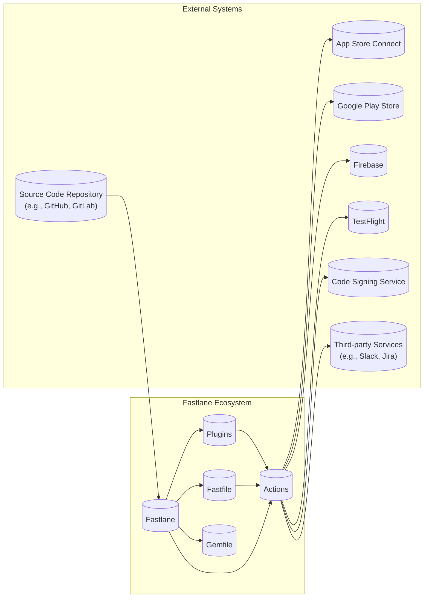

Okay, let's create a design document for Fastlane based on the provided GitHub repository.

# BUSINESS POSTURE

Fastlane is an open-source platform aimed at automating the entire mobile app development lifecycle, from building and testing to deployment and release.  It's widely adopted by both individual developers and large organizations.

Priorities and Goals:

*   Simplify and accelerate the mobile app development process.
*   Reduce manual errors and inconsistencies in builds, testing, and deployments.
*   Enable faster release cycles.
*   Improve developer productivity.
*   Support both iOS and Android platforms.
*   Provide a consistent and extensible framework for mobile app automation.
*   Maintain a vibrant and active open-source community.

Business Risks:

*   Compromise of build artifacts: Malicious code injection into the build process could lead to compromised app releases, impacting a large user base.
*   Exposure of sensitive credentials: Fastlane interacts with various services (app stores, code signing services, etc.) that require credentials.  Leakage or misuse of these credentials could lead to unauthorized access and actions.
*   Supply chain attacks: Fastlane relies on numerous third-party dependencies (Ruby gems, external tools).  Vulnerabilities in these dependencies could be exploited.
*   Misconfiguration: Incorrect configuration of Fastlane tools could lead to deployment failures, data leaks, or security vulnerabilities.
*   Lack of auditability: Without proper logging and auditing, it can be difficult to track down the source of issues or security incidents.
*   Platform-specific vulnerabilities:  Exploits targeting specific iOS or Android features or APIs that Fastlane interacts with.
*   Data breaches: Sensitive information handled by Fastlane (e.g., provisioning profiles, API keys) could be targeted in a data breach.

# SECURITY POSTURE

Existing Security Controls:

*   security control: Code signing: Fastlane facilitates code signing for both iOS and Android, ensuring app integrity and authenticity. Implemented in `match`, `sigh`, and other actions.
*   security control: Dependency management: Fastlane uses Bundler (for Ruby gems) and other package managers to manage dependencies. Described in Gemfile and Fastfile.
*   security control: Community vetting: As an open-source project, Fastlane benefits from community scrutiny and contributions, helping to identify and address security issues.  Visible on GitHub.
*   security control: API key management: Fastlane provides mechanisms for managing API keys and other secrets, although the security of these mechanisms depends on user implementation (e.g., using environment variables, encrypted files). Described in Fastlane documentation.
*   security control: Two-factor authentication (2FA) support: Fastlane supports 2FA for interacting with app stores and other services that require it. Described in Fastlane documentation and implemented in actions interacting with external services.
*   security control: HTTPS communication: Fastlane tools use HTTPS for communication with external services, protecting data in transit. Implemented in actions interacting with external services.

Accepted Risks:

*   accepted risk: User responsibility for credential security: Fastlane relies on users to securely manage their credentials and API keys.
*   accepted risk: Dependency vulnerabilities: While Fastlane uses dependency management tools, there's always a risk of vulnerabilities in third-party dependencies.
*   accepted risk: Limited built-in input validation: Fastlane actions often rely on user-provided input, and while some validation may exist, comprehensive input validation is not always enforced.

Recommended Security Controls:

*   Implement Software Composition Analysis (SCA) to identify and track vulnerabilities in third-party dependencies.
*   Integrate Static Application Security Testing (SAST) into the build process to identify potential code vulnerabilities.
*   Provide clear guidance and best practices for secure credential management, including the use of secrets management solutions.
*   Implement robust logging and auditing to track Fastlane actions and facilitate incident response.
*   Consider implementing Dynamic Application Security Testing (DAST) to test the running application for vulnerabilities.
*   Regularly review and update Fastlane configurations to ensure they adhere to security best practices.

Security Requirements:

*   Authentication:
    *   Fastlane actions interacting with external services must authenticate securely using appropriate mechanisms (e.g., API keys, OAuth, 2FA).
    *   Credentials must be stored and managed securely, avoiding hardcoding in scripts or configuration files.
*   Authorization:
    *   Access to Fastlane actions and resources should be controlled based on the principle of least privilege.
    *   Users should only have the necessary permissions to perform their tasks.
*   Input Validation:
    *   All user-provided input to Fastlane actions should be validated to prevent injection attacks and other vulnerabilities.
    *   Validation should be performed based on a whitelist approach, accepting only known good input.
*   Cryptography:
    *   Sensitive data, both in transit and at rest, should be protected using strong encryption.
    *   Cryptographic keys should be managed securely.
    *   Fastlane should use HTTPS for all communication with external services.

# DESIGN

## C4 CONTEXT

```mermaid
graph LR
    subgraph Users
        Developer((Developer))
        Tester((Tester))
    end

    subgraph Fastlane Ecosystem
        Fastlane[("Fastlane")]
    end
    
    subgraph External Systems
        AppStoreConnect[("App Store Connect")]
        GooglePlayStore[("Google Play Store")]
        Firebase[("Firebase")]
        TestFlight[("TestFlight")]
        CodeSigningService[("Code Signing Service")]
        ThirdPartyServices[("Third-party Services\n(e.g., Slack, Jira)")]
        SourceCodeRepository[("Source Code Repository\n(e.g., GitHub, GitLab)")]
    end

    Developer --> Fastlane : Uses
    Tester --> Fastlane : Uses
    Fastlane --> AppStoreConnect : Interacts with
    Fastlane --> GooglePlayStore : Interacts with
    Fastlane --> Firebase : Interacts with
    Fastlane --> TestFlight : Interacts with
    Fastlane --> CodeSigningService : Interacts with
    Fastlane --> ThirdPartyServices : Interacts with
    Fastlane --> SourceCodeRepository : Interacts with
```

Element Descriptions:

*   Element:
    *   Name: Developer
    *   Type: User
    *   Description: A software developer who uses Fastlane to automate their mobile app development workflow.
    *   Responsibilities: Writing code, configuring Fastlane, running Fastlane actions, managing app releases.
    *   Security controls: Strong passwords, 2FA for accessing development tools and services, secure coding practices.

*   Element:
    *   Name: Tester
    *   Type: User
    *   Description: A software tester who uses Fastlane to automate testing and distribution of app builds.
    *   Responsibilities: Running tests, distributing builds to testers, reporting bugs.
    *   Security controls: Strong passwords, 2FA for accessing testing tools and services.

*   Element:
    *   Name: Fastlane
    *   Type: System
    *   Description: The core Fastlane platform, providing a set of tools and actions for automating mobile app development.
    *   Responsibilities: Executing Fastlane actions, managing dependencies, interacting with external services.
    *   Security controls: HTTPS communication, dependency management, community vetting.

*   Element:
    *   Name: App Store Connect
    *   Type: External System
    *   Description: Apple's platform for managing iOS app submissions, releases, and metadata.
    *   Responsibilities: App submission, review, release management, TestFlight distribution.
    *   Security controls: Apple's security measures, including 2FA, code signing.

*   Element:
    *   Name: Google Play Store
    *   Type: External System
    *   Description: Google's platform for managing Android app submissions, releases, and metadata.
    *   Responsibilities: App submission, review, release management, beta testing.
    *   Security controls: Google's security measures, including 2FA, code signing.

*   Element:
    *   Name: Firebase
    *   Type: External System
    *   Description: Google's mobile and web application development platform.
    *   Responsibilities: Various services, including app distribution, analytics, and crash reporting.
    *   Security controls: Google's security measures, including authentication and authorization.

*   Element:
    *   Name: TestFlight
    *   Type: External System
    *   Description: Apple's platform for distributing beta versions of iOS apps to testers.
    *   Responsibilities: Managing beta testers, distributing builds, collecting feedback.
    *   Security controls: Apple's security measures, including access control and code signing.

*   Element:
    *   Name: Code Signing Service
    *   Type: External System
    *   Description: A service that provides code signing certificates and manages signing identities.
    *   Responsibilities: Generating and managing code signing certificates, signing app binaries.
    *   Security controls: Secure key management, access control.

*   Element:
    *   Name: Third-party Services
    *   Type: External System
    *   Description: Various third-party services that Fastlane can integrate with (e.g., Slack, Jira).
    *   Responsibilities: Providing specific functionalities (e.g., notifications, issue tracking).
    *   Security controls: Security measures implemented by the respective third-party services.

*   Element:
    *   Name: Source Code Repository
    *   Type: External System
    *   Description: A repository for storing the source code of the mobile app (e.g., GitHub, GitLab).
    *   Responsibilities: Version control, code collaboration, build triggering.
    *   Security controls: Access control, 2FA, code review processes.

## C4 CONTAINER



Element Descriptions:

*   Element:
    *   Name: Fastlane
    *   Type: Container
    *   Description: The core Fastlane application, responsible for orchestrating the automation workflow.
    *   Responsibilities: Parsing the Fastfile, managing dependencies, executing actions and plugins.
    *   Security controls: HTTPS communication, dependency management.

*   Element:
    *   Name: Actions
    *   Type: Container
    *   Description: Pre-built functions that perform specific tasks (e.g., building, testing, deploying).
    *   Responsibilities: Interacting with external services, performing specific automation tasks.
    *   Security controls: HTTPS communication, input validation (where implemented).

*   Element:
    *   Name: Plugins
    *   Type: Container
    *   Description: Extensions that add new functionality to Fastlane.
    *   Responsibilities: Providing custom actions and integrations.
    *   Security controls: Dependent on the specific plugin implementation.

*   Element:
    *   Name: Fastfile
    *   Type: Container
    *   Description: A configuration file that defines the automation lanes and workflows.
    *   Responsibilities: Defining the sequence of actions to be executed.
    *   Security controls: Should not contain hardcoded credentials.

*   Element:
    *   Name: Gemfile
    *   Type: Container
    *   Description: A file that lists the Ruby gem dependencies for Fastlane.
    *   Responsibilities: Specifying the required gems and their versions.
    *   Security controls: Dependency management using Bundler.

*   Element:
    *   Name: App Store Connect
    *   Type: External System
    *   Description: Apple's platform for managing iOS app submissions.
    *   Responsibilities: App submission, review, release.
    *   Security controls: Apple's security measures.

*   Element:
    *   Name: Google Play Store
    *   Type: External System
    *   Description: Google's platform for managing Android app submissions.
    *   Responsibilities: App submission, review, release.
    *   Security controls: Google's security measures.

*   Element:
    *   Name: Firebase
    *   Type: External System
    *   Description: Google's mobile/web application development platform.
    *   Responsibilities: Various services, including app distribution.
    *   Security controls: Google's security measures.

*   Element:
    *   Name: TestFlight
    *   Type: External System
    *   Description: Apple's platform for beta testing iOS apps.
    *   Responsibilities: Managing beta testers, distributing builds.
    *   Security controls: Apple's security measures.

*   Element:
    *   Name: Code Signing Service
    *   Type: External System
    *   Description: Service providing code signing certificates.
    *   Responsibilities: Generating/managing code signing certificates.
    *   Security controls: Secure key management.

*   Element:
    *   Name: Third-party Services
    *   Type: External System
    *   Description: Third-party services Fastlane integrates with.
    *   Responsibilities: Providing specific functionalities.
    *   Security controls: Security measures of the services.

*   Element:
    *   Name: Source Code Repository
    *   Type: External System
    *   Description: Repository for storing app source code.
    *   Responsibilities: Version control, code collaboration.
    *   Security controls: Access control, 2FA, code review.

## DEPLOYMENT

Fastlane itself is not "deployed" in the traditional sense of a web application. It's a command-line tool that runs locally on a developer's machine or on a CI/CD server. However, the mobile applications built and managed by Fastlane are deployed to various environments.

Possible Deployment Solutions:

1.  Developer's Local Machine: For development and testing.
2.  CI/CD Server (e.g., Jenkins, CircleCI, GitHub Actions, Bitrise): For automated builds, testing, and deployment.
3.  Cloud-based Build Servers (e.g., MacStadium, AWS Device Farm): For building and testing on specific hardware or platforms.

Chosen Deployment Solution (CI/CD Server - GitHub Actions):

```mermaid
graph LR
    subgraph GitHub Actions Workflow
        Runner[("GitHub Actions Runner")]
        Checkout[("Checkout Code")]
        SetupRuby[("Setup Ruby")]
        InstallDependencies[("Install Dependencies")]
        RunFastlane[("Run Fastlane")]
        UploadArtifacts[("Upload Artifacts")]
    end

    subgraph External Systems
        SourceCodeRepository[("Source Code Repository\n(GitHub)")]
        AppStoreConnect[("App Store Connect")]
        GooglePlayStore[("Google Play Store")]
    end
    
    SourceCodeRepository --> Checkout
    Checkout --> SetupRuby
    SetupRuby --> InstallDependencies
    InstallDependencies --> RunFastlane
    RunFastlane --> UploadArtifacts
    RunFastlane --> AppStoreConnect : Deploy
    RunFastlane --> GooglePlayStore : Deploy

```

Element Descriptions:

*   Element:
    *   Name: GitHub Actions Runner
    *   Type: Deployment Node
    *   Description: A virtual machine or container provided by GitHub Actions to execute workflows.
    *   Responsibilities: Running the steps defined in the workflow.
    *   Security controls: Isolated execution environment, managed by GitHub.

*   Element:
    *   Name: Checkout Code
    *   Type: Deployment Step
    *   Description: Checks out the source code from the GitHub repository.
    *   Responsibilities: Retrieving the latest code.
    *   Security controls: Access control to the repository.

*   Element:
    *   Name: Setup Ruby
    *   Type: Deployment Step
    *   Description: Sets up the Ruby environment required for Fastlane.
    *   Responsibilities: Installing the correct Ruby version.
    *   Security controls: Using a trusted Ruby version.

*   Element:
    *   Name: Install Dependencies
    *   Type: Deployment Step
    *   Description: Installs the required Ruby gems using Bundler.
    *   Responsibilities: Installing Fastlane and its dependencies.
    *   Security controls: Dependency management using Bundler, potentially using SCA tools.

*   Element:
    *   Name: Run Fastlane
    *   Type: Deployment Step
    *   Description: Executes the Fastlane commands defined in the Fastfile.
    *   Responsibilities: Building, testing, and deploying the app.
    *   Security controls: Secure credential management, input validation (within Fastlane actions).

*   Element:
    *   Name: Upload Artifacts
    *   Type: Deployment Step
    *   Description: Uploads build artifacts (e.g., IPA or APK files) to a storage location.
    *   Responsibilities: Storing the build results.
    *   Security controls: Access control to the storage location.

*   Element:
    *   Name: Source Code Repository (GitHub)
    *   Type: External System
    *   Description: The GitHub repository hosting the app's source code.
    *   Responsibilities: Version control, code collaboration.
    *   Security controls: Access control, 2FA, code review processes.

*   Element:
    *   Name: App Store Connect
    *   Type: External System
    *   Description: Apple's platform for managing iOS app submissions.
    *   Responsibilities: App submission, review, release.
    *   Security controls: Apple's security measures.

*   Element:
    *   Name: Google Play Store
    *   Type: External System
    *   Description: Google's platform for managing Android app submissions.
    *   Responsibilities: App submission, review, release.
    *   Security controls: Google's security measures.

## BUILD

```mermaid
graph LR
    subgraph Local Machine / CI Server
    Developer[("Developer")]
    SourceCodeRepository[("Source Code Repository")]
    Fastlane[("Fastlane")]
    BuildArtifact[("Build Artifact\n(IPA/APK)")]
    Linters[("Linters")]
    SAST[("SAST Scanner")]
    SCA[("SCA Scanner")]
    end

    Developer --> SourceCodeRepository : Commits Code
    SourceCodeRepository --> Fastlane : Triggers Build
    Fastlane --> Linters : Runs
    Fastlane --> SAST : Runs
    Fastlane --> SCA : Runs
    Fastlane --> BuildArtifact : Produces

```

Build Process Description:

1.  Developer commits code changes to the Source Code Repository (e.g., GitHub).
2.  The commit triggers a build process, either locally on the developer's machine or on a CI/CD server (e.g., GitHub Actions).
3.  Fastlane is invoked, and the Fastfile is parsed to determine the build steps.
4.  Linters (e.g., RuboCop for Ruby, SwiftLint for Swift) are run to check for code style and potential errors.
5.  A Static Application Security Testing (SAST) scanner (e.g., Brakeman for Ruby, SonarQube) is run to analyze the code for security vulnerabilities.
6.  A Software Composition Analysis (SCA) scanner (e.g., Dependabot, Snyk) is run to identify vulnerabilities in third-party dependencies.
7.  Fastlane executes the build commands (e.g., `gym` for iOS, `gradlew assembleRelease` for Android).
8.  The build process produces a build artifact (IPA file for iOS, APK file for Android).

Security Controls:

*   Source Code Repository: Access control, 2FA, code review processes.
*   Linters: Enforce code style and identify potential errors.
*   SAST Scanner: Detect code vulnerabilities.
*   SCA Scanner: Identify vulnerabilities in third-party dependencies.
*   Fastlane: Uses HTTPS for communication with external services.
*   Build Artifact: Code signing (ensured by Fastlane actions).
*   CI/CD Server (if used): Isolated build environment, secure credential management.

# RISK ASSESSMENT

Critical Business Processes:

*   Mobile app release process: Ensuring timely and secure releases of new app versions and updates.
*   App development workflow: Maintaining developer productivity and efficiency.
*   User data protection: Protecting user data handled by the mobile app.
*   Brand reputation: Maintaining a positive brand image and user trust.

Data Sensitivity:

*   Credentials and API keys: Highly sensitive. Used to access app stores, code signing services, and other third-party services. Compromise could lead to unauthorized access and actions.
*   Code signing certificates: Highly sensitive. Used to sign app binaries. Compromise could allow attackers to distribute malicious apps under the developer's identity.
*   App source code: Sensitive. Contains the intellectual property of the app.
*   User data (handled by the app, not directly by Fastlane): Sensitivity varies depending on the app's functionality. Could range from non-sensitive to highly sensitive (e.g., personal information, financial data).
*   Build artifacts (IPA/APK): Moderately sensitive. Represent the compiled app.

# QUESTIONS & ASSUMPTIONS

Questions:

*   What specific third-party services are integrated with Fastlane in this particular project?
*   What secrets management solution is currently used (if any)?
*   What is the current process for reviewing and updating Fastlane configurations?
*   Are there any specific compliance requirements (e.g., GDPR, HIPAA) that apply to the mobile app?
*   What is the team's current level of expertise with security best practices for mobile app development and Fastlane?
*   What level of automated testing (unit, integration, UI) is currently in place?

Assumptions:

*   BUSINESS POSTURE: The organization prioritizes both speed of delivery and security, but may have a higher risk tolerance than a large enterprise.
*   SECURITY POSTURE: Basic security measures (code signing, HTTPS) are in place, but there's room for improvement in areas like dependency management and vulnerability scanning.
*   DESIGN: Fastlane is used in a relatively standard way, with common actions and integrations. The deployment environment is likely a CI/CD server. The build process includes some basic security checks, but could be enhanced with more comprehensive scanning.