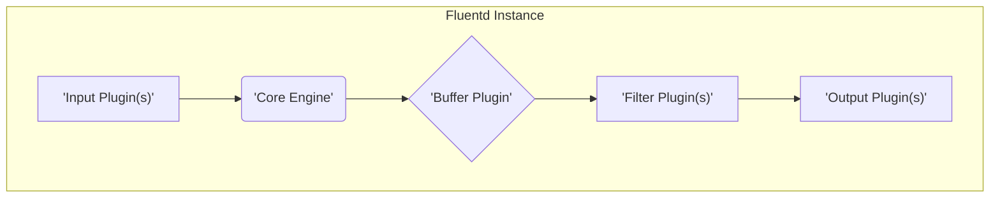

## Project Design Document: Fluentd (Improved)

**1. Introduction**

This document provides an enhanced and detailed architectural design of Fluentd, an open-source data collector. This design serves as the foundational artifact for subsequent threat modeling activities, aiming to identify potential security vulnerabilities within the system. The document meticulously outlines Fluentd's core components, the intricate flow of data, and the interactions between these components. The goal is to foster a deep understanding of Fluentd's architecture, enabling a comprehensive and effective threat modeling process.

**2. Goals**

*   Clearly define the architecture of Fluentd, providing sufficient detail for security analysis.
*   Identify and describe the major components of Fluentd and their specific responsibilities within the system.
*   Illustrate and explain the complete data flow within Fluentd, from ingestion to output.
*   Detail the key interactions and communication pathways between the various components.
*   Establish a solid and well-documented foundation for conducting thorough and targeted threat modeling exercises.

**3. Overview**

Fluentd acts as a unified logging layer, streamlining the collection and consumption of diverse data streams. Its primary strength lies in decoupling disparate data sources from various backend systems. This is achieved through a highly flexible and extensible architecture driven by a robust plugin system. Fluentd ingests events from a multitude of sources, performs transformations as dictated by its configuration, and efficiently routes these events to a wide array of destinations. Its core purpose is to simplify and standardize data collection and distribution across complex environments.

**4. Architectural Design**

Fluentd's architecture is fundamentally built upon a central Core Engine and a modular Plugin System.

*   **Core Engine:** This is the heart of Fluentd, responsible for the entire event lifecycle. Its key responsibilities include:
    *   Managing the reception of incoming events.
    *   Routing events based on the defined configuration rules ( `<match>` directives).
    *   Orchestrating the execution of configured plugins (input, buffer, filter, and output).
    *   Managing the internal state and resources of the Fluentd instance.
*   **Input Plugins:** These plugins are the entry points for data into Fluentd. They are responsible for collecting data from various sources and transforming it into a standardized event format. Examples include:
    *   `in_tail`: Monitors and reads data from the end of files, similar to the `tail -f` command. It's commonly used for log file ingestion.
    *   `in_forward`: Listens on a specified TCP or UDP port to receive events from other Fluentd instances or applications using the Fluentd's internal forwarding protocol.
    *   `in_http`: Exposes an HTTP endpoint to receive events via POST requests, often used for application logging or webhook integrations.
    *   `in_syslog`: Listens for and parses syslog messages, adhering to standard syslog protocols.
    *   `in_tcp`:  Listens on a specified TCP port for raw data streams. Requires a corresponding parser to structure the incoming data.
    *   `in_udp`: Listens on a specified UDP port for raw data packets. Similar to `in_tcp`, it needs a parser.
    *   `in_exec`: Executes external commands at regular intervals and captures their standard output as events. Useful for monitoring system metrics or application status.
*   **Buffer Plugins:** These plugins provide a mechanism for temporarily storing events before they are processed by output plugins. Buffering is crucial for:
    *   **Reliability:** Ensuring events are not lost during temporary outages or network issues with output destinations.
    *   **Backpressure Handling:** Managing situations where output destinations cannot keep up with the incoming event rate.
    *   **Different buffer types offer varying characteristics:**
        *   **Memory Buffer (`memory`):** Stores events in memory, offering fast performance but is susceptible to data loss if the Fluentd process crashes.
        *   **File Buffer (`file`):** Persists events to disk, providing better reliability at the cost of potentially lower throughput.
        *   **External Buffers (via plugins):**  Plugins can integrate with external systems like databases (e.g., Redis, Elasticsearch) for more robust and scalable buffering.
*   **Filter Plugins:** These plugins operate on the stream of events, allowing for transformation, enrichment, and filtering before they reach the output stage. They enable data manipulation and standardization. Examples include:
    *   `grep`: Filters events based on matching regular expressions against specific fields or the entire event record.
    *   `record_transformer`: Modifies event records by adding, deleting, or renaming fields, or by transforming field values.
    *   `parser`: Parses unstructured data within event fields into structured data, often used in conjunction with input plugins like `in_tcp` or `in_udp`.
    *   `geoip`: Enriches events with geographical information based on IP addresses found in the event data.
*   **Output Plugins:** These plugins are responsible for delivering the processed events to their final destinations. They handle the interaction with external systems. Examples include:
    *   `out_file`: Writes events to local or network-mounted files, often used for archival or simple logging.
    *   `out_forward`: Forwards events to other Fluentd instances, enabling complex routing topologies and aggregation.
    *   `out_elasticsearch`: Sends events to an Elasticsearch cluster for indexing and searching.
    *   `out_kafka`: Publishes events to Apache Kafka topics, facilitating integration with stream processing platforms.
    *   `out_s3`: Stores events as objects in Amazon S3 buckets, suitable for long-term archival and data lakes.
    *   `out_http`: Sends events to arbitrary HTTP endpoints, enabling integration with various web services and APIs.
*   **Configuration:** Fluentd's behavior is entirely driven by its configuration file (typically `fluent.conf`). This file, written in a domain-specific language, defines:
    *   Input sources and their specific configurations.
    *   Matching rules (`<match>` directives) that determine how events are routed.
    *   Buffer configurations, including type and parameters.
    *   Filter chains and their processing logic.
    *   Output destinations and their connection details.
*   **Control API:** Fluentd exposes a control API, typically accessible via HTTP, for runtime management and monitoring. This API allows for:
    *   Retrieving metrics about Fluentd's performance and status.
    *   Reloading the configuration without restarting the process.
    *   Querying the status of plugins and buffers.

**5. Data Flow**

The typical journey of data through a Fluentd instance can be visualized as follows:

Detailed steps of the data flow:

*   **Data Ingestion:** Input plugins actively collect raw data from their designated sources. This could involve reading from files, listening on network ports, or receiving HTTP requests.
*   **Event Creation:**  The input plugin transforms the raw, source-specific data into structured events. These events typically adhere to a JSON-like format, consisting of key-value pairs and a timestamp.
*   **Routing by Core Engine:** The Core Engine receives the newly created event. Based on the `<match>` directives defined in the `fluent.conf` file, the engine determines which subsequent processing stages (buffers, filters, and outputs) the event should be directed to. Multiple matching rules can apply to a single event, leading to fan-out scenarios.
*   **Buffering for Reliability:** The Core Engine instructs the configured Buffer Plugin to temporarily store the event. This buffering mechanism provides resilience against temporary unavailability or performance bottlenecks in the downstream output destinations.
*   **Filtering and Transformation (Optional):** If filter plugins are configured for the matching route, the Core Engine passes the buffered event to the designated Filter Plugin(s). These plugins perform transformations, enrichments, or filtering operations on the event data. Multiple filters can be chained together.
*   **Output to Destinations:** Finally, the Core Engine instructs the appropriate Output Plugin(s) to deliver the processed event to its final destination. This involves interacting with external systems like databases, message queues, cloud storage, or other Fluentd instances.

**6. Key Interactions**

*   **Input Plugin -> Core Engine:** Input plugins actively push newly collected and formatted events to the Core Engine for further processing and routing.
*   **Core Engine -> Buffer Plugin:** The Core Engine communicates with the Buffer Plugin to store incoming events, providing details about the event and the intended output destination.
*   **Buffer Plugin -> Core Engine:** The Buffer Plugin notifies the Core Engine about the status of buffered events. This includes signaling when a batch of events is ready for processing or reporting errors such as buffer overflows or write failures.
*   **Core Engine -> Filter Plugin:** The Core Engine passes events to the configured Filter Plugins, providing the event data for transformation or inspection.
*   **Filter Plugin -> Core Engine:** Filter plugins return the processed (or potentially modified) event back to the Core Engine. If a filter drops an event, it simply doesn't return it.
*   **Core Engine -> Output Plugin:** The Core Engine instructs the Output Plugin to deliver a batch of events to its configured destination, providing the necessary connection details and event data.
*   **Output Plugin -> External Systems:** Output plugins interact with external systems (e.g., databases, message brokers, cloud APIs) to transmit the event data according to the specific protocol and requirements of the destination.
*   **External Systems -> Input Plugin (e.g., `in_forward`):** Other Fluentd instances or external applications can initiate communication with a Fluentd instance by sending events to its configured input plugins, such as `in_forward`.
*   **Management Tools -> Control API:** External monitoring and management tools interact with Fluentd by sending requests to its Control API to retrieve metrics, reload configurations, or check the status of the system.

**7. Security Considerations (Detailed for Threat Modeling)**

This section provides a more in-depth look at potential security considerations, crucial for effective threat modeling.

*   **Input Plugin Vulnerabilities:**
    *   **Data Injection Attacks:** Maliciously crafted data injected through input sources (e.g., via `in_http` or `in_forward`) could exploit vulnerabilities in subsequent filter or output plugins, potentially leading to remote code execution or data breaches.
    *   **Denial of Service (DoS) Attacks:**  Flooding input plugins with a high volume of illegitimate data can overwhelm the Fluentd instance, consuming excessive resources (CPU, memory, network bandwidth) and hindering its ability to process legitimate events.
    *   **Spoofing and Man-in-the-Middle (MITM) Attacks:** Input plugins receiving data over network protocols (e.g., `in_forward`, `in_http`, `in_tcp`, `in_udp`) are susceptible to spoofing if proper authentication and encryption (e.g., TLS) are not implemented. Attackers could impersonate legitimate sources or intercept and modify data in transit.
    *   **Command Injection (via `in_exec`):** If the configuration of the `in_exec` plugin is dynamically generated based on untrusted input, it could be vulnerable to command injection attacks, allowing attackers to execute arbitrary commands on the Fluentd host.
*   **Buffer Vulnerabilities:**
    *   **Data Loss or Corruption:** Improperly configured or failing buffer mechanisms (especially memory buffers without proper persistence) can lead to the loss or corruption of event data during crashes or unexpected shutdowns.
    *   **Unauthorized Access to Buffered Data:** If the buffer is stored on disk (using the `file` buffer), inadequate file system permissions can allow unauthorized users or processes to access sensitive data stored in the buffer files.
    *   **Buffer Overflow:**  Although less common, vulnerabilities in the buffer implementation itself could potentially lead to buffer overflow conditions if excessively large events are processed.
*   **Filter Plugin Vulnerabilities:**
    *   **Malicious Logic Execution:** Custom or poorly written filter plugins could contain malicious code that could be executed within the Fluentd process, potentially compromising the system or accessing sensitive data.
    *   **Resource Exhaustion:** Inefficient or poorly designed filter logic (e.g., complex regular expressions) can consume excessive CPU and memory resources, leading to performance degradation or denial of service.
    *   **Information Disclosure:** Filter plugins that inadvertently log or expose sensitive information during their processing could lead to information disclosure vulnerabilities.
*   **Output Plugin Vulnerabilities:**
    *   **Data Leaks to Unauthorized Destinations:** Misconfigured output plugins could inadvertently send sensitive event data to unintended or unauthorized external systems.
    *   **Exposure of Credentials:** Output plugins often require credentials (API keys, passwords, etc.) to access external systems. Insecure storage or handling of these credentials in the configuration or within the plugin itself can lead to their exposure.
    *   **API Abuse and Rate Limiting Issues:** Output plugins interacting with external APIs might be vulnerable to abuse if not properly configured with appropriate rate limiting or authentication mechanisms. Compromised credentials could lead to unauthorized actions on the external system.
    *   **Injection Attacks on External Systems:** Output plugins that construct queries or commands based on event data without proper sanitization could be vulnerable to injection attacks (e.g., SQL injection, NoSQL injection) on the target external system.
*   **Configuration Vulnerabilities:**
    *   **Exposure of Sensitive Information:** Configuration files (`fluent.conf`) often contain sensitive information such as API keys, passwords, and database connection strings. Insecure storage or access control to these files can lead to their exposure.
    *   **Misconfiguration Leading to Security Flaws:** Incorrectly configured input, filter, or output plugins can introduce security vulnerabilities, such as allowing unauthorized access, exposing sensitive data, or creating open relays.
*   **Control API Vulnerabilities:**
    *   **Unauthorized Access and Manipulation:**  If the Control API lacks proper authentication and authorization mechanisms, attackers could gain unauthorized access to monitor Fluentd's status, reload configurations (potentially with malicious settings), or even disrupt its operation.
    *   **Denial of Service (DoS) Attacks:** The Control API could be targeted with DoS attacks to overload the Fluentd instance and prevent legitimate management operations.
*   **General Security Considerations:**
    *   **Vulnerabilities in Dependencies:** Fluentd relies on various third-party libraries and dependencies, which may contain known security vulnerabilities. Regular updates and vulnerability scanning of these dependencies are crucial.
    *   **Resource Exhaustion Attacks:** Attackers could attempt to exhaust Fluentd's resources (CPU, memory, disk I/O) by sending a large volume of data or triggering computationally expensive operations.
    *   **Insufficient Logging and Auditing:** Lack of comprehensive logging and auditing of Fluentd's activities can hinder security monitoring, incident response, and forensic analysis.

**8. Deployment Considerations**

The security posture of a Fluentd deployment is significantly influenced by the environment in which it operates.

*   **On-Premise Deployments:** Security relies heavily on the organization's infrastructure security controls, including network segmentation, firewall rules, access control lists, and physical security of the servers.
*   **Cloud Environments (AWS, Azure, GCP):** Leveraging cloud-native security services is crucial. This includes using Identity and Access Management (IAM) for controlling access to Fluentd instances and related resources, utilizing security groups or network security groups for network traffic filtering, and employing encryption for data at rest and in transit.
*   **Containerized Environments (Docker, Kubernetes):** Security considerations include securing the container images (scanning for vulnerabilities), implementing proper network policies within the Kubernetes cluster, managing secrets securely (using Kubernetes Secrets or dedicated secret management solutions), and ensuring the underlying container runtime and operating system are secure. Service mesh technologies can also enhance security in containerized deployments.

**9. Future Considerations**

*   **Formal Security Audits of Core and Community Plugins:** Implementing a regular and rigorous process for security auditing both the core Fluentd codebase and widely used community-contributed plugins to identify and address potential vulnerabilities proactively.
*   **Enhanced Authentication and Authorization Mechanisms:** Exploring and implementing more robust authentication and authorization methods for the Control API and for inter-Fluentd communication (e.g., mutual TLS, API keys with granular permissions).
*   **End-to-End Encryption Capabilities:**  Developing and integrating features for end-to-end encryption of event data, both in transit between Fluentd instances and at rest within buffer plugins, to protect sensitive information.
*   **Improved Secret Management:**  Providing better built-in mechanisms or recommendations for securely managing sensitive credentials used by output plugins, potentially integrating with dedicated secret management services.
*   **Standardized Security Hardening Guidelines:**  Creating and publishing comprehensive security hardening guidelines and best practices for deploying and configuring Fluentd in various environments.

This improved design document provides a more detailed and security-focused overview of Fluentd's architecture, serving as a robust foundation for conducting thorough and effective threat modeling activities. The enhanced descriptions of components, data flow, and security considerations aim to facilitate a deeper understanding of potential vulnerabilities and inform the development of appropriate mitigation strategies.