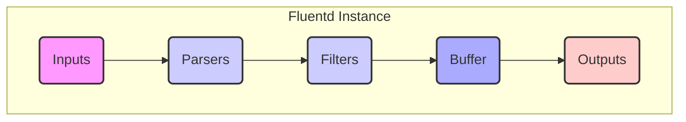
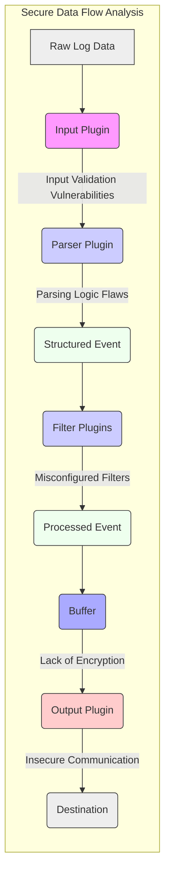

# Project Design Document: Fluentd (Improved)

**Version:** 1.1
**Date:** October 26, 2023
**Author:** AI Software Architect

## 1. Introduction

This document provides a detailed architectural design of the Fluentd project, specifically tailored for threat modeling. It aims to clearly outline the system's components, their interactions, and data flow to facilitate the identification of potential security vulnerabilities.

### 1.1. Purpose

The primary purpose of this document is to provide a comprehensive and well-structured description of the Fluentd system architecture for security analysis and threat modeling. This will enable security engineers to understand the system's inner workings and identify potential attack vectors and security weaknesses.

### 1.2. Scope

This document covers the core architectural components of a single Fluentd instance, including its input mechanisms, processing pipeline, buffering, and output destinations. The focus is on the logical architecture and data flow, highlighting areas relevant to security considerations. While touching upon deployment, the primary emphasis remains on the individual Fluentd process.

### 1.3. Audience

The intended audience for this document includes:

* Security engineers responsible for threat modeling, security assessments, and penetration testing.
* Developers working on Fluentd core or developing plugins.
* Operations teams managing Fluentd deployments with security in mind.

## 2. System Overview

Fluentd acts as a unified logging layer, streamlining data collection and routing. Its modular design, driven by a plugin architecture, allows it to ingest data from diverse sources and deliver it to various destinations. This central role in log management makes its security paramount.

### 2.1. Key Features Relevant to Security

* **Unified Logging Layer:** Centralizes log data, making security monitoring and analysis more efficient but also creating a single point of interest for attackers.
* **Plugin Architecture:** Offers flexibility but introduces potential risks from vulnerable or malicious plugins.
* **Buffering and Reliability:** Ensures data delivery but can also store sensitive data temporarily, requiring secure handling.
* **Flexible Routing:** Powerful for data management but requires careful configuration to prevent unintended data exposure.

## 3. Architectural Design

The architecture revolves around the movement of log events through distinct stages, each handled by specific components. Understanding these components and their interactions is crucial for identifying potential security vulnerabilities.

* **Inputs:** The initial point of contact for external data.
* **Parsers:** Transform raw data into a structured format, a step where interpretation errors can occur.
* **Filters:** Modify and route data, a stage where access control and data manipulation are critical.
* **Buffer:** Temporary storage, requiring protection of data at rest.
* **Outputs:** The final destination for processed data, necessitating secure communication and authentication.
* **Core:** The central orchestrator, whose security is fundamental to the entire system.

### 3.1. Inputs

* **Description:** Input plugins are the gateways for log data. They listen on various protocols and interfaces, making them prime targets for malicious input.
* **Examples:**
    * `in_tail`: Reading files presents risks if file permissions are misconfigured or if watched files are compromised.
    * `in_forward`: Receiving data from other Fluentd instances requires secure authentication and authorization to prevent unauthorized log injection.
    * `in_http`: HTTP endpoints need proper authentication and input validation to guard against web-based attacks.
    * `in_tcp`, `in_udp`: Listening on network sockets requires careful handling of incoming connections and data to prevent exploits.
    * `in_systemd`: Accessing system logs necessitates appropriate permissions and awareness of potential information disclosure.
* **Security Considerations:** These are critical entry points. Vulnerabilities here can allow attackers to inject malicious logs, potentially disrupting operations or gaining unauthorized access. Input validation and authentication are paramount.

### 3.2. Parsers

* **Description:** Parsers interpret raw data, and flaws in parsing logic can lead to vulnerabilities.
* **Examples:**
    * `parser_json`: While common, vulnerabilities in JSON parsing libraries could be exploited.
    * `parser_apache2`: Relying on regular expressions for parsing can introduce vulnerabilities if the regex is not carefully crafted, potentially leading to denial-of-service.
    * `parser_regexp`:  Complex regular expressions can be computationally expensive, leading to resource exhaustion attacks.
    * `parser_csv`:  Improper handling of delimiters or escaped characters can lead to data injection or misinterpretation.
* **Security Considerations:**  Carefully choose and configure parsers. Ensure they are up-to-date and robust against malformed input that could cause errors or expose underlying vulnerabilities.

### 3.3. Filters

* **Description:** Filters manipulate log events. Improperly configured filters can expose sensitive data or create bypasses in security controls.
* **Examples:**
    * `filter_grep`: While useful for filtering, incorrect patterns could inadvertently drop important security logs.
    * `filter_record_transformer`: Modifying records requires caution to avoid introducing errors or exposing sensitive information.
    * `filter_parser`: Applying additional parsing can introduce new vulnerabilities if the secondary parser is flawed.
    * `filter_geoip`: Relying on external GeoIP databases introduces a dependency that could be compromised or provide inaccurate information.
* **Security Considerations:**  Implement filters with a security-first mindset. Ensure they do not inadvertently remove crucial security information or expose sensitive data. Access control around filter configuration is important.

### 3.4. Buffer

* **Description:** The buffer holds log events temporarily. Its security is crucial for protecting data at rest and ensuring integrity.
* **Types:**
    * Memory Buffer: While fast, data is lost on process termination and offers no persistence or protection against crashes.
    * File Buffer: Requires careful management of file permissions and consideration of encryption to protect potentially sensitive data on disk.
    * Persistent Buffer (e.g., using plugins like `fluent-plugin-kafka`): Relies on the security mechanisms of the external system (e.g., Kafka's authentication and authorization).
* **Security Considerations:**  Choose the buffer type based on security requirements. File buffers should be encrypted, and access to buffer data should be restricted. Consider potential buffer overflow vulnerabilities if not managed correctly.

### 3.5. Outputs

* **Description:** Output plugins transmit processed logs to external systems. Secure communication and authentication are vital here.
* **Examples:**
    * `out_file`: Writing to files requires proper file permissions and consideration of where these files are stored.
    * `out_elasticsearch`: Requires secure authentication and authorization to the Elasticsearch cluster to prevent unauthorized access or data manipulation.
    * `out_s3`:  Sending data to cloud storage necessitates secure credentials management and appropriate bucket policies.
    * `out_kafka`: Requires secure authentication and authorization to the Kafka brokers and topics.
    * `out_forward`: Sending data to other Fluentd instances demands secure communication protocols like TLS to prevent eavesdropping and tampering.
* **Security Considerations:**  Securely configure output plugins with strong authentication and encryption. Protect credentials used to access output destinations. Ensure data is transmitted securely to prevent interception.

### 3.6. Core

* **Description:** The core manages the entire data flow and plugin lifecycle. Its security is fundamental to the integrity of the entire logging pipeline.
* **Functionality:**
    * Event Routing: Misconfigurations in routing rules could lead to logs being sent to unintended destinations.
    * Plugin Management:  The core's ability to load and execute plugins makes it a critical area for security. Vulnerabilities in the core could be exploited by malicious plugins.
    * Configuration Management: The configuration file often contains sensitive information (credentials, API keys). Secure storage and access control are essential.
* **Security Considerations:**  The core itself should be kept up-to-date with security patches. Secure configuration practices are paramount, including restricting access to the configuration file and using secure methods for managing sensitive information.

## 4. Data Flow with Security Implications

Understanding how data moves through Fluentd helps pinpoint potential security vulnerabilities at each stage.

1. **Input Reception:**  The initial point of contact. Vulnerabilities here can allow attackers to inject malicious data. *Threat: Data Injection, Denial of Service.*
2. **Parsing:**  Raw data is transformed. Errors in parsing can lead to misinterpretations or vulnerabilities. *Threat: Data Corruption, Exploitation of Parsing Vulnerabilities.*
3. **Filtering:** Data is modified and routed. Misconfigured filters can expose sensitive data or bypass security controls. *Threat: Information Disclosure, Security Control Bypass.*
4. **Buffering:** Data is temporarily stored. Lack of encryption can expose sensitive data at rest. *Threat: Data Breach (Data at Rest).*
5. **Output Delivery:** Data is sent to external systems. Insecure communication can lead to interception. *Threat: Data Breach (Data in Transit), Unauthorized Access to Destination Systems.*

## 5. Security Considerations (Detailed)

This section expands on the initial security considerations, categorizing them for clarity.

* **Confidentiality:** Protecting sensitive log data from unauthorized access.
    * Encrypting file buffers.
    * Using TLS/SSL for communication with other Fluentd instances and output destinations.
    * Carefully configuring filters to avoid exposing sensitive information.
    * Securely managing credentials used by output plugins.
* **Integrity:** Ensuring the accuracy and completeness of log data.
    * Validating input data to prevent corruption.
    * Using secure communication protocols to prevent tampering during transit.
    * Implementing mechanisms to detect and prevent unauthorized modification of buffer data.
* **Availability:** Ensuring the logging system remains operational and reliable.
    * Configuring resource limits to prevent denial-of-service attacks.
    * Implementing monitoring and alerting for Fluentd's health and performance.
    * Choosing reliable buffering mechanisms.
* **Authentication and Authorization:** Controlling access to Fluentd and its resources.
    * Implementing authentication for input sources (e.g., using tokens or API keys for `in_http`).
    * Using authentication and authorization for output destinations.
    * Restricting access to the Fluentd configuration file.
* **Plugin Security:** Addressing the risks associated with the plugin ecosystem.
    * Only using plugins from trusted sources.
    * Regularly updating plugins to patch known vulnerabilities.
    * Implementing mechanisms to verify the integrity of plugins.
* **Secure Configuration:** Ensuring Fluentd is configured securely.
    * Avoiding storing sensitive information directly in the configuration file (consider using environment variables or secrets management).
    * Restricting permissions on the configuration file.
    * Regularly reviewing and auditing the configuration.

## 6. Technologies Used

* **Core Language:** Ruby (potential vulnerabilities in the Ruby runtime environment need to be considered).
* **Configuration Language:** Typically a configuration file (e.g., `fluent.conf`) using a domain-specific language (potential for misconfigurations).
* **Plugin Ecosystem:** A vast array of plugins, each with its own security considerations and potential vulnerabilities.

## 7. Deployment Considerations and Security Implications

Different deployment scenarios introduce varying security challenges.

* **Standalone Instance:**  Security relies heavily on the host system's security.
* **Forwarding Agents:**  Security of communication between agents and aggregators becomes critical. Compromised agents could inject malicious logs.
* **Aggregator:**  A central point of interest for attackers. Requires robust security measures.
* **Clustering:**  Adds complexity to security management, requiring secure communication and coordination between nodes.

## 8. Future Considerations for Security

* **Enhanced Plugin Security Scanning:** Implementing automated tools to scan plugins for known vulnerabilities.
* **Built-in Secrets Management:** Integrating secure secrets management capabilities directly into Fluentd.
* **Role-Based Access Control (RBAC):** Implementing RBAC for managing access to Fluentd configurations and resources.
* **Improved Auditing Capabilities:** Enhancing auditing to track configuration changes and administrative actions.

This improved design document provides a more detailed and security-focused view of the Fluentd architecture. It highlights potential threat areas and serves as a strong foundation for subsequent threat modeling activities.