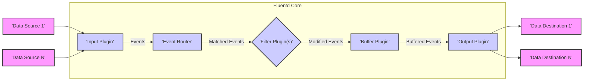
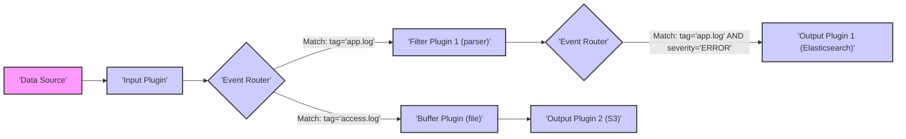

# Project Design Document: Fluentd

**Version:** 1.1
**Date:** October 26, 2023
**Author:** AI Software Architect

## 1. Introduction

This document provides an enhanced and detailed design overview of the Fluentd project, an open-source, unified data collector. This document is specifically tailored to serve as a robust foundation for subsequent threat modeling activities. It comprehensively outlines the system's architecture, key components with greater detail, data flow with specific examples, and a more in-depth discussion of security considerations relevant for threat analysis.

## 2. Project Overview

Fluentd addresses the challenge of collecting, processing, and forwarding diverse data streams from various sources into different destinations. Its primary strength lies in its ability to unify logging infrastructure, but its flexible architecture makes it suitable for handling any type of structured or unstructured data. It simplifies data ingestion and distribution, enabling better data analysis, monitoring, and alerting.

## 3. System Architecture

Fluentd employs a modular, plugin-driven architecture. The core system is responsible for managing the event lifecycle, routing, and buffering. Plugins extend Fluentd's capabilities for input, filtering, and output operations. This architecture promotes extensibility and allows users to tailor Fluentd to their specific needs.

### 3.1. Key Components

*   **Input Plugins:** These plugins are the entry points for data into Fluentd. They are responsible for fetching or receiving data from various sources and formatting it into Fluentd's internal event structure (a tag, a timestamp, and a record).
    *   `in_tail`:  Monitors one or more files for new lines and parses them as events. Configuration options include specifying the file path, format (e.g., `json`, `apache2`), and regular expressions for parsing.
    *   `in_forward`: Listens on a TCP or Unix socket for events sent by other Fluentd instances or applications using the Fluentd forward protocol. This protocol can optionally use TLS for encryption.
    *   `in_http`:  Exposes an HTTP endpoint to receive events via POST requests, typically in JSON format.
    *   `in_syslog`:  Listens for syslog messages over UDP or TCP, adhering to standard syslog formats.
    *   `in_tcp`, `in_udp`:  Provides generic TCP and UDP socket listeners for receiving arbitrary data streams. Requires configuration for parsing the incoming data.
    *   Cloud-specific input plugins (e.g., `aws-kinesis`, `google-cloud-storage`):  Connect directly to cloud services to ingest data.
*   **Event Router:** The central decision-making component. It receives incoming events and matches their tags against configured `<match>` directives in the Fluentd configuration file. Based on these matches, it determines which filter and output plugins should process the event. The router supports multiple matching criteria and allows for complex routing logic.
*   **Filter Plugins:** These plugins operate on events after they have been routed. They can modify, enrich, or drop events based on defined rules. Filters are applied sequentially in the order they are configured.
    *   `filter_grep`:  Filters events based on regular expressions applied to specific fields within the event record.
    *   `filter_record_transformer`:  Modifies the event record by adding, deleting, or renaming fields. It can also perform more complex transformations using embedded Ruby or other scripting languages.
    *   `filter_parser`:  Parses a string field within an event record into structured data based on a specified format (e.g., regular expressions, CSV, JSON).
    *   `filter_geoip`:  Enriches events with geographical information based on IP addresses found in the record.
    *   Custom filter plugins: Users can develop their own filter plugins to implement specific data processing logic.
*   **Buffer Plugins:** Buffers provide reliability and resilience by temporarily storing events before they are sent to output destinations. This is crucial for handling temporary outages or backpressure in downstream systems. Buffer configurations include settings for retry logic, flushing intervals, and storage mechanisms.
    *   Memory buffer (`memory`): Stores events in RAM. Offers the best performance but is volatile. Data is lost if the Fluentd process restarts unexpectedly.
    *   File buffer (`file`): Stores events on disk. Provides persistence across restarts but has lower performance compared to the memory buffer. Configuration options include specifying the buffer directory, chunk sizes, and synchronization methods.
    *   Database-backed buffers (via plugins, e.g., `fluent-plugin-redis`):  Leverage external databases for more robust and scalable buffering.
*   **Output Plugins:** These plugins are responsible for sending processed events to their final destinations. They handle the formatting and delivery of events to various systems.
    *   `out_file`: Writes events to local files, with options for formatting, file rotation, and buffering.
    *   `out_forward`: Forwards events to other Fluentd instances, enabling the creation of complex logging pipelines. Supports TLS for secure communication.
    *   `out_elasticsearch`: Sends events to Elasticsearch, a popular search and analytics engine.
    *   `out_kafka`: Publishes events to Apache Kafka topics.
    *   Cloud provider services (e.g., `aws-s3`, `google-cloud-storage`, `azure-blob`):  Upload events to cloud storage services.
    *   Database output plugins (e.g., `fluent-plugin-mongodb`, `fluent-plugin-postgresql`):  Write events to various database systems.
    *   Webhook output plugins: Send events to arbitrary HTTP endpoints.
*   **Fluentd Core:** The central runtime environment that manages the lifecycle of events, plugin interactions, and configuration loading. It handles signal processing, logging, and overall system management.

## 4. Data Flow

The journey of a log event through Fluentd involves several key stages:

Detailed steps with examples:

*   **Data Generation:** An application generates a log message (e.g., an error message or an access log entry).
*   **Data Ingestion:** The appropriate input plugin collects the data. For example, `in_tail` reads a new line from an application log file.
*   **Event Creation:** The input plugin transforms the raw data into a Fluentd event, which consists of a tag (e.g., `app.log`), a timestamp, and a record (a structured data payload, often a JSON object).
*   **Event Routing:** The Event Router examines the event's tag (e.g., `app.log`). Based on the `<match>` directives in the configuration, it determines the next steps. For instance, a `<match app.log>` directive might direct the event to a specific filter.
*   **Filtering (Conditional):** If a matching filter plugin is configured, it processes the event. For example, `filter_parser` might parse a log message string into individual fields within the record. Multiple filters can be applied sequentially.
*   **Buffering (Conditional):** If a matching buffer is configured, the event is temporarily stored. For example, events matching `<match access.log>` might be buffered to disk using the `file` buffer plugin.
*   **Output Processing:**  Output plugins receive the processed (and potentially buffered) events. For example, `out_elasticsearch` sends events to an Elasticsearch cluster, while `out_s3` uploads them to an S3 bucket. An event can be routed to multiple output plugins.

## 5. Security Considerations for Threat Modeling

This section expands on potential security concerns, providing more specific examples relevant for threat modeling:

*   **Data Confidentiality:** Protecting sensitive data handled by Fluentd is paramount.
    *   **Threat:**  Man-in-the-middle attacks intercepting log data transmitted over the network.
    *   **Mitigation:** Enforce TLS encryption for network-based input and output plugins (`in_forward`, `out_forward`, `in_http`, `out_http`). Properly configure and manage TLS certificates.
    *   **Threat:** Unauthorized access to buffered data on disk.
    *   **Mitigation:**  Implement appropriate file system permissions for buffer directories. Consider disk encryption for sensitive environments. Explore buffer plugins that offer encryption at rest.
    *   **Threat:** Sensitive information (e.g., API keys, passwords) exposed in event records.
    *   **Mitigation:** Implement filtering to redact or mask sensitive data before it is forwarded to output destinations.
*   **Data Integrity:** Ensuring data is not tampered with during its journey through Fluentd.
    *   **Threat:**  Malicious actors modifying log data in transit.
    *   **Mitigation:**  Utilize secure communication protocols (TLS). Explore plugin options for message signing or verification if required.
    *   **Threat:**  Compromised Fluentd instance altering log data before forwarding.
    *   **Mitigation:** Implement strong access controls for the Fluentd server and configuration files. Regularly audit configurations and plugin usage.
*   **Authentication and Authorization:** Controlling access to Fluentd and the data it processes.
    *   **Threat:** Unauthorized sources sending malicious or excessive data to Fluentd, potentially leading to denial-of-service or data poisoning.
    *   **Mitigation:** Implement authentication mechanisms for input plugins that accept network connections (e.g., client certificates for `in_forward`, API keys or basic authentication for `in_http`).
    *   **Threat:** Unauthorized modification of Fluentd configurations.
    *   **Mitigation:** Restrict access to the Fluentd configuration file (`fluent.conf`) and any related configuration management systems. Implement version control for configuration changes.
*   **Availability:** Ensuring Fluentd remains operational.
    *   **Threat:** Denial-of-service attacks targeting Fluentd's input endpoints.
    *   **Mitigation:** Implement rate limiting or traffic filtering at the network level or within input plugin configurations where available.
    *   **Threat:** Resource exhaustion due to excessive data volume or poorly configured buffers.
    *   **Mitigation:**  Properly size the Fluentd instance and configure buffer limits and overflow strategies. Monitor resource utilization.
    *   **Threat:**  Configuration errors leading to service crashes or data loss.
    *   **Mitigation:** Thoroughly test configuration changes in non-production environments. Implement configuration validation and rollback mechanisms.
*   **Plugin Security:** The plugin architecture introduces potential risks.
    *   **Threat:**  Using malicious plugins that could exfiltrate data, execute arbitrary code, or compromise the Fluentd instance.
    *   **Mitigation:**  Only use officially maintained or well-vetted community plugins. Regularly update plugins to patch known vulnerabilities. Implement security scanning for plugins if possible.
    *   **Threat:**  Vulnerabilities in plugin code that could be exploited.
    *   **Mitigation:** Stay informed about security advisories for Fluentd and its plugins. Subscribe to relevant security mailing lists.
*   **Configuration Security:** The configuration file is a critical asset.
    *   **Threat:**  Exposure of sensitive credentials (API keys, passwords) stored in plain text within the configuration file.
    *   **Mitigation:** Avoid storing secrets directly in the configuration. Utilize environment variables, secret management tools (e.g., HashiCorp Vault), or plugin-specific secret management features. Implement strict access controls for the configuration file.
*   **Logging and Monitoring:** Monitoring Fluentd's health and security is essential.
    *   **Threat:**  Security incidents going undetected due to lack of proper logging and monitoring.
    *   **Mitigation:** Configure Fluentd to log its own activity to a secure location. Monitor key metrics (e.g., CPU usage, memory usage, buffer queue sizes, error rates) to detect anomalies. Set up alerts for suspicious activity.

## 6. Technology Stack

*   **Core Language:** Ruby (MRI - Matz's Ruby Interpreter)
*   **Configuration Language:** Primarily a domain-specific language within the configuration file (`fluent.conf`), often resembling TOML or a custom format.
*   **Plugins:** Primarily developed in Ruby, leveraging the RubyGems package manager. Support exists for plugins written in other languages (e.g., C, Go) through extension mechanisms.
*   **Networking:** Utilizes standard network protocols including TCP, UDP, HTTP/HTTPS. Relies on Ruby's standard libraries for network operations.

## 7. Deployment Considerations

Understanding deployment scenarios is crucial for threat modeling as it influences the attack surface.

*   **Standalone Process:**  A single Fluentd instance running on a server. This is the simplest deployment model but lacks inherent redundancy.
*   **Daemon Set in Kubernetes:**  Each node in a Kubernetes cluster runs a Fluentd instance as a DaemonSet, collecting logs from containers on that node. This provides good coverage for containerized environments.
*   **Sidecar Container:**  A Fluentd container runs alongside an application container within the same pod, collecting logs specific to that application.
*   **Aggregator Layer:** Multiple Fluentd instances are deployed to aggregate logs from various sources before forwarding them to a central logging system. This provides scalability and resilience.
*   **Cloud-Based Deployments:**  Utilizing managed Fluentd services offered by cloud providers or deploying Fluentd on virtual machines or container services within the cloud.

## 8. Future Considerations (Beyond Initial Threat Model)

These are potential areas for future development or enhancement that could impact security:

*   Native support for more robust authentication and authorization mechanisms within the core.
*   Standardized and secure secret management capabilities integrated into Fluentd.
*   Improved plugin security scanning and verification processes.
*   Enhanced monitoring and alerting features with security-specific metrics.
*   Formal security audits and penetration testing of the core system and popular plugins.

This enhanced design document provides a more comprehensive understanding of the Fluentd project, specifically tailored for effective threat modeling. The detailed descriptions of components, data flow, and security considerations will enable a more thorough analysis of potential threats and vulnerabilities.