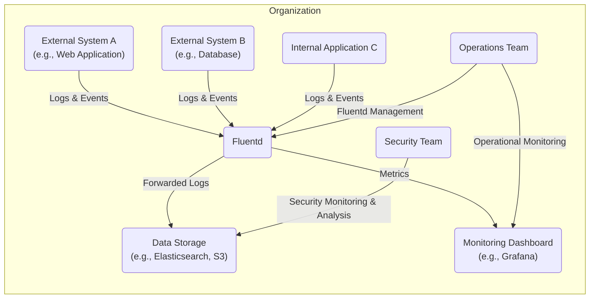
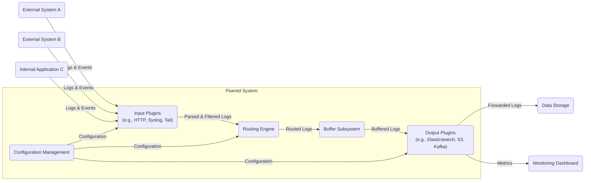
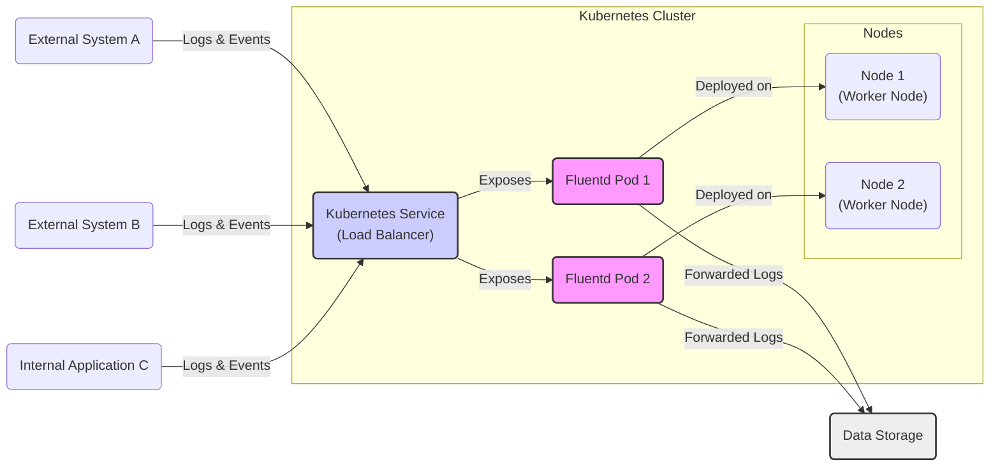
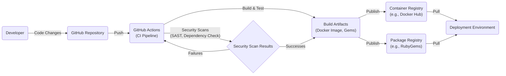

# BUSINESS POSTURE

This project, Fluentd, aims to provide a unified logging layer, enabling businesses to collect, process, and forward log data from various sources to diverse destinations.

- Business Priorities and Goals:
  - Centralized Logging: Aggregate logs from disparate systems into a single platform for easier analysis and management.
  - Real-time Data Processing: Enable immediate processing and forwarding of log data for timely insights and incident response.
  - Data Integration: Facilitate seamless integration with various data storage, analytics, and monitoring tools.
  - Scalability and Reliability: Ensure the logging system can handle increasing data volumes and remain operational under stress.
  - Open Source and Community Driven: Leverage community contributions and open standards for flexibility and cost-effectiveness.

- Business Risks:
  - Data Loss: Failure to reliably collect and forward logs, leading to loss of critical operational data.
  - Data Breach: Unauthorized access to sensitive log data, resulting in confidentiality violations and compliance issues.
  - System Unavailability: Downtime of the logging system, hindering monitoring and incident response capabilities.
  - Performance Bottleneck: Inefficient log processing impacting overall system performance and data delivery latency.
  - Configuration Errors: Misconfiguration leading to incorrect data routing, filtering, or loss of logs.

# SECURITY POSTURE

- Existing Security Controls:
  - security control: Access control to Fluentd configuration files (typically file system permissions). Implemented via operating system level access controls.
  - security control: Plugin-based architecture allows for community contributions, but also requires careful review of plugin security. Implemented via community review process and user discretion.
  - security control: Support for TLS/SSL for secure communication channels. Implemented in input and output plugins that support network communication.

- Accepted Risks:
  - accepted risk: Reliance on user-provided plugins introduces potential security vulnerabilities if plugins are not thoroughly vetted.
  - accepted risk: Default configurations might not be hardened and require manual security adjustments.
  - accepted risk: Security of destination systems is outside the scope of Fluentd itself.

- Recommended Security Controls:
  - security control: Implement automated security scanning of Fluentd core and plugins (SAST, DAST, dependency scanning).
  - security control: Enforce least privilege principles for Fluentd process execution and access to resources.
  - security control: Implement centralized configuration management and version control for Fluentd configurations.
  - security control: Establish a security incident response plan specifically for the logging infrastructure.
  - security control: Regularly audit Fluentd configurations and logs for security misconfigurations and anomalies.

- Security Requirements:
  - Authentication:
    - Requirement: Secure authentication mechanisms for accessing Fluentd management interfaces (if any) and configuration.
    - Requirement: Authentication for plugins that require external service access.
  - Authorization:
    - Requirement: Role-based access control (RBAC) for managing Fluentd configurations and accessing logs.
    - Requirement: Authorization policies to control plugin execution and resource access.
  - Input Validation:
    - Requirement: Input validation for data received from various sources to prevent injection attacks and data corruption.
    - Requirement: Sanitization of log data before forwarding to prevent cross-site scripting (XSS) or other injection vulnerabilities in downstream systems.
  - Cryptography:
    - Requirement: Encryption of sensitive log data in transit using TLS/SSL.
    - Requirement: Consider encryption of sensitive log data at rest, depending on storage destination capabilities and sensitivity of data.
    - Requirement: Secure storage and management of cryptographic keys and certificates.

# DESIGN

## C4 CONTEXT

- Context Diagram Elements:
  - Element:
    - Name: External System A (e.g., Web Application)
    - Type: External System
    - Description: An external web application generating application logs and events.
    - Responsibilities: Generate application logs and events.
    - Security controls: Application-level logging controls, potentially input validation to prevent log injection.
  - Element:
    - Name: External System B (e.g., Database)
    - Type: External System
    - Description: An external database system generating database logs and events.
    - Responsibilities: Generate database logs and events.
    - Security controls: Database audit logging, access control to database logs.
  - Element:
    - Name: Internal Application C
    - Type: Internal System
    - Description: An internal application generating application logs and events.
    - Responsibilities: Generate application logs and events.
    - Security controls: Application-level logging controls, potentially input validation to prevent log injection, internal network segmentation.
  - Element:
    - Name: Fluentd
    - Type: System
    - Description: Unified logging layer responsible for collecting, processing, and forwarding logs and events.
    - Responsibilities: Collect logs from various sources, parse and filter logs, route logs to destinations, buffer logs for reliability.
    - Security controls: Access control to configuration, secure communication channels (TLS), input validation via plugins, plugin security vetting.
  - Element:
    - Name: Monitoring Dashboard (e.g., Grafana)
    - Type: External System
    - Description: A dashboard used by operations and security teams to visualize metrics derived from logs.
    - Responsibilities: Visualize metrics, provide operational and security insights.
    - Security controls: Authentication and authorization for dashboard access, secure communication with data storage.
  - Element:
    - Name: Data Storage (e.g., Elasticsearch, S3)
    - Type: External System
    - Description: Storage system for persistent storage of collected logs.
    - Responsibilities: Store log data, provide data retrieval capabilities.
    - Security controls: Access control to log data, encryption at rest, data retention policies.
  - Element:
    - Name: Security Team
    - Type: User
    - Description: Team responsible for security monitoring, incident response, and threat analysis.
    - Responsibilities: Security monitoring, threat detection, incident response, log analysis for security events.
    - Security controls: Access to monitoring dashboards and log data storage, security information and event management (SIEM) tools.
  - Element:
    - Name: Operations Team
    - Type: User
    - Description: Team responsible for system operations, performance monitoring, and troubleshooting.
    - Responsibilities: System monitoring, performance analysis, troubleshooting, Fluentd management.
    - Security controls: Access to monitoring dashboards, Fluentd management interfaces (configuration access).

## C4 CONTAINER

- Container Diagram Elements:
  - Element:
    - Name: Input Plugins
    - Type: Container
    - Description: Responsible for collecting logs from various sources using different protocols and formats. Examples include HTTP, Syslog, Tail (file tailing).
    - Responsibilities: Receive logs from sources, parse logs into structured format, perform initial filtering and processing.
    - Security controls: Input validation, secure protocol handling (TLS for network inputs), plugin security vetting, access control to input ports/interfaces.
  - Element:
    - Name: Routing Engine
    - Type: Container
    - Description: Core component responsible for routing processed logs based on configuration rules to appropriate output plugins.
    - Responsibilities: Evaluate routing rules, direct logs to buffers, manage log flow.
    - Security controls: Configuration validation, access control to routing rules, rate limiting to prevent denial of service.
  - Element:
    - Name: Buffer Subsystem
    - Type: Container
    - Description: Provides buffering capabilities to ensure log delivery reliability even during temporary outages or backpressure in downstream systems.
    - Responsibilities: Buffer logs in memory or persistent storage, manage buffer queues, implement retry mechanisms.
    - Security controls: Secure buffer storage (encryption at rest if persistent), access control to buffer data, buffer overflow protection.
  - Element:
    - Name: Output Plugins
    - Type: Container
    - Description: Responsible for forwarding processed logs to various destinations such as databases, cloud storage, message queues, and monitoring systems. Examples include Elasticsearch, S3, Kafka.
    - Responsibilities: Format logs for destination systems, establish connections to destinations, forward logs, handle delivery acknowledgements and retries.
    - Security controls: Secure communication channels (TLS) to destinations, authentication and authorization for destination systems, output sanitization to prevent injection vulnerabilities in destinations, plugin security vetting.
  - Element:
    - Name: Configuration Management
    - Type: Container
    - Description: Manages the configuration of Fluentd, including input plugins, routing rules, output plugins, and buffer settings.
    - Responsibilities: Load and parse configuration files, validate configuration, provide API or interface for configuration management.
    - Security controls: Access control to configuration files, secure configuration storage, configuration version control, validation of configuration syntax and parameters.

## DEPLOYMENT

Deployment Solution: Docker Container Deployment on Kubernetes

- Deployment Diagram Elements:
  - Element:
    - Name: Kubernetes Cluster
    - Type: Environment
    - Description: Container orchestration platform managing Fluentd deployment. Provides scalability, resilience, and automated management.
    - Responsibilities: Container orchestration, resource management, service discovery, load balancing.
    - Security controls: Kubernetes RBAC, network policies, pod security policies, secrets management, cluster security hardening.
  - Element:
    - Name: Node 1, Node 2 (Worker Nodes)
    - Type: Infrastructure
    - Description: Worker nodes in the Kubernetes cluster where Fluentd pods are deployed.
    - Responsibilities: Run container workloads, provide compute resources.
    - Security controls: Operating system hardening, node security configuration, container runtime security, network segmentation.
  - Element:
    - Name: Fluentd Pod 1, Fluentd Pod 2
    - Type: Container Instance
    - Description: Instances of Fluentd containers running within Kubernetes pods. Each pod encapsulates a Fluentd container and its dependencies.
    - Responsibilities: Collect, process, and forward logs as Fluentd instances.
    - Security controls: Container image security scanning, least privilege container configuration, resource limits, network policies for pod isolation.
  - Element:
    - Name: Kubernetes Service (Load Balancer)
    - Type: Load Balancer
    - Description: Kubernetes service of type LoadBalancer that exposes Fluentd pods to external log sources. Distributes incoming log traffic across Fluentd pods.
    - Responsibilities: Load balancing, service discovery, external access point for Fluentd.
    - Security controls: Network security groups/firewall rules, TLS termination, rate limiting, access control to service endpoint.
  - Element:
    - Name: Data Storage
    - Type: External System
    - Description: External data storage system (e.g., Elasticsearch) where Fluentd forwards processed logs.
    - Responsibilities: Persistent storage of logs, data retrieval.
    - Security controls: Data storage security controls as described in Context Diagram.

## BUILD

- Build Process Elements:
  - Element:
    - Name: Developer
    - Type: Actor
    - Description: Software developer contributing code changes to the Fluentd project.
    - Responsibilities: Write code, commit changes, create pull requests.
    - Security controls: Developer workstation security, code review process, secure coding practices, access control to repository.
  - Element:
    - Name: GitHub Repository
    - Type: Code Repository
    - Description: Git repository hosted on GitHub containing Fluentd source code.
    - Responsibilities: Version control, code storage, collaboration platform.
    - Security controls: Access control to repository (authentication, authorization), branch protection rules, audit logging, vulnerability scanning of repository.
  - Element:
    - Name: GitHub Actions (CI Pipeline)
    - Type: CI/CD System
    - Description: Automated CI/CD pipeline triggered by code changes in the GitHub repository.
    - Responsibilities: Automated build, test, security scans, and artifact publishing.
    - Security controls: Secure pipeline configuration, secrets management for credentials, access control to pipeline workflows, audit logging of pipeline execution.
  - Element:
    - Name: Build Artifacts (Docker Image, Gems)
    - Type: Artifacts
    - Description: Output of the build process, including Docker images for containerized deployment and Ruby Gems for Ruby-based deployments.
    - Responsibilities: Deployable artifacts for Fluentd.
    - Security controls: Artifact signing, integrity checks, vulnerability scanning of artifacts, secure storage of artifacts.
  - Element:
    - Name: Security Scan Results
    - Type: Security Tool Output
    - Description: Results from static application security testing (SAST) and dependency vulnerability scanning performed during the build process.
    - Responsibilities: Identify potential security vulnerabilities in code and dependencies.
    - Security controls: Security scanning tools configuration, vulnerability reporting, integration with CI pipeline for build failure on critical findings.
  - Element:
    - Name: Container Registry (e.g., Docker Hub)
    - Type: Artifact Registry
    - Description: Registry for storing and distributing Docker images.
    - Responsibilities: Store and serve Docker images.
    - Security controls: Access control to registry, image signing and verification, vulnerability scanning of images in registry, registry security hardening.
  - Element:
    - Name: Package Registry (e.g., RubyGems)
    - Type: Artifact Registry
    - Description: Registry for storing and distributing Ruby Gems.
    - Responsibilities: Store and serve Ruby Gems.
    - Security controls: Access control to registry, gem signing and verification, registry security hardening.
  - Element:
    - Name: Deployment Environment
    - Type: Environment
    - Description: Target environment where Fluentd is deployed (e.g., Kubernetes cluster).
    - Responsibilities: Run Fluentd instances.
    - Security controls: Deployment environment security controls as described in Deployment Diagram.

# RISK ASSESSMENT

- Critical Business Processes:
  - Operational Monitoring: Fluentd enables real-time monitoring of application and system behavior, crucial for maintaining service availability and performance.
  - Security Monitoring and Incident Response: Logs collected by Fluentd are essential for security monitoring, threat detection, and incident investigation.
  - Compliance and Auditing: Log data is often required for compliance with regulatory requirements and for audit trails.

- Data Sensitivity:
  - Log data can contain sensitive information depending on the systems being monitored. This may include:
    - Application logs: Potentially contain user data, transaction details, error messages with sensitive information.
    - System logs: May contain system configurations, user activity, security events.
    - Database logs: Could include query details, data access patterns.
  - Sensitivity level: Moderate to High, depending on the specific data logged and the organization's data classification policies. Data confidentiality and integrity are important.

# QUESTIONS & ASSUMPTIONS

- Questions:
  - What are the specific regulatory compliance requirements for log data in the target environment?
  - What is the expected volume of log data Fluentd will need to handle?
  - What are the specific data retention requirements for logs?
  - Are there any specific security policies or standards that Fluentd deployment must adhere to?
  - What are the performance requirements for log delivery latency?

- Assumptions:
  - Fluentd will be deployed in a cloud environment (e.g., AWS, Azure, GCP) or on-premises Kubernetes cluster.
  - Data storage destination supports appropriate security controls (access control, encryption at rest).
  - Security team and operations team have the necessary expertise to manage and monitor Fluentd.
  - Organization has existing security policies and incident response procedures that will be extended to cover the logging infrastructure.
  - Input sources are trusted to some extent, but input validation is still necessary to prevent injection attacks and data corruption.