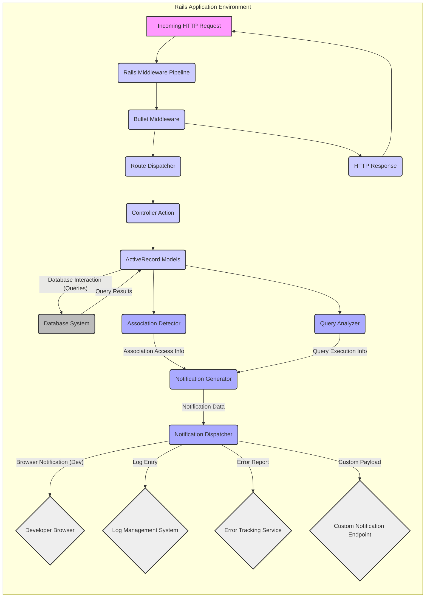

## Project Design Document: Bullet - N+1 Query Detector (Improved)

**1. Introduction**

This document provides an enhanced and detailed design overview of the Bullet project, an open-source gem for Ruby on Rails applications. Bullet is specifically designed to aid developers in preventing N+1 query problems and identifying instances of unused eager loading during the development and testing phases. This document is intended to serve as a robust foundation for subsequent threat modeling activities, comprehensively outlining the system's architecture, individual components, data flow pathways, and the underlying technologies employed.

**2. Project Overview**

Bullet functions as a middleware component deeply integrated within the request cycle of a Ruby on Rails application. Its primary mechanism involves hooking into ActiveRecord, the standard Object-Relational Mapper (ORM) utilized by Rails, to actively observe and analyze database queries and the relationships between data entities. By monitoring these interactions, Bullet can effectively identify potential N+1 query scenarios (where a single initial database query inadvertently triggers numerous subsequent queries) and highlight situations where eager loading of associated data is performed unnecessarily. Upon detecting such inefficiencies, Bullet generates notifications to inform developers, thereby facilitating the optimization of database interactions and the overall improvement of application performance.

**3. System Architecture**

Bullet operates as a middleware within the Rails application's request processing pipeline. It strategically integrates with ActiveRecord, the ORM used by Rails, to monitor database queries and their relationships.

*   **Core Components:**
    *   "Middleware": The entry point for Bullet, responsible for intercepting incoming requests and outgoing responses.
    *   "Association Detector": Monitors the access patterns of ActiveRecord associations during request processing.
    *   "Query Analyzer": Examines the sequence and quantity of database queries executed within the context of a single request.
    *   "Notification Generator": Constructs informative notifications based on the detection of N+1 queries or unused eager loading.
    *   "Configuration Manager": Manages user-defined settings that control Bullet's operational behavior.
    *   "Notification Dispatcher":  Sends generated notifications through various configurable channels.
    *   "Ignored Associations/Queries Store": Persists user-defined exceptions to Bullet's analytical rules.

*   **External Interactions:**
    *   "Rails Application": Bullet is directly embedded within the target Rails application's process.
    *   "Database System": Bullet passively observes database queries initiated by the Rails application.
    *   "Developer User Interface (Browser)": Bullet can display real-time notifications directly within the developer's browser during development sessions.
    *   "Log Management System": Bullet can write notifications to application or dedicated log files.
    *   "Error Tracking Services (e.g., Bugsnag, Airbrake)": Bullet can be configured to dispatch notifications to external error tracking platforms.
    *   "Custom Notification Endpoints": Users can define custom mechanisms for receiving Bullet notifications.

**4. Detailed Component Description**

*   **"Middleware":**
    *   Function: Injects Bullet into the Rails application's middleware stack, ensuring its execution within the request lifecycle.
    *   Responsibility: Initializes Bullet at the beginning of each incoming request to prepare for monitoring.
    *   Responsibility: Performs cleanup operations at the end of each request to release resources and reset state.

*   **"Association Detector":**
    *   Function: Hooks into ActiveRecord's association loading mechanisms to gain visibility into data relationships.
    *   Responsibility: Tracks which ActiveRecord associations are accessed during the processing of a request.
    *   Responsibility: Identifies potential N+1 query scenarios by detecting repeated database queries for the same associated data.
    *   Responsibility: Detects instances of unused eager loading by identifying associations that were loaded but never subsequently accessed within the request.

*   **"Query Analyzer":**
    *   Function: Monitors all database queries executed by ActiveRecord during request processing.
    *   Responsibility: Maintains a record of the number and types of database queries executed within a given request.
    *   Responsibility: Collaborates with the "Association Detector" to correlate database query patterns with association access patterns, enabling the identification of N+1 issues.

*   **"Notification Generator":**
    *   Function: Creates human-readable messages describing detected N+1 queries or instances of unused eager loading.
    *   Responsibility: Includes relevant contextual information within notifications, such as the affected model, association name, and the originating code location (backtrace).
    *   Responsibility: Determines the severity level of the notification (e.g., warning, alert) based on the type of issue detected.

*   **"Configuration Manager":**
    *   Function: Reads and interprets configuration settings defined by the user within `Bullet.configure` blocks in the Rails application's initialization code.
    *   Responsibility: Allows users to customize various aspects of Bullet's behavior, including enabling or disabling notifications, specifying desired notification channels, and defining associations or queries to be ignored during analysis.

*   **"Notification Dispatcher":**
    *   Function: Responsible for delivering generated notifications through the configured channels.
    *   Supported Notifiers:
        *   "Bullet::Notifier::JavascriptAlert": Displays notifications as non-blocking alerts directly within the developer's browser using JavaScript.
        *   "Bullet::Notifier::BulletLog": Writes notification messages to a dedicated log file specifically for Bullet activity.
        *   "Bullet::Notifier::RailsLogger": Integrates with the Rails application's standard logging system to write notifications to the application logs.
        *   "Bullet::Notifier::Bugsnag": Sends notifications as error reports to the Bugsnag error tracking service.
        *   "Bullet::Notifier::Airbrake": Sends notifications as error reports to the Airbrake error tracking service.
        *   "Custom Notifiers": Provides an interface for developers to implement their own notification mechanisms, allowing integration with other systems.

*   **"Ignored Associations/Queries Store":**
    *   Function: Provides a mechanism for users to explicitly exclude specific ActiveRecord associations or database queries from Bullet's analysis and reporting.
    *   Configuration: Typically configured declaratively within the `Bullet.configure` block in the Rails application's initialization process.

**5. Data Flow**

1. **"Incoming HTTP Request":** An HTTP request is received by the Rails application.
2. **"Rails Middleware Pipeline":** The request enters the standard Rails middleware processing pipeline.
3. **"Bullet Middleware":** Bullet's middleware component intercepts the request within the pipeline.
4. **"Route Dispatcher":** The Rails router determines the appropriate controller and action to handle the request.
5. **"Controller Action":** The designated controller action is executed.
6. **"ActiveRecord Models":** The controller action interacts with the database through ActiveRecord models.
7. **"Database System":** Database queries are executed against the database system.
8. **"Association Detector":** Bullet's Association Detector observes how ActiveRecord models access their associated data.
9. **"Query Analyzer":** Bullet's Query Analyzer monitors the specific database queries executed by ActiveRecord.
10. **"Notification Generator":** Based on the analysis performed by the Association Detector and Query Analyzer, the Notification Generator creates notifications for potential N+1 queries or unused eager loading.
11. **"Notification Dispatcher":** The Notification Dispatcher routes the generated notifications to the configured output channels.
12. **Notification Channels:** Notifications can be delivered as:
    *   **"Developer Browser":** Real-time alerts within the developer's browser during development.
    *   **"Log Management System":** Entries in application or dedicated log files.
    *   **"Error Tracking Service":** Error reports sent to services like Bugsnag or Airbrake.
    *   **"Custom Notification Endpoint":** Data sent to user-defined endpoints.
13. **"HTTP Response":** The Rails application sends the HTTP response back to the client.

**6. Key Technologies**

*   "Ruby": The primary programming language in which Bullet is developed.
*   "Ruby on Rails": The web application framework that Bullet integrates with.
*   "ActiveRecord": The Object-Relational Mapper (ORM) used by Rails for database interactions, which Bullet hooks into.
*   "Rake": A build automation tool used for running tests and other development tasks within the Bullet project.
*   "MiniTest" / "RSpec": Popular testing frameworks used for writing and executing unit and integration tests for Bullet.

**7. Deployment Model**

Bullet is deployed as a standard Ruby gem within a Ruby on Rails application. The typical deployment process involves:

*   Adding the `bullet` gem to the application's `Gemfile`.
*   Executing the `bundle install` command to install the gem and its dependencies.
*   Configuration of Bullet within the Rails application's initialization process (e.g., `config/environments/development.rb`).

Bullet operates directly within the application's process and does not necessitate a separate deployment infrastructure.

**8. Security Considerations (Preliminary)**

*   **"Configuration Security":**  Insecurely configured ignore lists could inadvertently mask genuine N+1 query problems, hindering performance optimization. Ensure proper review and management of ignored associations and queries.
*   **"Notification Channel Security":**  Sending notifications containing sensitive information over insecure channels (e.g., unencrypted HTTP to custom notifiers) could lead to information disclosure. Employ secure communication protocols (HTTPS) for custom notifiers. Avoid logging excessively detailed information in production environments.
*   **"Performance Impact in Production":** While primarily intended for development and testing, inadvertently enabling Bullet in production environments could introduce noticeable performance overhead due to its monitoring activities. Ensure Bullet is disabled or configured with minimal impact in production.
*   **"Dependency Management":**  Vulnerabilities in Bullet's own dependencies could pose a security risk to applications using the gem. Regularly update Bullet and its dependencies to mitigate potential vulnerabilities.
*   **"Information Exposure through Logs/Notifications":** Error messages or log entries generated by Bullet might unintentionally reveal sensitive details about the application's database schema, query structure, or internal logic. Carefully review and sanitize log outputs, especially in production.

**9. Diagrams**

*   **Component Diagram:** (Implicitly represented in the "System Architecture" and "Detailed Component Description" sections).
*   **Data Flow Diagram:** (Detailed in Section 5).

**10. Future Considerations**

*   Explore more granular and context-aware configuration options for ignoring specific instances of potential issues.
*   Investigate more advanced static analysis techniques to proactively identify potential N+1 queries before runtime.
*   Develop integrations with other development and monitoring tools to provide a more holistic view of application performance.

This improved document provides a more detailed and structured overview of the Bullet project's design, offering a solid foundation for conducting thorough threat modeling to identify potential security vulnerabilities and devise appropriate mitigation strategies.
