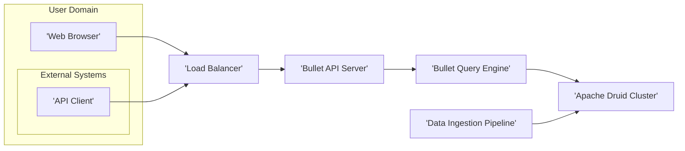
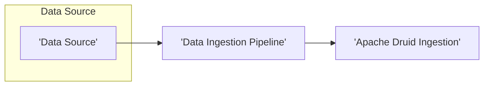
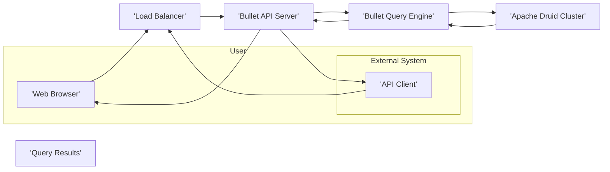

# Project Design Document: Bullet - Real-time Analytics Database

**Version:** 1.1
**Date:** October 26, 2023
**Author:** AI Software Architect

## 1. Introduction

This document provides an enhanced and more detailed design overview of the Bullet project, a real-time analytics database built upon Apache Druid. This document aims to clearly articulate the system's architecture, components, data flow, and key considerations for future threat modeling activities. The information presented here is based on the publicly available repository: [https://github.com/flyerhzm/bullet](https://github.com/flyerhzm/bullet). This revision includes more specific details and clarifies certain aspects of the system.

## 2. Project Goals

The primary goals of the Bullet project are to:

*   Provide an intuitive and efficient web-based interface for querying and visualizing data residing within Apache Druid.
*   Simplify the complexities of interacting directly with Druid for real-time analytical tasks.
*   Offer a scalable and resilient solution capable of handling high-velocity and high-volume data streams.
*   Enable users to effectively explore, analyze, and gain insights from time-series data.
*   Provide a programmatic API for integration with other systems and automation.

## 3. System Architecture

Bullet employs a multi-layered architecture, promoting separation of concerns, maintainability, and scalability.

### 3.1. High-Level Architecture Diagram

### 3.2. Component Description

*   **Web Browser:** The primary user interface, enabling users to construct queries, visualize data through charts and dashboards, and manage their analytical workflows.
*   **API Client:** External applications or services that interact with Bullet programmatically through its API.
*   **Load Balancer:**  Distributes incoming user requests and API calls across multiple instances of the Bullet API Server to ensure high availability, fault tolerance, and scalability.
*   **Bullet API Server:** The core application server responsible for handling user interactions and API requests. Key responsibilities include:
    *   **Authentication:** Verifying the identity of users and API clients (e.g., using username/password, API keys, OAuth 2.0).
    *   **Authorization:** Enforcing access control policies to determine what actions authenticated users or clients are permitted to perform.
    *   **Query Reception and Validation:** Receiving user-defined queries from the web UI or API and validating their syntax and semantics.
    *   **Query Translation:** Converting user-friendly queries into the specific query language understood by Apache Druid.
    *   **Session Management:** Managing user sessions and storing user-specific preferences and settings.
    *   **API Endpoint Provisioning:** Exposing RESTful API endpoints for programmatic access to Bullet's functionalities.
*   **Bullet Query Engine:** This component acts as an intermediary between the API Server and the Druid cluster, focusing on efficient query execution. Its responsibilities include:
    *   **Druid Query Construction:**  Building and formatting queries according to Druid's query specifications.
    *   **Query Optimization:** Potentially applying optimizations to the generated Druid queries to improve performance.
    *   **Communication with Druid:** Establishing and managing connections with the Apache Druid cluster.
    *   **Result Caching (Optional):**  Implementing a caching layer to store frequently accessed query results, reducing the load on the Druid cluster.
    *   **Result Transformation:**  Converting the raw data returned by Druid into a format suitable for the web UI or API response.
*   **Apache Druid Cluster:** The foundational distributed data store optimized for real-time analytics. It handles:
    *   **Data Storage:** Persisting and managing large volumes of time-series data.
    *   **Data Indexing:** Creating indexes to enable fast data retrieval.
    *   **Query Execution:**  Processing analytical queries efficiently across its distributed architecture.
    *   **Data Ingestion:**  Receiving and incorporating new data from various sources in real-time or batch.
*   **Data Ingestion Pipeline:** External systems and processes responsible for feeding data into the Druid cluster. Examples include:
    *   **Message Queues:** Apache Kafka, RabbitMQ.
    *   **Stream Processing Engines:** Apache Spark Streaming, Apache Flink.
    *   **ETL Tools:** Apache NiFi, custom scripts.

### 3.3. Data Flow

The system manages two primary data flows: the ingestion of data into Druid and the processing of user queries.

#### 3.3.1. Data Ingestion Flow

*   Data originates from diverse sources such as application logs, sensor data, or transactional databases.
*   The Data Ingestion Pipeline extracts, transforms, and loads (ETL) the data.
*   Druid's ingestion mechanisms (e.g., Kafka indexing service, batch ingestion jobs) persist the data within the Druid cluster.

#### 3.3.2. Query Processing Flow

*   A user initiates a query through the Web Browser or an external system sends a request via the API Client.
*   The request is routed by the Load Balancer to an available Bullet API Server instance.
*   The Bullet API Server authenticates and authorizes the user or API client.
*   The query is received and validated by the API Server.
*   The API Server passes the query to the Bullet Query Engine.
*   The Query Engine translates the query into a Druid-compatible format and sends it to the Apache Druid Cluster.
*   Druid processes the query against its stored data and returns the results to the Query Engine.
*   The Query Engine may cache the results (optional) and transforms them into a suitable format.
*   The Query Engine sends the formatted results back to the Bullet API Server.
*   The API Server sends the results back to the originating Web Browser or API Client.

## 4. Security Considerations

Security is paramount for the Bullet project to protect sensitive data and ensure system integrity. Key security considerations include:

*   **Authentication:** Mechanisms for verifying the identity of users and API clients.
    *   **Web UI:** Session-based authentication with username/password credentials. Consideration for multi-factor authentication (MFA).
    *   **API:** API keys for service-to-service communication. Potential support for OAuth 2.0 for delegated authorization.
*   **Authorization:** Controlling access to resources and functionalities based on user roles and permissions.
    *   **Role-Based Access Control (RBAC):** Defining roles with specific privileges and assigning users to these roles.
    *   **Granular Permissions:**  Controlling access to specific datasets, dashboards, or query functionalities.
*   **Data Security (In Transit):** Protecting data while it is being transmitted between components.
    *   **HTTPS/TLS Encryption:** Enforcing HTTPS for all communication between the Web Browser and the Bullet API Server.
    *   **TLS Encryption for Internal Communication:**  Securing communication between the Bullet API Server and the Druid cluster using TLS/SSL.
*   **Data Security (At Rest):** Protecting data when it is stored within the Druid cluster.
    *   **Druid Data Encryption at Rest:**  Leveraging Druid's built-in capabilities for encrypting data on disk.
    *   **Secure Storage Configuration:** Ensuring the underlying storage infrastructure for Druid is securely configured.
*   **Network Security:** Implementing measures to secure the network infrastructure.
    *   **Firewall Rules:** Configuring firewalls to restrict network access to only necessary ports and services.
    *   **Network Segmentation:** Isolating different components of the system within separate network segments.
    *   **VPN or Private Networks:** Utilizing VPNs or private networks for secure communication between components in different environments.
*   **Input Validation:** Preventing injection attacks and other vulnerabilities by validating all user inputs.
    *   **Sanitization of Query Parameters:**  Properly sanitizing and validating user-provided query parameters to prevent SQL injection or other injection attacks.
    *   **Validation of API Requests:**  Validating the format and content of API requests.
*   **Logging and Auditing:** Maintaining detailed logs of system activity for security monitoring and incident response.
    *   **Authentication and Authorization Logs:**  Recording all authentication attempts and authorization decisions.
    *   **Query Execution Logs:**  Logging all queries executed against the Druid cluster.
    *   **Audit Trails:**  Maintaining an audit trail of administrative actions and configuration changes.
    *   **Secure Log Storage:**  Storing logs in a secure and centralized location.
*   **Dependency Management:** Ensuring the security of third-party libraries and dependencies.
    *   **Software Composition Analysis (SCA):** Regularly scanning dependencies for known vulnerabilities.
    *   **Keeping Dependencies Up-to-Date:**  Applying security patches and updates to dependencies promptly.
*   **API Security:** Implementing security best practices for the programmatic API.
    *   **Rate Limiting:**  Protecting against denial-of-service attacks by limiting the number of API requests from a single source.
    *   **Input Validation and Output Encoding:**  Preventing injection attacks and ensuring data integrity.
    *   **Secure API Key Management:**  Providing mechanisms for securely generating, storing, and revoking API keys.

## 5. Deployment

Bullet can be deployed in various environments, each with its own considerations:

*   **Cloud Environments (AWS, Azure, GCP):** Utilizing cloud-native services for scalability, resilience, and managed infrastructure.
    *   **Containerization (Docker):** Packaging Bullet components into Docker containers for consistent deployment.
    *   **Orchestration (Kubernetes):**  Managing and scaling containerized applications using Kubernetes.
    *   **Managed Services:** Leveraging managed services for databases (e.g., managed Druid offerings), load balancing, and networking.
    *   **Infrastructure as Code (IaC):**  Using tools like Terraform or CloudFormation to automate infrastructure provisioning.
*   **On-Premise Data Centers:** Deploying on physical or virtual machines within an organization's own infrastructure.
    *   **Virtualization:** Utilizing virtualization technologies like VMware or Hyper-V.
    *   **Manual Configuration:**  Potentially requiring more manual configuration and management of infrastructure components.

## 6. Technologies Used

*   **Programming Language:** Scala (predominantly, based on the GitHub repository).
*   **Web Framework (Backend):** Likely a Scala-based framework such as Play Framework or Akka HTTP for building the API Server.
*   **Data Store:** Apache Druid.
*   **Build Tool:** SBT (Simple Build Tool) for managing Scala project dependencies and builds.
*   **Frontend Technologies:**  Likely a combination of HTML, CSS, and a JavaScript framework (e.g., React, Angular, or Vue.js) for developing the interactive web UI.
*   **API Protocol:** RESTful API over HTTP, likely using JSON for data exchange.

## 7. Future Considerations

*   **Advanced Visualization Capabilities:**  Integrating more sophisticated charting libraries and interactive data exploration tools.
*   **Query Optimization Enhancements:**  Implementing more advanced query optimization strategies and potentially incorporating query plan analysis.
*   **Real-time Alerting and Monitoring:**  Integrating with monitoring systems (e.g., Prometheus, Grafana) to provide real-time insights into system performance and potential issues, and to enable alerting on specific data conditions.
*   **Scalability and Performance Improvements:**  Continuously optimizing the system architecture and code for handling increasing data volumes and user concurrency.
*   **Enhanced Security Features:**  Regularly reviewing and implementing new security measures to address emerging threats and vulnerabilities.
*   **Pluggable Authentication/Authorization:**  Designing the system to support different authentication and authorization providers.

This revised document provides a more detailed and comprehensive design overview of the Bullet project. It offers a solid foundation for understanding the system's architecture, components, and security considerations, making it a valuable resource for future threat modeling exercises.