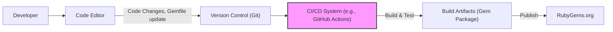

# BUSINESS POSTURE

This project, represented by the 'bullet' GitHub repository, aims to address performance issues in Ruby on Rails applications caused by N+1 queries. The primary business goal is to improve the efficiency and responsiveness of Rails applications, leading to a better user experience and potentially reduced infrastructure costs.

* Business Priorities:
    * Application Performance Optimization: Identifying and mitigating N+1 query problems to enhance application speed and responsiveness.
    * Cost Efficiency: Reducing database load and server resource consumption by optimizing database queries.
    * Developer Productivity: Providing developers with a tool to easily detect and resolve N+1 query issues during development.

* Business Risks:
    * False Positives/Negatives: Incorrectly identifying or missing N+1 queries, leading to wasted effort or unresolved performance problems.
    * Performance Overhead: The gem itself might introduce performance overhead, negating the benefits of N+1 query detection.
    * Compatibility Issues: Potential conflicts with different versions of Ruby on Rails or other gems, causing application instability.
    * Security Vulnerabilities: Security flaws in the gem could be exploited in applications using it, although this is less likely for a performance monitoring tool.

# SECURITY POSTURE

The 'bullet' gem is primarily a development and performance monitoring tool. Its direct security impact is limited compared to applications it monitors. However, as a dependency in Rails applications, its security posture is still relevant.

* Security Controls:
    * security control: Code Review - The project is open source on GitHub, allowing for community code review.
    * security control: Testing - The repository includes a test suite, indicating some level of testing for functionality and stability. (Location: 'test' directory in the repository)

* Accepted Risks:
    * accepted risk: Dependency Vulnerabilities - Like any software dependency, 'bullet' might have vulnerabilities in its own code or its dependencies.
    * accepted risk: Open Source Exposure - Being open source, vulnerabilities are publicly discoverable, which can be both a benefit (community review) and a risk (public knowledge of flaws).

* Recommended Security Controls:
    * recommended security control: Dependency Scanning - Implement automated dependency scanning to identify and address known vulnerabilities in the gem's dependencies.
    * recommended security control: Static Application Security Testing (SAST) - Integrate SAST tools into the development process to automatically scan the gem's codebase for potential security flaws.
    * recommended security control: Regular Security Audits - Conduct periodic security audits of the gem's codebase, especially before major releases, to proactively identify and mitigate security risks.

* Security Requirements:
    * Authentication: Not directly applicable to the 'bullet' gem itself. Authentication is handled by the Rails applications that use it.
    * Authorization: Not directly applicable to the 'bullet' gem itself. Authorization is handled by the Rails applications that use it.
    * Input Validation: Input validation is relevant in the context of how 'bullet' interacts with Rails application internals. It should handle various data structures and inputs from Rails applications gracefully and avoid unexpected behavior or errors.
    * Cryptography: Cryptography is not a primary requirement for the 'bullet' gem as it is not designed to handle sensitive data directly. However, if the gem were to log or transmit any data (which is not its primary function), appropriate security measures for data handling would be needed.

# DESIGN

The 'bullet' gem is designed to be integrated into Ruby on Rails applications. It acts as a middleware or a set of tools that monitor database queries during application execution and identify potential N+1 query issues.

## C4 CONTEXT

```mermaid
flowchart LR
    subgraph "Ruby on Rails Ecosystem"
        style "Ruby on Rails Ecosystem" fill:transparent,stroke:#999,stroke-dasharray:5 5
        A["Ruby on Rails Application"]
        B["RubyGems.org"]
    end
    C["Ruby on Rails Developers"]
    D["Bullet Gem"]

    C --> D
    D --> A
    A --> B

    linkStyle 0,1,2 stroke:#999,stroke-width:1px,dasharray:5 5
```

* Context Diagram Elements:
    * - Name: Ruby on Rails Developers
      - Type: Person
      - Description: Software developers who build and maintain Ruby on Rails applications. They use the 'bullet' gem to improve application performance.
      - Responsibilities: Develop and maintain Rails applications, use 'bullet' gem to identify and fix N+1 queries, deploy and monitor Rails applications.
      - Security controls: Secure development practices, code review, access control to development environments.
    * - Name: Bullet Gem
      - Type: Software System
      - Description: A Ruby gem designed to detect and alert developers to N+1 query problems in Ruby on Rails applications.
      - Responsibilities: Monitor database queries in Rails applications, identify N+1 queries, provide notifications to developers, integrate with Rails development environment.
      - Security controls: Input validation of Rails application data, secure coding practices, dependency scanning, SAST.
    * - Name: Ruby on Rails Application
      - Type: Software System
      - Description: A web application built using the Ruby on Rails framework. It is the target application where 'bullet' gem is integrated to monitor performance.
      - Responsibilities: Serve web requests, interact with databases, process user data, implement business logic, utilize 'bullet' gem for performance monitoring.
      - Security controls: Authentication, authorization, input validation, output encoding, secure session management, vulnerability scanning, web application firewall (WAF).
    * - Name: RubyGems.org
      - Type: Software System
      - Description: The public Ruby gem repository where 'bullet' gem is published and distributed.
      - Responsibilities: Host and distribute Ruby gems, manage gem versions, provide gem installation tools (e.g., `gem install`).
      - Security controls: Access control, malware scanning of uploaded gems, secure infrastructure, vulnerability management.

## C4 CONTAINER

```mermaid
flowchart LR
    subgraph "Ruby on Rails Application Runtime"
        style "Ruby on Rails Application Runtime" fill:transparent,stroke:#999,stroke-dasharray:5 5
        A["Rails Application Process" ]
        B["Bullet Gem (Ruby Gem)"]
        C["Database (e.g., PostgreSQL, MySQL)"]
    end

    A --> B
    A --> C

    linkStyle 0,1 stroke:#999,stroke-width:1px,dasharray:5 5
```

* Container Diagram Elements:
    * - Name: Rails Application Process
      - Type: Application Runtime
      - Description: The running Ruby on Rails application process that executes the application code and handles web requests.
      - Responsibilities: Execute Rails application code, handle HTTP requests, manage application state, interact with the database, load and execute 'bullet' gem code.
      - Security controls: Operating system security, process isolation, resource limits, application-level security controls (authentication, authorization, etc.).
    * - Name: Bullet Gem (Ruby Gem)
      - Type: Library/Gem
      - Description: The 'bullet' gem is integrated as a library within the Rails application process. It intercepts and analyzes database queries made by the application.
      - Responsibilities: Monitor database queries, detect N+1 queries, provide notifications (e.g., logs, browser console alerts), integrate with Rails middleware.
      - Security controls: Secure coding practices, input validation within the gem, dependency scanning, SAST.
    * - Name: Database (e.g., PostgreSQL, MySQL)
      - Type: Database
      - Description: The database system used by the Rails application to store and retrieve data. Examples include PostgreSQL, MySQL, etc.
      - Responsibilities: Store application data, execute database queries, manage data integrity and consistency, provide data access to the Rails application.
      - Security controls: Database access control, encryption at rest and in transit, database hardening, regular security patching, database activity monitoring.

## DEPLOYMENT

The 'bullet' gem itself is not deployed in the traditional sense. It is distributed via RubyGems.org and then included as a dependency within Ruby on Rails applications. The deployment context is therefore the deployment of the Rails applications that utilize the 'bullet' gem.

Assuming a typical cloud deployment for a Ruby on Rails application:

```mermaid
flowchart LR
    subgraph "Cloud Environment (e.g., AWS, GCP, Azure)"
        style "Cloud Environment (e.g., AWS, GCP, Azure)" fill:transparent,stroke:#999,stroke-dasharray:5 5
        subgraph "Load Balancer"
            E["Load Balancer"]
        end
        subgraph "Application Servers"
            F1["Application Server Instance 1"]
            F2["Application Server Instance 2"]
            F3["Application Server Instance N"]
        end
        subgraph "Database Servers"
            G["Database Server"]
        end
    end

    E --> F1 & F2 & F3
    F1 & F2 & F3 --> G

    subgraph "Developer Workstation"
        H["Developer Workstation"]
    end
    H -- "gem install bullet" --> B["RubyGems.org"]
    H -- "git push" --> I["Code Repository (e.g., GitHub)"]
    I -- "CI/CD Pipeline" --> F1 & F2 & F3

    linkStyle 0,1,2,3,4,5,6,7 stroke:#999,stroke-width:1px,dasharray:5 5
```

* Deployment Diagram Elements:
    * - Name: Load Balancer
      - Type: Infrastructure Component
      - Description: Distributes incoming web traffic across multiple application server instances.
      - Responsibilities: Traffic distribution, health checks, SSL termination, high availability.
      - Security controls: DDoS protection, SSL/TLS configuration, access control lists (ACLs), web application firewall (WAF) integration.
    * - Name: Application Server Instance (1, 2, N)
      - Type: Compute Instance (VM, Container)
      - Description: Virtual machines or containers running the Ruby on Rails application, including the 'bullet' gem.
      - Responsibilities: Run Rails application code, handle web requests, execute 'bullet' gem, interact with the database.
      - Security controls: Operating system hardening, security patching, intrusion detection system (IDS), access control, application-level security controls.
    * - Name: Database Server
      - Type: Database Infrastructure
      - Description: Server hosting the database system (e.g., PostgreSQL, MySQL) used by the Rails application.
      - Responsibilities: Store and manage application data, process database queries, ensure data integrity and availability.
      - Security controls: Database access control, encryption at rest and in transit, database hardening, regular security patching, database activity monitoring, backups and recovery.
    * - Name: RubyGems.org
      - Type: Package Repository
      - Description: Public repository for Ruby gems, used to distribute the 'bullet' gem.
      - Responsibilities: Host and distribute Ruby gems, manage gem versions, provide gem installation tools.
      - Security controls: Access control, malware scanning of uploaded gems, secure infrastructure, vulnerability management.
    * - Name: Developer Workstation
      - Type: Developer Environment
      - Description: Developer's local machine used for writing code, testing, and installing gems.
      - Responsibilities: Code development, local testing, gem installation, code version control.
      - Security controls: Endpoint security, antivirus, firewall, access control, secure coding practices.
    * - Name: Code Repository (e.g., GitHub)
      - Type: Version Control System
      - Description: Repository for storing and managing the application's source code, including dependency declarations (Gemfile).
      - Responsibilities: Version control, code collaboration, source code storage, change tracking.
      - Security controls: Access control, branch protection, audit logging, secure code storage.
    * - Name: CI/CD Pipeline
      - Type: Automation System
      - Description: Automated system for building, testing, and deploying the Rails application to the application servers.
      - Responsibilities: Automated build process, automated testing, deployment automation, integration with code repository.
      - Security controls: Access control, secure build environment, vulnerability scanning in pipeline, deployment authorization, audit logging.

## BUILD

The build process for the 'bullet' gem itself is relatively simple, typical for Ruby gems. For applications using 'bullet', the build process involves incorporating the gem as a dependency.



* Build Process Elements:
    * - Name: Developer
      - Type: Person
      - Description: Software developer working on the 'bullet' gem or a Rails application using it.
      - Responsibilities: Write code, test code, commit code changes, manage dependencies.
      - Security controls: Secure coding practices, code review, access control to development environments.
    * - Name: Code Editor
      - Type: Development Tool
      - Description: Integrated Development Environment (IDE) or text editor used by developers.
      - Responsibilities: Code editing, syntax highlighting, code completion, debugging.
      - Security controls: Plugin security, secure configuration, access control to local files.
    * - Name: Version Control (Git)
      - Type: Version Control System
      - Description: Git repository used to manage the source code of the 'bullet' gem or Rails application.
      - Responsibilities: Version control, code history, branching and merging, collaboration.
      - Security controls: Access control, branch protection, audit logging, secure code storage.
    * - Name: CI/CD System (e.g., GitHub Actions)
      - Type: Automation System
      - Description: Continuous Integration and Continuous Delivery system used to automate the build, test, and potentially deployment process.
      - Responsibilities: Automated build process, automated testing, static analysis, vulnerability scanning, package creation, publishing artifacts.
      - Security controls: Secure build environment, access control, secret management, vulnerability scanning in pipeline, audit logging.
    * - Name: Build Artifacts (Gem Package)
      - Type: Software Artifact
      - Description: The packaged Ruby gem file (.gem) created during the build process.
      - Responsibilities: Contain compiled code and metadata for distribution, be installable by RubyGems.
      - Security controls: Integrity checks (checksums), signing (if applicable), secure storage.
    * - Name: RubyGems.org
      - Type: Package Repository
      - Description: Public repository for Ruby gems, used to distribute the 'bullet' gem.
      - Responsibilities: Host and distribute Ruby gems, manage gem versions, provide gem installation tools.
      - Security controls: Access control, malware scanning of uploaded gems, secure infrastructure, vulnerability management.

# RISK ASSESSMENT

* Critical Business Processes:
    * Performance of Ruby on Rails Applications: The primary business process at risk is the performance and responsiveness of Rails applications. Poor performance can lead to negative user experience, lost revenue, and increased operational costs. 'bullet' gem aims to mitigate this risk.

* Data Sensitivity:
    * Metadata about Database Queries: 'bullet' gem primarily deals with metadata about database queries (query patterns, execution times, etc.). It does not directly handle or store sensitive application data. However, query patterns themselves might indirectly reveal information about application logic or data structures.
    * Sensitivity Level: Low to Medium. While not directly handling sensitive data, exposure of detailed query patterns could potentially be used for reconnaissance in targeted attacks. The sensitivity depends on the specific application and the level of detail exposed in 'bullet's outputs (logs, notifications).

# QUESTIONS & ASSUMPTIONS

* Questions:
    * What is the intended scope of 'bullet' gem usage? Is it primarily for development/staging environments, or is it also intended for production monitoring?
    * What are the typical types of Rails applications that are expected to use 'bullet'? (e.g., e-commerce, SaaS, internal tools) This helps understand the potential impact of performance issues.
    * What are the organization's specific security requirements and risk tolerance for open-source dependencies used in their Rails applications?
    * Are there any specific compliance requirements (e.g., GDPR, PCI DSS) that the Rails applications using 'bullet' need to adhere to?

* Assumptions:
    * Assumption: 'bullet' gem is intended to be used in development and potentially staging environments to identify and fix N+1 queries before they impact production performance.
    * Assumption: The primary concern is to improve the performance of Rails applications, and security is a secondary but still important consideration for any software dependency.
    * Assumption: Rails applications using 'bullet' handle some level of user data, and ensuring application performance contributes to a positive user experience and overall business success.
    * Assumption: The deployment environment for Rails applications using 'bullet' is likely a cloud-based infrastructure, as this is a common pattern for modern web applications.