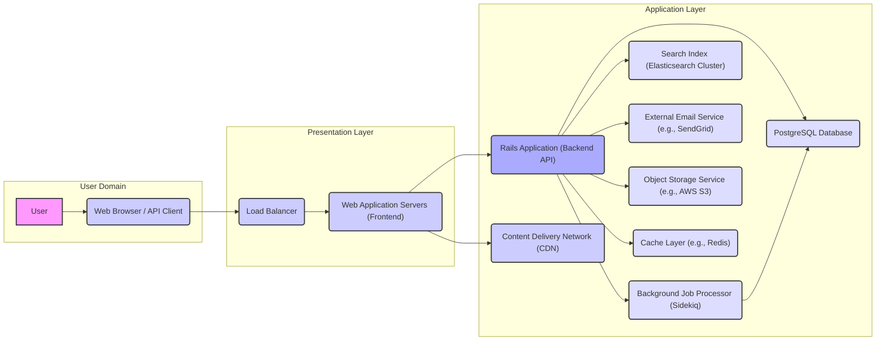

# Project Design Document: Forem Platform

**Version:** 1.1
**Date:** October 26, 2023
**Author:** AI Software Architect

## 1. Introduction

This document provides an enhanced architectural design of the Forem platform, an open-source platform for building online communities. This revision aims to provide a more detailed and refined understanding of the system's components, their interactions, and the overall architecture, specifically tailored for effective threat modeling.

### 1.1. Purpose

The primary purpose of this document is to provide a comprehensive and detailed architectural blueprint of the Forem platform, explicitly designed to facilitate thorough and accurate threat modeling. It meticulously describes the key components, data flows, and interactions within the system, highlighting potential areas of security concern and attack surfaces.

### 1.2. Scope

This document covers the core architectural components of the Forem platform, including:

*   User interaction points
*   Frontend application layer
*   Backend API layer
*   Persistent data storage
*   Asynchronous task processing
*   Indexing and search capabilities
*   Content delivery mechanisms
*   External communication services
*   File storage solutions

This document does not cover:

*   Specific infrastructure provisioning details (e.g., cloud provider configurations)
*   Low-level code implementation specifics
*   Detailed configurations of third-party integrations beyond their core function (e.g., specific email template designs)

### 1.3. Audience

This document is intended for:

*   Security engineers and architects tasked with performing threat modeling on the Forem platform.
*   Software development team members requiring a detailed understanding of the system architecture for development and maintenance.
*   DevOps and operations team members responsible for the deployment, scaling, and maintenance of the platform infrastructure.

## 2. High-Level Overview

Forem is a robust Ruby on Rails application engineered for the creation and management of online communities. It offers a rich set of features encompassing content creation, diverse user interactions, comprehensive moderation tools, and extensive customization options. The platform adheres to a well-defined web application architecture, emphasizing a clear separation of concerns between the client-side frontend and the server-side backend.

### 2.1. Key Features

*   **Rich Content Management:** Enables users to create and manage various content types, including articles, questions, polls, and discussions with rich text editing and media embedding.
*   **Secure User Management:** Provides secure user registration, authentication (supporting multiple methods), and granular role-based authorization controls for managing access and permissions.
*   **Interactive Community Features:** Fosters community engagement through features like following users, tagging content, commenting with nested replies, direct messaging, and reaction systems.
*   **Advanced Search Capabilities:** Offers powerful full-text search functionality across content and users, often leveraging features like filtering and sorting.
*   **Real-time and Asynchronous Notifications:** Delivers timely updates to users through both real-time in-app notifications and asynchronous email notifications for various activities.
*   **Extensive Customization Options:** Allows for theming, branding, and configuration adjustments to tailor the platform's appearance and functionality to specific community requirements.
*   **Programmatic API Access:** Exposes a well-documented and versioned API for programmatic interaction with the platform, enabling integrations and extensions.

## 3. System Architecture

The Forem platform is structured using a multi-tier architecture, promoting modularity and scalability. The following diagram illustrates the primary components and their interactions, highlighting data flow.

### 3.1. Component Descriptions

*   **User:** An individual interacting with the Forem platform, either through a web browser or programmatically via an API client.
*   **Web Browser / API Client:** The application used by users to access the Forem platform's frontend or the tool used to interact with the backend API directly.
*   **Load Balancer:** Distributes incoming HTTP(S) traffic across multiple web application servers to ensure high availability, fault tolerance, and optimal performance. This is a critical point for security controls like DDoS mitigation.
*   **Web Application Servers (Frontend):** Serve the static assets and potentially the server-side rendered components of the Forem frontend application (likely a single-page application built with JavaScript frameworks). These servers handle initial user requests and often act as a proxy to the backend API.
*   **Rails Application (Backend API):** The core of the Forem platform, built with Ruby on Rails. It implements the business logic, enforces data validation, handles user authentication and authorization, and orchestrates interactions with other backend services. This component exposes RESTful APIs for the frontend and external clients.
*   **PostgreSQL Database:** The primary relational database used for persistent storage of application data, including user accounts, content, relationships, settings, and other critical information. Data security measures like encryption at rest are crucial here.
*   **Background Job Processor (Sidekiq):** An asynchronous task processing system that handles non-real-time operations such as sending emails, processing image uploads, generating reports, and performing other deferred tasks. Security considerations include preventing unauthorized job execution and data access.
*   **Search Index (Elasticsearch Cluster):** Provides full-text indexing and search capabilities for content and users, enabling efficient and relevant search results. Security involves controlling access to the index and sanitizing data before indexing.
*   **Content Delivery Network (CDN):** A geographically distributed network of servers that caches static assets (images, CSS, JavaScript files) to reduce latency, improve loading times, and decrease the load on the origin web application servers. Security involves ensuring only intended assets are cached and served.
*   **External Email Service (e.g., SendGrid):** A third-party service used for sending transactional emails (e.g., password resets, notifications, welcome emails) and potentially marketing communications. Security involves secure API key management and adherence to email security best practices.
*   **Object Storage Service (e.g., AWS S3):** A scalable storage service used for storing user-uploaded files, such as profile pictures, article attachments, and other media. Security involves access control policies, encryption at rest, and preventing unauthorized access.
*   **Cache Layer (e.g., Redis):** An in-memory data store used for caching frequently accessed data to improve application performance and reduce database load. This can include session data, API responses, and other transient data. Security involves protecting sensitive data stored in the cache.

### 3.2. Data Flow

1. **User Interaction:** A user initiates an action through their web browser or an API client, sending a request to the Forem platform.
2. **Load Balancing and Routing:** The load balancer receives the incoming request and distributes it to an available web application server (frontend).
3. **Frontend Request Handling:** The frontend web application server processes the request, potentially rendering UI components or forwarding API requests to the backend.
4. **Backend API Interaction:** If the request requires data processing or modification, the frontend sends an API request (typically RESTful over HTTPS) to the Rails application (backend API).
5. **Authentication and Authorization:** The backend API authenticates the user (verifying their identity) and authorizes the request (ensuring they have the necessary permissions).
6. **Business Logic Processing:** The Rails application executes the necessary business logic to fulfill the request.
7. **Database Interaction:** The Rails application interacts with the PostgreSQL database to retrieve or persist data. This involves SQL queries for data manipulation.
8. **Asynchronous Task Offloading:** For non-blocking operations, the Rails application enqueues jobs to the background job processor (Sidekiq).
9. **Search Index Updates:** When content is created or modified, the Rails application updates the Elasticsearch index to maintain search accuracy.
10. **Email Communication:** The Rails application utilizes the external email service to send notifications and other email communications.
11. **File Storage Management:** User-uploaded files are stored and retrieved from the object storage service.
12. **Caching:** Frequently accessed data is retrieved from the cache layer (Redis) to improve performance.
13. **CDN Delivery of Static Assets:** Static assets are served directly to the user's browser from the CDN, reducing load on the web application servers.
14. **Response Delivery:** The backend API sends a response back to the frontend, which updates the user interface or provides the requested data to the API client.

## 4. Security Considerations

This section details key security considerations based on the Forem platform's architecture. These points will be crucial for guiding the subsequent threat modeling process.

*   **Authentication and Authorization Mechanisms:**
    *   Consider the strength of password hashing algorithms used for storing user credentials.
    *   Evaluate the implementation of multi-factor authentication (MFA) and its enforcement.
    *   Analyze the robustness of session management and protection against session hijacking.
    *   Examine the granularity and enforcement of role-based access control (RBAC) for different functionalities and data access.
*   **Data Security at Rest and in Transit:**
    *   Assess the implementation of encryption at rest for sensitive data within the PostgreSQL database and object storage.
    *   Verify the enforcement of HTTPS for all communication channels, including between the load balancer and web servers, and between the frontend and backend.
    *   Evaluate the security of data backups and disaster recovery mechanisms.
*   **Input Validation and Output Encoding:**
    *   Analyze the effectiveness of input validation techniques to prevent injection attacks (e.g., SQL injection, cross-site scripting (XSS), command injection).
    *   Examine the implementation of output encoding to prevent XSS vulnerabilities when displaying user-generated content.
    *   Consider the handling of file uploads and measures to prevent malicious file uploads.
*   **API Security Best Practices:**
    *   Evaluate the authentication and authorization mechanisms for the API (e.g., OAuth 2.0, API keys).
    *   Assess the implementation of rate limiting and request throttling to prevent abuse and denial-of-service attacks.
    *   Examine measures to prevent API parameter tampering and ensure data integrity.
    *   Consider the security of API documentation and access control.
*   **Third-Party Service Integration Security:**
    *   Analyze the security of API keys and credentials used to interact with external services (e.g., email service, object storage).
    *   Evaluate the security policies and practices of the third-party service providers.
    *   Consider the potential impact of vulnerabilities in third-party dependencies.
*   **Infrastructure and Deployment Security:**
    *   Assess the security configurations of the servers and infrastructure components.
    *   Evaluate the implementation of network segmentation and firewall rules.
    *   Examine the process for applying security updates and patches to the operating system and application dependencies.
    *   Consider the security of container images and orchestration platforms.
*   **Background Job Processing Security:**
    *   Analyze the potential security implications of the tasks performed by background workers, especially regarding data access and modification.
    *   Evaluate the mechanisms for securing the background job queue and preventing unauthorized job execution.
*   **Search Index Security:**
    *   Assess the sensitivity of the data indexed in Elasticsearch and the access controls in place.
    *   Consider the potential for information disclosure through search queries.
*   **CDN Security Considerations:**
    *   Evaluate the CDN configuration to prevent unauthorized access to cached content and ensure content integrity.
    *   Consider the potential for CDN cache poisoning attacks.
*   **Caching Layer Security:**
    *   Assess the sensitivity of data stored in the cache (e.g., session data) and the security measures in place to protect it.

## 5. Deployment Architecture

The Forem platform is typically deployed on cloud infrastructure, leveraging scalable and resilient services. A common deployment architecture includes:

*   **Cloud Provider Agnostic Design:** While often deployed on major providers like AWS, Google Cloud, or Azure, the architecture aims for portability.
*   **Containerized Deployment:** Utilizing Docker containers for packaging and deploying individual application components (e.g., web servers, API, background workers).
*   **Container Orchestration:** Employing Kubernetes or a similar orchestration platform to manage the deployment, scaling, and lifecycle of containerized applications. This includes managing deployments, services, and scaling rules.
*   **Managed Services:** Leveraging managed services for critical components like the PostgreSQL database (e.g., AWS RDS, Google Cloud SQL), Elasticsearch (e.g., AWS Elasticsearch Service, Elastic Cloud), and object storage (e.g., AWS S3, Google Cloud Storage).
*   **Infrastructure as Code (IaC):** Utilizing tools like Terraform, CloudFormation, or Pulumi to define and manage the infrastructure in a declarative and automated manner.
*   **CI/CD Pipeline:** Implementing a continuous integration and continuous delivery pipeline for automated building, testing, and deployment of code changes.

## 6. Technologies Used

*   **Primary Programming Language:** Ruby
*   **Backend Framework:** Ruby on Rails
*   **Frontend Technologies:** Likely a modern JavaScript framework (e.g., React, Vue.js, Ember.js)
*   **Relational Database:** PostgreSQL
*   **Asynchronous Job Processing:** Sidekiq (backed by Redis)
*   **Search Engine:** Elasticsearch
*   **In-Memory Data Store/Cache:** Redis
*   **Email Delivery Service:** Examples include SendGrid, Mailgun, AWS SES
*   **Object Storage:** Examples include AWS S3, Google Cloud Storage, Azure Blob Storage
*   **Web Server (within containers):** Likely Puma or Unicorn
*   **Load Balancer:** Examples include Nginx, HAProxy, cloud provider load balancers

## 7. Future Considerations

*   **Enhanced Scalability and Performance:** Continuously evaluate and implement strategies for improving the platform's ability to handle increasing user loads and data volumes, potentially through microservices or further optimization.
*   **Improved Maintainability and Modularity:** Focus on code refactoring and architectural improvements to enhance maintainability and reduce technical debt.
*   **Proactive Security Measures:** Implement advanced security monitoring, intrusion detection systems, and regular security audits and penetration testing.
*   **Expanded Monitoring and Logging:** Enhance monitoring and logging capabilities to provide deeper insights into system behavior and facilitate faster issue detection and resolution.
*   **Adoption of Security Best Practices:** Continuously review and adopt industry best practices for secure software development and deployment.

## 8. Conclusion

This enhanced design document provides a comprehensive and detailed architectural overview of the Forem platform, specifically tailored to support effective threat modeling activities. By clearly outlining the system's components, data flows, and security considerations, this document empowers security professionals to identify potential vulnerabilities and recommend appropriate mitigation strategies. This understanding is crucial for ensuring the security and integrity of the Forem platform and the communities it serves.
