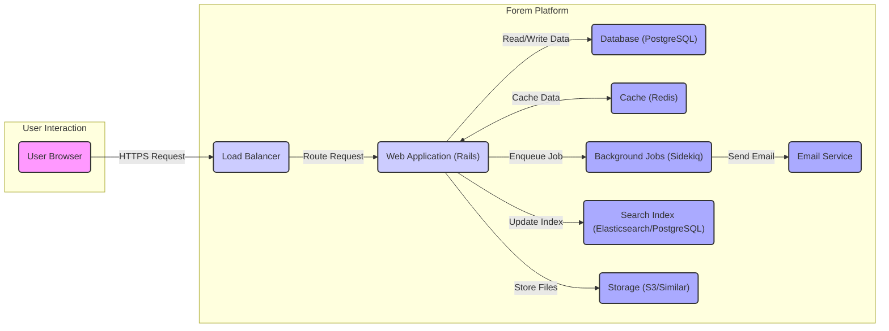
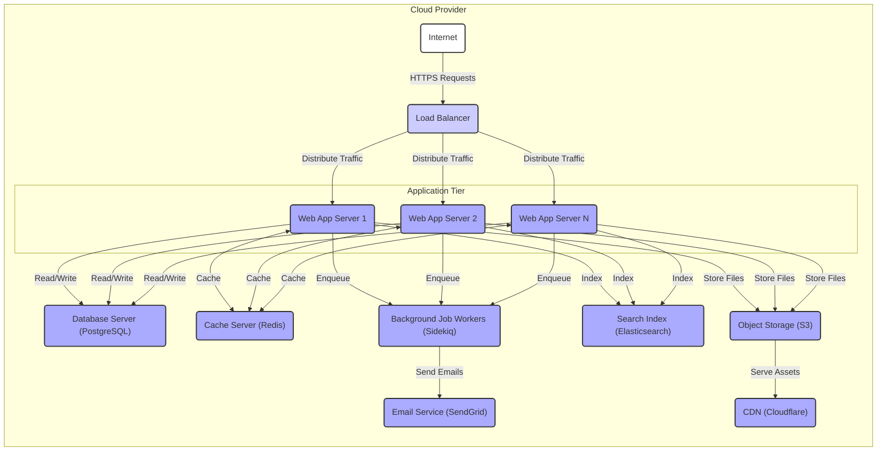

# Project Design Document: Forem Platform

**Project Name:** Forem

**Project Repository:** [https://github.com/forem/forem](https://github.com/forem/forem)

**Document Version:** 1.1

**Date:** October 26, 2023

**Author:** AI Software Architect

## 1. Introduction

This document provides a detailed architectural design of the Forem platform, an open-source platform for building online communities. This document is intended to serve as a foundational resource for subsequent threat modeling activities. It offers a comprehensive overview of the system's components, data flow, and underlying technologies, providing the necessary context for identifying potential security vulnerabilities.

## 2. Project Overview

Forem is a multifaceted platform engineered for the creation and management of online communities. Its feature set encompasses user account management, diverse content creation capabilities (including articles and discussions), rich social interaction features (comments, likes, follows, reactions), and robust community moderation tools. The platform's design emphasizes extensibility and customization, allowing for tailoring to specific community needs.

## 3. System Architecture

The Forem platform adopts a traditional, primarily monolithic web application architecture, characterized by a clear separation of concerns across distinct layers.

*   **Presentation Layer:** Responsible for rendering the user interface and managing user interactions. This layer predominantly uses server-side rendered HTML, enhanced with JavaScript for dynamic user interface elements and interactive features.
*   **Application Layer:** Encompasses the core business logic, request routing, and primary functionalities of the platform. This layer is implemented using the Ruby on Rails framework, adhering to the Model-View-Controller (MVC) architectural pattern.
*   **Data Layer:** Manages the persistence and retrieval of data. This layer primarily interacts with a relational database management system, specifically PostgreSQL, for structured data storage.
*   **Background Processing Layer:** Handles asynchronous tasks that do not require immediate user interaction. This includes operations like sending emails, processing notifications, and executing scheduled jobs. This functionality is typically managed by a background job processing system, commonly Sidekiq.

## 4. Key Components

This section provides a more granular breakdown of the major components within the Forem platform.

*   **User Management Subsystem:**
    *   **Authentication Service:** Handles user registration, login procedures, session management, and authentication using various methods (e.g., email/password, OAuth providers like GitHub, Twitter).
    *   **Authorization Service:** Manages user permissions, roles, and access control to different features and resources within the platform.
    *   **Profile Management:** Allows users to create and manage their profiles, including personal information, settings, and preferences.
*   **Content Management Subsystem:**
    *   **Editor Interface:** Provides a rich text editor (likely using Markdown or a WYSIWYG editor) for creating various content types.
    *   **Content Storage:** Manages the storage of different content types (articles, questions, polls, listings) in the database.
    *   **Taxonomy Management:** Handles tagging, categorization, and organization of content for discoverability.
    *   **Content Moderation Tools:** Provides tools for community moderators to manage and curate content, including flagging, editing, and deleting.
*   **Social Interaction Subsystem:**
    *   **Comment System:** Enables users to post and manage comments on content.
    *   **Reaction System:** Allows users to express reactions (likes, dislikes, etc.) to content and comments.
    *   **Follow/Friend System:** Implements user following and follower relationships.
    *   **Notification Service:** Generates and delivers notifications to users based on their activity and preferences.
*   **Community Features Subsystem:**
    *   **Community Creation and Management:** Enables the creation and configuration of individual communities or organizations within the platform.
    *   **Role-Based Access Control (Community Level):** Allows for defining specific roles and permissions within each community.
    *   **Community Moderation Tools:** Provides community-specific moderation capabilities.
*   **Search Functionality Subsystem:**
    *   **Indexing Service:** Responsible for indexing content and user data for efficient searching. Likely utilizes Elasticsearch or PostgreSQL's full-text search capabilities.
    *   **Search API:** Provides an interface for querying the search index.
    *   **Search UI Components:** Integrates search functionality into the user interface.
*   **Notification System Subsystem:**
    *   **Notification Generation:** Creates notifications based on various events within the platform.
    *   **Notification Delivery:** Handles the delivery of notifications through different channels (in-app, email, potentially push notifications).
    *   **Notification Preferences:** Allows users to customize their notification settings.
*   **Admin Interface Subsystem:**
    *   **User Management (Admin):** Provides administrative tools for managing user accounts.
    *   **Content Management (Admin):** Allows administrators to manage platform-wide content.
    *   **Settings Management:** Enables configuration of platform-wide settings.
    *   **Analytics and Reporting:** Provides insights into platform usage and activity.
*   **API (Application Programming Interface) Subsystem:**
    *   **RESTful API Endpoints:** Offers a set of RESTful endpoints for programmatic access to platform features and data.
    *   **Authentication and Authorization (API):**  Manages authentication and authorization for API requests (e.g., API keys, OAuth).
    *   **API Documentation:** Provides documentation for available API endpoints and usage.
*   **Background Jobs Subsystem:**
    *   **Job Queue:** Manages a queue of asynchronous tasks (e.g., using Redis with Sidekiq).
    *   **Worker Processes:** Executes the tasks in the job queue.
    *   **Scheduled Jobs:** Handles tasks that need to be executed at specific intervals (e.g., sending daily digests).
*   **Caching Layer Subsystem:**
    *   **Data Caching:** Caches frequently accessed data in memory (likely using Redis) to improve performance.
    *   **Fragment Caching:** Caches rendered HTML fragments.
    *   **Page Caching:** Caches entire rendered pages.
*   **Storage Subsystem:**
    *   **File Upload Handling:** Manages the uploading of user files (images, attachments).
    *   **Object Storage Integration:** Integrates with cloud storage services like AWS S3 or similar for storing uploaded files.
    *   **Asset Management:** Potentially includes features for managing and optimizing static assets.

## 5. Data Flow

The following details the data flow for several key user interactions within the Forem platform.

*   **User Authentication via Email/Password:**
    *   User enters email and password in the login form within the "User Browser".
    *   The "User Browser" sends an HTTPS POST request to the "Load Balancer".
    *   The "Load Balancer" routes the request to an available "Web Application (Rails)" instance.
    *   The "Web Application (Rails)" authenticates the user by comparing the provided password with the hashed password stored in the "Database (PostgreSQL)".
    *   Upon successful authentication, the "Web Application (Rails)" creates a session, storing session data (e.g., user ID) in the "Cache (Redis)" and setting a session cookie in the "User Browser".
    *   The "Web Application (Rails)" redirects the "User Browser" to the authenticated area.

*   **Content Creation (Article Submission):**
    *   User navigates to the content creation page in the "User Browser".
    *   User enters the article content, title, and tags using the editor.
    *   The "User Browser" sends an HTTPS POST request to the "Load Balancer".
    *   The "Load Balancer" routes the request to a "Web Application (Rails)" instance.
    *   The "Web Application (Rails)" validates the submitted data.
    *   The "Web Application (Rails)" saves the article content, metadata, and relationships (tags, author) to the "Database (PostgreSQL)".
    *   The "Web Application (Rails)" enqueues a background job in "Background Jobs (Sidekiq)" to update the "Search Index (Elasticsearch/PostgreSQL)".
    *   The "Web Application (Rails)" may also enqueue a background job to send notifications to relevant users (e.g., followers).
    *   If the user uploads images, the "Web Application (Rails)" interacts with "Storage (S3/Similar)" to store the files and updates the database with the file locations.

*   **Viewing an Article:**
    *   User clicks a link to view an article in the "User Browser".
    *   The "User Browser" sends an HTTP GET request to the "Load Balancer".
    *   The "Load Balancer" routes the request to a "Web Application (Rails)" instance.
    *   The "Web Application (Rails)" retrieves the article content from the "Database (PostgreSQL)".
    *   The "Web Application (Rails)" may retrieve related data from the "Cache (Redis)" to improve performance (e.g., user information, cached article snippets).
    *   The "Web Application (Rails)" renders the HTML page and sends it back to the "User Browser".

*   **Adding a Comment to an Article:**
    *   User enters a comment in the comment form within the "User Browser".
    *   The "User Browser" sends an HTTPS POST request to the "Load Balancer".
    *   The "Load Balancer" routes the request to a "Web Application (Rails)" instance.
    *   The "Web Application (Rails)" validates the comment content.
    *   The "Web Application (Rails)" saves the comment to the "Database (PostgreSQL)", associating it with the article and the user.
    *   The "Web Application (Rails)" enqueues a background job in "Background Jobs (Sidekiq)" to send notifications to the article author and other users who have commented on the article.

## 6. Technology Stack

*   **Core Programming Language:** Ruby (Likely using a specific version, e.g., Ruby 3.x)
*   **Web Application Framework:** Ruby on Rails (Likely a specific version, e.g., Rails 7.x)
*   **Relational Database:** PostgreSQL (Likely a specific version, e.g., PostgreSQL 14 or 15) with potential extensions like `pg_trgm` for fuzzy searching.
*   **In-Memory Data Store/Cache:** Redis (Likely a specific version, e.g., Redis 6 or 7) used for session storage, caching frequently accessed data, and as a message broker for background jobs.
*   **Background Job Processing:** Sidekiq (or potentially another system like Resque) for asynchronous task processing, often relying on Redis as a job queue.
*   **Search Engine:** Elasticsearch (or potentially PostgreSQL's built-in full-text search) for indexing and searching content and users. If using Elasticsearch, likely a specific version (e.g., Elasticsearch 7 or 8).
*   **Frontend Technologies:** HTML, CSS (potentially using a framework like Tailwind CSS or Bootstrap), JavaScript (potentially using a framework like Stimulus.js or React for specific interactive components).
*   **Testing Frameworks:** RSpec (for backend testing), potentially Jest or similar for frontend testing.
*   **Containerization:** Docker for packaging and deploying the application and its dependencies.
*   **Orchestration:** Potentially Kubernetes for managing containerized deployments at scale.
*   **Cloud Provider:**  Likely deployed on a major cloud provider such as AWS, Google Cloud Platform (GCP), or Azure.
*   **Email Delivery:**  Integration with third-party email services like SendGrid, Mailgun, or Amazon SES.

## 7. Deployment Architecture

A typical deployment of Forem in a cloud environment would involve the following components, potentially orchestrated using Kubernetes:

*   **Load Balancer(s):** Distribute incoming HTTPS traffic across multiple "Web Application Servers". These could be managed services provided by the cloud provider (e.g., AWS ELB/ALB, Google Cloud Load Balancing).
*   **Web Application Servers (Containers/VMs):** Run instances of the Ruby on Rails application. These are typically deployed as containers orchestrated by Kubernetes or as virtual machines. Auto-scaling is often implemented to handle varying traffic loads.
*   **Database Server (Managed Service/Dedicated Instance):** A managed PostgreSQL service (e.g., AWS RDS, Google Cloud SQL) or a dedicated PostgreSQL instance, often configured with replication for high availability and backups.
*   **Cache Cluster (Managed Service/Dedicated Instances):** A managed Redis service (e.g., AWS ElastiCache, Google Cloud Memorystore) or a cluster of dedicated Redis instances for caching and session management.
*   **Background Job Workers (Containers/VMs):**  Run instances of Sidekiq workers to process background jobs. These are often deployed as separate containers or processes.
*   **Search Index Cluster (Managed Service/Dedicated Instances):** If using Elasticsearch, a managed Elasticsearch service (e.g., AWS Elasticsearch Service, Google Cloud Elasticsearch) or a cluster of dedicated Elasticsearch nodes.
*   **Object Storage (Cloud Service):**  A scalable object storage service like AWS S3, Google Cloud Storage, or Azure Blob Storage for storing user-uploaded files and static assets.
*   **Email Service Integration (Cloud Service):** Integration with a third-party email service like SendGrid, Mailgun, or Amazon SES for reliable email delivery.
*   **Content Delivery Network (CDN):**  A CDN (e.g., Cloudflare, AWS CloudFront) to cache static assets and improve load times for users globally.

## 8. Security Considerations (Detailed)

This section expands on the initial security considerations, providing more specific examples and potential threats.

*   **Authentication and Authorization:**
    *   **Threats:** Brute-force attacks on login forms, credential stuffing, session hijacking, privilege escalation.
    *   **Mitigations:** Strong password policies, multi-factor authentication (MFA), rate limiting login attempts, secure session management (using HTTPOnly and Secure cookies), robust authorization checks at the application layer.
*   **Input Validation:**
    *   **Threats:** SQL injection, cross-site scripting (XSS), command injection, path traversal.
    *   **Mitigations:**  Sanitize and validate all user inputs on the server-side, use parameterized queries for database interactions, implement appropriate output encoding to prevent XSS, avoid direct execution of user-provided commands.
*   **Data Protection:**
    *   **Threats:** Data breaches, unauthorized access to sensitive data, exposure of personal information.
    *   **Mitigations:**  Encrypt sensitive data at rest (e.g., using database encryption features) and in transit (using HTTPS), implement access control lists (ACLs) to restrict access to data, regularly audit data access logs.
*   **Session Management:**
    *   **Threats:** Session fixation, session hijacking.
    *   **Mitigations:**  Generate strong, unpredictable session IDs, regenerate session IDs after login, set appropriate session timeout values, use secure cookies (HTTPOnly and Secure flags).
*   **Cross-Site Scripting (XSS) Prevention:**
    *   **Threats:**  Stealing user credentials, redirecting users to malicious sites, defacing the website.
    *   **Mitigations:** Implement Content Security Policy (CSP) headers, use appropriate output encoding based on the context (HTML escaping, JavaScript escaping, URL escaping).
*   **Cross-Site Request Forgery (CSRF) Prevention:**
    *   **Threats:**  Unauthorized actions performed on behalf of authenticated users.
    *   **Mitigations:** Implement CSRF tokens (e.g., using Rails' built-in functionality), use the SameSite cookie attribute.
*   **Dependency Management:**
    *   **Threats:** Exploiting known vulnerabilities in third-party libraries and dependencies.
    *   **Mitigations:** Regularly update dependencies to the latest secure versions, use dependency scanning tools to identify vulnerabilities.
*   **Rate Limiting:**
    *   **Threats:** Denial-of-service (DoS) attacks, brute-force attacks.
    *   **Mitigations:** Implement rate limits on API endpoints, login attempts, and other critical actions.
*   **Security Headers:**
    *   **Threats:** Various browser-based attacks.
    *   **Mitigations:** Configure security headers like Content Security Policy (CSP), HTTP Strict Transport Security (HSTS), X-Content-Type-Options, X-Frame-Options, and Referrer-Policy.
*   **Regular Security Audits and Penetration Testing:**
    *   **Threats:** Undiscovered vulnerabilities in the codebase and infrastructure.
    *   **Mitigations:** Conduct regular security audits and penetration testing by qualified professionals to identify and address potential weaknesses.

## 9. Conclusion

This enhanced design document provides a more detailed and comprehensive overview of the Forem platform's architecture, components, and data flow. The added granularity in the descriptions of key components, data flows, and the technology stack, along with the expanded security considerations, makes this document a more robust foundation for conducting thorough threat modeling activities. The inclusion of deployment architecture details and more specific technology versions further enhances its value for security analysis.