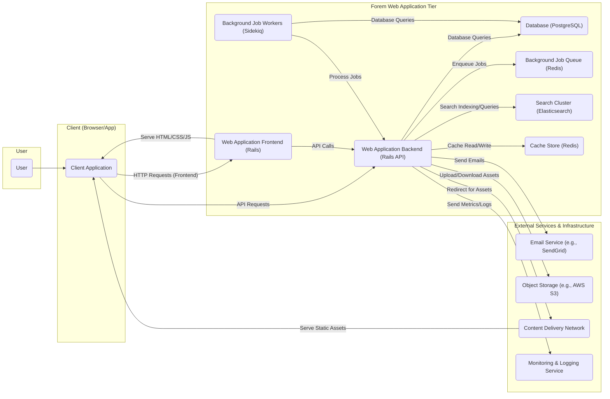

## Project Design Document: Forem Platform (Improved)

**1. Introduction**

This document provides an enhanced architectural design of the Forem platform, based on the open-source project available at https://github.com/forem/forem. This detailed design serves as a crucial artifact for subsequent threat modeling activities, offering a comprehensive overview of the system's components, their interactions, and the flow of data.

**2. Project Overview**

Forem is a versatile, open-source platform designed for building and fostering online communities. Its feature set encompasses tools for creating blogs, discussion forums, podcast hosting, and various other forms of online engagement. The platform's architecture emphasizes flexibility and extensibility, enabling customization and integration with a wide range of external services.

**3. High-Level Architecture**

**4. Component Breakdown**

*   **User:**  Represents any individual interacting with the Forem platform. This includes both authenticated members and anonymous visitors browsing public content.
*   **Client Application (Browser/App):** The user interface through which users access and interact with the Forem platform. This can be a web browser rendering the frontend or a native mobile application communicating with the backend API.
*   **Forem Web Application Tier:** This tier encompasses the core logic and functionality of the Forem platform, further divided into:
    *   **Web Application Frontend (Rails):** Responsible for rendering the user interface (HTML, CSS, JavaScript), handling user interactions, and making API calls to the backend.
    *   **Web Application Backend (Rails API):**  Provides the API endpoints for the frontend and other potential clients. It handles business logic, data validation, authentication, and authorization.
    *   **Database (PostgreSQL):** The primary persistent data store for the platform, housing:
        *   User accounts and profiles, including authentication credentials.
        *   All forms of content (articles, comments, forum posts, etc.).
        *   Relationships between users, content, and communities.
        *   Platform configuration and settings.
    *   **Background Job Queue (Redis):** A message broker used to queue asynchronous tasks for processing.
    *   **Background Job Workers (Sidekiq):**  Processes tasks from the background job queue. These tasks include:
        *   Sending transactional and notification emails.
        *   Processing and optimizing image uploads.
        *   Updating search indexes in Elasticsearch.
        *   Performing scheduled maintenance and data processing tasks.
    *   **Search Cluster (Elasticsearch):** Provides robust full-text search capabilities across all content within the Forem platform, enabling users to efficiently find relevant information.
    *   **Cache Store (Redis):** An in-memory data store used for caching frequently accessed data to improve application performance and reduce load on the database. This includes:
        *   Fragment caching of rendered HTML.
        *   Object caching of database records.
        *   Session data storage.
*   **External Services & Infrastructure:** Services external to the core application that provide essential functionalities:
    *   **Email Service (e.g., SendGrid):** A third-party service responsible for sending emails, including user registration confirmations, notifications, and password resets.
    *   **Object Storage (e.g., AWS S3):**  Stores user-uploaded media assets (images, videos, etc.) securely and scalably.
    *   **Content Delivery Network (CDN):** A geographically distributed network of servers that caches static assets (images, CSS, JavaScript) to deliver content to users with low latency.
    *   **Monitoring & Logging Service:**  Collects and analyzes application logs and performance metrics, providing insights into system health and potential issues.

**5. Data Flow (Detailed)**

A typical user interaction and data flow within the Forem platform can be broken down as follows:

*   **User Interaction:** A **User** interacts with the **Client Application** (e.g., browsing a blog post, submitting a comment, updating their profile).
*   **Frontend Request:** The **Client Application** sends **HTTP Requests (Frontend)** to the **Web Application Frontend (Rails)** for initial page loads and rendering. For dynamic interactions and data retrieval, it sends **API Requests** to the **Web Application Backend (Rails API)**.
*   **Backend Processing:**
    *   The **Web Application Frontend (Rails)** may make **API Calls** to the **Web Application Backend (Rails API)** to fetch data or trigger actions.
    *   The **Web Application Backend (Rails API)** receives the request and performs necessary actions, which may involve:
        *   **Database Interaction:** Executing **Database Queries** against the **Database (PostgreSQL)** to retrieve, create, update, or delete data.
        *   **Caching:** Reading from or writing to the **Cache Store (Redis)** to improve performance.
        *   **Search Operations:** Interacting with the **Search Cluster (Elasticsearch)** for indexing new content or executing search queries.
        *   **Background Job Enqueueing:**  Enqueuing tasks into the **Background Job Queue (Redis)** for asynchronous processing.
        *   **External Service Communication:**  Communicating with **External Services** such as the **Email Service** to send emails or the **Object Storage** to upload or download files.
*   **Background Job Processing:** **Background Job Workers (Sidekiq)** retrieve tasks from the **Background Job Queue (Redis)** and process them. This may involve further **Database Queries** or interactions with other services.
*   **Asset Delivery:** The **Content Delivery Network (CDN)** serves static assets directly to the **Client Application**, reducing the load on the web application servers. The **Web Application Backend (Rails API)** may redirect the **Client Application** to the **CDN** for accessing specific assets.
*   **Frontend Rendering:** The **Web Application Frontend (Rails)** serves the initial HTML, CSS, and JavaScript to the **Client Application**.
*   **Monitoring and Logging:** The **Web Application Backend (Rails API)** sends **Metrics/Logs** to the **Monitoring & Logging Service** for analysis and alerting.
*   **Response to User:** The **Web Application Backend (Rails API)** sends responses back to the **Client Application**, which then updates the user interface accordingly.

**6. Key Technologies**

*   **Primary Programming Language:** Ruby
*   **Web Application Framework:** Ruby on Rails (with a likely separation of concerns between frontend and backend within the framework)
*   **Relational Database:** PostgreSQL
*   **Background Job Processing:** Redis (for queueing), Sidekiq (for workers)
*   **Search Engine:** Elasticsearch
*   **Caching Mechanism:** Redis
*   **Frontend Technologies:** HTML, CSS, JavaScript (likely utilizing a modern JavaScript framework or library like React, Vue.js, or similar)
*   **Email Delivery Service:**  Examples include SendGrid, Mailgun, Postmark
*   **Object Storage Service:** Examples include AWS S3, Google Cloud Storage, Azure Blob Storage
*   **Content Delivery Network Service:** Examples include Cloudflare, AWS CloudFront, Fastly
*   **Monitoring and Logging:**  Likely utilizing services like Prometheus, Grafana, ELK stack (Elasticsearch, Logstash, Kibana), or cloud provider equivalents.

**7. Security Considerations (Detailed)**

This section expands on the initial security considerations, providing more specific areas of focus for threat modeling:

*   **Authentication and Authorization:**
    *   Secure user registration and login processes.
    *   Robust session management to prevent session hijacking.
    *   Role-based access control (RBAC) to manage user permissions and prevent unauthorized access to resources and functionalities.
    *   Multi-factor authentication (MFA) to enhance account security.
*   **Input Validation and Output Encoding:**
    *   Thorough validation of all user inputs on both the client and server sides to prevent injection attacks (e.g., SQL injection, cross-site scripting (XSS), command injection).
    *   Proper encoding of output data to prevent XSS vulnerabilities.
*   **Data Protection (Confidentiality and Integrity):**
    *   Encryption of sensitive data at rest (e.g., using database encryption) and in transit (e.g., using HTTPS/TLS).
    *   Regular security audits and penetration testing to identify potential vulnerabilities.
    *   Secure handling of personally identifiable information (PII) in compliance with relevant regulations (e.g., GDPR, CCPA).
*   **Rate Limiting and Abuse Prevention:**
    *   Implementation of rate limiting to prevent denial-of-service (DoS) attacks and brute-force attempts.
    *   Mechanisms to detect and mitigate bot activity and spam.
*   **Dependency Management and Vulnerability Scanning:**
    *   Regularly updating dependencies to patch known security vulnerabilities.
    *   Utilizing dependency scanning tools to identify and address vulnerable libraries.
*   **Secure File Uploads:**
    *   Validation of file types and sizes to prevent malicious uploads.
    *   Sanitization of uploaded files to remove potential threats.
    *   Storing uploaded files securely and serving them through a separate domain or CDN to mitigate potential XSS risks.
*   **API Security:**
    *   Secure authentication and authorization for API endpoints (e.g., using OAuth 2.0).
    *   Input validation and output encoding for API requests and responses.
    *   Rate limiting for API endpoints.
*   **Infrastructure Security:**
    *   Secure configuration of servers and network infrastructure.
    *   Regular security patching of operating systems and other infrastructure components.
    *   Firewall configurations to restrict access to services.
*   **Third-Party Integrations:**
    *   Careful evaluation of the security posture of integrated third-party services.
    *   Secure configuration of integrations and adherence to security best practices.
    *   Regularly reviewing permissions granted to third-party services.

**8. Conclusion**

This improved design document provides a more detailed and comprehensive understanding of the Forem platform's architecture, enhancing its value for threat modeling activities. By outlining the various components, their interactions, and the flow of data with greater precision, this document facilitates a more thorough identification of potential security vulnerabilities and the development of effective mitigation strategies.