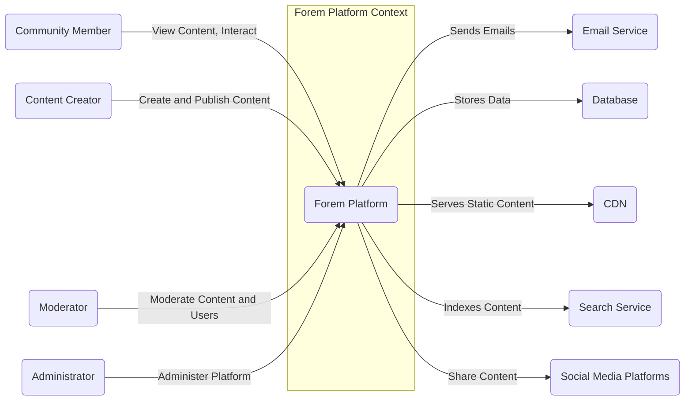
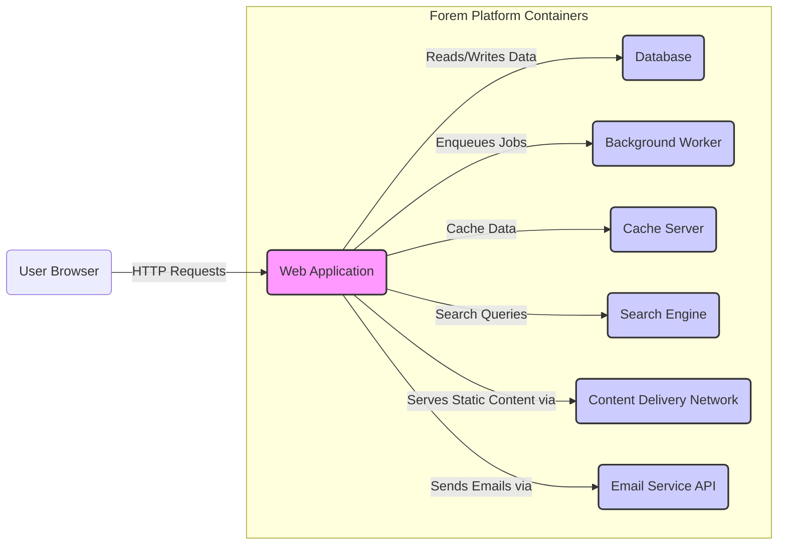
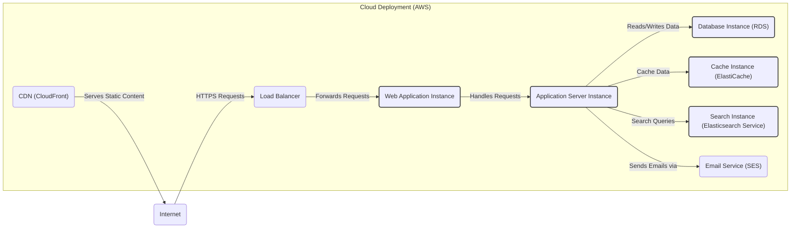
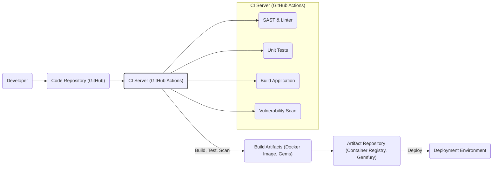

# BUSINESS POSTURE

- Business Priorities and Goals:
 - Provide a platform for communities to connect, share content, and engage in discussions.
 - Enable content creators to publish articles, tutorials, and other forms of content.
 - Foster a vibrant and active community around shared interests.
 - Offer a customizable and extensible platform for diverse community needs.
 - Potentially monetize the platform through advertising, premium features, or community subscriptions in the future.
- Business Risks:
 - Data breaches compromising user data and content.
 - Platform unavailability impacting community engagement and trust.
 - Content moderation failures leading to negative user experiences and reputational damage.
 - Security vulnerabilities exploited to disrupt the platform or gain unauthorized access.
 - Legal and compliance risks related to data privacy and content regulations.

# SECURITY POSTURE

- Existing Security Controls:
 - security control: Code Reviews - Implemented as part of the open-source development process on GitHub, ensuring community scrutiny and peer review of code changes.
 - security control: Dependency Scanning - Likely employed to identify known vulnerabilities in third-party libraries and dependencies used by the project.
 - security control: Authentication and Authorization - Implemented within the application to manage user access and permissions, details are within application code.
 - security control: Input Validation - Framework level input validation provided by Ruby on Rails framework, and custom validation logic within the application code.
 - security control: HTTPS - Enforced for all web traffic to protect data in transit, configured at the web server and potentially CDN level.
- Accepted Risks:
 - accepted risk: Potential vulnerabilities introduced by community contributions that may not be immediately identified.
 - accepted risk: Reliance on the open-source community for timely security patches and updates of dependencies.
 - accepted risk: Risk of undiscovered vulnerabilities in the codebase due to its complexity and scale.
- Recommended Security Controls:
 - security control: Implement a Web Application Firewall (WAF) - To protect against common web attacks such as SQL injection, cross-site scripting (XSS), and DDoS attacks.
 - security control: Regular Penetration Testing - Conduct periodic professional security assessments to identify and remediate vulnerabilities proactively.
 - security control: Security Awareness Training - Provide security training for developers and maintainers to promote secure coding practices and awareness of security threats.
 - security control: Implement a robust Incident Response Plan - Define procedures for handling security incidents, including detection, containment, eradication, recovery, and post-incident analysis.
 - security control: Implement static and dynamic application security testing (SAST/DAST) in the CI/CD pipeline to automatically identify vulnerabilities early in the development lifecycle.
- Security Requirements:
 - Authentication:
  - Requirement: Secure user authentication mechanisms to verify user identities.
  - Requirement: Consider multi-factor authentication (MFA) for enhanced security, especially for administrators and moderators.
  - Requirement: Implement session management to securely handle user sessions and prevent session hijacking.
 - Authorization:
  - Requirement: Role-based access control (RBAC) to manage user permissions and access to features and data based on their roles (e.g., admin, moderator, user).
  - Requirement: Implement granular authorization checks to ensure users can only access resources they are permitted to access.
 - Input Validation:
  - Requirement: Comprehensive input validation on all user inputs to prevent injection attacks (e.g., SQL injection, XSS, command injection).
  - Requirement: Sanitize user-generated content to mitigate the risk of stored XSS vulnerabilities.
 - Cryptography:
  - Requirement: Encryption of sensitive data at rest, such as user credentials and personal information, in the database.
  - Requirement: Encryption of sensitive data in transit using HTTPS for all communication channels.
  - Requirement: Securely manage cryptographic keys and ensure proper key rotation.

# DESIGN

- C4 CONTEXT

- C4 CONTEXT Elements:
 - Element:
  - Name: Forem Platform
  - Type: Software System
  - Description: The community platform itself, providing features for content creation, user interaction, and community management.
  - Responsibilities:
   - Manage user accounts and authentication.
   - Store and serve content (articles, discussions, etc.).
   - Facilitate user interactions (comments, reactions, etc.).
   - Moderate content and users.
   - Administer the platform settings and configurations.
  - Security controls:
   - Security control: Authentication and authorization mechanisms.
   - Security control: Input validation and output encoding.
   - Security control: Data encryption at rest and in transit.
   - Security control: Logging and monitoring of security events.
 - Element:
  - Name: Community Member
  - Type: Person
  - Description: Users who browse content, participate in discussions, and interact with the community.
  - Responsibilities:
   - Consume content provided by the platform.
   - Engage in discussions and interactions with other members.
   - Report inappropriate content or behavior.
  - Security controls:
   - Security control: Strong password management.
   - Security control: Awareness of phishing and social engineering attacks.
 - Element:
  - Name: Content Creator
  - Type: Person
  - Description: Users who create and publish content on the platform, such as articles, tutorials, and discussions.
  - Responsibilities:
   - Create and publish high-quality content.
   - Engage with the community around their content.
   - Adhere to platform content guidelines.
  - Security controls:
   - Security control: Secure account management.
   - Security control: Awareness of content security best practices.
 - Element:
  - Name: Moderator
  - Type: Person
  - Description: Users responsible for maintaining community standards, moderating content, and managing user behavior.
  - Responsibilities:
   - Review and moderate user-generated content.
   - Enforce community guidelines and policies.
   - Manage user reports and disputes.
  - Security controls:
   - Security control: Strong multi-factor authentication for moderator accounts.
   - Security control: Audit logging of moderation actions.
 - Element:
  - Name: Administrator
  - Type: Person
  - Description: Users with full administrative access to the platform, responsible for platform configuration, maintenance, and security.
  - Responsibilities:
   - Configure and manage platform settings.
   - Monitor platform performance and security.
   - Manage user accounts and permissions.
   - Apply security updates and patches.
  - Security controls:
   - Security control: Strong multi-factor authentication for administrator accounts.
   - Security control: Role-based access control to limit administrative privileges.
   - Security control: Comprehensive audit logging of administrative actions.
 - Element:
  - Name: Email Service
  - Type: External System
  - Description: An external service used by the platform to send emails, such as transactional emails, notifications, and newsletters.
  - Responsibilities:
   - Send emails on behalf of the platform.
   - Ensure email deliverability and reliability.
  - Security controls:
   - Security control: Secure API integration with the platform.
   - Security control: Data encryption in transit.
 - Element:
  - Name: Database
  - Type: External System
  - Description: A database system used to store platform data, including user accounts, content, and community information.
  - Responsibilities:
   - Persist platform data.
   - Ensure data integrity and availability.
   - Provide data access to the platform.
  - Security controls:
   - Security control: Access control to the database.
   - Security control: Data encryption at rest.
   - Security control: Regular database backups.
 - Element:
  - Name: CDN
  - Type: External System
  - Description: A Content Delivery Network used to cache and serve static content, improving performance and availability.
  - Responsibilities:
   - Cache and serve static assets (images, CSS, JavaScript).
   - Improve platform performance and reduce latency.
   - Protect against DDoS attacks.
  - Security controls:
   - Security control: HTTPS for content delivery.
   - Security control: DDoS protection.
 - Element:
  - Name: Search Service
  - Type: External System
  - Description: An external search service used to index platform content and provide search functionality to users.
  - Responsibilities:
   - Index platform content for search.
   - Provide search API for the platform.
   - Ensure search relevance and performance.
  - Security controls:
   - Security control: Secure API integration with the platform.
   - Security control: Access control to search indexes.
 - Element:
  - Name: Social Media Platforms
  - Type: External System
  - Description: External social media platforms where users can share content from the Forem platform.
  - Responsibilities:
   - Enable content sharing to social media.
   - Drive traffic back to the Forem platform.
  - Security controls:
   - Security control: Secure sharing mechanisms.
   - Security control: Link integrity and prevention of malicious redirects.

- C4 CONTAINER

- C4 CONTAINER Elements:
 - Element:
  - Name: Web Application
  - Type: Container
  - Description: Ruby on Rails application that handles user requests, business logic, and presentation. It's the primary interface for users and interacts with other containers.
  - Responsibilities:
   - Handle HTTP requests from users.
   - Implement application business logic.
   - Render user interfaces (HTML, API responses).
   - Authenticate and authorize users.
   - Interact with the database, background worker, cache, search engine, CDN, and email service.
  - Security controls:
   - Security control: Web Application Firewall (WAF) in front of the application.
   - Security control: Input validation and output encoding within the application code.
   - Security control: Secure session management.
   - Security control: Regular security updates of the Rails framework and dependencies.
 - Element:
  - Name: Database
  - Type: Container
  - Description: PostgreSQL database used for persistent storage of application data, including user accounts, content, settings, and other platform information.
  - Responsibilities:
   - Store and retrieve application data.
   - Ensure data integrity and consistency.
   - Provide data persistence for the web application.
  - Security controls:
   - Security control: Database access control lists (ACLs) to restrict access.
   - Security control: Database user authentication and authorization.
   - Security control: Data encryption at rest using database encryption features.
   - Security control: Regular database backups and disaster recovery plan.
 - Element:
  - Name: Background Worker
  - Type: Container
  - Description: Background job processing system (e.g., Sidekiq) used to handle asynchronous tasks, such as sending emails, processing content, and performing background updates.
  - Responsibilities:
   - Process background jobs enqueued by the web application.
   - Handle asynchronous tasks efficiently.
   - Improve web application responsiveness by offloading tasks.
  - Security controls:
   - Security control: Secure job processing to prevent job queue poisoning.
   - Security control: Monitoring and logging of background job execution.
   - Security control: Access control to the background worker system.
 - Element:
  - Name: Cache Server
  - Type: Container
  - Description: In-memory cache (e.g., Redis or Memcached) used to store frequently accessed data to improve application performance and reduce database load.
  - Responsibilities:
   - Cache frequently accessed data.
   - Reduce database query load.
   - Improve application response times.
  - Security controls:
   - Security control: Access control to the cache server.
   - Security control: Secure configuration of the cache server.
   - Security control: Consider encryption for sensitive data in cache if necessary.
 - Element:
  - Name: Search Engine
  - Type: Container
  - Description: Search engine (e.g., Elasticsearch) used to index platform content and provide search functionality.
  - Responsibilities:
   - Index platform content for efficient searching.
   - Provide search API for the web application.
   - Enable users to search for content within the platform.
  - Security controls:
   - Security control: Access control to the search engine.
   - Security control: Secure API integration with the web application.
   - Security control: Data sanitization before indexing to prevent injection attacks.
 - Element:
  - Name: Content Delivery Network (CDN)
  - Type: Container
  - Description: CDN (e.g., Cloudflare) used to serve static assets (images, CSS, JavaScript) to users from geographically distributed servers.
  - Responsibilities:
   - Serve static content efficiently.
   - Reduce latency for users worldwide.
   - Provide DDoS protection and other security features.
  - Security controls:
   - Security control: HTTPS for content delivery.
   - Security control: CDN security configurations (e.g., origin protection).
   - Security control: DDoS mitigation provided by the CDN.
 - Element:
  - Name: Email Service API
  - Type: Container
  - Description: API of an external email service (e.g., SendGrid, Mailgun) used by the web application to send emails.
  - Responsibilities:
   - Send transactional emails, notifications, and newsletters.
   - Ensure email deliverability and tracking.
  - Security controls:
   - Security control: Secure API key management and storage.
   - Security control: Rate limiting to prevent abuse.
   - Security control: TLS encryption for API communication.

- DEPLOYMENT

- Deployment Options:
 - Option 1: Cloud-based deployment (AWS, GCP, Azure) using managed services.
 - Option 2: On-premises deployment on virtual machines or bare metal servers.
 - Option 3: Hybrid deployment combining cloud and on-premises infrastructure.

- Detailed Deployment (Cloud-based - Option 1):

- DEPLOYMENT Elements:
 - Element:
  - Name: Load Balancer
  - Type: Infrastructure
  - Description: Distributes incoming traffic across multiple web application instances for high availability and scalability.
  - Responsibilities:
   - Load balancing incoming HTTP/HTTPS requests.
   - Health checks for web application instances.
   - SSL/TLS termination.
  - Security controls:
   - Security control: DDoS protection provided by cloud provider.
   - Security control: Web Application Firewall (WAF) integration.
   - Security control: Access control to load balancer management interface.
 - Element:
  - Name: Web Application Instance
  - Type: Infrastructure
  - Description: Virtual machines or containers running the web application code, handling user requests and business logic.
  - Responsibilities:
   - Run the web application code.
   - Process user requests.
   - Interact with other backend services.
  - Security controls:
   - Security control: Security hardening of operating system and application environment.
   - Security control: Regular patching and updates.
   - Security control: Instance-level firewalls to restrict network access.
 - Element:
  - Name: Application Server Instance
  - Type: Infrastructure
  - Description: Virtual machines or containers that support the web application execution environment (e.g., Ruby runtime, application server). In some deployments, web and application server functions might be combined in the same instance.
  - Responsibilities:
   - Provide runtime environment for the web application.
   - Execute application code.
  - Security controls:
   - Security control: Security hardening of operating system and runtime environment.
   - Security control: Regular patching and updates.
   - Security control: Instance-level firewalls.
 - Element:
  - Name: Database Instance (RDS)
  - Type: Infrastructure
  - Description: Managed database service (e.g., AWS RDS for PostgreSQL) providing a scalable and reliable database backend.
  - Responsibilities:
   - Host the application database.
   - Manage database backups and replication.
   - Ensure database performance and availability.
  - Security controls:
   - Security control: Database access control and security groups.
   - Security control: Data encryption at rest and in transit.
   - Security control: Regular database backups and point-in-time recovery.
 - Element:
  - Name: Cache Instance (ElastiCache)
  - Type: Infrastructure
  - Description: Managed cache service (e.g., AWS ElastiCache for Redis) providing in-memory caching for improved performance.
  - Responsibilities:
   - Provide caching service for the application.
   - Improve application response times.
  - Security controls:
   - Security control: Access control to the cache service.
   - Security control: Secure configuration of the cache service.
   - Security control: Encryption for sensitive data in cache if required.
 - Element:
  - Name: Search Instance (Elasticsearch Service)
  - Type: Infrastructure
  - Description: Managed search service (e.g., AWS Elasticsearch Service) providing search functionality.
  - Responsibilities:
   - Host the search index.
   - Provide search API for the application.
  - Security controls:
   - Security control: Access control to the search service.
   - Security control: Secure API access.
 - Element:
  - Name: CDN (CloudFront)
  - Type: Infrastructure
  - Description: Managed CDN service (e.g., AWS CloudFront) for serving static content globally.
  - Responsibilities:
   - Serve static assets from edge locations.
   - Improve content delivery performance.
   - Provide DDoS protection.
  - Security controls:
   - Security control: CDN security policies and configurations.
   - Security control: HTTPS for content delivery.
 - Element:
  - Name: Email Service (SES)
  - Type: Infrastructure
  - Description: Managed email service (e.g., AWS SES) for sending emails.
  - Responsibilities:
   - Send emails on behalf of the application.
   - Manage email delivery and reputation.
  - Security controls:
   - Security control: Secure API credentials management.
   - Security control: Email sending policies and rate limits.

- BUILD

- BUILD Elements:
 - Element:
  - Name: Developer
  - Type: Person
  - Description: Software developers who write, modify, and commit code to the repository.
  - Responsibilities:
   - Write and maintain code.
   - Commit code changes to the code repository.
   - Participate in code reviews.
  - Security controls:
   - Security control: Secure development practices training.
   - Security control: Secure coding guidelines.
   - Security control: Local development environment security.
 - Element:
  - Name: Code Repository (GitHub)
  - Type: Tool/Service
  - Description: Git repository hosted on GitHub, used for version control and collaboration.
  - Responsibilities:
   - Store source code and version history.
   - Manage code branches and merges.
   - Trigger CI/CD pipelines on code changes.
  - Security controls:
   - Security control: Access control to the repository.
   - Security control: Branch protection rules.
   - Security control: Audit logging of repository actions.
 - Element:
  - Name: CI Server (GitHub Actions)
  - Type: Tool/Service
  - Description: Continuous Integration server (GitHub Actions) that automates the build, test, and security scanning process.
  - Responsibilities:
   - Automate build process.
   - Run unit tests and integration tests.
   - Perform static analysis security testing (SAST) and linting.
   - Scan for vulnerabilities in dependencies.
   - Build and package application artifacts.
  - Security controls:
   - Security control: Secure CI/CD pipeline configuration.
   - Security control: Secrets management for CI/CD credentials.
   - Security control: Audit logging of CI/CD pipeline execution.
 - Element:
  - Name: SAST & Linter
  - Type: Tool/Service
  - Description: Static Application Security Testing (SAST) tools and linters used to analyze code for potential security vulnerabilities and code quality issues.
  - Responsibilities:
   - Identify potential security vulnerabilities in the code.
   - Enforce coding standards and best practices.
   - Provide feedback to developers on code quality and security.
  - Security controls:
   - Security control: Regularly updated SAST tools and linters.
   - Security control: Configuration of SAST tools to match security requirements.
 - Element:
  - Name: Unit Tests
  - Type: Process
  - Description: Automated unit tests to verify the functionality of individual code components.
  - Responsibilities:
   - Ensure code functionality and correctness.
   - Detect regressions in code changes.
  - Security controls:
   - Security control: Focus on testing security-relevant functionalities.
 - Element:
  - Name: Build Application
  - Type: Process
  - Description: Compilation and packaging of the application code into deployable artifacts.
  - Responsibilities:
   - Compile code.
   - Package application dependencies.
   - Create deployable artifacts (e.g., Docker images, Gems).
  - Security controls:
   - Security control: Secure build environment.
   - Security control: Dependency management and vulnerability scanning.
 - Element:
  - Name: Vulnerability Scan
  - Type: Tool/Service
  - Description: Scans build artifacts and dependencies for known vulnerabilities.
  - Responsibilities:
   - Identify known vulnerabilities in dependencies and build artifacts.
   - Generate vulnerability reports.
  - Security controls:
   - Security control: Regularly updated vulnerability databases.
   - Security control: Automated vulnerability scanning in CI/CD pipeline.
 - Element:
  - Name: Build Artifacts (Docker Image, Gems)
  - Type: Artifact
  - Description: Deployable packages of the application, such as Docker images and Ruby Gems.
  - Responsibilities:
   - Contain the packaged application code and dependencies.
   - Be ready for deployment to target environments.
  - Security controls:
   - Security control: Signed artifacts to ensure integrity and authenticity.
   - Security control: Minimal artifact size to reduce attack surface.
 - Element:
  - Name: Artifact Repository (Container Registry, Gemfury)
  - Type: Tool/Service
  - Description: Repository for storing and managing build artifacts, such as container images and Gems.
  - Responsibilities:
   - Store and manage build artifacts.
   - Provide access to artifacts for deployment.
  - Security controls:
   - Security control: Access control to the artifact repository.
   - Security control: Vulnerability scanning of stored artifacts.
   - Security control: Audit logging of artifact access and modifications.
 - Element:
  - Name: Deployment Environment
  - Type: Environment
  - Description: Target environment where the application is deployed and running (e.g., cloud environment, on-premises servers).
  - Responsibilities:
   - Run the application.
   - Serve user requests.
  - Security controls:
   - Security control: Secure deployment process.
   - Security control: Runtime environment security controls as described in DEPLOYMENT section.

# RISK ASSESSMENT

- Critical Business Processes:
 - User Registration and Authentication: Essential for platform access and user management.
 - Content Creation and Publishing: Core functionality for content creators and community engagement.
 - Content Access and Delivery: Ensuring users can access and consume content reliably and securely.
 - Community Interaction (Comments, Discussions): Facilitating user engagement and community building.
 - Platform Administration and Configuration: Managing platform settings, users, and security.
- Data to Protect and Sensitivity:
 - User Credentials (Passwords, API Keys): Highly Sensitive - Confidentiality and integrity are critical to prevent unauthorized access.
 - User Profiles (Personal Information, Email Addresses): Sensitive - Confidentiality and integrity are important for user privacy and compliance (GDPR, CCPA).
 - Content (Articles, Discussions, Comments): Sensitive - Integrity and availability are important to maintain platform value and user trust. Some content might contain personal or sensitive information.
 - Community Data (Groups, Relationships, Interactions): Sensitive - Integrity and availability are important for community functionality and user experience.
 - Platform Configuration (Settings, Access Controls): Sensitive - Confidentiality and integrity are crucial to maintain platform security and prevent unauthorized modifications.

# QUESTIONS & ASSUMPTIONS

- BUSINESS POSTURE:
 - Assumption: The primary business goal is to build a thriving online community platform.
 - Assumption: Monetization is a potential future goal but not the immediate priority.
 - Question: What are the key performance indicators (KPIs) for measuring the success of the platform?
 - Question: Are there specific compliance requirements (e.g., GDPR, CCPA, accessibility standards) that the platform needs to adhere to?
- SECURITY POSTURE:
 - Assumption: Standard web application security best practices are intended to be followed.
 - Assumption: The project benefits from community security reviews due to its open-source nature.
 - Question: What is the current security incident response plan, if any?
 - Question: Are there any existing security policies or guidelines that are being followed?
- DESIGN:
 - Assumption: A typical three-tier web application architecture is suitable for this platform.
 - Assumption: Cloud-based deployment is a likely deployment scenario for scalability and manageability.
 - Question: What are the specific technologies chosen for each container (e.g., specific database, cache, search engine)?
 - Question: What is the expected scale of the platform in terms of users and content?