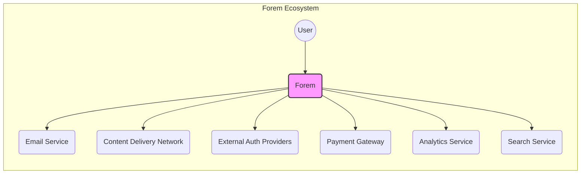
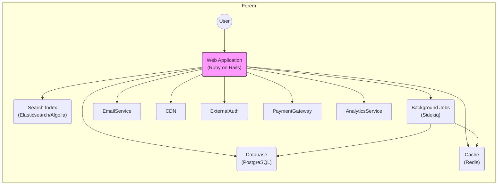
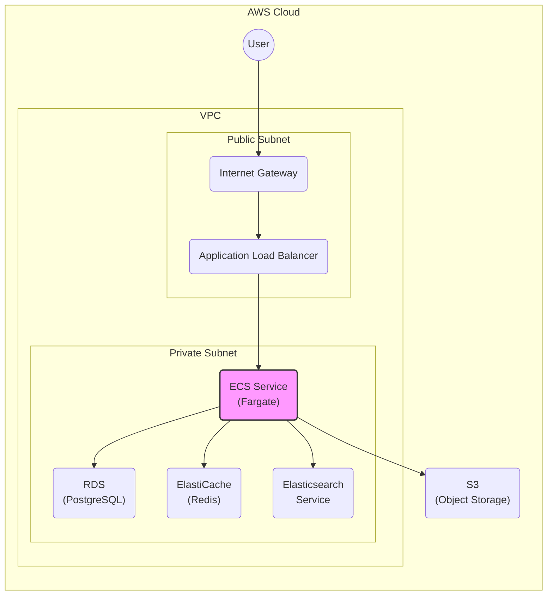
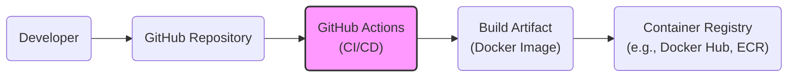

Okay, let's create a design document for the Forem project, focusing on aspects relevant to threat modeling.

# BUSINESS POSTURE

Forem is an open-source platform for building online communities.  It powers dev.to, a large and active community for software developers.  This suggests a business posture that balances openness and community engagement with the need for a stable, secure, and scalable platform.

Priorities and Goals:

*   Foster a thriving and engaged community.
*   Provide a stable and reliable platform for users.
*   Maintain a positive reputation and user trust.
*   Enable continuous development and feature releases.
*   Protect user data and privacy.
*   Attract and retain users and contributors.
*   Monetization through, e.g., ads, partnerships, or premium features (secondary to community building).

Business Risks:

*   Reputational damage due to security breaches or data leaks.
*   Loss of user trust and engagement due to platform instability or security vulnerabilities.
*   Legal and financial repercussions from data breaches or non-compliance with privacy regulations.
*   Compromise of user accounts and potential for malicious activity.
*   Service disruption due to denial-of-service attacks or infrastructure failures.
*   Intellectual property theft or unauthorized access to source code.
*   Exposure of sensitive internal data or configurations.
*   Supply chain attacks through compromised dependencies.

# SECURITY POSTURE

Existing Security Controls (based on the GitHub repository and common practices):

*   security control: Authentication: User authentication via Devise gem (likely with email/password, and potentially social logins).
    *   Implemented in: `app/models/user.rb` and related Devise configuration files.
*   security control: Authorization: Role-based access control (RBAC) using Pundit gem, defining user permissions.
    *   Implemented in: `app/policies` directory.
*   security control: Input Validation: Rails' built-in model validations and strong parameters to sanitize user inputs.
    *   Implemented in: Models (e.g., `app/models/article.rb`) and controllers.
*   security control: Output Encoding: Rails' built-in mechanisms to prevent Cross-Site Scripting (XSS) by escaping HTML output.
    *   Implemented in: Views (ERB templates).
*   security control: Session Management: Secure session management using Rails' default session store (likely cookies with appropriate security flags).
    *   Implemented in: Rails configuration (e.g., `config/initializers/session_store.rb`).
*   security control: Dependency Management: Bundler for managing Ruby gem dependencies.
    *   Implemented in: `Gemfile` and `Gemfile.lock`.
*   security control: Static Code Analysis: Rubocop and Brakeman for static code analysis and security checks.
    *   Implemented in: CI/CD pipeline (GitHub Actions).
*   security control: Content Security Policy (CSP): Likely implemented to mitigate XSS and data injection attacks.
    *   Implemented in: HTTP headers (likely configured in Rails application).
*   security control: HTTPS: Enforced HTTPS to encrypt communication between clients and the server.
    *   Implemented in: Web server configuration (e.g., Nginx, Apache) and Rails configuration.
*   security control: Rate Limiting: Likely implemented to prevent abuse and brute-force attacks.
    *   Implemented in: Potentially using Rack::Attack or a similar middleware.
*   security control: Database Security: Secure database configuration (e.g., PostgreSQL) with appropriate access controls.
    *   Implemented in: Database configuration files and deployment scripts.

Accepted Risks:

*   accepted risk: Reliance on third-party services (e.g., cloud providers, CDNs, external APIs) introduces potential security dependencies.
*   accepted risk: Open-source nature exposes the codebase to potential scrutiny and vulnerability discovery by malicious actors (but also benefits from community contributions to security).
*   accepted risk: Complexity of the platform and its features increases the attack surface.
*   accepted risk: User-generated content (articles, comments) poses a risk of malicious content injection (e.g., XSS, phishing links).

Recommended Security Controls:

*   Implement a robust Web Application Firewall (WAF) to protect against common web attacks.
*   Regularly conduct penetration testing and vulnerability assessments.
*   Implement a comprehensive security monitoring and alerting system.
*   Establish a formal security incident response plan.
*   Implement Software Composition Analysis (SCA) to identify and manage vulnerabilities in third-party dependencies.
*   Consider implementing Multi-Factor Authentication (MFA) for enhanced user account security.
*   Implement robust logging and auditing of security-relevant events.

Security Requirements:

*   Authentication:
    *   Strong password policies (length, complexity, expiration).
    *   Secure password reset mechanisms.
    *   Protection against brute-force attacks.
    *   Option for multi-factor authentication (MFA).
*   Authorization:
    *   Fine-grained access control to resources based on user roles and permissions.
    *   Principle of least privilege (users should only have access to what they need).
    *   Regular review and auditing of user permissions.
*   Input Validation:
    *   Strict validation of all user inputs on both client-side and server-side.
    *   Whitelisting of allowed characters and formats.
    *   Protection against SQL injection, cross-site scripting (XSS), and other injection attacks.
*   Cryptography:
    *   Use of strong, industry-standard cryptographic algorithms and libraries.
    *   Secure storage of sensitive data (e.g., passwords, API keys) using hashing and encryption.
    *   Proper key management practices.
    *   Secure communication using HTTPS (TLS/SSL).

# DESIGN

## C4 CONTEXT

Element List:

*   Element:
    *   Name: User
    *   Type: Person
    *   Description: A person who interacts with the Forem platform, either as a reader, writer, or administrator.
    *   Responsibilities: Reading articles, writing articles, commenting, interacting with other users, managing their profile.
    *   Security controls: Authentication, authorization, session management, input validation, output encoding.

*   Element:
    *   Name: Forem
    *   Type: Software System
    *   Description: The core Forem application, providing the platform for community interaction.
    *   Responsibilities: Handling user requests, managing content, enforcing access control, interacting with external services.
    *   Security controls: All listed security controls apply to the Forem application.

*   Element:
    *   Name: Email Service
    *   Type: External System
    *   Description: A third-party service used for sending emails (e.g., notifications, password resets).
    *   Responsibilities: Sending emails on behalf of Forem.
    *   Security controls: Secure communication (TLS), API key protection.

*   Element:
    *   Name: CDN
    *   Type: External System
    *   Description: A content delivery network used for serving static assets (e.g., images, CSS, JavaScript).
    *   Responsibilities: Caching and delivering static content to users.
    *   Security controls: HTTPS, access controls.

*   Element:
    *   Name: External Auth Providers
    *   Type: External System
    *   Description: Third-party authentication providers (e.g., GitHub, Twitter, Google).
    *   Responsibilities: Authenticating users via OAuth or similar protocols.
    *   Security controls: Secure communication (TLS), OAuth protocol security.

*   Element:
    *   Name: Payment Gateway
    *   Type: External System
    *   Description: A third-party service for processing payments (if applicable).
    *   Responsibilities: Handling payment transactions securely.
    *   Security controls: PCI DSS compliance, secure communication (TLS), tokenization.

*   Element:
    *   Name: Analytics Service
    *   Type: External System
    *   Description: A third-party service for collecting and analyzing platform usage data.
    *   Responsibilities: Tracking user activity and providing analytics.
    *   Security controls: Data privacy compliance, secure communication (TLS).

*   Element:
    *   Name: Search Service
    *   Type: External System/Internal System
    *   Description: Service used for indexing and searching content. Could be external (e.g., Algolia, Elasticsearch) or internal.
    *   Responsibilities: Providing search functionality.
    *   Security controls: Access controls, input sanitization, secure communication.

## C4 CONTAINER

Element List:

*   Element:
    *   Name: Web Application (Ruby on Rails)
    *   Type: Web Application
    *   Description: The main application serving user requests, handling business logic, and interacting with other components.
    *   Responsibilities: User interface, request handling, authentication, authorization, content management.
    *   Security controls: All listed security controls apply to the web application.

*   Element:
    *   Name: Database (PostgreSQL)
    *   Type: Database
    *   Description: The primary data store for user data, content, and other persistent information.
    *   Responsibilities: Storing and retrieving data.
    *   Security controls: Database access controls, encryption at rest (if applicable), regular backups.

*   Element:
    *   Name: Cache (Redis)
    *   Type: Cache
    *   Description: An in-memory data store used for caching frequently accessed data to improve performance.
    *   Responsibilities: Caching data.
    *   Security controls: Access controls, data encryption (if applicable).

*   Element:
    *   Name: Search Index (Elasticsearch/Algolia)
    *   Type: Search Index
    *   Description: An index used for fast and efficient searching of content.
    *   Responsibilities: Indexing and searching content.
    *   Security controls: Access controls, input sanitization.

*   Element:
    *   Name: Background Jobs (Sidekiq)
    *   Type: Background Processor
    *   Description: A component for processing asynchronous tasks (e.g., sending emails, processing images).
    *   Responsibilities: Executing background tasks.
    *   Security controls: Secure communication with other components, input validation.

*   Element:
    *   Name: Email Service, CDN, External Auth, Payment Gateway, Analytics Service
    *   Type: External System
    *   Description: External services.
    *   Responsibilities: Described in C4 Context.
    *   Security controls: Described in C4 Context.

## DEPLOYMENT

Possible Deployment Solutions:

1.  Heroku: A Platform-as-a-Service (PaaS) provider.
2.  AWS: Using services like EC2, ECS, or EKS.
3.  DigitalOcean: Using Droplets (virtual machines).
4.  Self-hosted: On-premises servers or a private cloud.

Chosen Solution (for detailed description): AWS ECS/Fargate

Element List:

*   Element:
    *   Name: User
    *   Type: Person
    *   Description: Described in C4 Context.
    *   Responsibilities: Described in C4 Context.
    *   Security controls: Described in C4 Context.

*   Element:
    *   Name: Internet Gateway
    *   Type: Networking Component
    *   Description: Provides internet access to the VPC.
    *   Responsibilities: Routing traffic between the VPC and the internet.
    *   Security controls: AWS security groups and network ACLs.

*   Element:
    *   Name: Application Load Balancer
    *   Type: Load Balancer
    *   Description: Distributes incoming traffic across multiple instances of the Forem application.
    *   Responsibilities: Load balancing, SSL termination.
    *   Security controls: AWS security groups, SSL/TLS certificates.

*   Element:
    *   Name: ECS Service (Fargate)
    *   Type: Container Orchestration Service
    *   Description: Manages the deployment and scaling of the Forem application containers.
    *   Responsibilities: Running and managing the application containers.
    *   Security controls: IAM roles and policies, security groups, network isolation.

*   Element:
    *   Name: RDS (PostgreSQL)
    *   Type: Database Service
    *   Description: Managed PostgreSQL database service.
    *   Responsibilities: Providing a managed database instance.
    *   Security controls: Database access controls, encryption at rest, regular backups, IAM roles.

*   Element:
    *   Name: ElastiCache (Redis)
    *   Type: Cache Service
    *   Description: Managed Redis cache service.
    *   Responsibilities: Providing a managed cache instance.
    *   Security controls: Access controls, data encryption (if applicable), IAM roles.

*   Element:
    *   Name: Elasticsearch Service
    *   Type: Search Service
    *   Description: Managed Elasticsearch service.
    *   Responsibilities: Providing a managed search index.
    *   Security controls: Access controls, input sanitization, IAM roles.

*   Element:
    *   Name: S3 (Object Storage)
    *   Type: Storage Service
    *   Description: Used for storing static assets (e.g., user uploads).
    *   Responsibilities: Storing and serving static files.
    *   Security controls: S3 bucket policies, access controls, encryption at rest.

## BUILD

Build Process Description:

1.  Developer pushes code changes to the GitHub repository.
2.  GitHub Actions triggers a workflow based on the push event.
3.  The workflow performs the following steps:
    *   Checks out the code.
    *   Sets up the build environment (e.g., Ruby, Node.js).
    *   Installs dependencies (using Bundler and Yarn).
    *   Runs linters (e.g., Rubocop, ESLint).
    *   Runs static analysis security tools (e.g., Brakeman).
    *   Runs tests (e.g., RSpec, Jest).
    *   Builds a Docker image containing the application.
    *   Pushes the Docker image to a container registry (e.g., Docker Hub, Amazon ECR).
4.  The deployment process (described above) pulls the latest Docker image from the registry and deploys it to the target environment.

Security Controls:

*   security control: Code Review: Pull requests and code reviews before merging changes.
*   security control: Static Analysis: Automated static code analysis using Rubocop and Brakeman.
*   security control: Dependency Scanning: Regular scanning for vulnerabilities in dependencies.
*   security control: Secure Build Environment: Using GitHub Actions with appropriate security configurations.
*   security control: Image Signing: (Recommended) Signing Docker images to ensure integrity.
*   security control: Least Privilege: Build process should have minimal necessary permissions.

# RISK ASSESSMENT

Critical Business Processes:

*   User registration and authentication.
*   Content creation and publishing.
*   Community interaction (commenting, discussions).
*   User data management.
*   Platform administration.

Data Sensitivity:

*   User Personally Identifiable Information (PII): Email addresses, usernames, profile information, IP addresses (High sensitivity).
*   User-generated content (articles, comments): May contain sensitive information or intellectual property (Medium sensitivity).
*   Authentication credentials (passwords): Hashed and salted, but still highly sensitive (High sensitivity).
*   Session data: Contains information about user sessions (Medium sensitivity).
*   Internal configuration data: API keys, database credentials (High sensitivity).
*   Usage analytics data: May contain information about user behavior (Medium sensitivity).

# QUESTIONS & ASSUMPTIONS

Questions:

*   What specific third-party services are used (e.g., email provider, CDN, analytics)?
*   What are the specific requirements for data retention and deletion?
*   What are the existing incident response procedures?
*   Is there a bug bounty program or vulnerability disclosure policy?
*   What is the current level of security awareness training for developers and administrators?
*   Are there any specific compliance requirements (e.g., GDPR, CCPA)?
*   What is the process for managing secrets (e.g., API keys, database credentials)?
*   How is user-generated content moderated and reviewed for malicious content?

Assumptions:

*   BUSINESS POSTURE: The primary goal is community building, with monetization as a secondary concern.
*   SECURITY POSTURE: Basic security controls are in place, but there is room for improvement.
*   DESIGN: The application follows a standard Rails architecture with common components. The deployment uses a cloud-based infrastructure (AWS). The build process uses GitHub Actions.