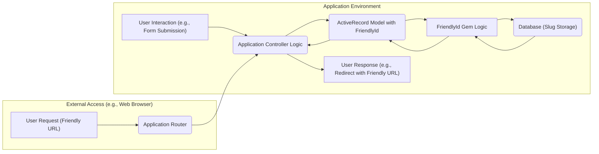

# Project Design Document: FriendlyId Gem Integration

**Version:** 1.1
**Date:** October 26, 2023
**Author:** Gemini (AI Language Model)

## 1. Introduction

This document details the design for integrating the `friendly_id` Ruby gem (version 6.x or later, based on the repository: [https://github.com/norman/friendly_id](https://github.com/norman/friendly_id)) into an application. Its primary purpose is to clearly define the architecture and data flow related to `friendly_id`, providing a foundation for subsequent threat modeling activities.

## 2. Goals and Non-Goals

**Goals:**

*   Implement user-friendly and SEO-optimized URLs for application resources using slugs.
*   Enable efficient retrieval of records using these generated friendly IDs.
*   Maintain the uniqueness of slugs within defined model scopes to prevent conflicts.
*   Allow for flexible customization of slug generation rules and the tracking of slug changes.
*   Establish a well-defined system architecture to facilitate comprehensive security analysis.

**Non-Goals:**

*   In-depth implementation specifics of the application utilizing `friendly_id`. The focus remains on the `friendly_id` integration itself.
*   Performance evaluation or optimization strategies related to `friendly_id`.
*   Specific user interface or user experience design considerations for friendly IDs.
*   Detailed code examples illustrating the application's usage of `friendly_id`.

## 3. High-Level Architecture

This section illustrates the key components and their interactions within the system when `friendly_id` is employed.

**Components:**

*   **User Interaction (e.g., Form Submission):** An action initiated by a user that triggers data creation or modification.
*   **Application Controller Logic:** The application code handling user requests and orchestrating interactions with models.
*   **ActiveRecord Model with FriendlyId:**  An ActiveRecord model that has incorporated the `FriendlyId` functionality.
*   **FriendlyId Gem Logic:** The core logic provided by the `friendly_id` gem for slug generation, management, and lookup.
*   **Database (Slug Storage):** The persistent storage where application data, including the generated slugs, is stored.
*   **User Response (e.g., Redirect with Friendly URL):** The application's response to the user's action, potentially including the newly generated or existing friendly ID in the URL.
*   **External Access (e.g., Web Browser):** An external entity, such as a web browser, that interacts with the application, potentially using friendly URLs.
*   **Application Router:** The component responsible for interpreting incoming requests (including those with friendly URLs) and directing them to the appropriate controller action.

**Data Flow:**

1. When a user action necessitates a friendly ID (e.g., creating a new product), the application controller interacts with the relevant ActiveRecord model.
2. The model, having included `FriendlyId`, delegates the task of slug generation and management to the `FriendlyId` gem.
3. The `FriendlyId` gem generates a slug based on the configured source attribute(s) and options (e.g., parameterizing the product name).
4. The generated slug is persisted in the designated database column (typically `slug`) alongside the model's other attributes.
5. When a user requests a resource using a friendly URL, the application router identifies the request.
6. The router directs the request to the appropriate controller action.
7. The controller action utilizes `FriendlyId`'s finder methods (e.g., `Product.friendly.find('product-slug')`) to retrieve the corresponding record from the database based on the provided slug.

## 4. Detailed Design

This section provides a more granular view of the key aspects of the `friendly_id` integration.

### 4.1. Model Integration Details

*   **Inclusion Mechanism:** The `friendly_id` gem is included within ActiveRecord models that require friendly URLs using the `extend FriendlyId` directive.
    *   Example: `class Article < ApplicationRecord; extend FriendlyId; friendly_id :title, use: :slugged; end`
*   **Dedicated Slug Column:** A specific database column (conventionally named `slug`) is utilized to store the generated friendly ID for each record.
*   **Source Attribute Definition:** The attribute(s) from which the slug is derived are explicitly defined within the model.
    *   Example: `friendly_id :name, use: :slugged` (slug generated from the `name` attribute).
    *   Example: `friendly_id [:category, :name], use: :slugged, sequence_separator: '-'` (slug generated from `category` and `name`).
*   **Configuration Options:** Various options are available to customize `friendly_id`'s behavior:
    *   `:slugged`: Enables the core slug generation functionality.
    *   `:history`:  Activates the tracking of slug changes, allowing records to be found by their old slugs.
    *   `:scoped`: Enforces slug uniqueness within the context of a specified association.
    *   `sequence_separator`: Defines the character used to separate the base slug from the sequence number when ensuring uniqueness (e.g., `-`, `_`).
    *   `reserved_words`:  Specifies a list of words that cannot be used as slugs, preventing conflicts with application routes or other reserved terms.
    *   `slug_generator_class`: Allows the use of a custom class to implement specific slug generation logic.

### 4.2. Detailed Slug Generation Process

*   **Initiation:** Slug generation is triggered when a new record is created or when the value of the designated source attribute is updated.
*   **Parameterization Step:** The value of the source attribute is processed to create a URL-friendly string by removing special characters, converting to lowercase, and replacing spaces with hyphens (or the configured separator).
*   **Uniqueness Verification:** The `FriendlyId` gem queries the database to check if a slug with the same value already exists within the model's scope (if a scope is defined).
*   **Sequence Appending (for Uniqueness):** If the generated slug is not unique, a sequential number is appended to the slug until a unique value is found. The `sequence_separator` option determines how the number is appended.
*   **Historical Slug Management (Optional):** If the `:history` option is enabled, when a slug changes, the old slug is recorded in a separate `slugs` table, preserving the ability to find the record using the previous URL.

### 4.3. Finding Records Using Friendly IDs

*   **`friendly.find()` Method:** This is the primary method provided by `friendly_id` for locating records based on their friendly ID.
*   **Lookup Procedure:** When `friendly.find()` is called, it first attempts to locate a record where the `slug` column exactly matches the provided friendly ID.
*   **Historical Slug Lookup (Conditional):** If the `:history` option is active and the initial lookup fails, `friendly.find()` then queries the `slugs` table to find a match for the provided slug, potentially retrieving a record based on an older slug.
*   **Exception Handling:** If no matching record is found (either by the current slug or a historical slug), an `ActiveRecord::RecordNotFound` exception is typically raised, indicating that the requested resource could not be found.

### 4.4. Scoped Slug Implementation (Optional)

*   **Scope Definition:** The `scope` option allows you to define an association with another model, making slugs unique only within the context of that associated record.
    *   Example: `friendly_id :title, use: :scoped, scope: :blog_post` (slugs are unique within the scope of a specific `BlogPost`).
*   **Uniqueness Constraint:** When using scoped slugs, the uniqueness check during slug generation considers the value of the foreign key associated with the specified scope.

### 4.5. Slug History Management (Optional)

*   **`slugs` Table Structure:** A dedicated database table (typically named `slugs`) is used to store the history of slugs for models that have the `:history` option enabled.
*   **Data Elements:** This table typically includes columns such as:
    *   `slug`: The historical slug value.
    *   `sluggable_id`: The ID of the associated record.
    *   `sluggable_type`: The type of the associated record (using Single Table Inheritance if applicable).
    *   `created_at`:  Timestamp indicating when the slug was created.
    *   `is_current`: A boolean flag indicating if this is the currently active slug for the record.
*   **Retrieval by Historical Slug:** The `friendly.find()` method leverages the `slugs` table to locate records even if the user provides an outdated friendly ID.

## 5. Security Considerations for Threat Modeling

This section outlines potential security considerations related to the `friendly_id` integration, serving as input for subsequent threat modeling exercises.

*   **Predictable Slug Generation:** If the logic for generating slugs is easily predictable (e.g., simply incrementing numbers), attackers might be able to guess valid slugs and access resources without authorization.
    *   **Example Threat:** An attacker could iterate through sequential IDs to discover private documents or user profiles.
    *   **Mitigation:** Use less predictable source attributes or incorporate randomness into the slug generation process.
*   **Slug Collision Vulnerabilities:** While `friendly_id` aims for uniqueness, flaws in its implementation or database constraints could lead to slug collisions, potentially causing data integrity issues or unauthorized access.
    *   **Example Threat:** Two different users might end up with the same slug for their profiles, leading to one user accessing the other's information.
    *   **Mitigation:** Thoroughly review the `friendly_id` gem's code for potential race conditions or logic errors in uniqueness checks. Ensure appropriate database constraints are in place.
*   **Information Disclosure via Slugs:** If sensitive information is directly included in the slug source attribute, it could be inadvertently exposed in URLs.
    *   **Example Threat:** A user's email address or internal ID might be part of the slug, making it visible in the URL.
    *   **Mitigation:** Carefully select source attributes for slug generation, avoiding the inclusion of PII or other sensitive data.
*   **Denial of Service through Slug Manipulation:** In scenarios where slugs can be influenced by user input (e.g., during record creation or updates), malicious actors could attempt to generate a large number of slugs or excessively long slugs, potentially leading to performance degradation or database overload.
    *   **Example Threat:** An attacker could submit forms with extremely long titles, causing the application to attempt to generate excessively long slugs.
    *   **Mitigation:** Implement input validation and sanitization on any user-provided data that contributes to slug generation. Consider rate limiting or other protective measures.
*   **Security of Slug History Data:** If slug history is enabled, the `slugs` table contains potentially sensitive information about past resource locations. Unauthorized access to this table could reveal information about resource changes or deletions.
    *   **Example Threat:** An attacker gaining access to the `slugs` table could track the history of private documents and potentially access older versions if they are not properly secured.
    *   **Mitigation:** Ensure appropriate access controls are in place for the `slugs` table. Consider the implications of retaining historical slug data.
*   **Bypassing Reserved Words:** If the implementation of the `reserved_words` feature is flawed, attackers might be able to create resources with slugs that conflict with application routes or other reserved terms, potentially leading to unexpected behavior or security vulnerabilities.
    *   **Example Threat:** An attacker could create a user with the slug "admin," potentially interfering with administrative routes.
    *   **Mitigation:** Thoroughly test the `reserved_words` functionality to ensure it cannot be easily bypassed.
*   **Insecure Scopes:** Incorrectly configured scopes could lead to unintended access or manipulation of resources if uniqueness constraints are not properly enforced within the defined scope.
    *   **Example Threat:** If slugs are scoped to a user but the scoping logic is flawed, one user might be able to create resources with slugs intended for another user.
    *   **Mitigation:** Carefully design and implement scoping logic, ensuring that uniqueness is enforced correctly within the intended boundaries.

## 6. Future Considerations

*   **Integration with API Endpoints Security:**  Consider how friendly IDs will be used in API endpoints and the implications for API authentication and authorization mechanisms.
*   **Internationalized Slugs:**  For applications supporting multiple languages, explore strategies for generating and handling slugs that are appropriate for different locales and character sets.
*   **Custom Slug Validation Rules:** Investigate the need for implementing custom validation rules for generated slugs beyond the default functionality provided by `friendly_id`. This could include checks for specific patterns or disallowed characters.
*   **Impact of Soft Deletes:** If the application uses soft deletes, consider how `friendly_id` interacts with soft-deleted records and ensure that slug uniqueness is maintained appropriately, potentially including soft-deleted records in uniqueness checks.

This document provides a detailed design for the integration of the `friendly_id` gem. It serves as a valuable resource for understanding the system's architecture and identifying potential security vulnerabilities during the threat modeling process.
