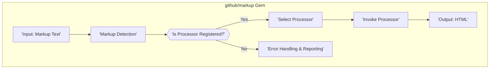
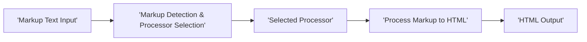
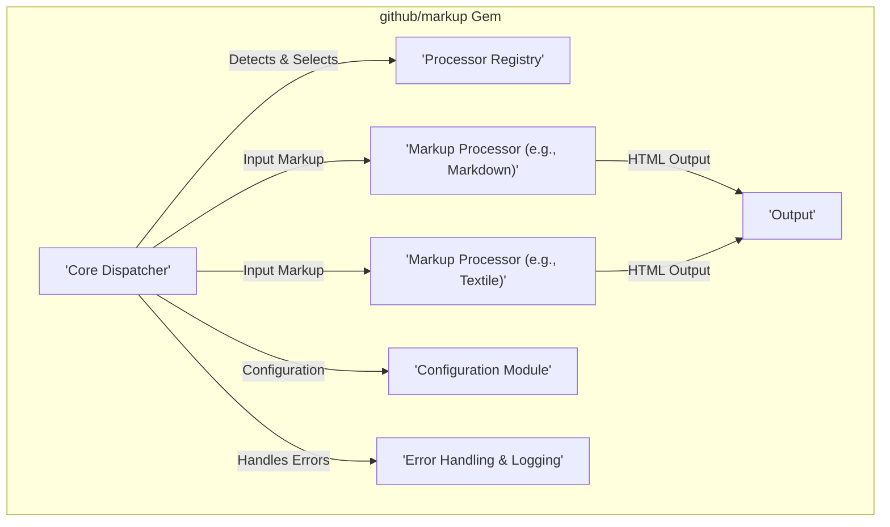

# Project Design Document: github/markup

**Version:** 1.1
**Date:** October 26, 2023
**Author:** AI Software Architect

## 1. Introduction

This document provides a detailed design overview of the `github/markup` project, a Ruby gem responsible for converting various markup languages (like Markdown, Textile, and others) into HTML. This document aims to provide a comprehensive understanding of the system's architecture, data flow, and key components. This detailed design will serve as the foundation for subsequent threat modeling activities, enabling a thorough analysis of potential security vulnerabilities.

## 2. Goals

*   Provide a clear and concise overview of the `github/markup` project's architecture and its internal workings.
*   Identify and describe the key components of the system and their interactions with each other.
*   Detail the flow of data through the system, from input to output.
*   Establish a solid and well-documented foundation for identifying potential security vulnerabilities and attack vectors during threat modeling.

## 3. Non-Goals

*   In-depth, line-by-line code-level implementation specifics of the Ruby gem.
*   Detailed performance benchmarking, optimization strategies, or scalability considerations.
*   Specific deployment or infrastructure details related to how the gem is used in various environments.
*   Comprehensive internal workings of the individual, external markup processors (e.g., the detailed parsing logic within a specific Markdown library).

## 4. System Architecture

The `github/markup` gem operates as a central dispatch mechanism for converting markup text into HTML. It intelligently identifies the input markup language and then delegates the conversion process to the appropriate, registered processor. This modular design allows for easy extension and support of various markup formats.

**Explanation of Architecture Diagram:**

*   **'Input: Markup Text'**: Represents the raw text in a supported markup language that needs to be converted into HTML. This is the starting point of the conversion process.
*   **'Markup Detection'**: This component analyzes the input text, often by examining file extensions, specific header markers within the content, or through configured patterns, to determine the correct markup language.
*   **'Is Processor Registered?'**: A decision point where the gem checks its internal registry to see if a suitable processor is available and registered for the detected markup language.
*   **'Select Processor'**: If a matching processor is found in the registry, this component selects and prepares it for the conversion task.
*   **'Error Handling & Reporting'**: If no processor is registered for the detected markup language, this component handles the error, potentially logging the issue and returning an appropriate error message or a default output.
*   **'Invoke Processor'**: The selected processor is instantiated or called with the input markup text as an argument to perform the actual conversion.
*   **'Output: HTML'**: The selected markup processor generates the corresponding HTML output, which is the final result of the conversion process.

## 5. Data Flow

The data flow within `github/markup` describes the journey of the input markup text as it is transformed into HTML.

*   **Markup Text Input:** The process begins when the `github/markup` gem receives a string containing the markup text. The source of this input can vary:
    *   Reading the content of a file from the file system.
    *   Receiving the markup text as input from another application or service.
    *   Being directly provided as a string within the code.
*   **Markup Language Detection:** The input string is then passed to the markup detection component. This component employs various strategies to identify the markup language:
    *   **File Extension Analysis:** Examining the file extension (e.g., `.md`, `.markdown`, `.textile`).
    *   **Content Inspection:** Looking for specific markers or headers that are characteristic of certain markup languages.
    *   **Configuration Lookup:** Consulting configuration settings that might specify a default or preferred markup language.
*   **Processor Selection and Invocation:** Based on the detected markup language, the core dispatcher selects the appropriate processor from its registry. The input markup text is then passed to the selected processor.
*   **Markup Processing and Conversion:** The selected processor undertakes the task of converting the markup text into HTML. This involves several steps specific to the markup language:
    *   **Parsing:** Analyzing the structure and syntax of the markup text.
    *   **Interpretation:** Applying the rules and conventions of the markup language to interpret the text.
    *   **HTML Generation:** Generating the corresponding HTML tags and attributes based on the parsed markup.
*   **HTML Output:** The markup processor produces an HTML string as the output. This string represents the converted content and is the final result of the `github/markup` gem's processing.

## 6. Components

The `github/markup` gem is composed of several distinct components that work together to achieve the markup conversion.

*   **Core Dispatcher:** This is the central component of the gem, acting as the orchestrator of the conversion process. Its responsibilities include:
    *   Receiving the initial markup text input.
    *   Delegating the task of markup language detection.
    *   Consulting the Processor Registry to find the appropriate processor.
    *   Invoking the selected processor with the input text.
    *   Handling scenarios where no suitable processor is found.
*   **Markup Processors:** These are individual, modular components responsible for the actual conversion of specific markup languages to HTML. Examples include:
    *   **Markdown Processor:**  Utilizes libraries like `kramdown`, `redcarpet`, or `commonmarker` to convert Markdown syntax to HTML.
    *   **Textile Processor:** Handles the conversion of Textile markup to HTML.
    *   **RDoc Processor:**  Processes RDoc markup, often used for Ruby documentation.
    *   **MediaWiki Processor:** Converts MediaWiki syntax to HTML.
    *   **Other Markup Processors:** Support for various other markup languages as needed.
*   **Processor Registry:** This component maintains a list or mapping of supported markup languages and their corresponding processor implementations. It allows the Core Dispatcher to efficiently look up and select the correct processor.
*   **Configuration Module:** This component manages configuration settings that influence the gem's behavior. These settings might include:
    *   Default markup language to use if detection fails.
    *   Specific options or configurations for individual markup processors.
    *   Security-related settings, such as allowed HTML tags or attribute sanitization rules.
*   **Error Handling and Logging:** This component is responsible for managing and reporting errors that occur during the conversion process. This includes:
    *   Handling cases where the markup language cannot be detected.
    *   Dealing with errors raised by the individual markup processors.
    *   Providing mechanisms for logging errors and debugging information.

## 7. Dependencies

The `github/markup` gem relies on other libraries and gems to provide its functionality. Understanding these dependencies is crucial for security analysis as vulnerabilities in these dependencies can also impact `github/markup`. Key dependencies include:

*   **Specific Markup Processing Libraries:**  As mentioned earlier, the individual markup processors often rely on external gems (e.g., `kramdown`, `redcarpet` for Markdown).
*   **Potentially other utility gems:** For tasks like file system access, string manipulation, or logging.

## 8. Security Considerations (Detailed)

This section outlines potential security considerations that will be further investigated during the threat modeling process.

*   **Input Validation Vulnerabilities:**
    *   **Malicious Markup Injection:**  If input validation is insufficient, attackers could inject malicious markup code that, when processed, could lead to Cross-Site Scripting (XSS) vulnerabilities in the output.
    *   **Denial of Service through Complex Markup:**  Crafted input with excessive nesting or computationally expensive markup structures could potentially overwhelm the processors, leading to Denial of Service (DoS).
*   **Output Sanitization Issues:**
    *   **Cross-Site Scripting (XSS):** Failure to properly sanitize the generated HTML output could allow attackers to inject malicious scripts that execute in the context of a user's browser.
    *   **HTML Injection:**  Even without script execution, the injection of arbitrary HTML can alter the appearance and potentially the functionality of a web page.
*   **Vulnerabilities in Markup Processors:**
    *   **Third-Party Library Vulnerabilities:**  The security of `github/markup` is directly tied to the security of the underlying markup processing libraries it uses. Known vulnerabilities in these libraries could be exploited.
    *   **Processor-Specific Bugs:**  Bugs or vulnerabilities within the individual markup processor implementations could be exploited through crafted input.
*   **Code Injection through Processor Exploits:** In extreme cases, vulnerabilities in the markup processors could potentially be exploited to inject and execute arbitrary code on the server.
*   **Path Traversal (Less Likely but Possible):** If the gem interacts with the file system based on user-provided input (e.g., including external files), path traversal vulnerabilities could arise.
*   **Regular Expression Denial of Service (ReDoS):** If the markup processors use regular expressions for parsing, carefully crafted input could exploit inefficient regex patterns, leading to DoS.

## 9. Future Considerations

*   **Pluggable Processor Architecture:**  Formalizing a plugin architecture to allow easier addition of support for new markup languages and potentially community contributions of processors.
*   **Sandboxing or Isolation of Processors:** Implementing mechanisms to isolate the execution of individual markup processors to limit the impact of potential vulnerabilities within a specific processor.
*   **Granular Security Configuration:** Providing more fine-grained control over security settings, such as allowing users to specify allowed HTML tags and attributes on a per-processor basis.
*   ** নিয়মিত Security Audits:**  Establishing a process for regular security audits and vulnerability scanning of the `github/markup` gem and its dependencies.

This improved design document provides a more detailed and structured overview of the `github/markup` project. This enhanced understanding will be invaluable for conducting a comprehensive threat model and identifying potential security risks.