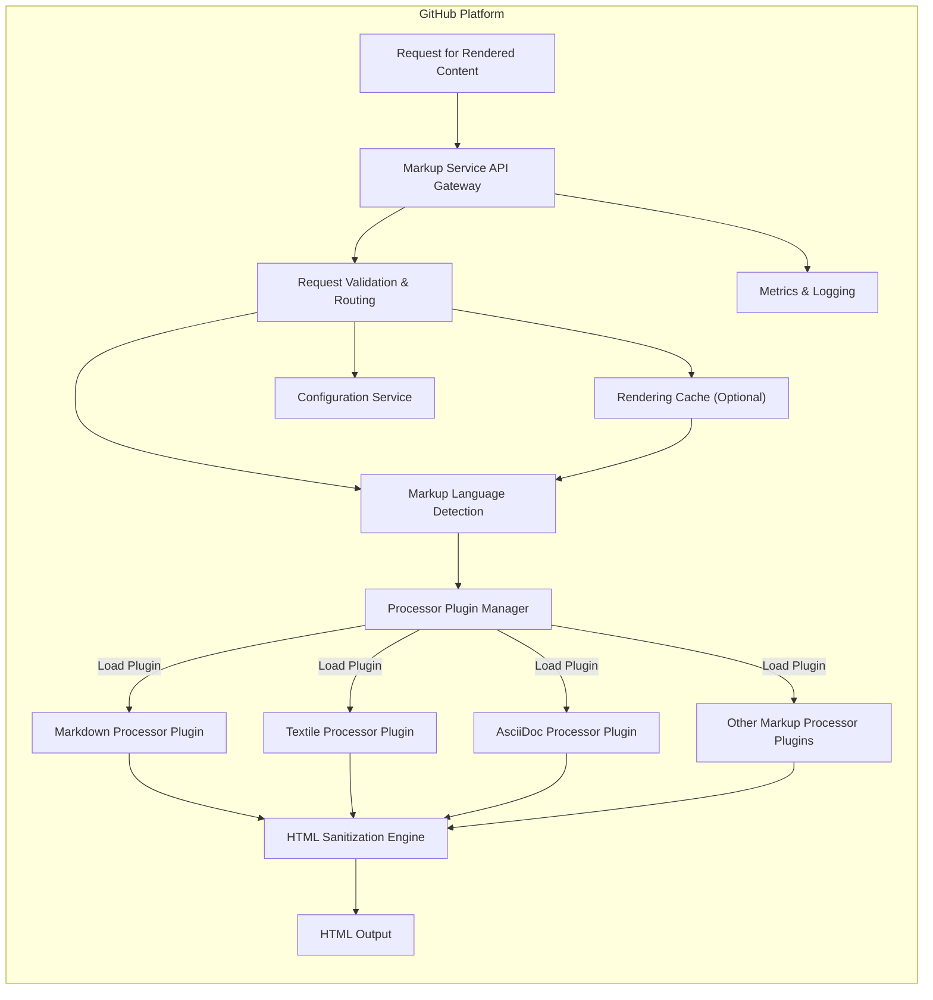
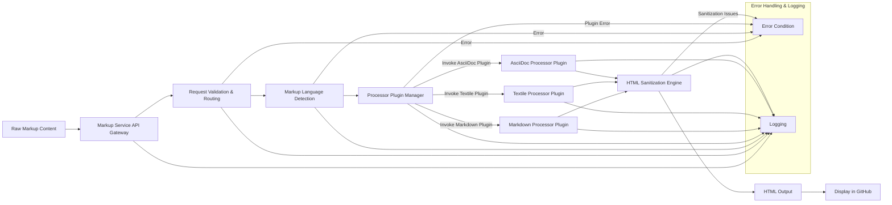

# Project Design Document: GitHub Markup

**Version:** 1.1
**Date:** October 26, 2023
**Author:** AI Software Architect

## 1. Introduction

This document provides an enhanced and detailed design overview of the GitHub Markup project (referenced from [https://github.com/github/markup](https://github.com/github/markup)). This iteration builds upon the initial design by providing more granular details about the system's architecture, component responsibilities, and data flow. The aim remains to create a clear and comprehensive document suitable for subsequent threat modeling activities. This design is based on publicly available information, common software architecture patterns for similar functionalities, and best practices in secure software development.

## 2. Goals and Objectives

The primary goal of the GitHub Markup project is to provide a robust, secure, and efficient service for rendering various markup languages (e.g., Markdown, Textile, AsciiDoc, etc.) into HTML for display within the GitHub platform. Key objectives include:

*   **Comprehensive Language Support:**  Support for a wide and evolving range of common and specialized markup languages.
*   **Platform-Wide Consistency:** Ensure uniform and predictable rendering of markup across all areas of the GitHub platform, including issues, comments, wikis, and code files.
*   **Robust Security Posture:**  Proactively prevent the rendering of malicious or harmful content embedded within user-supplied markup, safeguarding users and the platform.
*   **High Performance and Scalability:**  Process and render markup efficiently with minimal latency, even under heavy load. The system should scale horizontally to accommodate growing demand.
*   **Extensible Architecture:**  Facilitate the straightforward addition of new markup language support and custom rendering behaviors without requiring significant code refactoring.
*   **Maintainable and Testable Codebase:**  Maintain a well-structured, modular, and thoroughly tested codebase to ensure ease of updates, bug fixes, and ongoing development.
*   **Configurability:** Allow for configuration of processing options, security policies, and feature flags.

## 3. System Architecture

The GitHub Markup project likely employs a modular and pluggable architecture, centered around a core rendering service that dispatches processing to specialized language handlers. This design promotes extensibility and maintainability.

### 3.1. Components

The system likely comprises the following key components with enhanced descriptions:

*   **Markup Service API Gateway:**
    *   The entry point for all markup rendering requests from within the GitHub platform.
    *   Handles authentication and authorization of requests.
    *   Provides rate limiting and other traffic management functionalities.
    *   May perform initial request logging and metrics collection.

*   **Request Validation & Routing:**
    *   Responsible for validating incoming requests, ensuring they contain the necessary information (e.g., markup content, language hint).
    *   Routes the request to the appropriate components based on the detected markup language.
    *   Handles error conditions for invalid or malformed requests.

*   **Markup Language Detection:**
    *   Analyzes the input content and any provided hints (e.g., file extension, content type) to accurately determine the markup language.
    *   May employ heuristics or machine learning models for more complex cases.
    *   Provides a fallback mechanism if the language cannot be confidently identified.

*   **Processor Plugin Manager:**
    *   A central component responsible for managing and loading available markup processor plugins.
    *   Dynamically loads plugins based on configuration or detected language.
    *   Provides an interface for interacting with the loaded plugins.

*   **Markdown Processor Plugin:**
    *   A plugin specifically designed to handle Markdown syntax, potentially leveraging libraries like `commonmarker` or a custom implementation.
    *   Parses the Markdown input into an Abstract Syntax Tree (AST).
    *   Transforms the AST into a raw HTML representation.
    *   Implements GitHub-specific Markdown extensions (e.g., task lists, auto-linking, mentions).

*   **Textile Processor Plugin:**
    *   A plugin dedicated to processing Textile markup, utilizing a suitable parsing library.
    *   Performs parsing and conversion of Textile syntax to raw HTML.

*   **AsciiDoc Processor Plugin:**
    *   Handles AsciiDoc markup language, likely using a library like Asciidoctor.
    *   Converts AsciiDoc input into raw HTML.

*   **Other Markup Processor Plugins:**
    *   Represents plugins for other supported markup languages (e.g., reStructuredText, Creole).
    *   Each plugin encapsulates the logic for parsing and converting its respective markup language to raw HTML.

*   **HTML Sanitization Engine:**
    *   A critical security component responsible for sanitizing the raw HTML output generated by the markup processors.
    *   Removes or neutralizes potentially harmful HTML tags, attributes, and JavaScript code to prevent XSS vulnerabilities.
    *   Uses a well-established sanitization library (e.g., DOMPurify) and configurable rulesets.

*   **HTML Output:**
    *   The final, sanitized HTML content ready for embedding within the GitHub platform.
    *   May include additional processing for applying GitHub's CSS styles.

*   **Rendering Cache (Optional):**
    *   An optional caching layer to store previously rendered HTML based on the input markup and processing options.
    *   Improves performance by serving cached results for identical requests.
    *   Implements cache invalidation strategies based on content changes or time-to-live (TTL).

*   **Configuration Service:**
    *   Provides configuration parameters to the Markup Service, including supported languages, security policies, and feature flags.
    *   Allows for dynamic updates to the service's behavior without requiring redeployment.

*   **Metrics & Logging:**
    *   Collects and reports metrics on service performance, error rates, and resource usage.
    *   Provides detailed logging for debugging and auditing purposes.

## 4. Data Flow

The data flow for rendering markup follows a structured path through the components:

1. **Request Initiation:** A component within the GitHub platform (e.g., web application, API) sends a request to the Markup Service API Gateway to render markup content.
2. **API Gateway Processing:** The API Gateway authenticates the request, applies rate limiting, and forwards it to the Request Validation & Routing component.
3. **Request Validation:** The Request Validation & Routing component verifies the request's validity and extracts the markup content and any language hints.
4. **Language Detection:** The Markup Language Detection component analyzes the content and hints to determine the specific markup language.
5. **Processor Selection:** Based on the detected language, the Processor Plugin Manager selects and invokes the appropriate processor plugin (e.g., Markdown Processor Plugin for Markdown).
6. **Markup Processing:** The selected processor plugin parses the raw markup content and generates raw HTML output.
7. **HTML Sanitization:** The raw HTML is passed to the HTML Sanitization Engine, which removes any potentially malicious code or elements.
8. **Optional Caching:** If enabled and the content is cacheable, the sanitized HTML is stored in the Rendering Cache.
9. **HTML Output Delivery:** The sanitized HTML (either from the cache or the sanitization engine) is returned to the requesting component within the GitHub platform.
10. **Integration and Display:** The GitHub platform integrates the rendered HTML into the user interface for display.

## 5. Security Considerations

Security remains a critical aspect of the GitHub Markup project. The following expands on potential threats and mitigation strategies:

*   **Cross-Site Scripting (XSS) Attacks:** Attackers may inject malicious scripts into markup content that, when rendered, execute in other users' browsers.
    *   **Mitigation:**
        *   **Strict HTML Sanitization:** Employ a robust and actively maintained HTML sanitization library (e.g., DOMPurify) with a strict allow-list of permitted HTML tags and attributes.
        *   **Context-Aware Output Encoding:** Ensure proper encoding of output based on the context in which it will be displayed.
        *   **Content Security Policy (CSP):** Implement and enforce a strong CSP to restrict the sources from which the browser can load resources, mitigating the impact of successful XSS attacks.
*   **Server-Side Request Forgery (SSRF):** If markup processing allows embedding of external resources (e.g., images via `` tags), attackers could manipulate this to make requests to internal or external systems.
    *   **Mitigation:**
        *   **Disable or Restrict External Resource Loading:**  Consider disabling the ability to load external resources or implement a strict allow-list of permitted domains.
        *   **URL Validation and Sanitization:** Thoroughly validate and sanitize URLs provided in markup to prevent manipulation.
        *   **Separate Resource Fetching Service:** If external resources are necessary, use a separate, isolated service with strict controls for fetching and validating these resources.
*   **Denial of Service (DoS) Attacks:** Maliciously crafted markup could consume excessive server resources (CPU, memory) during processing, leading to service degradation or unavailability.
    *   **Mitigation:**
        *   **Resource Limits and Timeouts:** Implement timeouts for parsing and rendering operations to prevent runaway processes. Set limits on the size and complexity of input markup.
        *   **Input Validation and Sanitization:**  Sanitize input to remove potentially problematic constructs (e.g., excessively nested elements).
        *   **Rate Limiting:** Implement rate limiting at the API Gateway to prevent excessive requests from a single source.
*   **HTML Injection:** Even with sanitization, vulnerabilities in the parsing logic or sanitization rules could allow unintended HTML to be injected.
    *   **Mitigation:**
        *   **Secure Parsing Libraries:** Utilize well-vetted and up-to-date parsing libraries for each markup language.
        *   **Regular Security Audits:** Conduct regular security audits and penetration testing to identify potential injection vulnerabilities.
        *   **Principle of Least Privilege:** Ensure the markup processing service runs with the minimum necessary privileges.
*   **Regular Expression Denial of Service (ReDoS):** If regular expressions are used in parsing or sanitization, poorly crafted regex can be exploited to cause excessive backtracking and CPU consumption.
    *   **Mitigation:**
        *   **Careful Regex Design and Review:**  Thoroughly review and test all regular expressions for potential ReDoS vulnerabilities.
        *   **Use of Specialized Parsing Techniques:** Consider using parser generators or other techniques that are less susceptible to ReDoS.
*   **Dependency Vulnerabilities:** Security vulnerabilities in the parsing libraries or other dependencies used by the markup processors.
    *   **Mitigation:**
        *   **Dependency Management:** Implement a robust dependency management process to track and update dependencies regularly.
        *   **Vulnerability Scanning:** Use automated tools to scan dependencies for known vulnerabilities and promptly apply patches.

## 6. Deployment

The GitHub Markup project is likely deployed as a highly available and scalable microservice within GitHub's internal infrastructure. Key deployment considerations include:

*   **Containerization:** Deploying the service within containers (e.g., Docker) for isolation and consistent environment.
*   **Orchestration:** Utilizing a container orchestration platform (e.g., Kubernetes) for managing deployment, scaling, and health monitoring.
*   **Load Balancing:** Employing load balancers to distribute traffic across multiple instances of the service for high availability and performance.
*   **Caching Infrastructure:** Leveraging a distributed caching system (e.g., Redis, Memcached) for the optional rendering cache.
*   **Monitoring and Alerting:** Implementing comprehensive monitoring and alerting systems to track service health, performance, and errors.
*   **Immutable Infrastructure:**  Deploying updates and changes by replacing entire server instances rather than modifying them in place.
*   **Secure Communication:** Ensuring secure communication between components using TLS/SSL.

## 7. Future Considerations

Ongoing development and future enhancements for the GitHub Markup project may include:

*   **Advanced Markup Features:** Supporting more advanced features and extensions within existing markup languages.
*   **Real-time Rendering:** Exploring options for real-time or asynchronous rendering of markup.
*   **Accessibility Enhancements:** Continuously improving the accessibility of the rendered HTML output.
*   **Customizable Rendering Pipelines:**  Allowing users or organizations to customize the rendering process with their own plugins or configurations.
*   **Integration with Code Editors:** Providing seamless integration with code editors for previewing rendered markup.
*   **Performance Optimization:** Continuously profiling and optimizing the service for improved performance and resource efficiency.

This enhanced design document provides a more detailed and comprehensive overview of the GitHub Markup project, focusing on its architecture, components, data flow, and security considerations. This detailed information is crucial for effective threat modeling and ensuring the security and reliability of the service.