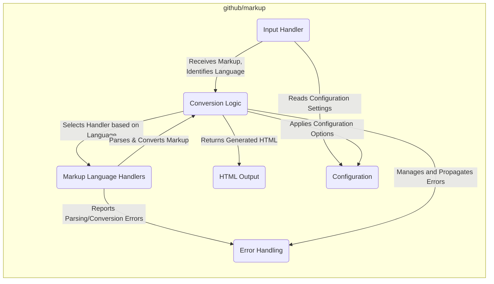
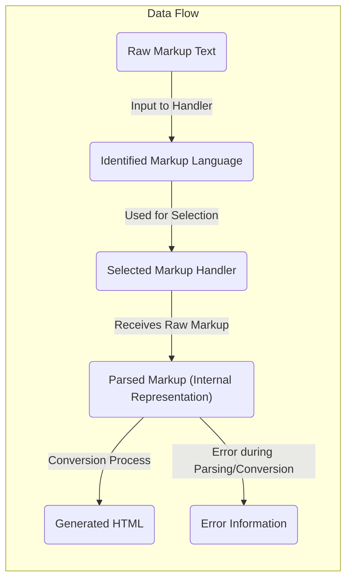

# Project Design Document: github/markup

**Version:** 1.1
**Date:** October 26, 2023
**Author:** AI Software Architect

## 1. Introduction

This document provides a detailed design overview of the `github/markup` project. The primary purpose of this document is to clearly articulate the architecture, components, and data flow of the system to facilitate comprehensive threat modeling. Understanding these aspects is crucial for identifying potential security vulnerabilities and designing appropriate mitigations.

## 2. Goals

*   Provide a clear and concise description of the `github/markup` project's architecture and its role within the GitHub ecosystem.
*   Identify the key components and explicitly detail their responsibilities and interactions within the system.
*   Outline the complete data flow through the system, from the initial input to the final output, including intermediate transformations.
*   Highlight potential areas of security concern with specific examples to guide future threat modeling activities.
*   Serve as a reliable and up-to-date reference point for developers, security analysts, and other stakeholders.

## 3. Overview

The `github/markup` project is a core Ruby library within GitHub responsible for converting various plain-text markup languages (such as Markdown, Textile, RDoc, AsciiDoc, and others) into HTML. This conversion is essential for rendering user-generated content across various parts of the GitHub platform, including:

*   Rendering README files in repositories.
*   Displaying content in issues and pull requests.
*   Formatting comments and discussions.
*   Presenting content in GitHub Pages.

`github/markup` acts as a central, standardized service for this conversion, ensuring consistency and maintainability across the platform. It dynamically selects the appropriate converter based on file extensions or specified language hints.

## 4. System Architecture

The `github/markup` project employs a modular architecture, leveraging external gems and internal logic to manage the diverse range of supported markup formats.

### 4.1. Key Components

*   **Input Handler:** This component is the entry point for the markup conversion process. Its responsibilities include:
    *   Receiving the raw markup text as input.
    *   Identifying the markup language based on file extensions (e.g., `.md`, `.textile`) or explicit language directives.
    *   Potentially performing initial pre-processing or sanitization steps (though this is generally minimal at this stage).
*   **Markup Language Handlers (Converters):** These are the individual modules or external gems responsible for the core parsing and conversion logic for specific markup languages. Examples include:
    *   `kramdown` (for Markdown and its variants).
    *   `RedCloth` (for Textile).
    *   `rdoc` (for Ruby RDoc).
    *   `asciidoctor` (for AsciiDoc).
    *   Other language-specific gems or internal implementations. Each handler is responsible for understanding the syntax of its respective language and transforming it into a structured representation before generating HTML.
*   **Conversion Logic (Dispatcher):** This central component orchestrates the entire conversion process. Its key functions are:
    *   Receiving the identified markup language from the Input Handler.
    *   Selecting the appropriate Markup Language Handler based on the identified language.
    *   Invoking the conversion function of the selected handler, passing the raw markup text.
    *   Receiving the generated HTML from the handler.
*   **HTML Output:** This component represents the final output of the system, which is the HTML representation of the input markup. This output is then typically passed to other parts of the GitHub platform for rendering in web browsers.
*   **Configuration:** This component manages various settings and options that can influence the conversion process. These might include:
    *   Enabling or disabling specific features or extensions for certain markup languages.
    *   Setting rendering options (e.g., whether to allow certain HTML tags).
    *   Defining security policies or sanitization rules (though primary sanitization often happens downstream).
*   **Error Handling:** This component is responsible for managing errors that may occur during any stage of the conversion process. This includes:
    *   Handling invalid markup syntax reported by the language handlers.
    *   Managing issues with the underlying parsing libraries or dependencies.
    *   Potentially logging errors or providing feedback to the calling application.

### 4.2. Component Interactions

### 4.3. Data Flow

The data flows through `github/markup` in a sequential manner, with transformations occurring at each stage:

1. **Raw Markup Input:** The process begins with raw markup text being received by the "Input Handler".
2. **Language Identification:** The "Input Handler" analyzes the input (e.g., file extension) to determine the specific markup language.
3. **Handler Selection:** The "Conversion Logic" uses the identified language to select the appropriate "Markup Language Handler".
4. **Parsing and Conversion:** The selected "Markup Language Handler" receives the raw markup, parses it into an internal representation (e.g., an Abstract Syntax Tree), and then converts this representation into HTML.
5. **HTML Output:** The generated HTML is produced by the "Markup Language Handler" and passed back through the "Conversion Logic" to the "HTML Output".
6. **Error Handling (Conditional):** If any errors occur during parsing or conversion within the "Markup Language Handler", this information is passed to the "Error Handling" component for management.

## 5. Security Considerations

This section outlines potential security considerations relevant to `github/markup`, which will be the focus of subsequent threat modeling activities.

*   **Cross-Site Scripting (XSS) via Input:** Malicious markup code injected into the input could be improperly converted, leading to the generation of HTML containing executable scripts. This is a primary concern, requiring robust input validation and potentially output sanitization (though the latter is often handled by the consuming application).
*   **Dependency Vulnerabilities:** The reliance on numerous external gems for handling different markup languages introduces a significant attack surface. Vulnerabilities in these dependencies (e.g., parsing flaws, arbitrary code execution) could be exploited if not regularly updated and audited.
*   **Denial of Service (DoS) through Complex Markup:** Processing extremely large or deeply nested markup structures could consume excessive server resources (CPU, memory), leading to DoS. Rate limiting or input size restrictions might be necessary.
*   **Server-Side Request Forgery (SSRF) in Markup:** Some markup languages allow embedding external resources (images, includes). If not handled carefully, this could be exploited to perform SSRF attacks, where the server makes requests to internal or external resources on behalf of the attacker.
*   **Information Disclosure through Error Messages:** Verbose error messages generated during the conversion process could potentially leak sensitive information about the system's internal workings or the structure of the input markup.
*   **Configuration Vulnerabilities:** If the configuration options are not securely managed or if default configurations are insecure, attackers might be able to manipulate settings to bypass security measures or introduce vulnerabilities.
*   **Regular Expression Denial of Service (ReDoS):** If the underlying parsing libraries use inefficient regular expressions, specially crafted malicious input could cause excessive backtracking, leading to CPU exhaustion and DoS.
*   **HTML Injection through Insecure Handlers:**  Flaws in specific Markup Language Handlers could lead to the generation of unintended HTML structures that might introduce security vulnerabilities in the consuming application.

## 6. Dependencies

The `github/markup` project has several key dependencies, primarily Ruby gems responsible for handling specific markup languages. These dependencies are critical to its functionality but also represent potential security risks:

*   **Markup Conversion Gems:**  `kramdown`, `RedCloth`, `rdoc`, `asciidoctor`, and others. These gems perform the core parsing and conversion and are potential sources of vulnerabilities.
*   **Other Utility Gems:**  Potentially gems for file handling, configuration management, or logging. While less directly involved in markup processing, vulnerabilities in these can also pose risks.

It is crucial to maintain up-to-date versions of these dependencies and regularly assess them for known vulnerabilities using tools like `bundler-audit`.

## 7. Deployment

The `github/markup` library is primarily deployed as a gem within the broader GitHub application infrastructure. It is not typically run as a standalone service but is rather integrated into various components that require markup rendering. This means it operates within the security context of the larger GitHub application.

## 8. Future Considerations

*   **Sandboxing of Markup Language Handlers:** Implementing sandboxing or isolation techniques for the individual Markup Language Handlers could limit the impact of vulnerabilities within those components.
*   **Centralized Security Policy Enforcement:** Defining and enforcing centralized security policies for markup processing across all supported languages could improve consistency and reduce the risk of language-specific bypasses.
*   **Regular Security Audits of Dependencies:**  Automating and regularly performing security audits of all dependencies is crucial for identifying and mitigating potential vulnerabilities.
*   **Input Sanitization Layer:**  Exploring the implementation of a dedicated input sanitization layer before passing markup to the individual handlers could provide an additional layer of defense against XSS and other injection attacks.
*   **Performance Monitoring and Optimization:** Continuously monitoring the performance of the conversion process and optimizing it can help mitigate potential DoS attacks.

## 9. Conclusion

This document provides an enhanced and more detailed design overview of the `github/markup` project, specifically tailored for threat modeling purposes. By clearly outlining the architecture, component responsibilities, and data flow, and by highlighting specific security considerations, this document serves as a valuable resource for understanding the system's potential vulnerabilities and for designing effective security measures. Continuous review and updates to this document are essential to reflect changes in the system and the evolving threat landscape.