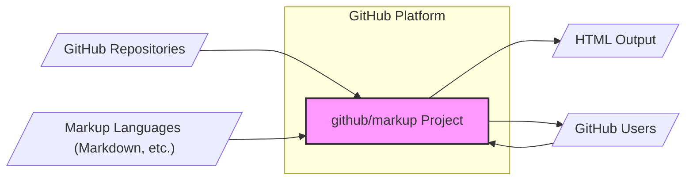
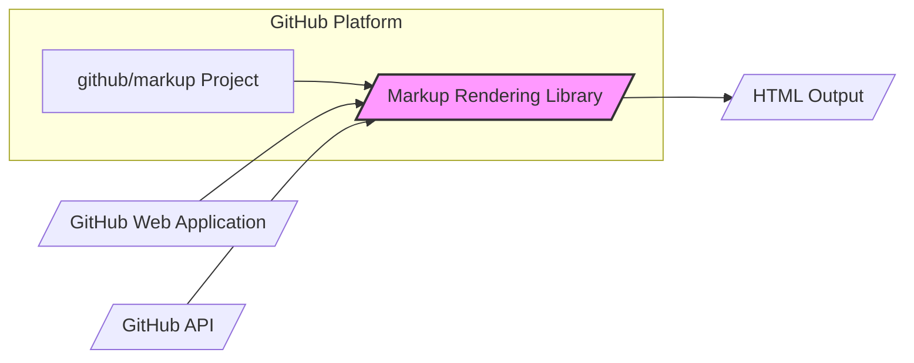
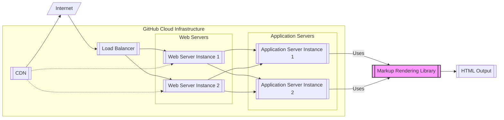

# BUSINESS POSTURE

This project, `github/markup`, aims to provide a reliable and secure library for rendering various markup languages into HTML. This is a core component for GitHub's functionality, as it enables the platform to display user-generated content in a readable and consistent format across different markup dialects.

Business Priorities:
- Reliability: The markup rendering must be highly reliable to ensure consistent display of content across GitHub. Downtime or rendering errors would negatively impact user experience.
- Security: The rendering process must be secure to prevent vulnerabilities such as Cross-Site Scripting (XSS) attacks, which could compromise user accounts and data.
- Performance: Rendering should be performant to avoid delays in content display and maintain a responsive user experience.
- Maintainability: The codebase should be maintainable to allow for updates, bug fixes, and the addition of new markup language support as needed.

Business Risks:
- Security Vulnerabilities: Exploitable vulnerabilities in the markup parsing and rendering logic could lead to significant security breaches, including XSS and other injection attacks.
- Rendering Errors: Incorrect or inconsistent rendering of markup could lead to user confusion, data misinterpretation, and a degraded user experience.
- Performance Bottlenecks: Inefficient rendering processes could lead to performance issues, especially under heavy load, impacting the overall responsiveness of GitHub.
- Supply Chain Risks: Dependencies used by the project could introduce vulnerabilities if not properly managed and vetted.

# SECURITY POSTURE

Existing Security Controls:
- security control: GitHub's Secure Development Lifecycle (SDLC) - Assumed to be in place for all GitHub projects, including code reviews, security testing, and vulnerability management. (Location: GitHub's internal security policies and procedures)
- security control: Dependency Scanning - Assumed to be in place to detect known vulnerabilities in project dependencies. (Location: GitHub's internal security tooling and processes)
- security control: Regular Security Audits - Assumed to be conducted on core GitHub components, potentially including markup rendering. (Location: GitHub's security audit logs and reports)
- accepted risk: Reliance on community contributions - As an open-source project, there is a reliance on community contributions, which may introduce security vulnerabilities if not properly vetted.

Recommended Security Controls:
- security control: Static Application Security Testing (SAST) - Implement SAST tools to automatically scan the codebase for potential security vulnerabilities during development.
- security control: Dynamic Application Security Testing (DAST) - Implement DAST tools to test the rendered output for vulnerabilities by simulating real-world attacks.
- security control: Fuzzing - Employ fuzzing techniques to automatically generate and test a wide range of inputs to identify potential parsing vulnerabilities.
- security control: Input Validation - Rigorously validate all input markup to ensure it conforms to expected formats and prevent injection attacks.
- security control: Output Encoding - Properly encode all rendered output to prevent XSS vulnerabilities by neutralizing potentially malicious scripts.

Security Requirements:
- Authentication: Not directly applicable to the markup rendering library itself, as it is a component within the broader GitHub platform. Authentication is handled at the GitHub platform level.
- Authorization: Not directly applicable to the markup rendering library itself. Authorization is handled at the GitHub platform level, determining what content users are allowed to access and render.
- Input Validation:
    - Requirement: All input markup must be strictly validated against the expected syntax for each supported markup language.
    - Requirement: Input validation should prevent injection attacks by sanitizing or rejecting potentially malicious markup constructs.
    - Requirement: Implement robust error handling for invalid markup input to prevent unexpected behavior or crashes.
- Cryptography: Not directly applicable to the core markup rendering functionality. Cryptography is relevant for secure communication and data storage within the broader GitHub platform, but not directly within the markup rendering library itself.

# DESIGN

## C4 CONTEXT



Context Diagram Elements:

- Name: github/markup Project
  - Type: Software System
  - Description: A library responsible for rendering various markup languages (e.g., Markdown, Textile, etc.) into HTML for display on the GitHub platform.
  - Responsibilities:
    - Parse input markup text in various formats.
    - Convert parsed markup into valid and semantically correct HTML.
    - Ensure secure rendering to prevent XSS and other vulnerabilities.
    - Support a range of markup languages used on GitHub.
  - Security controls:
    - Input validation of markup content.
    - Output encoding of rendered HTML.
    - SAST and DAST during development.
    - Fuzzing to identify parsing vulnerabilities.

- Name: GitHub Users
  - Type: Person
  - Description: Individuals who use the GitHub platform to view and interact with content, including content rendered by `github/markup`.
  - Responsibilities:
    - View rendered content on GitHub.
    - Create and contribute content in various markup languages.
  - Security controls:
    - Authentication to access GitHub.
    - Authorization to view specific content.

- Name: GitHub Repositories
  - Type: Software System / Data Store
  - Description: Stores the markup content that needs to be rendered by the `github/markup` project.
  - Responsibilities:
    - Store markup files (e.g., README.md, documentation).
    - Provide markup content to the `github/markup` project for rendering.
  - Security controls:
    - Access control to repositories.
    - Data integrity checks.

- Name: Markup Languages (Markdown, etc.)
  - Type: External System / Data Format
  - Description: Represents the various markup languages that the `github/markup` project is designed to support.
  - Responsibilities:
    - Define the syntax and semantics of markup languages.
    - Provide specifications for parsing and rendering.
  - Security controls:
    - Not directly applicable, as these are external standards. Security considerations are focused on how `github/markup` processes these languages.

- Name: HTML Output
  - Type: Data Format
  - Description: The output of the `github/markup` project, which is HTML code that can be displayed in web browsers.
  - Responsibilities:
    - Represent the rendered content in a browser-readable format.
    - Be correctly structured and semantically valid.
    - Be free from XSS vulnerabilities.
  - Security controls:
    - Output encoding to prevent XSS.

## C4 CONTAINER



Container Diagram Elements:

- Name: Markup Rendering Library
  - Type: Library / Component
  - Description: A software library within the `github/markup` project that contains the core logic for parsing and rendering markup languages to HTML. This library is likely used by various parts of the GitHub platform.
  - Responsibilities:
    - Parse input markup text.
    - Convert parsed markup to HTML.
    - Implement security controls like input validation and output encoding.
    - Support different markup languages.
  - Security controls:
    - Input validation within parsing logic.
    - Output encoding before generating HTML.
    - Unit tests with security focus.
    - SAST analysis of the library code.

- Name: GitHub Web Application
  - Type: Web Application
  - Description: The main GitHub web application that users interact with. It utilizes the Markup Rendering Library to display user-generated content.
  - Responsibilities:
    - Retrieve markup content from repositories or user inputs.
    - Call the Markup Rendering Library to convert markup to HTML.
    - Display the rendered HTML to users in web browsers.
  - Security controls:
    - Authentication and authorization of users.
    - Secure communication (HTTPS).
    - Content Security Policy (CSP) to mitigate XSS.

- Name: GitHub API
  - Type: API
  - Description: The GitHub API that allows programmatic access to GitHub resources, including content that may need to be rendered. It may also use the Markup Rendering Library.
  - Responsibilities:
    - Provide access to repository content via API endpoints.
    - Potentially use the Markup Rendering Library to pre-render content for API responses or provide raw markup for client-side rendering.
  - Security controls:
    - API authentication (e.g., OAuth).
    - API authorization.
    - Rate limiting to prevent abuse.

- Name: HTML Output
  - Type: Data Format
  - Description: The HTML generated by the Markup Rendering Library, used by the GitHub Web Application and potentially the GitHub API.
  - Responsibilities:
    - Represent the rendered markup in HTML format.
    - Be consumed by web browsers and other HTML rendering engines.
  - Security controls:
    - Output encoding applied by the Markup Rendering Library.
    - Browser-based security features (e.g., XSS filters, CSP).

## DEPLOYMENT

Deployment Diagram (Conceptual - Actual GitHub deployment is complex and internal):



Deployment Diagram Elements (Conceptual):

- Name: Load Balancer
  - Type: Infrastructure Component
  - Description: Distributes incoming traffic from the internet across multiple web server instances for scalability and availability.
  - Responsibilities:
    - Traffic distribution.
    - Health checks of web server instances.
    - SSL termination.
  - Security controls:
    - DDoS protection.
    - Rate limiting.
    - SSL/TLS encryption.

- Name: Web Server Instances (Web Server Instance 1, Web Server Instance 2)
  - Type: Infrastructure Component / Server
  - Description: Servers that handle incoming HTTP requests, serve static content, and route requests to application servers.
  - Responsibilities:
    - Handling HTTP requests.
    - Serving static assets.
    - Reverse proxy to application servers.
  - Security controls:
    - Web Application Firewall (WAF).
    - Regular security patching.
    - Hardened server configuration.

- Name: Application Server Instances (Application Server Instance 1, Application Server Instance 2)
  - Type: Infrastructure Component / Server
  - Description: Servers that run the GitHub application code, including the components that utilize the Markup Rendering Library.
  - Responsibilities:
    - Running application logic.
    - Utilizing the Markup Rendering Library.
    - Processing user requests.
  - Security controls:
    - Application-level firewalls.
    - Intrusion Detection/Prevention Systems (IDS/IPS).
    - Regular security patching.

- Name: Markup Rendering Library
  - Type: Software Component / Library
  - Description: Deployed as part of the application server instances. It's the library responsible for markup rendering.
  - Responsibilities:
    - Markup parsing and HTML generation.
    - Security controls as described in Container section.
  - Security controls:
    - Input validation.
    - Output encoding.
    - Secure coding practices.

- Name: HTML Output
  - Type: Data
  - Description: The HTML output generated by the Markup Rendering Library, passed back through the application and web servers to the user's browser, potentially via a CDN.
  - Responsibilities:
    - Displaying rendered content in user browsers.
  - Security controls:
    - Browser security features (CSP, XSS filters).

- Name: CDN (Content Delivery Network)
  - Type: Infrastructure Component
  - Description: Caches static content and potentially rendered HTML output to improve performance and reduce latency for users globally.
  - Responsibilities:
    - Caching content.
    - Serving content to users from geographically closer locations.
    - Offloading traffic from origin servers.
  - Security controls:
    - DDoS protection.
    - Secure content delivery (HTTPS).

## BUILD

```mermaid
graph LR
    A[/"Developer"/] --> B[/"Code Commit"/]
    B --> C[/"GitHub Repository"/]
    C --> D[/"GitHub Actions Workflow"/]
    D --> E{/"Build Process"/}
    E --> F[/"SAST & Security Scanners"/]
    F --> G[/"Dependency Check"/]
    G --> H[/"Build Artifacts (Library)"/]
    H --> I[/"Artifact Repository"/]
    style H fill:#f9f,stroke:#333,stroke-width:2px
```

Build Process Description:

1. Developer: Developers write and modify code for the `github/markup` project.
2. Code Commit: Developers commit their code changes to the GitHub repository.
3. GitHub Repository: The central repository hosting the source code of the `github/markup` project.
4. GitHub Actions Workflow: A CI/CD pipeline defined using GitHub Actions, automatically triggered on code commits.
5. Build Process: The core build steps, including compilation, testing, and packaging of the Markup Rendering Library.
6. SAST & Security Scanners: Static Application Security Testing tools and other security scanners are integrated into the build process to automatically analyze the code for potential vulnerabilities.
7. Dependency Check: Checks for known vulnerabilities in project dependencies.
8. Build Artifacts (Library): The compiled and packaged Markup Rendering Library, ready for deployment.
9. Artifact Repository: A secure repository (likely internal to GitHub) where build artifacts are stored.

Build Process Security Controls:

- security control: Automated Build Process - GitHub Actions workflows ensure a consistent and repeatable build process, reducing manual errors. (Location: GitHub Actions configuration files)
- security control: Static Application Security Testing (SAST) - SAST tools integrated into the build pipeline automatically scan code for vulnerabilities. (Location: GitHub Actions workflow definition, SAST tool configurations)
- security control: Dependency Scanning - Automated dependency scanning tools check for known vulnerabilities in external libraries. (Location: GitHub Actions workflow definition, dependency scanning tool configurations)
- security control: Code Review - Code changes are reviewed by other developers before being merged, providing a manual security check. (Location: GitHub pull request process)
- security control: Access Control to Artifact Repository - Access to the artifact repository is restricted to authorized personnel and systems. (Location: Artifact repository access control policies)
- security control: Build Environment Security - The build environment (GitHub Actions runners) is assumed to be securely configured and maintained by GitHub. (Location: GitHub's internal infrastructure security)

# RISK ASSESSMENT

Critical Business Processes:
- Rendering user-generated content across the GitHub platform. This is critical for user experience, communication, and collaboration on GitHub.

Data to Protect:
- User-provided markup content: This data is of moderate sensitivity. While not typically classified as highly confidential, its integrity and availability are crucial for GitHub's functionality. Maliciously crafted markup could be used for attacks.
- Rendered HTML output: The integrity and security of the rendered HTML are paramount to prevent XSS and other client-side vulnerabilities.

Data Sensitivity:
- Moderate. User-provided markup content itself is generally not highly sensitive in terms of confidentiality, but its potential to be exploited for security vulnerabilities elevates its importance in terms of integrity and availability. The rendered HTML output is highly sensitive from a security perspective due to XSS risks.

# QUESTIONS & ASSUMPTIONS

Questions:
- What specific SAST, DAST, and fuzzing tools are currently used or planned for the `github/markup` project?
- What is the process for handling and remediating vulnerabilities identified by security scans and testing?
- What is the performance SLA for markup rendering, and how is performance monitored?
- Are there specific markup languages that are considered higher risk from a security perspective?
- What is the process for updating and patching dependencies used by the `github/markup` project?
- What is the intended deployment environment beyond the conceptual cloud infrastructure described? Are there specific regions or zones?

Assumptions:
- BUSINESS POSTURE:
    - Security and reliability are top priorities for the `github/markup` project due to its core function within the GitHub platform.
    - Performance is also a significant concern to ensure a responsive user experience.
- SECURITY POSTURE:
    - GitHub's standard secure development lifecycle and security practices are applied to the `github/markup` project.
    - Dependency scanning and regular security audits are in place at the GitHub platform level.
    - Input validation and output encoding are considered essential security controls for markup rendering.
- DESIGN:
    - The `github/markup` project is implemented as a library or component that is integrated into various parts of the GitHub platform.
    - The deployment architecture is based on a typical cloud infrastructure with load balancers, web servers, application servers, and CDN.
    - GitHub Actions is used for the build and CI/CD process.