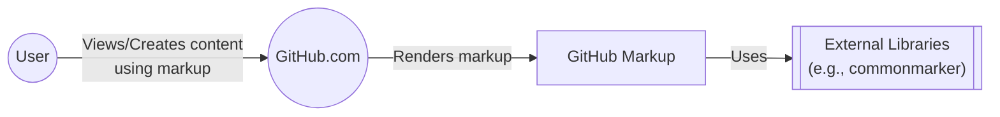
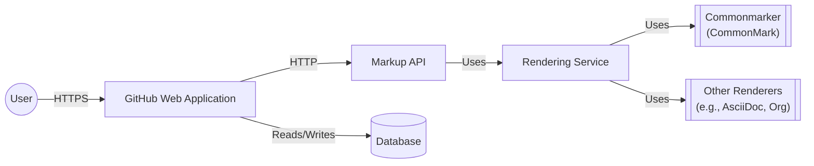
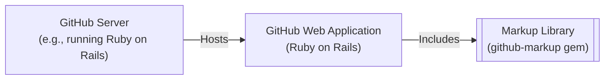
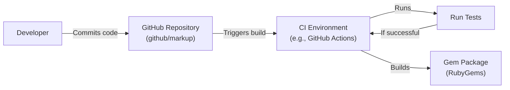

Okay, let's create a design document for the GitHub Markup project.

# BUSINESS POSTURE

GitHub Markup is a critical component of the GitHub platform, responsible for rendering various markup languages into HTML. It's used across the platform for displaying READMEs, issues, pull requests, comments, and more.

Priorities and Goals:

-   Reliability: The service must be highly available and resilient to failures, as it impacts the usability of the entire GitHub platform.
-   Security: Preventing XSS vulnerabilities is paramount, as user-provided markup could be exploited to attack other users.
-   Performance: Rendering should be fast and efficient to ensure a smooth user experience.
-   Maintainability: The codebase should be easy to understand and modify, as new markup languages and features are added regularly.
-   Accuracy: Markup should be rendered correctly and consistently, according to the specifications of each language.

Business Risks:

-   Service Outage: If Markup is unavailable, large parts of GitHub become unusable, impacting millions of users and potentially causing significant business disruption.
-   Cross-Site Scripting (XSS) Vulnerabilities: Successful XSS attacks could lead to account compromise, data breaches, and reputational damage.
-   Performance Degradation: Slow rendering times can frustrate users and reduce engagement with the platform.
-   Inaccurate Rendering: Incorrectly rendered markup can lead to miscommunication and confusion.
-   Supply Chain Attacks: Compromised dependencies could introduce vulnerabilities into the Markup service.

# SECURITY POSTURE

Existing Security Controls:

-   security control: Input Sanitization: GitHub Markup uses a combination of whitelisting, filtering, and escaping to prevent XSS vulnerabilities. This is implemented primarily within the various libraries used to parse and render different markup languages (e.g., `github-markup` itself, and underlying libraries like `commonmarker` for CommonMark, etc.).
-   security control: Content Security Policy (CSP): GitHub employs CSP headers to mitigate the impact of potential XSS vulnerabilities. This is implemented at the web server level (serving GitHub.com) and is not directly part of the `github-markup` library itself.
-   security control: Regular Dependency Updates: GitHub likely has processes in place to keep dependencies up-to-date, reducing the risk of known vulnerabilities. This is implied by the nature of the project and GitHub's overall security practices, but not explicitly stated in the repository itself.
-   security control: Code Reviews: All code changes undergo review by other engineers, helping to catch potential security issues before they are merged. This is a standard practice on GitHub.
-   security control: Automated Testing: The project includes a test suite to ensure that markup is rendered correctly and to help prevent regressions.
-   security control: Static Analysis: GitHub likely uses static analysis tools to identify potential security vulnerabilities in the codebase. This is a common practice at GitHub, but not explicitly mentioned in this specific repository.

Accepted Risks:

-   accepted risk: Complexity of Markup Parsing: The inherent complexity of parsing various markup languages means that there is always a risk of undiscovered vulnerabilities.
-   accepted risk: Reliance on Third-Party Libraries: The project depends on external libraries for parsing and rendering, introducing a dependency on the security of those libraries.
-   accepted risk: Zero-Day Vulnerabilities: There is always a risk of zero-day vulnerabilities in the underlying libraries or the Markup code itself.

Recommended Security Controls:

-   security control: Fuzz Testing: Implement fuzz testing to proactively discover edge cases and potential vulnerabilities in the parsing and rendering logic.
-   security control: Regular Security Audits: Conduct regular security audits, both internal and external, to identify potential weaknesses.
-   security control: Supply Chain Security Measures: Implement robust supply chain security measures, such as software bill of materials (SBOM) generation and dependency analysis, to mitigate the risk of compromised dependencies.

Security Requirements:

-   Authentication: Not directly applicable to the Markup library itself, as it operates on unauthenticated input. Authentication is handled at a higher level in the GitHub application.
-   Authorization: Not directly applicable, as Markup renders content based on user input, but the authorization to view that content is handled elsewhere.
-   Input Validation:
    -   Strictly enforce whitelisting of allowed HTML tags and attributes.
    -   Sanitize all user-provided input to prevent XSS attacks.
    -   Validate input against the expected format for each markup language.
    -   Reject any input that does not conform to the expected format.
-   Cryptography: Not directly applicable, as Markup does not handle sensitive data. However, any URLs generated should use HTTPS.
-   Output Encoding: Ensure that all output is properly encoded to prevent XSS vulnerabilities.

# DESIGN

## C4 CONTEXT

Element Descriptions:

-   Element:
    -   Name: User
    -   Type: Person
    -   Description: A user of the GitHub platform.
    -   Responsibilities: Creates and views content on GitHub, including issues, pull requests, comments, and README files.
    -   Security controls: Browser security features, two-factor authentication (if enabled).
-   Element:
    -   Name: GitHub.com
    -   Type: Software System
    -   Description: The main GitHub web application.
    -   Responsibilities: Handles user authentication, authorization, content storage, and presentation. Calls GitHub Markup to render user-provided markup.
    -   Security controls: Authentication, authorization, input validation, output encoding, CSP, regular security audits, WAF.
-   Element:
    -   Name: GitHub Markup
    -   Type: Software System
    -   Description: The library responsible for rendering various markup languages into HTML.
    -   Responsibilities: Parses and renders user-provided markup into safe HTML.
    -   Security controls: Input sanitization, whitelisting, filtering, escaping, regular dependency updates.
-   Element:
    -   Name: External Libraries
    -   Type: Software System
    -   Description: Third-party libraries used by GitHub Markup for parsing and rendering specific markup languages.
    -   Responsibilities: Provide the core parsing and rendering logic for different markup formats.
    -   Security controls: Dependent on the security practices of the library maintainers. GitHub Markup should regularly update these libraries.

## C4 CONTAINER

Element Descriptions:

-   Element:
    -   Name: User
    -   Type: Person
    -   Description: A user of the GitHub platform.
    -   Responsibilities: Creates and views content on GitHub.
    -   Security controls: Browser security features, two-factor authentication (if enabled).
-   Element:
    -   Name: GitHub Web Application
    -   Type: Web Application
    -   Description: The main GitHub web application.
    -   Responsibilities: Handles user requests, interacts with the database, and calls the Markup API.
    -   Security controls: Authentication, authorization, input validation, output encoding, CSP, regular security audits, WAF.
-   Element:
    -   Name: Markup API
    -   Type: API
    -   Description: An internal API exposed by GitHub Markup.
    -   Responsibilities: Receives markup text and rendering requests from the GitHub Web Application.
    -   Security controls: Input validation, rate limiting.
-   Element:
    -   Name: Rendering Service
    -   Type: Component
    -   Description: The core component of GitHub Markup that orchestrates the rendering process.
    -   Responsibilities: Selects the appropriate renderer based on the markup language and manages the rendering process.
    -   Security controls: Input sanitization, whitelisting, filtering, escaping.
-   Element:
    -   Name: Commonmarker
    -   Type: Library
    -   Description: A third-party library for parsing and rendering CommonMark.
    -   Responsibilities: Parses CommonMark input and generates HTML output.
    -   Security controls: Dependent on the security practices of the Commonmarker maintainers.
-   Element:
    -   Name: Other Renderers
    -   Type: Library
    -   Description: Third-party libraries for parsing and rendering other markup languages (e.g., AsciiDoc, Org).
    -   Responsibilities: Parse input in their respective formats and generate HTML output.
    -   Security controls: Dependent on the security practices of the respective library maintainers.
-   Element:
    -   Name: GitHubWebAppDatabase
    -   Type: Database
    -   Description: GitHub's database.
    -   Responsibilities: Store data.
    -   Security controls: Access control, encryption at rest, encryption in transit, regular backups, auditing.

## DEPLOYMENT

Possible Deployment Solutions:

1.  Embedded Library: GitHub Markup is likely deployed as a library embedded within the main GitHub web application (Ruby on Rails).
2.  Separate Service (Microservice): GitHub Markup could be deployed as a separate microservice, accessed via an internal API.
3.  Combination: A hybrid approach, where some markup languages are handled by an embedded library and others by a separate service.

Chosen Solution (most likely, based on the repository structure): Embedded Library

Element Descriptions:

-   Element:
    -   Name: GitHub Server
    -   Type: Server
    -   Description: A physical or virtual server hosting the GitHub web application.
    -   Responsibilities: Runs the operating system and the web server software.
    -   Security controls: OS hardening, firewall, intrusion detection/prevention systems, regular security updates.
-   Element:
    -   Name: GitHub Web Application
    -   Type: Web Application
    -   Description: The main GitHub web application, likely built using Ruby on Rails.
    -   Responsibilities: Handles user requests, interacts with the database, and renders web pages.
    -   Security controls: Authentication, authorization, input validation, output encoding, CSP, regular security audits, WAF.
-   Element:
    -   Name: Markup Library
    -   Type: Library
    -   Description: The github-markup gem, included as a dependency in the GitHub web application.
    -   Responsibilities: Provides the functionality to render various markup languages into HTML.
    -   Security controls: Input sanitization, whitelisting, filtering, escaping, regular dependency updates.

## BUILD

Build Process Description:

1.  Developers commit code changes to the GitHub repository.
2.  A CI environment (likely GitHub Actions, given that it's a GitHub project) is triggered by the commit.
3.  The CI environment sets up the build environment (e.g., installs dependencies).
4.  The CI environment runs the test suite.
5.  If the tests pass, the CI environment builds the gem package.
6.  The gem package is likely published to RubyGems.org, making it available for use by the GitHub web application.

Security Controls:

-   security control: CI/CD Pipeline: Automated build and deployment through a CI/CD pipeline (GitHub Actions) ensures consistency and reduces the risk of manual errors.
-   security control: Automated Testing: The test suite helps to catch bugs and regressions before they are deployed.
-   security control: Dependency Management: The project uses a dependency management system (Bundler for Ruby) to manage dependencies and ensure that the correct versions are used.
-   security control: Static Analysis (Likely): GitHub likely uses static analysis tools as part of their CI process to identify potential security vulnerabilities.
-   security control: Code Review: All code changes are reviewed by other developers before being merged.

# RISK ASSESSMENT

Critical Business Processes:

-   Rendering of user-generated content (READMEs, issues, pull requests, comments, etc.).
-   Displaying code with syntax highlighting.
-   Providing a consistent and reliable user experience across the GitHub platform.

Data:

-   User-provided markup text (low sensitivity, but potential for XSS).
-   Rendered HTML (low sensitivity).
-   No direct handling of highly sensitive data (e.g., passwords, API keys) within the Markup library itself. The primary risk is the *injection* of malicious content that could *target* sensitive data handled elsewhere in the GitHub application.

Sensitivity:

-   The markup text itself is generally not sensitive, but it can be used as a vector for attacks (XSS). The primary concern is the potential for malicious code injection, not the confidentiality of the markup itself.

# QUESTIONS & ASSUMPTIONS

Questions:

-   What specific static analysis tools are used in the CI pipeline?
-   What is the exact process for handling security vulnerabilities discovered in the Markup library or its dependencies?
-   Are there any specific performance targets or SLAs for Markup rendering?
-   What is the process for adding support for new markup languages?
-   Are there any plans to move Markup to a separate microservice?
-   What is the exact deployment mechanism (e.g., specific Ruby on Rails deployment tools)?
-   Is there any form of sandboxing used during the rendering process?

Assumptions:

-   BUSINESS POSTURE: GitHub has a strong security culture and prioritizes the security of its platform.
-   BUSINESS POSTURE: GitHub has a dedicated security team responsible for identifying and addressing vulnerabilities.
-   SECURITY POSTURE: GitHub uses static analysis tools as part of its CI process.
-   SECURITY POSTURE: GitHub has a process for regularly updating dependencies.
-   SECURITY POSTURE: GitHub employs CSP headers to mitigate XSS vulnerabilities.
-   DESIGN: GitHub Markup is primarily deployed as a library embedded within the main GitHub web application.
-   DESIGN: GitHub Actions is used as the CI environment.
-   DESIGN: The gem package is published to RubyGems.org.
-   DESIGN: GitHub has internal monitoring and alerting systems to detect and respond to service outages or performance degradation.