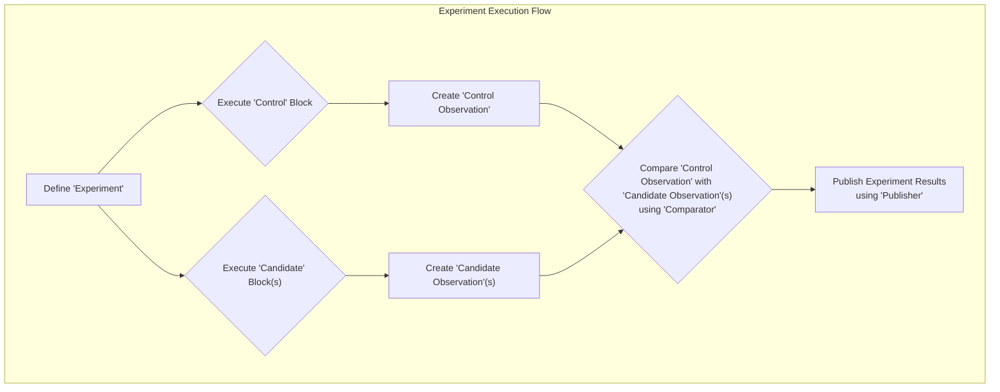

## Project Design Document: GitHub Scientist Library (Improved)

**1. Introduction**

This document provides an enhanced architectural design overview of the GitHub Scientist library (hereafter referred to as "Scientist"). This detailed design serves as a robust foundation for subsequent threat modeling exercises. It meticulously outlines the core components, data flow, and interactions of the library within a host application environment.

**2. Project Overview**

Scientist is a carefully crafted Ruby library empowering developers to confidently refactor critical code pathways. Its core strength lies in facilitating the parallel execution of both the existing code ("control") and the new, potentially improved code ("candidate"). Crucially, Scientist then compares the outcomes of these parallel executions. This rigorous comparison allows developers to validate the behavior of the new code with precision before fully integrating it, thereby significantly mitigating the risk of introducing regressions. Scientist's design deliberately focuses on the *mechanics* of experimentation and comparison, delegating the actual execution environment and contextual information to the application that integrates it.

**3. Goals**

* To offer a straightforward and easily understandable mechanism for defining and executing experiments.
* To seamlessly facilitate the comparison of results originating from different code execution paths.
* To provide a high degree of flexibility in defining the control behavior, candidate behaviors, and the logic used for comparison.
* To ensure minimal performance overhead when running experiments, particularly in production environments.
* To offer well-defined extension points for observing and recording the outcomes of experiments.

**4. Non-Goals**

* Providing a built-in user interface for managing and configuring experiments.
* Handling the persistent storage of experiment results.
* Implementing functionalities for traffic routing or feature flag management.
* Offering statistical analysis capabilities for interpreting experiment results.
* Directly managing distributed experiments or asynchronous execution patterns (though it is designed to be compatible with such systems when implemented by the integrating application).

**5. Target Audience**

* Software engineers tasked with refactoring existing code or introducing new functionalities into established systems.
* Quality assurance professionals responsible for validating the behavior of newly developed code.
* DevOps engineers interested in monitoring the impact of code changes and deployments.

**6. Architecture**

Scientist's architecture revolves around the central concept of an `Experiment`. The following details the key components and their roles:

* **`Experiment`:** This is the core class, acting as the central container for an entire experiment. It holds references to the `Control` behavior, one or more `Candidate` behaviors, and the `Comparator` responsible for comparing their results.
* **`Control`:** Represents the established or legacy code path. It is defined as a block of code whose result serves as the benchmark for comparison.
* **`Candidate`:** Represents the new or refactored code path under evaluation. An `Experiment` can be configured with multiple `Candidate` behaviors to test various approaches.
* **`Observation`:**  A wrapper object that encapsulates the outcome of executing either the `Control` or a `Candidate`. It captures the returned value and any exceptions that might have been raised during execution.
* **`Comparator`:** This component is responsible for the crucial task of comparing the `Observation` from the `Control` against the `Observation` from the `Candidate`(s). The default `Comparator` performs a simple equality check, but developers can provide custom implementations for more complex comparison logic.
* **`Context`:** Optional data that can be provided to the `Experiment` and subsequently passed to the `Control` and `Candidate` blocks. This allows experiments to be context-aware and behave differently based on specific conditions.
* **`Publisher`:** An interface defining the contract for reporting the results of an experiment. The application integrating Scientist is responsible for providing a concrete implementation of the `Publisher` to handle experiment outcomes, such as logging, sending metrics, or triggering notifications.

Here's a Mermaid flowchart illustrating the core workflow of an experiment:

**7. Data Flow**

The flow of data within a Scientist experiment proceeds as follows:

* **Experiment Definition:** The developer instantiates an `Experiment` object, specifying the code block for the `Control`, one or more code blocks for the `Candidate`(s), and optionally a custom `Comparator` and `Context` data.
* **Experiment Execution (via `Experiment#run`):**
    * The code block associated with the `Control` is executed.
    * The return value and any exceptions raised during the `Control`'s execution are captured and encapsulated within a `Control Observation` object.
    * Each `Candidate` code block is executed sequentially (by default).
    * The return value and any exceptions raised during each `Candidate`'s execution are captured and encapsulated within corresponding `Candidate Observation` objects.
* **Comparison:** The configured `Comparator` receives the `Control Observation` and each `Candidate Observation`. The `Comparator`'s logic determines whether the results from the `Control` and the `Candidate`(s) are considered a match based on the defined criteria.
* **Publishing:** The comprehensive results of the experiment, including whether the observations matched, the actual values returned by the `Control` and `Candidate`(s), any exceptions that occurred, and the provided `Context`, are passed to the configured `Publisher`. The specific actions performed by the `Publisher` (e.g., logging, metrics emission) are determined by the integrating application's implementation.

**Key Data Elements:**

* **`Control` Return Value:** The value returned by the execution of the `Control` code block.
* **`Candidate` Return Value:** The value returned by the execution of a `Candidate` code block.
* **`Control` Exception:** An exception object raised during the execution of the `Control` code block (if any).
* **`Candidate` Exception:** An exception object raised during the execution of a `Candidate` code block (if any).
* **`Context` Data:**  Arbitrary data passed to the `Experiment` that can influence the behavior of the `Control` and `Candidate` code blocks.
* **Comparison Result:** A boolean value indicating whether the `Comparator` deemed the `Control` and `Candidate` results to be equivalent.
* **Experiment Name (Optional):** A string identifier assigned to the `Experiment` for tracking and reporting purposes.

**8. Key Interactions**

Scientist's primary interactions occur with:

* **Integrating Application Code:** This is the primary point of interaction. The application code defines and orchestrates the execution of experiments using the Scientist library. It provides the essential `Control` and `Candidate` code blocks and is responsible for implementing the `Publisher` to handle experiment outcomes.
* **Custom `Comparator` Implementations (Optional):** Developers can extend Scientist's functionality by providing custom `Comparator` classes. This allows for tailoring the comparison logic to specific needs beyond simple equality checks.
* **Custom `Publisher` Implementations:** The integrating application *must* provide an implementation of the `Publisher` interface. This implementation dictates how experiment results are handled, enabling integration with logging frameworks, monitoring systems, and other relevant infrastructure.
* **`Context`ual Data Provider (Implicit):** The application implicitly provides context data when defining and running experiments, influencing the execution paths of the `Control` and `Candidate` behaviors.

**9. Security Considerations (Detailed)**

The integration of Scientist within an application introduces several security considerations that need careful attention:

* **Data Security - Exposure of Sensitive Information:**
    * **Threat:** Sensitive data might inadvertently be processed or logged within the `Control` or `Candidate` code blocks. The `Publisher` implementation could then unintentionally expose this sensitive information through logs, metrics, or other reporting mechanisms.
    * **Mitigation:** Rigorous review of `Control` and `Candidate` code is essential to prevent the processing of sensitive data. The `Publisher` implementation should be carefully designed to avoid logging or transmitting sensitive information. Consider using data masking or anonymization techniques within the `Publisher`.
* **Operational Security - Side Effects and Resource Consumption:**
    * **Threat:**  `Candidate` code, if not carefully designed, might introduce unintended side effects (e.g., modifying database state, triggering external actions) even during experimentation. Furthermore, poorly performing `Candidate` code could consume excessive resources, potentially leading to denial-of-service conditions.
    * **Mitigation:**  `Candidate` code should ideally be idempotent and side-effect free. Scientist's configuration options (e.g., forcing the control) can be used to mitigate risks in production. Thorough testing of `Candidate` code in non-production environments is crucial. Implement timeouts and resource limits for experiment execution.
* **Code Security - Vulnerabilities in Custom Components:**
    * **Threat:**  Custom `Comparator` or `Publisher` implementations provided by the integrating application might contain security vulnerabilities (e.g., injection flaws, insecure dependencies).
    * **Mitigation:**  Follow secure coding practices when developing custom `Comparator` and `Publisher` components. Conduct thorough security reviews and penetration testing of these custom components. Keep dependencies up-to-date to address known vulnerabilities.
* **Access Control - Exposure of Experiment Logic:**
    * **Threat:** The definition and configuration of experiments might reveal sensitive business logic or internal workings of the application. Unauthorized access to this information could be exploited.
    * **Mitigation:** Implement appropriate access controls to the code and configuration files where experiments are defined. Follow the principle of least privilege when granting access to this information.
* **Input Validation within `Control` and `Candidate` Blocks:**
    * **Threat:** If the `Control` or `Candidate` blocks process external input without proper validation, they could be vulnerable to injection attacks or other input-related vulnerabilities.
    * **Mitigation:**  Apply robust input validation techniques within the `Control` and `Candidate` code blocks, mirroring the validation used in the production code paths. Scientist itself does not handle input validation, making it the responsibility of the integrating code.
* **Dependency Management:**
    * **Threat:**  Scientist itself, or the integrating application's custom components, might rely on third-party libraries with known security vulnerabilities.
    * **Mitigation:**  Maintain an up-to-date inventory of all dependencies. Regularly scan dependencies for known vulnerabilities and promptly update to secure versions.

**10. Future Considerations (Beyond Scope of Current Threat Model)**

These are potential enhancements and extensions to Scientist that are not within the scope of the current threat modeling exercise but are worth noting for future development:

* Exploration of more advanced and statistically rigorous comparison methodologies.
* Seamless integration with established feature flagging systems for dynamic experiment activation and targeting.
* Support for asynchronous execution of `Control` and `Candidate` blocks to further minimize performance impact.

This improved design document provides a more comprehensive and detailed understanding of the GitHub Scientist library's architecture, data flow, and security considerations. This enhanced documentation will significantly aid in conducting thorough and effective threat modeling activities.