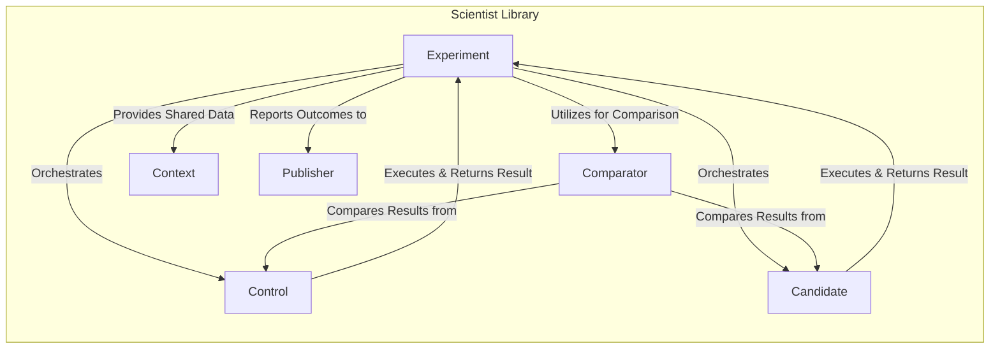
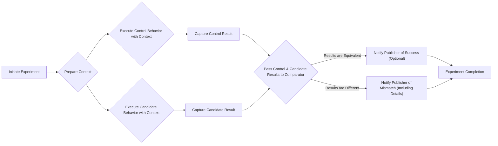

## Project Design Document: Scientist Library (Improved)

**1. Introduction**

This document provides an enhanced design overview of the `scientist` library, a Ruby library designed to facilitate safe and reliable refactoring of critical code paths. By enabling parallel execution of old ("control") and new ("candidate") code, and subsequent comparison of their outputs, `scientist` minimizes the risk of introducing regressions. This detailed design serves as a crucial input for subsequent threat modeling exercises.

**2. Goals**

*   Present a more granular architectural breakdown of the `scientist` library's components and their interactions.
*   Provide a clearer and more detailed description of the data flow within the library during an experiment.
*   Elaborate on potential security considerations, providing more specific examples and context.
*   Offer a more nuanced perspective on deployment considerations and the shared responsibility model for security.

**3. Non-Goals**

*   This document remains focused on design and does not serve as a user guide or comprehensive API reference.
*   The internal implementation details of the Ruby code are not the primary focus.
*   A formal, structured threat analysis is outside the scope of this document but will be a direct follow-up activity.

**4. Architectural Overview**

The core concept of the `scientist` library revolves around the "experiment," which orchestrates the execution and comparison of two distinct code paths. Key components work together to define, execute, and report on these experiments.

**4.1. High-Level Architecture**

**4.2. Component Descriptions (Detailed)**

*   **Experiment:** The central orchestrator. It holds the configuration for an experiment, including references to the `Control`, `Candidate`, `Comparator`, and `Publisher`. It manages the execution lifecycle, ensuring both the control and candidate are run (typically with the same input derived from the `Context`).
*   **Control:** Encapsulates the original, trusted code path. The `Experiment` invokes the control's associated code block and captures its output. This output serves as the ground truth for the experiment.
*   **Candidate:** Encapsulates the new code path being evaluated. Similar to the `Control`, the `Experiment` invokes the candidate's code block and captures its output.
*   **Comparator:**  A strategy object responsible for determining the equivalence of the `Control` and `Candidate` results. It receives the outputs of both and returns a boolean indicating whether they are considered equal. Custom comparators allow for handling complex data structures or scenarios where exact equality is not required.
*   **Publisher:**  Handles the reporting and persistence of experiment outcomes. It receives information about the experiment's execution, including whether the results matched or mismatched, execution times, and potentially the results themselves. Different publishers can be configured to log to different destinations or formats.
*   **Context:** A mechanism for providing shared, contextual information to both the `Control` and `Candidate` code blocks. This ensures both code paths operate within the same environment and with the same input data, minimizing variability.

**5. Data Flow (Detailed)**

The data flow within an experiment can be broken down into a more granular sequence of steps:

**Detailed Data Flow Steps:**

1. **Initiate Experiment:** The application code triggers the execution of a defined `Experiment`.
2. **Prepare Context:** The `Experiment` prepares the shared `Context` object, potentially populating it with relevant data for the experiment.
3. **Execute Control Behavior with Context:** The `Experiment` executes the code block associated with the `Control`, providing the prepared `Context`.
4. **Execute Candidate Behavior with Context:** The `Experiment` executes the code block associated with the `Candidate`, also providing the same `Context`. Note that the order of control and candidate execution might not be strictly defined or guaranteed.
5. **Capture Control Result:** The output or return value from the `Control`'s execution is captured and stored.
6. **Capture Candidate Result:** The output or return value from the `Candidate`'s execution is captured and stored.
7. **Pass Control & Candidate Results to Comparator:** The captured results from both the `Control` and `Candidate` are passed as arguments to the configured `Comparator`.
8. **Results are Equivalent:** The `Comparator` determines that the two results are equivalent based on its defined logic. The `Experiment` then proceeds to notify the `Publisher` of a successful comparison (this notification might be optional depending on the publisher's configuration).
9. **Results are Different:** The `Comparator` determines that the two results are not equivalent. The `Experiment` then notifies the `Publisher` of the mismatch, typically including details about the differences in the results.
10. **Notify Publisher of Success (Optional):** The `Publisher` records the successful experiment run, potentially including metadata like timestamps and execution times.
11. **Notify Publisher of Mismatch (Including Details):** The `Publisher` records the mismatch, including details of the control and candidate results (or a representation thereof) to aid in debugging.
12. **Experiment Completion:** The experiment concludes. The calling application typically proceeds using the result from the `Control` (ensuring the application continues to operate on the known-good path).

**6. Security Considerations (Expanded)**

Building upon the initial considerations, here's a more detailed look at potential security implications:

*   **Sensitive Information Disclosure via Publisher:**
    *   **Threat:** If the data being compared includes sensitive personal information (PII), financial data, or secrets, a misconfigured or overly verbose `Publisher` could log these details in plain text.
    *   **Mitigation:** Implement secure logging practices, including redaction or masking of sensitive data within custom publishers. Ensure log storage is appropriately secured with access controls. Carefully review the configuration and behavior of any third-party publisher integrations.
*   **Code Injection Risks with Custom Components:**
    *   **Threat:** Allowing arbitrary code execution through custom `Comparator` or `Publisher` implementations poses a significant risk. Malicious actors could inject code to exfiltrate data, disrupt service, or gain unauthorized access.
    *   **Mitigation:**  Restrict the ability to provide custom components or implement strict input validation and sandboxing for such components. Consider using a predefined set of safe, built-in comparators and publishers where possible. Employ code review and static analysis on any custom implementations.
*   **Denial of Service through Resource Exhaustion:**
    *   **Threat:** A malicious or poorly designed experiment with computationally expensive `Control` or `Candidate` code could consume excessive resources (CPU, memory, I/O), leading to a denial of service for the application.
    *   **Mitigation:** Implement timeouts and resource limits for experiment execution. Monitor resource consumption during experiments. Avoid running experiments in production environments under heavy load without careful consideration.
*   **Compromised Integrity of Experiment Outcomes:**
    *   **Threat:** If an attacker can tamper with the `Comparator` logic or the results before comparison, they could manipulate the outcome of the experiment, potentially masking regressions or introducing vulnerabilities.
    *   **Mitigation:** Ensure the integrity of the `Comparator` implementation and the environment in which the experiment runs. Use secure coding practices and protect the codebase from unauthorized modification.
*   **Security of Contextual Data:**
    *   **Threat:** If the `Context` object contains sensitive information, vulnerabilities in the `Control` or `Candidate` code could lead to its exposure or misuse.
    *   **Mitigation:**  Minimize the amount of sensitive data placed in the `Context`. If sensitive data is necessary, ensure the `Control` and `Candidate` code paths handle it securely.
*   **Logging Infrastructure Vulnerabilities:**
    *   **Threat:** If the logging infrastructure used by the `Publisher` has security vulnerabilities, experiment data (including potential sensitive information from mismatches) could be compromised.
    *   **Mitigation:** Follow secure logging best practices, including regular patching and security audits of the logging infrastructure. Implement appropriate access controls for log data.

**7. Deployment Considerations (Refined)**

The security of the `scientist` library is a shared responsibility between the library itself and the application in which it is deployed.

*   **Dependency Management and Supply Chain Security:**  It is crucial to obtain the `scientist` library from trusted sources and verify its integrity to prevent supply chain attacks. Utilize dependency management tools with security scanning capabilities.
*   **Host Application Security Posture:** The overall security of the application using `scientist` is paramount. Vulnerabilities in the host application can be exploited, regardless of the security of the `scientist` library itself. This includes secure configuration, input validation, authorization, and authentication mechanisms within the host application.
*   **Environment Isolation:** Consider the environment in which experiments are run. Running experiments in production environments requires careful consideration of potential performance impacts and security risks. Ideally, experiments should be conducted in isolated testing or staging environments.
*   **Configuration Management:** Securely manage the configuration of the `scientist` library, including the selection and configuration of `Publishers` and `Comparators`. Avoid hardcoding sensitive information in configurations.
*   **Principle of Least Privilege:** When configuring custom components or integrations, adhere to the principle of least privilege, granting only the necessary permissions.

**8. Future Considerations**

*   **Enhanced Security Auditing:**  Future development could include built-in mechanisms for security auditing of experiment configurations and execution.
*   **Secure Handling of Secrets:**  If experiments need to interact with systems requiring secrets, explore secure secret management integrations within the library.
*   **Formal Security Review:**  A formal security review and penetration testing of the `scientist` library itself could identify potential vulnerabilities within the core library code.

This improved design document provides a more comprehensive understanding of the `scientist` library's architecture, data flow, and security considerations, laying a stronger foundation for effective threat modeling.