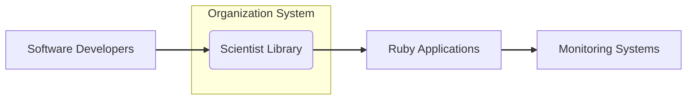
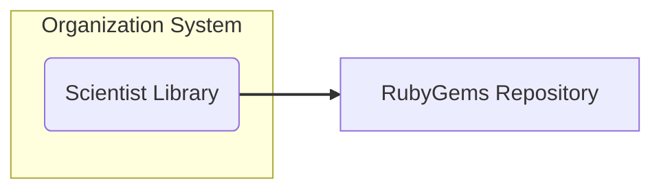
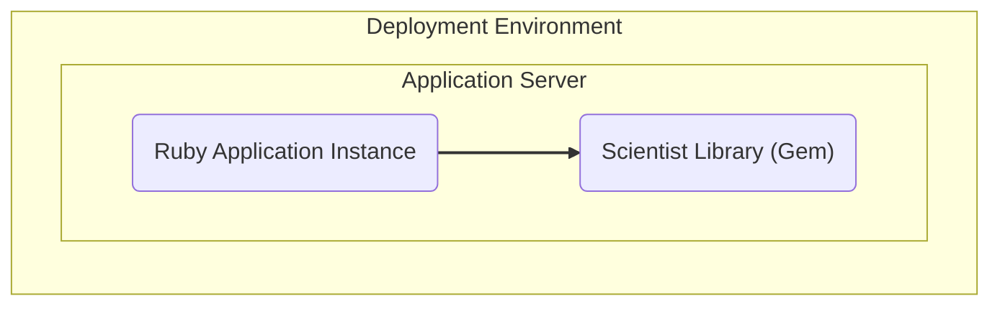
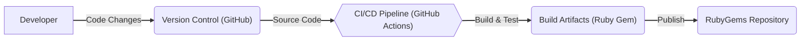

# BUSINESS POSTURE

- Business Priorities and Goals:
  - Enable safe and reliable refactoring of critical code paths in production environments.
  - Reduce the risk of introducing regressions or performance issues during code changes.
  - Facilitate iterative and incremental improvements to existing systems.
  - Improve developer confidence in making changes to complex code.
- Business Risks:
  - Introduction of bugs or performance degradation in production due to refactoring errors.
  - Potential for service disruption or downtime if refactoring introduces critical issues.
  - Increased development time and cost if refactoring process is not efficient or reliable.
  - Negative impact on user experience if refactoring leads to unexpected behavior.

# SECURITY POSTURE

- Existing Security Controls:
  - security control: GitHub repository hosting with standard GitHub security features (access control, audit logs). Implemented by: GitHub platform.
  - security control: Open source project with community review and contributions. Implemented by: Open source nature of the project.
  - accepted risk: Vulnerabilities in dependencies of the library.
  - accepted risk: Security vulnerabilities introduced by community contributions.
- Recommended Security Controls:
  - security control: Implement automated dependency scanning to identify and address vulnerabilities in gem dependencies.
  - security control: Integrate static application security testing (SAST) tools into the development workflow to identify potential security issues in the library code.
  - security control: Establish a clear process for reporting and addressing security vulnerabilities.
  - security control: Document secure development guidelines for contributors.
- Security Requirements:
  - Authentication: Not directly applicable as this is a library. Authentication is handled by the applications using the library.
  - Authorization: Not directly applicable as this is a library. Authorization is handled by the applications using the library.
  - Input Validation: The library should perform input validation on any external data it processes to prevent unexpected behavior or vulnerabilities in the applications using it.
  - Cryptography:  The library itself does not appear to require cryptography. However, applications using the library might handle sensitive data and should implement appropriate cryptographic measures independently.

# DESIGN

## C4 CONTEXT

- Context Diagram Elements:
  - - Name: Scientist Library
    - Type: Software Library
    - Description: A Ruby library for refactoring critical paths of code by running experiments in production.
    - Responsibilities: Provides API for defining and running experiments, comparing old and new code paths, and publishing results.
    - Security controls: Input validation on API inputs.
  - - Name: Software Developers
    - Type: User
    - Description: Developers who use the Scientist library to refactor code in Ruby applications.
    - Responsibilities: Integrate the Scientist library into Ruby applications, define experiments, and analyze results.
    - Security controls: Secure coding practices when using the library, proper configuration of experiments.
  - - Name: Ruby Applications
    - Type: Software System
    - Description: Applications written in Ruby that utilize the Scientist library for code refactoring experiments.
    - Responsibilities: Execute experiments defined by developers, utilize results from Scientist library, and handle any potential errors or exceptions.
    - Security controls: Application level security controls, including authentication, authorization, input validation, and secure data handling.
  - - Name: Monitoring Systems
    - Type: Software System
    - Description: Systems used to monitor the performance and behavior of Ruby applications during and after Scientist experiments.
    - Responsibilities: Collect and analyze metrics related to experiment execution, identify performance regressions or errors, and provide insights into experiment outcomes.
    - Security controls: Access control to monitoring data, secure data storage and transmission.

## C4 CONTAINER

- Container Diagram Elements:
  - - Name: Scientist Library (Ruby Gem)
    - Type: Library/Gem
    - Description: The Scientist library packaged as a Ruby Gem, distributed through RubyGems.org or private gem repositories.
    - Responsibilities: Encapsulates the core logic of the Scientist library, providing a reusable component for Ruby applications.
    - Security controls: Code review, static analysis, dependency scanning during development and release process.
  - - Name: RubyGems Repository
    - Type: Package Repository
    - Description: Public or private repository for hosting and distributing Ruby Gems, including the Scientist library.
    - Responsibilities: Stores and serves the Scientist Ruby Gem to developers and build systems.
    - Security controls: Access control, integrity checks for packages, vulnerability scanning of hosted gems (if applicable for private repositories).

## DEPLOYMENT

- Deployment Diagram Elements:
  - - Name: Ruby Application Instance
    - Type: Application Runtime
    - Description: An instance of a Ruby application running in a production, staging, or development environment.
    - Responsibilities: Executes the Ruby application code, including the Scientist library, and serves application functionality to users or other systems.
    - Security controls: Operating system security hardening, application runtime environment security configurations, network security controls.
  - - Name: Scientist Library (Gem)
    - Type: Library Dependency
    - Description: The Scientist Ruby Gem deployed as a dependency within the Ruby application instance.
    - Responsibilities: Provides experiment functionality to the Ruby application at runtime.
    - Security controls: Included as part of the application deployment package, inheriting security controls of the application environment.

## BUILD

- Build Diagram Elements:
  - - Name: Developer
    - Type: Human User
    - Description: Software developer contributing to the Scientist library project.
    - Responsibilities: Writes code, performs local testing, and commits changes to the version control system.
    - Security controls: Secure development workstation, code review process.
  - - Name: Version Control (GitHub)
    - Type: Code Repository
    - Description: GitHub repository hosting the source code of the Scientist library.
    - Responsibilities: Stores and manages source code, tracks changes, and facilitates collaboration.
    - Security controls: Access control, branch protection, audit logs.
  - - Name: CI/CD Pipeline (GitHub Actions)
    - Type: Automation System
    - Description: Automated build and deployment pipeline using GitHub Actions.
    - Responsibilities: Automates building, testing, and publishing the Scientist Ruby Gem.
    - Security controls: Secure pipeline configuration, secret management, build environment security.
  - - Name: Build Artifacts (Ruby Gem)
    - Type: Software Package
    - Description: The compiled and packaged Scientist Ruby Gem produced by the build process.
    - Responsibilities: Contains the distributable version of the Scientist library.
    - Security controls: Integrity checks (checksums), signing of artifacts (if implemented).
  - - Name: RubyGems Repository
    - Type: Package Repository
    - Description: Repository where the built Ruby Gem is published and made available for download.
    - Responsibilities: Hosts and distributes the Scientist Ruby Gem.
    - Security controls: Access control, integrity checks, vulnerability scanning (if applicable).

# RISK ASSESSMENT

- Critical Business Processes:
  - Safe and reliable code refactoring in production.
  - Maintaining application stability and performance during code changes.
- Data Sensitivity:
  - The Scientist library itself does not directly handle sensitive data. However, applications using the library might process sensitive data. The risk is that incorrect refactoring using Scientist could indirectly expose or corrupt sensitive data handled by the consuming applications. The sensitivity of data depends on the applications using the library and is not inherent to the library itself.

# QUESTIONS & ASSUMPTIONS

- Questions:
  - What are the specific applications or systems where the Scientist library will be used within the organization?
  - What are the existing security practices and tools used in the organization's software development lifecycle?
  - What is the organization's risk tolerance for production incidents caused by refactoring errors?
  - Are there specific compliance requirements that need to be considered when using the Scientist library?
- Assumptions:
  - The Scientist library will be used to refactor critical code paths in production environments.
  - The organization prioritizes minimizing the risk of production incidents and data corruption.
  - The organization has a software development team familiar with Ruby and RubyGems.
  - The organization has monitoring systems in place to observe application behavior in production.