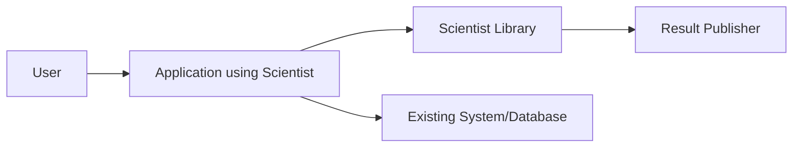
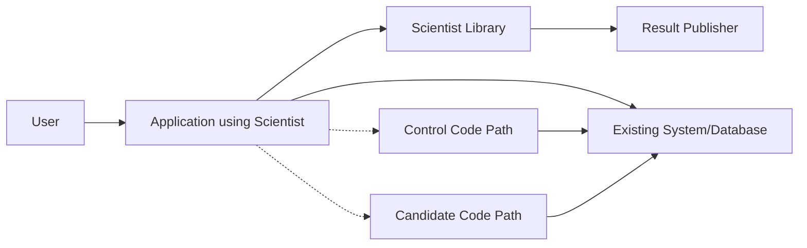
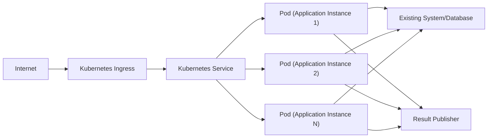
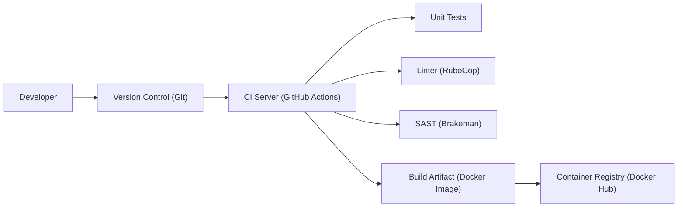

Okay, let's create a design document for the GitHub Scientist library, keeping in mind its purpose and potential security implications.

# BUSINESS POSTURE

GitHub Scientist is a Ruby library designed to carefully test refactored code paths against the original code paths in a production environment. The primary business goal is to minimize the risk associated with deploying new code by verifying its behavior against the existing, trusted implementation. This allows for continuous improvement and refactoring with a high degree of confidence.

Business Priorities:

*   Minimize risk of regressions during code refactoring.
*   Enable continuous delivery and deployment with high confidence.
*   Improve code quality and maintainability over time.
*   Gather data-driven insights into the behavior of new code in production.
*   Reduce the impact of potential bugs on end-users.

Business Risks:

*   Performance overhead introduced by running both code paths could impact user experience.
*   Incorrectly implemented experiments could lead to inconsistent data or application state.
*   Exceptions or errors in the experimental code path could affect the overall application stability.
*   Sensitive data exposure if experiment results are not handled securely.
*   Increased complexity in the codebase due to the addition of experiment logic.

# SECURITY POSTURE

Existing Security Controls:

*   security control: The library itself does not directly handle authentication or authorization. It relies on the surrounding application's security mechanisms. (Implicit in the library's design)
*   security control: Input validation is the responsibility of the application using the library, not the library itself. (Implicit in the library's design)
*   security control: The library does not perform any cryptographic operations. (Implicit in the library's design)
*   security control: The library publishes results, and it's up to the publisher to ensure sensitive data is not exposed. (Described in documentation)
*   security control: The library provides a mechanism to ignore known differences between the control and candidate code paths, reducing noise in the results. (Described in documentation)
*   security control: The library allows for custom comparison logic, enabling developers to define how results are compared and what constitutes a mismatch. (Described in documentation)
*   security control: The library provides a mechanism to control the percentage of requests that are subjected to the experiment. (Described in documentation)

Accepted Risks:

*   accepted risk: The library adds complexity to the codebase, which could potentially introduce new bugs.
*   accepted risk: There is a performance overhead associated with running both code paths, although this is intended to be minimal.
*   accepted risk: The library relies on the developer to correctly implement the experiment and handle the results appropriately.

Recommended Security Controls:

*   security control: Implement robust monitoring and alerting for any errors or exceptions raised within the Scientist experiment.
*   security control: Ensure that any data published by the experiment is properly sanitized to prevent sensitive data leakage.
*   security control: Regularly review and audit the implementation of Scientist experiments to ensure they are configured correctly and not introducing any security vulnerabilities.
*   security control: Implement circuit breakers or other safeguards to automatically disable experiments if they are causing significant performance degradation or errors.

Security Requirements:

*   Authentication: Not directly applicable to the library itself. Relies on the application's authentication mechanisms.
*   Authorization: Not directly applicable to the library itself. Relies on the application's authorization mechanisms.
*   Input Validation: The application using Scientist must ensure proper input validation before passing data to either the control or candidate code paths.
*   Cryptography: Not directly applicable to the library itself. If the application requires cryptography, it should be handled independently of Scientist.
*   Data Sensitivity: Any data used within or published by Scientist experiments must be carefully reviewed for sensitivity. Sensitive data must be appropriately handled (e.g., anonymized, encrypted) to prevent leakage.
*   Error Handling: Exceptions within either code path should be handled gracefully and should not impact the overall application stability. Errors should be logged and monitored.

# DESIGN

## C4 CONTEXT

Element Descriptions:

*   Element:
    *   Name: User
    *   Type: Person
    *   Description: A user of the application that is using the Scientist library.
    *   Responsibilities: Interacts with the application.
    *   Security controls: Relies on application-level security controls.

*   Element:
    *   Name: Application using Scientist
    *   Type: Software System
    *   Description: The application that is using the Scientist library to refactor code.
    *   Responsibilities: Handles user requests, executes control and candidate code paths, and publishes results.
    *   Security controls: Implements authentication, authorization, and input validation.

*   Element:
    *   Name: Scientist Library
    *   Type: Library
    *   Description: The Scientist library itself.
    *   Responsibilities: Provides the framework for running experiments and publishing results.
    *   Security controls: Relies on the application for security; provides mechanisms for safe experimentation.

*   Element:
    *   Name: Existing System/Database
    *   Type: Software System/Database
    *   Description: Any existing systems or databases that the application interacts with.
    *   Responsibilities: Provides data and services to the application.
    *   Security controls: Relies on its own security mechanisms.

*   Element:
    *   Name: Result Publisher
    *   Type: Software System/Component
    *   Description: The component responsible for publishing the results of the experiment (e.g., logging, metrics system).
    *   Responsibilities: Receives and processes experiment results.
    *   Security controls: Must ensure that sensitive data is not exposed in the published results.

## C4 CONTAINER

Since Scientist is a library, the container diagram is essentially an extension of the context diagram.

Element Descriptions:

*   Element:
    *   Name: Control Code Path
    *   Type: Code Component
    *   Description: The original, existing code path.
    *   Responsibilities: Executes the existing logic.
    *   Security controls: Relies on existing application security.

*   Element:
    *   Name: Candidate Code Path
    *   Type: Code Component
    *   Description: The new, refactored code path.
    *   Responsibilities: Executes the new logic.
    *   Security controls: Relies on existing application security; should be carefully reviewed for new vulnerabilities.

*   (All other elements are the same as in the C4 Context diagram)

## DEPLOYMENT

Scientist is a library, so its deployment is tied to the application that uses it. There are several possible deployment scenarios:

1.  **Traditional Server Deployment:** The application (with Scientist) is deployed to a set of servers (physical or virtual).
2.  **Containerized Deployment (e.g., Docker, Kubernetes):** The application (with Scientist) is packaged into a container and deployed to a container orchestration platform.
3.  **Serverless Deployment (e.g., AWS Lambda):** The application (with Scientist) is deployed as serverless functions.

We'll describe the containerized deployment using Kubernetes, as it's a common and complex scenario.

Element Descriptions:

*   Element:
    *   Name: Internet
    *   Type: Network
    *   Description: The public internet.
    *   Responsibilities: Provides access to the application.
    *   Security controls: Relies on network-level security (firewalls, etc.).

*   Element:
    *   Name: Kubernetes Ingress
    *   Type: Load Balancer/Reverse Proxy
    *   Description: The entry point for traffic into the Kubernetes cluster.
    *   Responsibilities: Routes traffic to the appropriate service.
    *   Security controls: TLS termination, potentially WAF.

*   Element:
    *   Name: Kubernetes Service
    *   Type: Service Discovery/Load Balancer
    *   Description: Provides a stable endpoint for accessing the application pods.
    *   Responsibilities: Load balances traffic across the application pods.
    *   Security controls: Network policies.

*   Element:
    *   Name: Pod (Application Instance)
    *   Type: Container
    *   Description: A running instance of the application container, which includes the Scientist library.
    *   Responsibilities: Handles user requests, executes experiments.
    *   Security controls: Container security (image scanning, runtime security), application-level security.

*   Element:
    *   Name: Existing System/Database
    *   Type: External System
    *   Description: External systems and databases.
    *   Responsibilities: Provides data and services.
    *   Security controls: Relies on its own security.

*   Element:
    *   Name: Result Publisher
    *   Type: External System/Component
    *   Description: System for publishing experiment results.
    *   Responsibilities: Collects and processes experiment data.
    *   Security controls: Data sanitization, access control.

## BUILD

The build process for an application using Scientist would typically involve the following steps:

1.  **Developer:** Writes code, including Scientist experiments.
2.  **Version Control (e.g., Git):** Code is committed and pushed to a version control system.
3.  **Continuous Integration (CI) Server (e.g., GitHub Actions, Jenkins):**
    *   Checks out the code.
    *   Runs unit tests.
    *   Runs linters (e.g., RuboCop for Ruby).
    *   Runs static analysis security testing (SAST) tools (e.g., Brakeman for Ruby).
    *   Builds the application artifact (e.g., a Docker image).
    *   Pushes the artifact to a registry (e.g., Docker Hub, ECR).

Security Controls in Build Process:

*   security control: Version control provides an audit trail of code changes.
*   security control: CI server enforces automated testing and quality checks.
*   security control: Linters help maintain code quality and identify potential issues.
*   security control: SAST tools scan for security vulnerabilities in the code.
*   security control: Container image scanning (if applicable) checks for vulnerabilities in the container image.
*   security control: Secure storage of build artifacts in a registry.

# RISK ASSESSMENT

Critical Business Processes:

*   The primary critical business process is the *reliable and safe deployment of new code*. Scientist is directly involved in this process.
*   Maintaining application uptime and performance is also critical. Scientist experiments must not significantly impact these.

Data Sensitivity:

*   The data Scientist handles depends entirely on the application using it.
*   If the application processes *Personally Identifiable Information (PII)*, *financial data*, or other *sensitive information*, then Scientist experiments could potentially expose this data if not handled carefully.
*   Result publishers must be configured to *sanitize or anonymize* any sensitive data before publishing.
*   Data sensitivity levels:
    *   **Public:** No restrictions on access or disclosure.
    *   **Internal:** Limited to employees and authorized personnel.
    *   **Confidential:** Restricted to specific individuals or teams.
    *   **Restricted:** Highly sensitive data with strict access controls.

# QUESTIONS & ASSUMPTIONS

Questions:

*   What specific result publishers are intended to be used with Scientist in this application?
*   What is the expected performance overhead of running Scientist experiments?
*   What is the tolerance for errors or exceptions within Scientist experiments?
*   What types of data will be processed by the application using Scientist?
*   What are the existing security controls and policies of the application?

Assumptions:

*   BUSINESS POSTURE: The organization has a moderate risk tolerance, prioritizing stability and reliability but also valuing continuous improvement.
*   SECURITY POSTURE: The application using Scientist already has basic security measures in place (authentication, authorization, input validation).
*   DESIGN: The application is deployed in a containerized environment (Kubernetes). The build process includes automated testing and security checks. The result publisher will be configured to handle sensitive data appropriately.