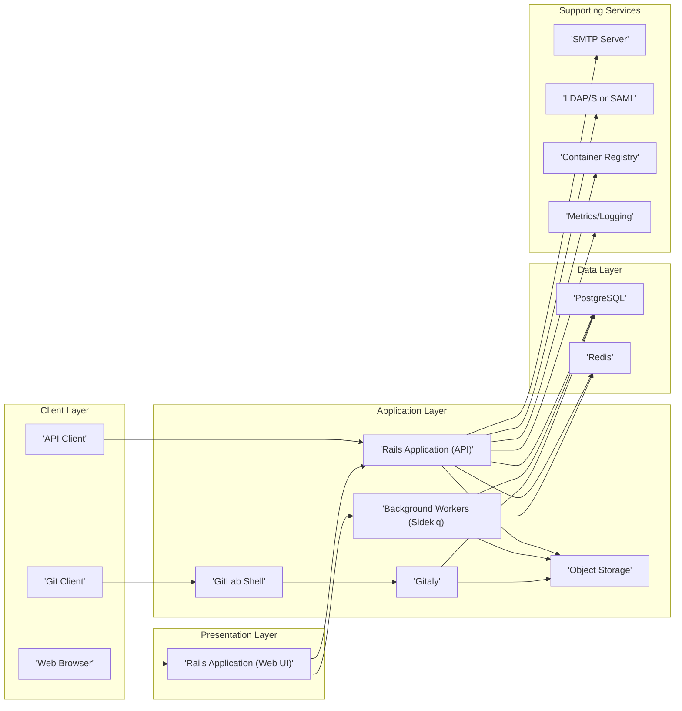

# Project Design Document: GitLab

**Project Name:** GitLab

**Project Repository:** [https://github.com/gitlabhq/gitlabhq](https://github.com/gitlabhq/gitlabhq)

**Document Version:** 1.1

**Date:** October 26, 2023

**Author:** AI Software Architect

## 1. Introduction

This document provides a detailed architectural overview of the GitLab project, focusing on its key components, their interactions, and the flow of data. This design document is specifically crafted to serve as a robust foundation for subsequent threat modeling activities. Recognizing the extensive nature of GitLab, this document concentrates on core functionalities crucial for source code management, issue tracking, Continuous Integration/Continuous Delivery (CI/CD), and user management. It aims to provide sufficient detail for security analysis without delving into every intricate implementation detail.

## 2. Goals

*   Deliver a clear, concise, and comprehensive architectural overview of the GitLab platform.
*   Precisely identify key components within the GitLab ecosystem and delineate their specific responsibilities.
*   Thoroughly describe the primary interactions and data flows that occur within the system.
*   Establish a solid and well-defined basis for identifying potential security threats, vulnerabilities, and attack vectors.

## 3. Target Audience

*   Security engineers and architects tasked with performing threat modeling and security assessments.
*   Development teams involved in building, extending, or integrating with the GitLab platform.
*   Operations teams responsible for the deployment, maintenance, and monitoring of GitLab instances.
*   Anyone requiring a detailed understanding of GitLab's architecture for security analysis.

## 4. System Overview

GitLab is a self-hosted, web-based DevOps lifecycle tool that provides integrated functionalities for software development. It encompasses a wide array of features designed to streamline the entire software development lifecycle, from planning and coding to building, testing, deploying, and monitoring. At its heart, GitLab is a Ruby on Rails application, leveraging a microservices architecture for certain components. Key functionalities include:

*   **Source Code Management (SCM):**  Provides Git repository hosting with features like branching, merging, and access control.
*   **Issue Tracking and Project Management:** Enables teams to plan, organize, and track their work through issues, epics, and milestones.
*   **Continuous Integration and Continuous Delivery (CI/CD):** Automates the build, test, and deployment processes for software applications.
*   **Container Registry:**  Allows for the storage and management of Docker container images.
*   **Security Scanning and Vulnerability Management:** Integrates security scanning tools to identify vulnerabilities in code and dependencies.
*   **Monitoring and Analytics:** Provides insights into application performance and system health.

## 5. Architectural Layers

GitLab's architecture can be logically divided into the following layers, each with distinct responsibilities:

*   **Client Layer:** Represents the various ways users and external systems interact with GitLab. This layer is the entry point for all user-initiated actions.
    *   Web Browsers: Used by human users to access the graphical user interface (UI) for most GitLab functionalities.
    *   Git Clients: Command-line tools used by developers for interacting with Git repositories (e.g., `git push`, `git pull`).
    *   API Clients: Applications or scripts that interact with GitLab programmatically through its RESTful API.
    *   Mobile Applications: (If applicable) Native applications designed for mobile devices to access GitLab features.
*   **Presentation Layer:**  Responsible for handling user interface rendering, user input processing, and communication with the Application Layer.
    *   Ruby on Rails Application (Web UI):  The primary web application responsible for serving the HTML, CSS, and JavaScript that constitute the user interface. It handles HTTP requests and responses, and manages user sessions.
*   **Application Layer:** Contains the core business logic, application services, and workflows that implement GitLab's features. This layer orchestrates data access and processing.
    *   Ruby on Rails Application (API): Provides the RESTful API endpoints for programmatic interaction with GitLab. It handles authentication, authorization, and request processing for API calls.
    *   Background Workers (Sidekiq):  A system for processing asynchronous tasks, such as sending emails, processing CI/CD jobs, and updating search indexes. This prevents blocking the main application thread.
    *   GitLab Shell: An authorization and access control layer for Git commands. It intercepts Git requests and determines if the user has the necessary permissions to perform the requested action.
    *   Gitaly: A service that provides high-level access to Git repositories stored on disk. It abstracts away the complexities of direct Git repository manipulation.
    *   Object Storage:  Used for storing large, unstructured data such as CI/CD artifacts, LFS (Large File Storage) objects, and user uploads. This offloads storage from the primary database.
*   **Data Layer:**  Responsible for the persistent storage and retrieval of data. This layer ensures data integrity and availability.
    *   PostgreSQL: The primary relational database used to store application data, including user information, project metadata, issue details, and CI/CD configurations.
    *   Redis: An in-memory data store used for caching frequently accessed data, managing background job queues for Sidekiq, and supporting real-time features like activity streams.
    *   Object Storage (e.g., AWS S3, Google Cloud Storage, Azure Blob Storage): Stores large binary files associated with GitLab projects.
*   **Supporting Services Layer:**  Encompasses external services and dependencies that GitLab relies on for various functionalities.
    *   SMTP Server: Used for sending email notifications to users.
    *   LDAP/S or SAML Providers: External identity providers used for user authentication and authorization.
    *   Container Registry: A service for storing and distributing Docker images used in CI/CD pipelines.
    *   Metrics and Logging Systems (e.g., Prometheus, Elasticsearch, Grafana): Used for monitoring GitLab's performance, collecting logs, and visualizing data.

## 6. Key Components and Interactions

### 6.1. Web UI Interaction

*   Users access GitLab functionalities through web browsers, interacting with the graphical user interface.
*   The 'Rails Application (Web UI)' receives HTTP requests from the browser, handles user input, and renders the appropriate web pages.
*   To fulfill user requests, the Web UI often communicates with the 'Rails Application (API)' to fetch or update data.
*   Data persistence and retrieval involve interactions with 'PostgreSQL' and potentially 'Redis' for caching.
*   File uploads and downloads may involve direct interaction with 'Object Storage'.

### 6.2. Git Client Interaction

*   Developers use Git clients to perform version control operations on repositories hosted in GitLab.
*   When a Git client interacts with GitLab, the request is first handled by 'GitLab Shell'.
*   'GitLab Shell' authenticates the user based on SSH keys or personal access tokens and authorizes the requested Git operation.
*   If authorized, 'GitLab Shell' invokes 'Gitaly' to execute the Git commands on the repository.
*   'Gitaly' directly interacts with the Git repository files on disk and may also access 'Object Storage' for LFS objects.
*   Metadata about repository changes is often updated in 'PostgreSQL'.

### 6.3. API Interaction

*   External applications, scripts, and services interact with GitLab programmatically through its RESTful API.
*   The 'Rails Application (API)' handles incoming API requests, performing authentication and authorization based on API keys, personal access tokens, or OAuth tokens.
*   API requests can trigger various actions, including creating issues, managing projects, triggering CI/CD pipelines, and retrieving data.
*   API interactions involve reading and writing data to 'PostgreSQL', 'Redis', and 'Object Storage', depending on the specific request.
*   Asynchronous tasks triggered by API calls are often handled by 'Background Workers (Sidekiq)'.

### 6.4. CI/CD Pipeline Execution

*   CI/CD pipelines are defined in `.gitlab-ci.yml` files within repositories and are executed by GitLab Runner.
*   When a pipeline is triggered (e.g., by a code push), the 'Rails Application (API)' creates pipeline job records in 'PostgreSQL'.
*   GitLab Runner, a separate agent, polls the 'Rails Application (API)' for new jobs.
*   Upon receiving a job, the Runner executes the steps defined in the pipeline, which may involve:
    *   Checking out code from 'Gitaly'.
    *   Pulling container images from the 'Container Registry'.
    *   Running tests and build processes.
    *   Pushing container images to the 'Container Registry'.
    *   Uploading artifacts to 'Object Storage'.
*   GitLab Runner reports the status of the job back to the 'Rails Application (API)', which updates the pipeline status in 'PostgreSQL'.

### 6.5. User Authentication

*   GitLab supports multiple authentication methods for users.
    *   Local authentication: Usernames and passwords stored in 'PostgreSQL'.
    *   LDAP/S: Authentication delegated to an external LDAP or Active Directory server.
    *   SAML: Authentication delegated to an external SAML identity provider.
    *   OAuth 2.0: Allows users to authenticate using third-party providers.
*   The 'Rails Application (Web UI)' and 'Rails Application (API)' handle authentication requests, potentially interacting with 'LDAP/S or SAML' providers.
*   Successful authentication results in the creation of a session, typically managed using cookies and stored in 'Redis'.

## 7. Data Flows

Here are detailed descriptions of key data flows within the GitLab system:

*   **Code Push Workflow:**
    *   A developer commits changes locally and initiates a `git push` command.
    *   The 'Git Client' communicates with 'GitLab Shell' over SSH or HTTPS.
    *   'GitLab Shell' authenticates the user using SSH keys or personal access tokens and authorizes the push operation based on repository permissions.
    *   'GitLab Shell' instructs 'Gitaly' to receive the pushed commits and update the repository.
    *   'Gitaly' writes the new commits and objects to the Git repository files on disk. For large files managed by LFS, 'Gitaly' interacts with 'Object Storage'.
    *   'Gitaly' updates the repository metadata, which is then reflected in 'PostgreSQL'.
    *   The push event may trigger 'Background Workers (Sidekiq)' to initiate CI/CD pipelines, send notifications, or update search indexes.
*   **Issue Creation Workflow:**
    *   A user creates a new issue through the 'Web Browser' interface or via the 'API Client'.
    *   The 'Rails Application (Web UI)' or 'Rails Application (API)' receives the issue data.
    *   The application logic validates the input and stores the issue details (title, description, assignee, etc.) in 'PostgreSQL'.
    *   'Background Workers (Sidekiq)' may be triggered to send email notifications to relevant users (e.g., assignees, watchers).
    *   The issue creation event may also be indexed in a search service (not explicitly shown in the diagram but often part of a full GitLab deployment).
*   **CI/CD Pipeline Execution Workflow:**
    *   A trigger event (e.g., code push, merge request, scheduled job) initiates a CI/CD pipeline.
    *   The 'Rails Application (API)' creates records for the pipeline and its individual jobs in 'PostgreSQL', based on the `.gitlab-ci.yml` configuration.
    *   Available GitLab Runner instances periodically poll the 'Rails Application (API)' for pending jobs.
    *   A Runner picks up a job and retrieves the job definition, including the script to execute and any required environment variables.
    *   The Runner may need to check out the relevant code from 'Gitaly'.
    *   The Runner might pull necessary Docker images from the 'Container Registry'.
    *   The Runner executes the job's script. This could involve building code, running tests, or deploying applications.
    *   If the job produces artifacts, the Runner uploads them to 'Object Storage'.
    *   The Runner reports the job's status (success, failure, etc.) and any logs back to the 'Rails Application (API)'.
    *   The 'Rails Application (API)' updates the pipeline and job statuses in 'PostgreSQL'. Notifications may be sent based on pipeline outcomes.

## 8. Technology Stack

*   **Programming Languages:** Ruby, Go, JavaScript
*   **Framework:** Ruby on Rails
*   **Database:** PostgreSQL
*   **Caching/Queue:** Redis
*   **Background Processing:** Sidekiq
*   **Git Management:** Gitaly
*   **Web Server:** Puma (typically)
*   **Object Storage:** AWS S3, Google Cloud Storage, Azure Blob Storage (configurable)
*   **Containerization:** Docker, Kubernetes (for deployment of GitLab itself and CI/CD jobs)
*   **Monitoring:** Prometheus, Grafana, Elasticsearch, Kibana (often used in conjunction)

## 9. Deployment Model

GitLab offers flexible deployment options:

*   **Self-Managed:** Organizations install and manage the entire GitLab stack on their own infrastructure (servers, cloud instances, etc.). This provides maximum control but requires significant operational overhead.
*   **SaaS (GitLab.com):** GitLab Inc. hosts and manages the platform as a service. Users access GitLab through a web browser without needing to manage the underlying infrastructure.
*   **Hybrid:** A combination of self-managed and SaaS components, where some data or functionalities might reside on-premises while others are in the cloud.

The chosen deployment model has a significant impact on the security perimeter and the responsibilities for securing the infrastructure.

## 10. Security Considerations (Detailed)

This section outlines key security considerations relevant for threat modeling:

*   **Authentication and Authorization:**
    *   **Weak Password Policies:**  Potential for brute-force attacks if password policies are not enforced.
    *   **Insecure Session Management:** Vulnerabilities in session handling could lead to session hijacking.
    *   **Insufficient Authorization Checks:**  Flaws in authorization logic could allow users to access resources they shouldn't.
    *   **Insecure API Key Management:**  Compromised API keys can grant unauthorized access.
    *   **Vulnerabilities in LDAP/S or SAML Integration:** Misconfigurations or vulnerabilities in external authentication providers can be exploited.
*   **Data Security:**
    *   **Data at Rest Encryption:** Lack of encryption for sensitive data in 'PostgreSQL' and 'Object Storage' could lead to data breaches.
    *   **Data in Transit Encryption:** Failure to enforce HTTPS can expose data transmitted between clients and the server.
    *   **Insufficient Access Controls to Data Stores:**  Unauthorized access to the database or object storage could compromise sensitive information.
*   **Input Validation and Output Encoding:**
    *   **Cross-Site Scripting (XSS):**  Insufficient sanitization of user-provided input can lead to XSS vulnerabilities.
    *   **SQL Injection:**  Improperly constructed database queries can be exploited to gain unauthorized access or modify data.
    *   **Command Injection:**  Vulnerabilities where user input is used to construct system commands.
*   **CI/CD Security:**
    *   **Insecure Pipeline Configurations:**  Loosely configured pipelines can introduce vulnerabilities.
    *   **Secret Sprawl:**  Storing secrets (API keys, passwords) directly in pipeline configurations is a risk.
    *   **Compromised Runners:**  If GitLab Runner instances are compromised, attackers could gain access to repositories and deploy malicious code.
    *   **Dependency Confusion:**  Potential for using malicious dependencies in CI/CD pipelines.
*   **Dependency Management:**
    *   **Vulnerable Dependencies:**  Using outdated or vulnerable libraries and components can introduce security risks.
    *   **Supply Chain Attacks:**  Compromised dependencies could be injected into the GitLab codebase.
*   **Rate Limiting and Denial of Service (DoS) Protection:**
    *   **Lack of Rate Limiting:**  Susceptible to brute-force attacks and other forms of abuse.
    *   **Resource Exhaustion:**  Malicious actors could potentially exhaust system resources, leading to denial of service.
*   **Logging and Monitoring:**
    *   **Insufficient Logging:**  Lack of comprehensive logging can hinder incident response and forensic analysis.
    *   **Inadequate Monitoring:**  Failure to monitor system activity can allow attacks to go undetected.
*   **Secrets Management:**
    *   **Hardcoded Secrets:**  Storing secrets directly in the codebase is a significant security risk.
    *   **Insecure Secret Storage:**  Using weak or default encryption for storing secrets.
*   **Network Security:**
    *   **Exposed Services:**  Unnecessary services exposed to the internet increase the attack surface.
    *   **Lack of Network Segmentation:**  Insufficient network segmentation can allow attackers to move laterally within the network.

## 11. Assumptions and Limitations

*   This document provides a generalized architectural overview. Specific implementations and configurations may vary.
*   The focus is on core functionalities. Less frequently used features or integrations may not be detailed.
*   The technology stack and specific versions of components are subject to change.
*   Security considerations are high-level and intended to guide further analysis. A dedicated security architecture document would provide more granular detail.
*   This document assumes a reasonably standard deployment of GitLab. Highly customized deployments may have different architectural characteristics.

## 12. Future Considerations

*   **Detailed Component Diagrams:**  Develop more granular diagrams for specific subsystems, such as the CI/CD pipeline execution engine or the authentication framework.
*   **Detailed Data Flow Diagrams:** Create diagrams illustrating specific user interactions and system processes with more emphasis on data transformation and security controls at each stage.
*   **Security Architecture Diagrams:**  Produce diagrams specifically highlighting security controls, trust boundaries, and potential attack paths within the GitLab architecture. This would include details on network segmentation, encryption boundaries, and authentication flows.
*   **Threat Modeling Artifacts:**  Generate preliminary threat lists and attack trees based on this design document to facilitate more structured threat analysis.
