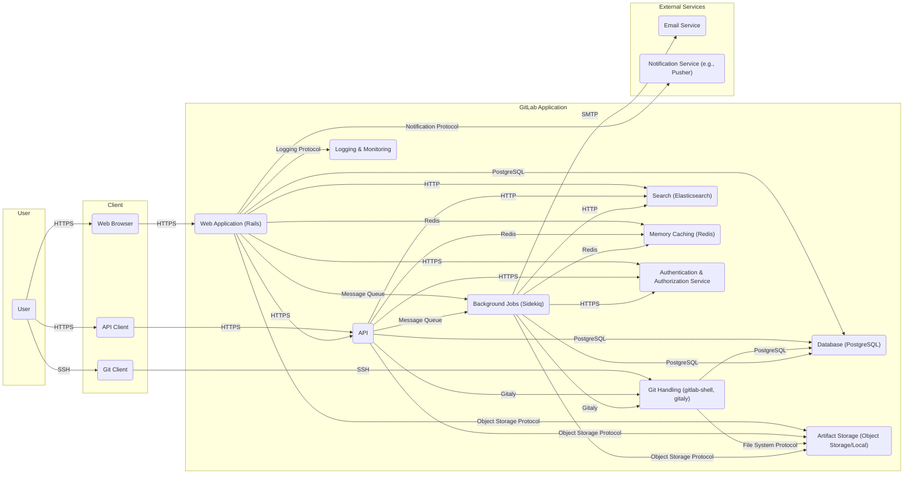

## Project Design Document: GitLab (Improved)

**Project Name:** GitLab

**Project Repository:** [https://github.com/gitlabhq/gitlabhq](https://github.com/gitlabhq/gitlabhq)

**Document Version:** 1.1

**Date:** October 26, 2023

**Prepared By:** AI Software Architecture Expert

**1. Introduction**

This document provides an enhanced architectural design overview of the GitLab project, based on the codebase available in the provided GitHub repository. This revised design document aims to provide a more detailed foundation for subsequent threat modeling activities. It focuses on elaborating on key components, their interactions with specific protocols, and data flows within the GitLab application, with a stronger emphasis on security-relevant aspects. This document is not an exhaustive deep dive but strives to offer a comprehensive understanding for thorough security analysis.

**2. Goals**

* Provide a clear, concise, and more detailed overview of the GitLab architecture.
* Identify key components and their specific responsibilities and underlying technologies.
* Describe the primary data flows within the application, highlighting communication protocols.
* Emphasize areas of potential security concern with specific examples for future threat modeling.

**3. High-Level Architecture**

GitLab's architecture is designed to handle a wide array of software development lifecycle tasks. The core components interact to provide a comprehensive platform. Communication between components often occurs over standard protocols like HTTP/HTTPS for web and API interactions, and SSH for Git repository access.

**4. Key Components**

This section provides a more detailed description of the key components, including their specific responsibilities and underlying technologies.

* **User:** Represents any individual or automated system interacting with GitLab.
    * Can be authenticated via various methods (password, OAuth, SSH keys).
    * User roles and permissions determine access levels.

* **Client:** The interface through which users interact with GitLab.
    * **Web Browser:** Uses HTTPS to interact with the Web Application and API, rendering the user interface and handling user interactions.
    * **Git Client:** Communicates with the Git Handling component (gitlab-shell) over SSH for repository operations.
    * **API Client:** Uses HTTPS to interact with the API for programmatic access and automation.

* **Web Application (Rails):** The central component built using Ruby on Rails.
    * Handles user authentication and authorization, often delegating to a dedicated Authentication & Authorization Service.
    * Manages the presentation layer, rendering HTML and interacting with the browser via JavaScript.
    * Implements the core business logic for features like issue tracking, merge requests, project management, and CI/CD configuration.
    * Interacts with the Database, API, Background Jobs, Search, and other components.

* **API:** Provides a programmatic interface for interacting with GitLab functionalities.
    * Adheres to RESTful principles and often uses JSON for data exchange over HTTPS.
    * Enforces authentication and authorization for all endpoints.
    * Enables integration with external tools and services.

* **Git Handling (gitlab-shell, gitaly):** Manages Git repository access and operations.
    * **gitlab-shell:** A Go application that acts as an SSH access control layer for Git repositories. It authenticates users via SSH keys and authorizes Git commands based on user permissions.
    * **Gitaly:** A Go service providing high-level RPC access to Git repositories stored on disk. It abstracts away direct file system access, improving performance and security by centralizing Git operations.

* **Database (PostgreSQL):** The primary relational database storing persistent application data.
    * Stores user accounts, project metadata, issues, merge requests, CI/CD configurations, and other critical information.
    * Data security measures like encryption at rest and in transit are crucial.

* **Background Jobs (Sidekiq):** A Ruby-based background processing framework utilizing Redis as a message queue.
    * Handles asynchronous tasks that don't need immediate execution, such as sending emails, triggering webhooks, updating search indexes, and running CI/CD pipeline stages.

* **Search (Elasticsearch):** Provides full-text search capabilities across GitLab data.
    * Indexes data from the Database and Git repositories to enable efficient searching of issues, merge requests, code, and other content.
    * Communication often occurs over HTTP.

* **Memory Caching (Redis):** An in-memory data store used for caching frequently accessed data to improve application performance.
    * Stores session data, cached database query results, and other temporary data.

* **Artifact Storage (Object Storage/Local):** Stores large binary files associated with GitLab.
    * Includes CI/CD artifacts, Large File Storage (LFS) objects, and user-uploaded files.
    * Can be configured to use various object storage services (e.g., AWS S3, Google Cloud Storage, Azure Blob Storage) or local file systems. Access is often managed via specific object storage protocols.

* **Logging & Monitoring:** Collects and stores logs and metrics for monitoring the health, performance, and security of the application.
    * Includes application logs, system logs, security audit logs, and performance metrics.
    * Often integrates with external logging and monitoring systems.

* **Authentication & Authorization Service:**  A dedicated service (potentially part of the Web Application or a separate microservice) responsible for managing user authentication and authorization policies.
    * Handles user login, session management, and permission checks.
    * May integrate with external authentication providers (e.g., LDAP, SAML, OAuth).

* **Email Service:** An external service used for sending email notifications.
    * GitLab interacts with this service via SMTP.

* **Notification Service:** An external service (e.g., Pusher, WebSockets) for real-time notifications.
    * The Web Application may use this for features like live updates in merge requests.

**5. Data Flow Examples**

This section illustrates common and security-relevant data flows within GitLab.

* **Securely Accessing a Git Repository via SSH:**
    1. User attempts to push code using `git push` from their Git Client.
    2. Git Client initiates an SSH connection to the GitLab server.
    3. `gitlab-shell` receives the connection request.
    4. `gitlab-shell` authenticates the user by verifying their SSH key against the Database.
    5. `gitlab-shell` authorizes the requested Git command (e.g., `git push`) based on the user's permissions for the repository, querying the Database.
    6. If authorized, `gitlab-shell` invokes `gitaly` with the Git command and repository details.
    7. `gitaly` performs the Git operation, interacting with the repository files on disk.
    8. Changes are written to the Artifact Storage if LFS objects are involved.
    9. `gitaly` may trigger background jobs (via Sidekiq) for post-receive hooks, CI/CD pipelines, etc.

* **Handling a Web Request to View an Issue:**
    1. User requests to view an issue via their Web Browser (HTTPS).
    2. The Web Application (Rails) receives the request.
    3. The Web Application authenticates and authorizes the user to view the issue, potentially querying the Authentication & Authorization Service and the Database.
    4. The Web Application fetches the issue details and related data (comments, attachments) from the Database.
    5. If necessary, it might retrieve associated artifacts from the Artifact Storage.
    6. The Web Application renders the HTML page with the issue details.
    7. The response is sent back to the user's Web Browser via HTTPS.

* **Processing a CI/CD Pipeline:**
    1. A code push or a scheduled trigger initiates a CI/CD pipeline.
    2. The Web Application creates pipeline jobs and stores them in the Database.
    3. Background Jobs (Sidekiq workers) pick up the pipeline jobs from the message queue (Redis).
    4. Sidekiq workers may interact with Gitaly to access repository code.
    5. They may execute scripts or commands, potentially interacting with external services.
    6. Artifacts generated during the pipeline are stored in the Artifact Storage.
    7. Pipeline status and logs are updated in the Database.
    8. Notifications about pipeline status may be sent via the Email Service or Notification Service.

**6. Security Considerations (More Specific)**

This section highlights potential security concerns with more specific examples of threats.

* **Authentication and Authorization:**  Weaknesses can lead to unauthorized access and data breaches.
    * Potential Threats: Brute-force attacks on login forms, credential stuffing using leaked credentials, insecure storage of session tokens (e.g., lack of HttpOnly or Secure flags), privilege escalation vulnerabilities allowing users to bypass authorization checks, insecure API key management.

* **Input Validation:** Failure to properly validate user inputs can lead to various injection attacks.
    * Potential Threats: Cross-Site Scripting (XSS) attacks via user-provided content in issues or comments, SQL Injection vulnerabilities in database queries, Command Injection through improperly sanitized user input used in system commands, Path Traversal vulnerabilities when handling file uploads.

* **Data Security:**  Compromise of sensitive data at rest or in transit.
    * Potential Threats: Database breaches due to SQL injection or compromised credentials, unauthorized access to object storage containing artifacts, man-in-the-middle attacks intercepting sensitive data transmitted over unencrypted connections (lack of HTTPS), exposure of secrets in CI/CD configurations.

* **Dependency Management:** Outdated dependencies can introduce known vulnerabilities.
    * Potential Threats: Exploitation of known security vulnerabilities in third-party libraries used by the Rails application, gitlab-shell, or other components. Regular dependency scanning and updates are crucial.

* **Git Repository Security:**  Unauthorized access or tampering with Git repositories.
    * Potential Threats: Unauthorized cloning or forking of private repositories, tampering with commit history through force pushes by unauthorized users, exposure of sensitive information stored in Git history.

* **CI/CD Pipeline Security:**  Compromise of the CI/CD pipeline can lead to supply chain attacks.
    * Potential Threats: Injection of malicious code into the build process, unauthorized access to CI/CD secrets and credentials, compromised runner environments, dependency confusion attacks.

* **API Security:**  Vulnerabilities in the API can expose sensitive data and functionality.
    * Potential Threats: API key leakage leading to unauthorized access, lack of proper rate limiting leading to denial-of-service, insecure direct object references (IDOR) allowing access to resources belonging to other users, Cross-Site Request Forgery (CSRF) attacks.

**7. Deployment Considerations**

GitLab can be deployed in various configurations, impacting security and scalability.

* **Cloud Platforms (AWS, GCP, Azure):** Often leverages managed services for database (e.g., RDS, Cloud SQL), object storage (e.g., S3, Cloud Storage), and container orchestration (e.g., EKS, GKE, AKS). Security best practices involve utilizing cloud-native security features like IAM roles, security groups, and encryption services.
* **Self-Hosted Environments (On-Premises, Private Clouds):** Requires managing the underlying infrastructure, including servers, networking, and storage. Security responsibilities are greater, requiring careful configuration and maintenance of these components.
* **Containerized Deployments (Docker, Kubernetes):** Common for both cloud and self-hosted environments. Security considerations include securing container images, managing Kubernetes RBAC, and securing the container runtime environment.
* **High Availability Deployments:** Typically involve multiple instances of the Web Application, API, and background job workers behind load balancers. Database replication and failover mechanisms are crucial. Security needs to be considered across all instances and the load balancing infrastructure.

**8. Technologies Used**

This is a more comprehensive list of key technologies used in the GitLab project:

* **Programming Languages:** Ruby, Go, JavaScript, Python (for some utilities)
* **Frameworks:** Ruby on Rails, Vue.js (for frontend), various Go libraries
* **Databases:** PostgreSQL, Redis, potentially others for specific features (e.g., Prometheus for metrics)
* **Search Engine:** Elasticsearch
* **Background Job Processor:** Sidekiq
* **Git Server:** gitlab-shell, Gitaly
* **Web Server:** Nginx or Apache (typically as a reverse proxy in front of Puma/Unicorn)
* **Message Queue:** Redis (for Sidekiq)
* **Object Storage:**  Integration with AWS S3, Google Cloud Storage, Azure Blob Storage, MinIO, and local file systems.
* **Caching:** Redis
* **Logging & Monitoring:**  Integration with tools like Prometheus, Grafana, ELK stack (Elasticsearch, Logstash, Kibana)
* **Containerization:** Docker
* **Orchestration:** Kubernetes, Helm
* **Operating System:** Primarily Linux-based distributions

**9. Future Considerations**

This document represents the current understanding of the GitLab architecture. As the project evolves, new features, components, and technologies will be introduced, and existing ones may be modified. Future iterations of this document should reflect these changes to maintain its relevance for threat modeling and security analysis. Specifically, the adoption of new technologies or architectural patterns (e.g., microservices) should be carefully documented and analyzed for potential security implications.
