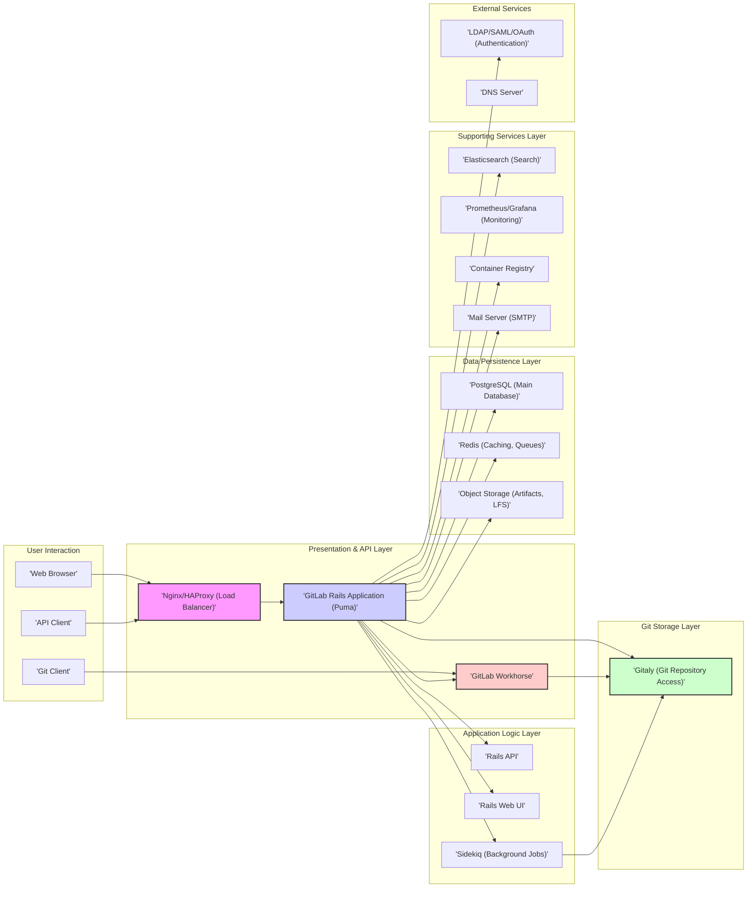

## Project Design Document: GitLab (Improved)

**Project Name:** GitLab

**Project Repository:** [https://github.com/gitlabhq/gitlabhq](https://github.com/gitlabhq/gitlabhq)

**Document Version:** 2.0

**Date:** October 26, 2023

**Prepared By:** AI Software Architecture Expert

**1. Introduction**

This document provides an enhanced architectural design overview of the GitLab platform, building upon the previous version. It aims to offer a more granular understanding of the key components, their intricate interactions, and the overall system structure. This refined document is specifically tailored to serve as a robust foundation for subsequent threat modeling activities, enabling a deeper and more comprehensive analysis of potential security vulnerabilities and attack vectors within the GitLab ecosystem.

**2. Goals and Objectives**

*   Deliver a more detailed and precise architectural overview of the GitLab platform.
*   Identify and describe the major components with greater specificity regarding their internal functions and dependencies.
*   Illustrate the key interactions and data flows between components with more context and examples.
*   Establish a clearer and more comprehensive understanding of the system's architecture specifically for security analysis and threat identification.
*   Serve as a more effective and informative input for threat modeling exercises, facilitating the identification of a wider range of potential security risks and attack surfaces.

**3. System Architecture Overview**

GitLab's architecture is a multi-faceted system designed to provide a complete DevOps lifecycle platform. It can be conceptually divided into several interconnected layers, each with distinct responsibilities:

*   **User Interface (Presentation) Layer:**  Provides the means for users to interact with GitLab, primarily through web browsers and APIs.
*   **API Layer:** Exposes programmatic interfaces for interacting with GitLab's functionalities, enabling integrations with other systems.
*   **Application Logic Layer:** Contains the core business logic of GitLab, orchestrating interactions between various components and enforcing business rules.
*   **Data Persistence Layer:** Manages the persistent storage of all application data, including user information, repositories, and configuration.
*   **Background Processing Layer:** Handles asynchronous tasks and deferred operations, ensuring responsiveness of the main application.
*   **Git Storage Layer:** Specifically manages the storage and access to Git repositories.
*   **Supporting Services Layer:**  Includes auxiliary services that provide essential functionalities like search, caching, and monitoring.

**4. Key Components and their Responsibilities (Detailed)**

*   **Web Browser:** The primary graphical interface for users to access and interact with GitLab's features.
*   **Git Client:** Command-line tools used by developers to interact with Git repositories hosted on GitLab, performing operations like cloning, pushing, and pulling.
*   **API Client:** Applications or scripts that interact with GitLab programmatically through its RESTful API or GraphQL API.
*   **Nginx/HAProxy (Load Balancer):**  Distributes incoming HTTP and HTTPS traffic across multiple instances of the GitLab Rails application, ensuring high availability and scalability. It also handles SSL termination.
*   **GitLab Rails Application (Puma):** The core of GitLab, a Ruby on Rails application responsible for handling user requests, implementing business logic, managing user authentication and authorization, and coordinating interactions between other components. Puma is the multithreaded application server.
    *   **Rails API:**  A component within the Rails application that handles incoming API requests, authenticates them, and processes them according to the defined API endpoints.
    *   **Rails Web UI:**  The component responsible for rendering the HTML and JavaScript that forms the user interface presented in the web browser.
*   **GitLab Workhorse:** A Go application acting as a smart reverse proxy sitting in front of the Rails application. It handles computationally intensive and long-running tasks such as:
    *   Serving Git repository data (through Gitaly).
    *   Handling large file uploads and downloads.
    *   Processing Git push and pull requests.
    *   Serving static assets.
    This offloads these tasks from the main Rails application, improving performance and responsiveness.
*   **Sidekiq (Background Jobs):** A Ruby-based background processing framework that executes asynchronous tasks outside the main request-response cycle. Examples include:
    *   Sending email notifications.
    *   Processing CI/CD pipeline jobs.
    *   Updating search indexes in Elasticsearch.
    *   Performing house-keeping tasks.
*   **Gitaly (Git Repository Access):** A service written in Go that provides high-performance, reliable, and secure access to Git repositories stored on disk. It abstracts away the complexities of direct file system access and offers a gRPC interface for other GitLab components to interact with Git data.
*   **Redis (Caching, Queues):** An in-memory data store used for various purposes:
    *   **Caching:** Storing frequently accessed data to reduce database load and improve response times.
    *   **Message Broker:**  Used by Sidekiq for managing background job queues.
    *   **Session Storage:**  Storing user session data.
*   **PostgreSQL (Main Database):** The primary relational database used to store persistent application data, including:
    *   User accounts and permissions.
    *   Issue tracking data.
    *   Merge request information.
    *   CI/CD configuration and results.
    *   Project metadata.
*   **Object Storage (Artifacts, LFS):** A scalable storage solution for large binary files:
    *   **CI/CD Artifacts:**  Output files generated by CI/CD pipeline jobs.
    *   **Git Large File Storage (LFS) Objects:**  Large files tracked by Git LFS.
    Common implementations include AWS S3, Google Cloud Storage, or MinIO.
*   **Elasticsearch (Search):** A distributed search and analytics engine used to provide powerful and efficient search capabilities across various GitLab data, including:
    *   Code in repositories.
    *   Issues and merge requests.
    *   User profiles.
*   **Prometheus/Grafana (Monitoring):** A combination of tools used for monitoring the health and performance of the GitLab instance:
    *   **Prometheus:** Collects metrics from various GitLab components.
    *   **Grafana:** Visualizes these metrics in dashboards, providing insights into system performance and potential issues.
*   **Container Registry:** A private registry for storing and managing Docker images. It's used for:
    *   Storing images used in CI/CD pipelines.
    *   Providing a central repository for container images within an organization.
*   **Mail Server (SMTP):** An external service used for sending email notifications to users for various events, such as issue updates, merge request approvals, and password resets.
*   **LDAP/SAML/OAuth (Authentication):** External authentication providers used to verify user identities. GitLab integrates with these services to allow users to log in using their existing credentials.
*   **DNS Server:** Resolves domain names to IP addresses, enabling access to the GitLab instance.

**5. Key Interactions and Data Flows (Detailed Examples)**

*   **User Authentication (with External Provider):**
    *   User attempts to log in via the web browser.
    *   Nginx forwards the request to the GitLab Rails application.
    *   The Rails application redirects the user to the configured external authentication provider (e.g., LDAP, SAML).
    *   The user authenticates with the external provider.
    *   The external provider redirects the user back to the GitLab Rails application with an authentication assertion.
    *   The Rails application validates the assertion and establishes a session for the user.
*   **Code Push (Detailed Flow):**
    *   Developer uses `git push` from their local machine.
    *   The Git client communicates with GitLab Workhorse over SSH or HTTPS.
    *   GitLab Workhorse authenticates the user based on SSH keys or HTTP credentials.
    *   GitLab Workhorse authorizes the push operation.
    *   GitLab Workhorse streams the received Git objects to Gitaly.
    *   Gitaly writes the new objects to the repository on disk.
    *   Gitaly sends a post-receive hook notification to the Rails application.
    *   The Rails application queues background jobs in Sidekiq to update repository indexes, trigger CI/CD pipelines, and send notifications.
*   **Issue Creation (with Search Indexing):**
    *   User creates a new issue via the web browser.
    *   Nginx forwards the request to the GitLab Rails application.
    *   The Rails application validates the input and stores the issue details in the PostgreSQL database.
    *   The Rails application queues a background job in Sidekiq to index the new issue in Elasticsearch.
    *   Sidekiq processes the job and sends the issue data to Elasticsearch for indexing.
    *   Notifications might be sent via Sidekiq and the mail server.
*   **CI/CD Pipeline Execution (with Container Registry and Object Storage):**
    *   A code push or a scheduled trigger initiates a CI/CD pipeline.
    *   The Rails application creates CI/CD job definitions and stores them in the database.
    *   Runners (separate agents) poll the Rails application for new jobs.
    *   A runner picks up a job and may pull necessary Docker images from the Container Registry.
    *   The runner executes the job steps, potentially generating artifacts.
    *   The runner uploads the generated artifacts to Object Storage.
    *   The runner reports the job status back to the Rails application.
    *   The Rails application updates the pipeline status in the database and may send notifications.
*   **API Request (Example: Fetching Project Details):**
    *   An API client sends a GET request to `/api/v4/projects/:id`.
    *   Nginx forwards the request to the GitLab Rails application.
    *   The Rails API component authenticates and authorizes the request.
    *   The Rails application queries the PostgreSQL database to retrieve the project details.
    *   The Rails application formats the response as JSON and sends it back to the API client.

**6. Security Considerations (Enhanced)**

*   **Authentication and Authorization:** Robust mechanisms for verifying user identities (local accounts, LDAP, SAML, OAuth) and controlling access to resources based on roles and permissions. This includes multi-factor authentication (MFA) support.
*   **Input Validation and Output Encoding:** Rigorous validation of all user-provided data to prevent injection attacks (SQL injection, cross-site scripting, command injection). Proper encoding of output to prevent interpretation of malicious scripts.
*   **Data Encryption:** Encryption of sensitive data at rest (using database encryption, object storage encryption) and in transit (HTTPS enforced, SSH for Git operations).
*   **Rate Limiting and Abuse Prevention:** Mechanisms to limit the number of requests from a single user or IP address to prevent denial-of-service attacks and abuse of API endpoints.
*   **Regular Security Updates and Patching:**  A process for promptly applying security patches to the GitLab application, its dependencies, and the underlying operating system.
*   **Secure Configuration Management:**  Following security best practices for configuring all components, including disabling unnecessary features and setting strong passwords.
*   **Network Segmentation and Firewalls:**  Dividing the infrastructure into isolated networks and using firewalls to control traffic flow and limit the impact of a potential breach.
*   **Security Auditing and Logging:** Comprehensive logging of security-related events for auditing and incident response purposes.
*   **Vulnerability Scanning and Penetration Testing:** Regular security assessments to identify potential vulnerabilities.
*   **Content Security Policy (CSP):**  Using CSP headers to mitigate the risk of cross-site scripting attacks.
*   **Cross-Origin Resource Sharing (CORS):**  Careful configuration of CORS policies to control which domains can access GitLab's resources.
*   **Protection against Common Web Attacks:** Implementation of defenses against OWASP Top 10 vulnerabilities.

**7. Technologies Used**

*   **Primary Programming Languages:** Ruby, Go, JavaScript
*   **Core Framework:** Ruby on Rails
*   **Relational Database:** PostgreSQL
*   **In-Memory Data Store:** Redis
*   **Web Servers/Load Balancers:** Nginx, HAProxy
*   **Background Processing Framework:** Sidekiq
*   **Git Repository Management Service:** Gitaly
*   **Search and Analytics Engine:** Elasticsearch
*   **Object Storage Solutions:** AWS S3, Google Cloud Storage (or compatible S3-like storage)
*   **Containerization Technologies:** Docker, Kubernetes (often used for deployment)
*   **Monitoring and Alerting:** Prometheus, Grafana
*   **Message Queue (for Background Jobs):** Redis
*   **Communication Protocol (for Gitaly):** gRPC

**8. Deployment Model (Common Variations)**

GitLab offers flexible deployment options, each with its own architectural nuances and security considerations:

*   **Self-Managed (On-Premise or Cloud IaaS):** Organizations install and manage the entire GitLab stack on their own infrastructure, providing maximum control but requiring significant operational overhead. Security is primarily the responsibility of the deploying organization.
*   **GitLab.com (SaaS):** GitLab Inc. hosts and manages the entire platform, offering a fully managed service. Security is a shared responsibility, with GitLab Inc. handling infrastructure and application security.
*   **GitLab Dedicated (Single-Tenant SaaS):** A single-tenant instance of GitLab hosted and managed by GitLab Inc., offering more isolation and customization options compared to the multi-tenant SaaS offering.
*   **Hybrid Deployments:** Combinations of self-managed and SaaS components, such as using GitLab.com for some projects and a self-managed instance for others.

**9. Future Considerations**

*   Detailed diagrams illustrating the internal architecture of individual components like Gitaly and the Rails application.
*   Mapping of specific security controls to each component and data flow.
*   Identification of trust boundaries within the system to pinpoint critical areas for security focus.
*   Analysis of potential attack surfaces and common attack vectors relevant to each component.
*   Documentation of specific security policies and procedures implemented within GitLab.

This improved document provides a more comprehensive and detailed understanding of the GitLab architecture, specifically tailored for effective threat modeling. It highlights key components, their interactions, and crucial security considerations, serving as a valuable resource for identifying and mitigating potential security risks.