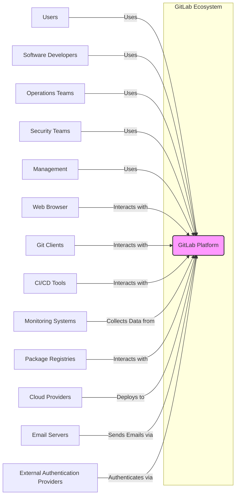
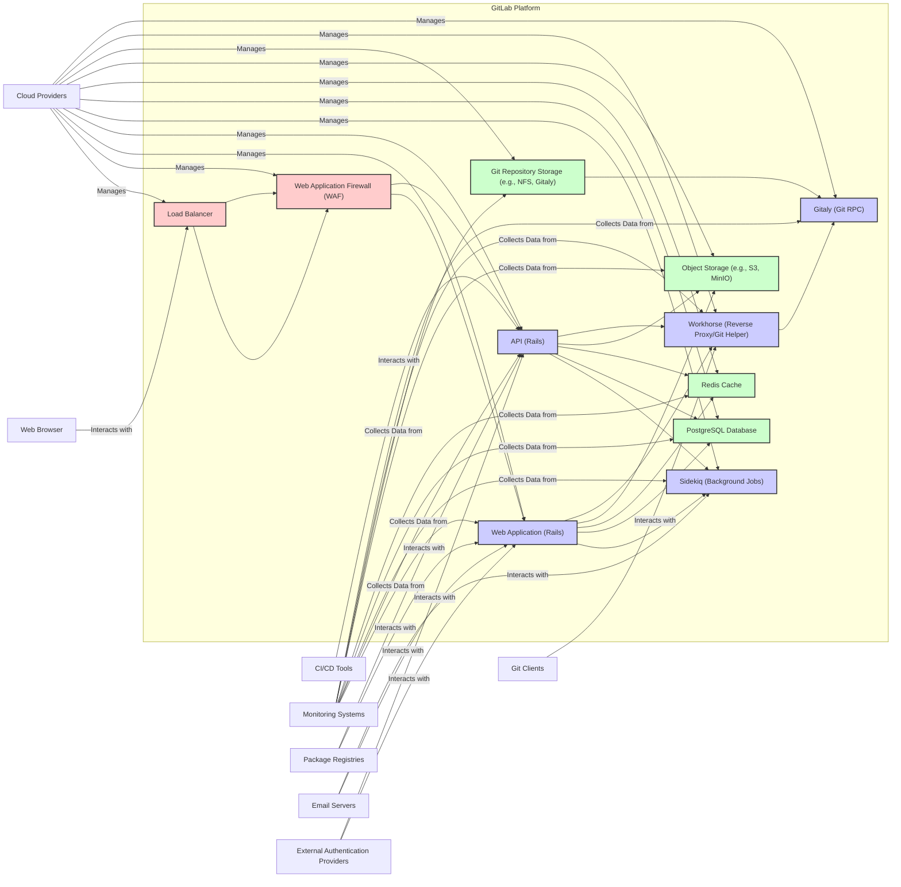

# BUSINESS POSTURE

- Business Priorities and Goals:
 - GitLab is a comprehensive DevOps platform that aims to streamline and accelerate the software development lifecycle.
 - Key business priorities include:
  - Providing a single application for the entire DevOps lifecycle, from planning and source code management to CI/CD, security, and monitoring.
  - Enabling collaboration and efficiency for development, operations, and security teams.
  - Supporting a wide range of software development methodologies and deployment environments.
  - Offering both self-managed and SaaS (GitLab.com) deployment options to cater to diverse customer needs.
  - Ensuring the security and compliance of the platform and the software developed using it.
 - The primary business goal is to be the leading DevOps platform, empowering organizations to deliver software faster and more securely.

- Most Important Business Risks:
 - Data breaches and data loss: GitLab stores sensitive data, including source code, credentials, and customer data. A breach could lead to significant financial and reputational damage.
 - Service disruption and unavailability: GitLab is a critical tool for software development. Downtime can halt development processes and impact business operations.
 - Security vulnerabilities in the platform: Vulnerabilities in GitLab itself could be exploited to compromise user data or systems.
 - Compliance violations: GitLab must comply with various regulations (e.g., GDPR, SOC 2, HIPAA depending on customer base and deployment) related to data privacy and security.
 - Supply chain attacks: Compromise of GitLab's build and release process could lead to the distribution of malicious software to users.
 - Loss of customer trust: Security incidents and lack of reliability can erode customer trust and lead to customer churn.

# SECURITY POSTURE

- Existing Security Controls:
 - security control Authentication: GitLab supports various authentication methods, including username/password, LDAP, SAML, OAuth, and personal access tokens. Implemented in GitLab codebase and configurable through the user interface and administration settings.
 - security control Authorization: GitLab employs a granular permission model to control access to projects, groups, and features based on user roles. Implemented in GitLab codebase and enforced at the application level.
 - security control Input Validation: GitLab performs input validation to prevent common web vulnerabilities such as cross-site scripting (XSS) and SQL injection. Implemented in GitLab codebase, throughout the application layers.
 - security control Cryptography: GitLab uses encryption for sensitive data at rest and in transit (HTTPS). Implemented in GitLab codebase and infrastructure configuration.
 - security control Security Scanning: GitLab integrates security scanning tools (SAST, DAST, dependency scanning, container scanning) into the CI/CD pipeline. Implemented as part of GitLab CI/CD features and integrated security scanners.
 - security control Access Control: GitLab enforces access control lists (ACLs) and role-based access control (RBAC) to manage user permissions. Implemented in GitLab codebase and administrative features.
 - security control Monitoring and Logging: GitLab provides extensive logging and monitoring capabilities for security events and system performance. Implemented in GitLab codebase and infrastructure monitoring tools.
 - security control Incident Response: GitLab has an incident response plan to address security incidents and vulnerabilities. Described in GitLab's security documentation and operational procedures.
 - security control Secure Software Development Lifecycle (SSDLC): GitLab follows a secure software development lifecycle, including security reviews, penetration testing, and vulnerability management. Described in GitLab's security documentation and development processes.
 - security control Regular Security Audits and Penetration Testing: GitLab undergoes regular security audits and penetration testing by internal and external security experts. Described in GitLab's security documentation and compliance reports.
 - security control Vulnerability Management Program: GitLab has a vulnerability management program to track, prioritize, and remediate security vulnerabilities. Described in GitLab's security documentation and vulnerability disclosure policy.
 - security control Security Awareness Training: GitLab provides security awareness training to its employees. Described in GitLab's internal security policies and training programs.
 - security control Infrastructure Security: GitLab's infrastructure (for GitLab.com) is secured using industry best practices, including firewalls, intrusion detection systems, and regular security patching. Implemented in GitLab's infrastructure and cloud provider configurations.
 - security control Data Encryption at Rest and in Transit: GitLab encrypts sensitive data at rest and in transit using strong encryption algorithms. Implemented in GitLab codebase, database configurations, and network configurations.

- Accepted Risks:
 - accepted risk Complexity of the codebase: GitLab is a large and complex application, which can increase the attack surface and the likelihood of vulnerabilities. Accepted due to the extensive functionality and features offered by GitLab.
 - accepted risk Open Source Nature: While transparency is a benefit, the open-source nature of GitLab means that vulnerabilities are publicly disclosed, potentially giving attackers more information. Accepted as part of the open-source development model.
 - accepted risk Third-party dependencies: GitLab relies on numerous third-party libraries and components, which can introduce vulnerabilities if not properly managed. Accepted with mitigation through dependency scanning and management processes.
 - accepted risk User-generated content: GitLab allows users to upload and store various types of content, which could potentially include malicious code or data. Accepted with mitigation through input validation and content security policies.

- Recommended Security Controls:
 - security control Supply Chain Security: Implement stricter controls over third-party dependencies, including dependency pinning, vulnerability scanning, and provenance checks.
 - security control Enhanced Monitoring and Threat Intelligence: Implement advanced security monitoring and threat intelligence capabilities to proactively detect and respond to security threats.
 - security control Runtime Application Self-Protection (RASP): Consider implementing RASP to protect against runtime attacks.
 - security control Security Champions Program: Establish a security champions program within development teams to promote security awareness and best practices.
 - security control Bug Bounty Program: Maintain and enhance a bug bounty program to incentivize external security researchers to find and report vulnerabilities.

- Security Requirements:
 - Authentication:
  - Requirement: Strong multi-factor authentication (MFA) should be enforced for administrators and highly privileged users.
  - Requirement: Support for various authentication protocols (SAML, OAuth, LDAP) should be maintained for enterprise integration.
  - Requirement: Password policies should be configurable and enforced to ensure strong passwords.
 - Authorization:
  - Requirement: Granular role-based access control (RBAC) should be enforced across all features and resources.
  - Requirement: Least privilege principle should be applied to user permissions and access rights.
  - Requirement: Authorization decisions should be consistently enforced and auditable.
 - Input Validation:
  - Requirement: All user inputs should be validated to prevent injection attacks (XSS, SQL injection, command injection, etc.).
  - Requirement: Input validation should be performed on both the client-side and server-side.
  - Requirement: Input validation rules should be regularly reviewed and updated to address new attack vectors.
 - Cryptography:
  - Requirement: Strong encryption algorithms should be used for data at rest and in transit.
  - Requirement: Key management processes should be secure and robust.
  - Requirement: Cryptographic libraries and implementations should be regularly updated to address known vulnerabilities.
 - Security Logging and Auditing:
  - Requirement: Comprehensive security logs should be generated and stored securely.
  - Requirement: Security logs should be regularly reviewed and analyzed for security incidents.
  - Requirement: Auditing capabilities should be in place to track user actions and system events.
 - Secure Configuration:
  - Requirement: GitLab and its components should be securely configured according to security best practices.
  - Requirement: Security configurations should be regularly reviewed and hardened.
  - Requirement: Default configurations should be secure and minimize the attack surface.

# DESIGN

## C4 CONTEXT



- Context Diagram Elements:
 - Element:
  - Name: GitLab Platform
  - Type: Software System
  - Description: GitLab is a web-based DevOps lifecycle tool that provides source code management (SCM), continuous integration (CI), continuous delivery (CD), security scanning, and project management capabilities. It is used by development, operations, and security teams to collaborate on software development and deployment.
  - Responsibilities:
   - Source code management and version control.
   - Continuous integration and continuous delivery automation.
   - Issue tracking and project management.
   - Security scanning and vulnerability management.
   - User authentication and authorization.
   - Platform administration and configuration.
  - Security controls:
   - security control Authentication and authorization mechanisms.
   - security control Input validation and output encoding.
   - security control Encryption of data at rest and in transit.
   - security control Security scanning and vulnerability management tools.
   - security control Audit logging and monitoring.
 - Element:
  - Name: Users
  - Type: Actor
  - Description: End-users who access GitLab through a web browser to interact with projects, issues, and other features.
  - Responsibilities:
   - Accessing project information and collaborating on projects.
   - Reporting issues and requesting features.
   - Reviewing code and participating in discussions.
  - Security controls:
   - security control User authentication (username/password, SSO).
   - security control Session management.
   - security control Browser security controls.
 - Element:
  - Name: Software Developers
  - Type: Actor
  - Description: Developers who use GitLab for source code management, collaboration, and CI/CD.
  - Responsibilities:
   - Writing and committing code.
   - Creating merge requests and reviewing code.
   - Configuring CI/CD pipelines.
   - Managing project repositories.
  - Security controls:
   - security control Git client authentication (SSH keys, personal access tokens).
   - security control Code review processes.
   - security control Secure coding practices.
 - Element:
  - Name: Operations Teams
  - Type: Actor
  - Description: Operations teams who use GitLab for infrastructure management, deployment automation, and monitoring.
  - Responsibilities:
   - Configuring and managing GitLab infrastructure.
   - Deploying applications using GitLab CI/CD.
   - Monitoring system performance and availability.
   - Managing access control and security settings.
  - Security controls:
   - security control Infrastructure security hardening.
   - security control Access control to infrastructure and GitLab administration.
   - security control Monitoring and alerting systems.
 - Element:
  - Name: Security Teams
  - Type: Actor
  - Description: Security teams who use GitLab for security scanning, vulnerability management, and security policy enforcement.
  - Responsibilities:
   - Configuring and managing security scanning tools.
   - Reviewing security scan results and managing vulnerabilities.
   - Defining and enforcing security policies.
   - Conducting security audits and penetration testing.
  - Security controls:
   - security control Security scanning tools and configurations.
   - security control Vulnerability management processes.
   - security control Security policy enforcement mechanisms.
 - Element:
  - Name: Management
  - Type: Actor
  - Description: Managers and executives who use GitLab for project oversight, reporting, and strategic decision-making.
  - Responsibilities:
   - Monitoring project progress and performance.
   - Reviewing reports and dashboards.
   - Making strategic decisions based on project data.
   - Managing budgets and resources.
  - Security controls:
   - security control Access control to sensitive project data and reports.
   - security control Audit logging of management actions.
 - Element:
  - Name: Web Browser
  - Type: Software System
  - Description: Web browsers used by users to access the GitLab web interface.
  - Responsibilities:
   - Rendering the GitLab web application.
   - Handling user interactions and requests.
   - Displaying project information and features.
  - Security controls:
   - security control Browser security features (CSP, XSS protection).
   - security control HTTPS communication.
 - Element:
  - Name: Git Clients
  - Type: Software System
  - Description: Git command-line clients and GUI applications used by developers to interact with GitLab repositories.
  - Responsibilities:
   - Cloning and pushing code to GitLab repositories.
   - Managing branches and merge requests.
   - Interacting with Git version control system.
  - Security controls:
   - security control Git client authentication (SSH keys, personal access tokens).
   - security control Secure communication protocols (SSH, HTTPS).
 - Element:
  - Name: CI/CD Tools
  - Type: Software System
  - Description: External CI/CD tools that may integrate with GitLab for triggering pipelines or reporting build status.
  - Responsibilities:
   - Triggering GitLab CI/CD pipelines.
   - Receiving build status updates from GitLab.
   - Integrating with GitLab's API for CI/CD workflows.
  - Security controls:
   - security control API authentication and authorization.
   - security control Secure communication protocols (HTTPS).
 - Element:
  - Name: Monitoring Systems
  - Type: Software System
  - Description: External monitoring systems that collect metrics and logs from GitLab for performance monitoring and security analysis.
  - Responsibilities:
   - Collecting metrics and logs from GitLab components.
   - Providing dashboards and alerts for system performance and security events.
   - Integrating with GitLab's monitoring endpoints.
  - Security controls:
   - security control Secure access to monitoring data.
   - security control Secure communication protocols for data collection.
 - Element:
  - Name: Package Registries
  - Type: Software System
  - Description: External package registries (e.g., npm, Maven, Docker Registry) that GitLab interacts with for dependency management and container image storage.
  - Responsibilities:
   - Downloading dependencies during CI/CD builds.
   - Publishing container images and packages.
   - Storing and managing software packages.
  - Security controls:
   - security control Authentication and authorization for registry access.
   - security control Secure communication protocols (HTTPS).
   - security control Vulnerability scanning of packages and images.
 - Element:
  - Name: Cloud Providers
  - Type: Infrastructure
  - Description: Cloud infrastructure providers (e.g., AWS, Azure, GCP) used to host GitLab instances (for GitLab.com or self-managed deployments).
  - Responsibilities:
   - Providing compute, storage, and networking resources.
   - Ensuring infrastructure security and availability.
   - Managing underlying infrastructure components.
  - Security controls:
   - security control Cloud provider security controls (firewalls, IAM, encryption).
   - security control Infrastructure security hardening.
 - Element:
  - Name: Email Servers
  - Type: Software System
  - Description: Email servers used by GitLab to send email notifications to users.
  - Responsibilities:
   - Sending email notifications for events in GitLab.
   - Handling email delivery and routing.
  - Security controls:
   - security control Secure email protocols (SMTP with TLS).
   - security control Email server security configurations.
 - Element:
  - Name: External Authentication Providers
  - Type: Software System
  - Description: External systems used for user authentication, such as LDAP servers, SAML identity providers, and OAuth providers.
  - Responsibilities:
   - Authenticating users based on external credentials.
   - Providing user identity information to GitLab.
  - Security controls:
   - security control Secure authentication protocols (LDAP, SAML, OAuth).
   - security control Secure communication protocols (HTTPS).

## C4 CONTAINER



- Container Diagram Elements:
 - Element:
  - Name: Web Application Firewall (WAF)
  - Type: Infrastructure Component
  - Description: A Web Application Firewall that protects the Web Application and API containers from common web attacks.
  - Responsibilities:
   - Filtering malicious traffic.
   - Protecting against OWASP Top 10 vulnerabilities.
   - Rate limiting and DDoS protection.
  - Security controls:
   - security control WAF rules and policies.
   - security control Regular rule updates.
   - security control Monitoring and logging of WAF events.
 - Element:
  - Name: Load Balancer
  - Type: Infrastructure Component
  - Description: A load balancer that distributes incoming traffic across multiple instances of the Web Application and API containers.
  - Responsibilities:
   - Distributing traffic for high availability and scalability.
   - SSL termination.
   - Health checks for backend containers.
  - Security controls:
   - security control SSL/TLS encryption.
   - security control Access control to load balancer configuration.
   - security control DDoS protection.
 - Element:
  - Name: Web Application (Rails)
  - Type: Application
  - Description: The main GitLab web application built with Ruby on Rails, handling user interface, core application logic, and user interactions.
  - Responsibilities:
   - Rendering web pages and user interface.
   - Handling user requests and actions.
   - Implementing core GitLab features (project management, issue tracking, etc.).
   - Interacting with other containers (Sidekiq, Database, Cache, Object Storage, Workhorse).
  - Security controls:
   - security control Authentication and authorization logic.
   - security control Input validation and output encoding.
   - security control Session management.
   - security control Security headers (CSP, X-Frame-Options, etc.).
 - Element:
  - Name: API (Rails)
  - Type: Application
  - Description: The GitLab API built with Ruby on Rails, providing programmatic access to GitLab features for integrations and automation.
  - Responsibilities:
   - Providing a RESTful API for GitLab functionalities.
   - Handling API requests from clients and integrations.
   - Enforcing API authentication and authorization.
   - Interacting with other containers (Sidekiq, Database, Cache, Object Storage, Workhorse).
  - Security controls:
   - security control API authentication and authorization (OAuth, Personal Access Tokens).
   - security control API rate limiting and throttling.
   - security control Input validation and output encoding for API requests and responses.
   - security control API documentation and security guidelines.
 - Element:
  - Name: Sidekiq (Background Jobs)
  - Type: Application
  - Description: A background job processing system using Ruby and Redis, handling asynchronous tasks such as email notifications, CI/CD pipeline execution, and background processing.
  - Responsibilities:
   - Processing background jobs and asynchronous tasks.
   - Managing job queues and retries.
   - Executing CI/CD pipelines and security scans.
   - Sending email notifications.
  - Security controls:
   - security control Secure job processing and handling of sensitive data.
   - security control Access control to job queues and processing logic.
   - security control Monitoring and logging of job execution.
 - Element:
  - Name: PostgreSQL Database
  - Type: Data Store
  - Description: A relational database used to store persistent data for GitLab, including user accounts, project metadata, issues, merge requests, and CI/CD configurations.
  - Responsibilities:
   - Storing and managing persistent data.
   - Ensuring data integrity and consistency.
   - Providing data access to Web Application and API containers.
  - Security controls:
   - security control Database access control and authentication.
   - security control Data encryption at rest.
   - security control Regular database backups and recovery procedures.
   - security control Database security hardening.
 - Element:
  - Name: Redis Cache
  - Type: Data Store
  - Description: An in-memory data store used for caching frequently accessed data and session management to improve performance.
  - Responsibilities:
   - Caching frequently accessed data.
   - Session management and storage.
   - Improving application performance and responsiveness.
  - Security controls:
   - security control Redis access control and authentication.
   - security control Secure configuration of Redis.
   - security control Data encryption in transit (if applicable).
 - Element:
  - Name: Object Storage (e.g., S3, MinIO)
  - Type: Data Store
  - Description: Object storage used to store large files, such as Git repository archives, CI/CD artifacts, and user uploads.
  - Responsibilities:
   - Storing large files and binary data.
   - Providing scalable and durable storage.
   - Managing object access and permissions.
  - Security controls:
   - security control Object storage access control and authentication.
   - security control Data encryption at rest and in transit.
   - security control Object versioning and data retention policies.
 - Element:
  - Name: Git Repository Storage (e.g., NFS, Gitaly)
  - Type: Data Store
  - Description: Storage system used to store Git repositories. Gitaly is often used to manage Git repository access and operations.
  - Responsibilities:
   - Storing Git repository data.
   - Providing efficient access to Git repositories.
   - Ensuring data integrity and consistency for Git repositories.
  - Security controls:
   - security control File system access control.
   - security control Data encryption at rest.
   - security control Regular backups of Git repositories.
 - Element:
  - Name: Workhorse (Reverse Proxy/Git Helper)
  - Type: Application
  - Description: A reverse proxy and Git helper application written in Go, handling Git requests, file uploads, and downloads, offloading these tasks from the main Rails application.
  - Responsibilities:
   - Handling Git requests and protocol (SSH, HTTP).
   - Serving static assets.
   - Proxying requests to the Rails application.
   - Managing file uploads and downloads.
  - Security controls:
   - security control Input validation for Git requests and file uploads.
   - security control Access control for Git operations.
   - security control Rate limiting for Git requests.
 - Element:
  - Name: Gitaly (Git RPC)
  - Type: Application
  - Description: A Git RPC service written in Go, providing high-performance access to Git repositories, abstracting away direct file system access.
  - Responsibilities:
   - Providing RPC interface for Git operations.
   - Managing Git repository access and operations.
   - Ensuring Git repository data integrity.
  - Security controls:
   - security control Gitaly access control and authentication.
   - security control Secure communication protocols for RPC (gRPC with TLS).
   - security control Input validation for Git commands and operations.

## DEPLOYMENT

- Deployment Options:
 - Self-Managed on Virtual Machines (VMs) or Bare Metal: GitLab can be deployed on VMs or bare metal servers, providing full control over the infrastructure.
 - Self-Managed on Kubernetes: GitLab can be deployed on Kubernetes clusters for scalability and resilience.
 - GitLab.com (SaaS): GitLab provides a fully managed SaaS offering hosted on cloud infrastructure.
 - Hybrid Deployment: A combination of self-managed and SaaS components.

- Detailed Deployment (Self-Managed on Kubernetes):
 - We will describe a deployment of GitLab on a Kubernetes cluster, which is a common and scalable deployment architecture.

```mermaid
graph LR
    subgraph "Kubernetes Cluster"
        subgraph "Nodes"
            PodWA[/"Web Application Pods"/]
            PodAPI[/"API Pods"/]
            PodSW[/"Sidekiq Pods"/]
            PodWH[/"Workhorse Pods"/]
            PodGT[/"Gitaly Pods"/]
            PodPG[/"PostgreSQL Pod"/]
            PodRD[/"Redis Pod"/]
        end
        SVCWA[/"Web Application Service"/]
        SVCAPI[/"API Service"/]
        SVCSW[/"Sidekiq Service"/]
        SVCWH[/"Workhorse Service"/]
        SVCGT[/"Gitaly Service"/]
        SVCPG[/"PostgreSQL Service"/]
        SVCRD[/"Redis Service"/]
        Ingress[Ingress Controller]
    end
    LB[Load Balancer] -- Routes Traffic to --> Ingress
    Ingress -- Routes to --> SVCWA & SVCAPI & SVCWH
    SVCWA --> PodWA
    SVCAPI --> PodAPI
    SVCSW --> PodSW
    SVCWH --> PodWH
    SVCGT --> PodGT
    SVCPG --> PodPG
    SVCRD --> PodRD
    PodWA --> PodSW & PodPG & PodRD & PodOS & PodWH
    PodAPI --> PodSW & PodPG & PodRD & PodOS & PodWH
    PodWH --> PodGT
    PodGT --> PodGRS
    PodOS[/"Object Storage (External)"/]
    PodGRS[/"Git Repository Storage (External)"/]
    MON[Monitoring System (External)] -- Monitors --> Kubernetes Cluster & LB & PodOS & PodGRS

    style PodWA fill:#ccf,stroke:#333,stroke-width:2px
    style PodAPI fill:#ccf,stroke:#333,stroke-width:2px
    style PodSW fill:#ccf,stroke:#333,stroke-width:2px
    style PodWH fill:#ccf,stroke:#333,stroke-width:2px
    style PodGT fill:#ccf,stroke:#333,stroke-width:2px
    style PodPG fill:#cfc,stroke:#333,stroke-width:2px
    style PodRD fill:#cfc,stroke:#333,stroke-width:2px
    style PodOS fill:#cfc,stroke:#333,stroke-width:2px
    style PodGRS fill:#cfc,stroke:#333,stroke-width:2px
    style SVCWA fill:#eee,stroke:#333,stroke-width:1px,stroke-dasharray:5,5
    style SVCAPI fill:#eee,stroke:#333,stroke-width:1px,stroke-dasharray:5,5
    style SVCSW fill:#eee,stroke:#333,stroke-width:1px,stroke-dasharray:5,5
    style SVCWH fill:#eee,stroke:#333,stroke-width:1px,stroke-dasharray:5,5
    style SVCGT fill:#eee,stroke:#333,stroke-width:1px,stroke-dasharray:5,5
    style SVCPG fill:#eee,stroke:#333,stroke-width:1px,stroke-dasharray:5,5
    style SVCRD fill:#eee,stroke:#333,stroke-width:1px,stroke-dasharray:5,5
    style Ingress fill:#fcc,stroke:#333,stroke-width:2px
    style LB fill:#fcc,stroke:#333,stroke-width:2px
    style MON fill:#cfc,stroke:#333,stroke-width:2px
```

- Deployment Diagram Elements:
 - Element:
  - Name: Kubernetes Cluster
  - Type: Infrastructure
  - Description: A Kubernetes cluster that orchestrates and manages GitLab containers.
  - Responsibilities:
   - Container orchestration and management.
   - Resource allocation and scheduling.
   - Service discovery and load balancing within the cluster.
   - Health monitoring and self-healing.
  - Security controls:
   - security control Kubernetes RBAC for access control.
   - security control Network policies to isolate namespaces and pods.
   - security control Container security scanning and vulnerability management.
   - security control Secrets management for sensitive data.
 - Element:
  - Name: Load Balancer
  - Type: Infrastructure Component
  - Description: An external load balancer that distributes traffic to the Kubernetes Ingress Controller.
  - Responsibilities:
   - External traffic routing and load balancing.
   - SSL termination.
   - DDoS protection.
  - Security controls:
   - security control SSL/TLS encryption.
   - security control Access control to load balancer configuration.
   - security control DDoS mitigation measures.
 - Element:
  - Name: Ingress Controller
  - Type: Application
  - Description: A Kubernetes Ingress controller that manages external access to services within the cluster, routing traffic to the appropriate GitLab services (Web Application, API, Workhorse).
  - Responsibilities:
   - Routing external HTTP/HTTPS traffic to Kubernetes services.
   - SSL termination within the cluster.
   - Path-based routing and traffic management.
  - Security controls:
   - security control Ingress controller configuration security.
   - security control SSL/TLS certificate management.
   - security control Rate limiting and request filtering.
 - Element:
  - Name: Web Application Pods
  - Type: Container
  - Description: Kubernetes pods running instances of the GitLab Web Application container.
  - Responsibilities:
   - Serving the GitLab web interface.
   - Handling user requests.
  - Security controls:
   - security control Container image security scanning.
   - security control Pod security policies.
   - security control Resource limits and quotas.
 - Element:
  - Name: API Pods
  - Type: Container
  - Description: Kubernetes pods running instances of the GitLab API container.
  - Responsibilities:
   - Serving the GitLab API.
   - Handling API requests.
  - Security controls:
   - security control Container image security scanning.
   - security control Pod security policies.
   - security control Resource limits and quotas.
 - Element:
  - Name: Sidekiq Pods
  - Type: Container
  - Description: Kubernetes pods running instances of the GitLab Sidekiq container for background job processing.
  - Responsibilities:
   - Processing background jobs.
   - Executing CI/CD pipelines.
  - Security controls:
   - security control Container image security scanning.
   - security control Pod security policies.
   - security control Resource limits and quotas.
 - Element:
  - Name: Workhorse Pods
  - Type: Container
  - Description: Kubernetes pods running instances of the GitLab Workhorse container for handling Git requests and file uploads.
  - Responsibilities:
   - Handling Git requests.
   - Serving static assets.
  - Security controls:
   - security control Container image security scanning.
   - security control Pod security policies.
   - security control Resource limits and quotas.
 - Element:
  - Name: Gitaly Pods
  - Type: Container
  - Description: Kubernetes pods running instances of the GitLab Gitaly container for Git repository access.
  - Responsibilities:
   - Providing Git repository access.
   - Managing Git operations.
  - Security controls:
   - security control Container image security scanning.
   - security control Pod security policies.
   - security control Resource limits and quotas.
 - Element:
  - Name: PostgreSQL Pod
  - Type: Container
  - Description: Kubernetes pod running the PostgreSQL database container.
  - Responsibilities:
   - Storing persistent data.
   - Database management.
  - Security controls:
   - security control Container image security scanning.
   - security control Pod security policies.
   - security control Persistent volume security.
   - security control Database access control within Kubernetes.
 - Element:
  - Name: Redis Pod
  - Type: Container
  - Description: Kubernetes pod running the Redis cache container.
  - Responsibilities:
   - Caching data.
   - Session management.
  - Security controls:
   - security control Container image security scanning.
   - security control Pod security policies.
   - security control Network policies to restrict access.
 - Element:
  - Name: Object Storage (External)
  - Type: Infrastructure Service
  - Description: External object storage service (e.g., AWS S3, Azure Blob Storage, GCP Cloud Storage) used for storing large files.
  - Responsibilities:
   - Scalable object storage.
   - Data durability and availability.
  - Security controls:
   - security control Object storage access control (IAM).
   - security control Data encryption at rest and in transit.
   - security control Object lifecycle management.
 - Element:
  - Name: Git Repository Storage (External)
  - Type: Infrastructure Service
  - Description: External storage service (e.g., NFS, cloud-based file storage) used for storing Git repository data.
  - Responsibilities:
   - Persistent storage for Git repositories.
   - High performance file access.
  - Security controls:
   - security control Storage access control (NFS exports, cloud IAM).
   - security control Data encryption at rest.
   - security control Backup and recovery mechanisms.
 - Element:
  - Name: Monitoring System (External)
  - Type: Software System
  - Description: External monitoring system that collects metrics and logs from the Kubernetes cluster and GitLab components.
  - Responsibilities:
   - System monitoring and alerting.
   - Performance analysis.
   - Security event logging and analysis.
  - Security controls:
   - security control Secure access to monitoring data.
   - security control Secure communication channels for data collection.

## BUILD

```mermaid
graph LR
    DEV[Developer] --> VCS[Version Control System (GitLab)]
    VCS --> CI[CI/CD System (GitLab CI)]
    CI --> BC[Build Container Image]
    CI --> SAST[SAST Scanning]
    CI --> DAST[DAST Scanning]
    CI --> DSCAN[Dependency Scanning]
    CI --> CSCAN[Container Scanning]
    BC --> ART[Artifact Registry (Container Registry)]
    ART --> DEP[Deployment Environment]

    style DEV fill:#ccf,stroke:#333,stroke-width:2px
    style VCS fill:#ccf,stroke:#333,stroke-width:2px
    style CI fill:#ccf,stroke:#333,stroke-width:2px
    style BC fill:#ccf,stroke:#333,stroke-width:2px
    style SAST fill:#cfc,stroke:#333,stroke-width:2px
    style DAST fill:#cfc,stroke:#333,stroke-width:2px
    style DSCAN fill:#cfc,stroke:#333,stroke-width:2px
    style CSCAN fill:#cfc,stroke:#333,stroke-width:2px
    style ART fill:#cfc,stroke:#333,stroke-width:2px
    style DEP fill:#cfc,stroke:#333,stroke-width:2px
```

- Build Process Elements:
 - Element:
  - Name: Developer
  - Type: Actor
  - Description: Software developers writing code and committing changes.
  - Responsibilities:
   - Writing and testing code.
   - Committing code changes to the version control system.
   - Creating merge requests.
  - Security controls:
   - security control Secure coding practices.
   - security control Code review processes.
   - security control Developer workstation security.
 - Element:
  - Name: Version Control System (GitLab)
  - Type: Software System
  - Description: GitLab's built-in Git repository hosting, storing source code and tracking changes.
  - Responsibilities:
   - Storing and managing source code.
   - Version control and history tracking.
   - Access control to code repositories.
  - Security controls:
   - security control Access control to repositories (authentication and authorization).
   - security control Audit logging of code changes.
   - security control Branch protection and merge request approvals.
 - Element:
  - Name: CI/CD System (GitLab CI)
  - Type: Software System
  - Description: GitLab's integrated CI/CD system, automating the build, test, and deployment pipeline.
  - Responsibilities:
   - Automating the build process.
   - Running automated tests.
   - Performing security scans.
   - Building and publishing artifacts.
   - Deploying applications.
  - Security controls:
   - security control Secure CI/CD pipeline configuration.
   - security control Secrets management for CI/CD jobs.
   - security control Isolation of CI/CD jobs.
   - security control Audit logging of CI/CD pipeline execution.
 - Element:
  - Name: Build Container Image
  - Type: Process
  - Description: The process of building container images for GitLab components or applications deployed on GitLab.
  - Responsibilities:
   - Compiling code and packaging applications into container images.
   - Creating reproducible and consistent build artifacts.
  - Security controls:
   - security control Base image security hardening.
   - security control Minimal image size and reduced attack surface.
   - security control Image signing and provenance.
 - Element:
  - Name: SAST Scanning
  - Type: Security Tool
  - Description: Static Application Security Testing, analyzing source code for security vulnerabilities without executing the code.
  - Responsibilities:
   - Identifying potential security vulnerabilities in source code.
   - Providing reports of identified vulnerabilities.
  - Security controls:
   - security control SAST tool configuration and rulesets.
   - security control Integration of SAST results into vulnerability management.
 - Element:
  - Name: DAST Scanning
  - Type: Security Tool
  - Description: Dynamic Application Security Testing, analyzing running applications for security vulnerabilities by simulating attacks.
  - Responsibilities:
   - Identifying security vulnerabilities in running applications.
   - Simulating real-world attacks to find vulnerabilities.
   - Providing reports of identified vulnerabilities.
  - Security controls:
   - security control DAST tool configuration and scan profiles.
   - security control Secure deployment environment for DAST scanning.
   - security control Integration of DAST results into vulnerability management.
 - Element:
  - Name: Dependency Scanning
  - Type: Security Tool
  - Description: Scanning project dependencies for known vulnerabilities.
  - Responsibilities:
   - Identifying vulnerable dependencies in project's libraries and packages.
   - Providing reports of vulnerable dependencies.
  - Security controls:
   - security control Dependency scanning tool configuration and vulnerability databases.
   - security control Integration of dependency scanning results into vulnerability management.
 - Element:
  - Name: Container Scanning
  - Type: Security Tool
  - Description: Scanning container images for known vulnerabilities in base images and application layers.
  - Responsibilities:
   - Identifying vulnerabilities in container images.
   - Providing reports of container image vulnerabilities.
  - Security controls:
   - security control Container scanning tool configuration and vulnerability databases.
   - security control Integration of container scanning results into vulnerability management.
 - Element:
  - Name: Artifact Registry (Container Registry)
  - Type: Software System
  - Description: A registry for storing and managing build artifacts, such as container images. GitLab Container Registry can be used.
  - Responsibilities:
   - Storing and managing container images and other build artifacts.
   - Providing access control to artifacts.
   - Ensuring artifact integrity and availability.
  - Security controls:
   - security control Artifact registry access control (authentication and authorization).
   - security control Vulnerability scanning of stored artifacts.
   - security control Artifact signing and provenance.
 - Element:
  - Name: Deployment Environment
  - Type: Environment
  - Description: The target environment where GitLab or applications built with GitLab are deployed (e.g., Kubernetes cluster, VMs).
  - Responsibilities:
   - Running and hosting GitLab or deployed applications.
   - Providing runtime environment and resources.
  - Security controls:
   - security control Deployment environment security hardening.
   - security control Access control to deployment environment.
   - security control Runtime security monitoring and protection.

# RISK ASSESSMENT

- Critical Business Processes:
 - Source Code Management: Protecting the integrity and confidentiality of source code is paramount. Unauthorized access or modification could lead to significant business disruption and security breaches.
 - CI/CD Pipeline: Ensuring the security and integrity of the CI/CD pipeline is crucial to prevent supply chain attacks and ensure secure software delivery.
 - User Authentication and Authorization: Securely managing user identities and access rights is essential to protect sensitive data and resources.
 - Security Scanning and Vulnerability Management: Effectively identifying, tracking, and remediating security vulnerabilities is critical to maintain a secure platform.
 - Issue Tracking and Project Management: While less critical from a direct security perspective, the availability and integrity of project management data are important for business continuity and operational efficiency.

- Data Sensitivity:
 - Source Code: Highly Confidential. Source code is the intellectual property of the organization and its compromise can lead to significant competitive disadvantage and security risks.
 - Credentials (API keys, passwords, tokens): Highly Confidential. Compromise of credentials can lead to unauthorized access to systems and data.
 - User Data (personal information, profiles): Sensitive. User data needs to be protected to comply with privacy regulations and maintain user trust.
 - CI/CD Pipeline Configurations: Sensitive. Misconfiguration or compromise can lead to security breaches and supply chain attacks.
 - Security Scan Results: Sensitive. Vulnerability information needs to be protected to prevent exploitation before remediation.
 - Audit Logs: Sensitive. Audit logs are crucial for security monitoring and incident response and need to be protected from tampering.
 - Project Management Data (issues, merge requests, discussions): Confidential. Project data may contain sensitive business information and should be protected from unauthorized access.

# QUESTIONS & ASSUMPTIONS

- Questions:
 - What is the specific deployment environment for GitLab (Cloud provider, on-premises, hybrid)?
 - What are the specific compliance requirements for GitLab (e.g., GDPR, SOC 2, HIPAA)?
 - What are the organization's specific security priorities and risk appetite?
 - Are there any specific third-party integrations that require special security considerations?
 - What is the process for managing secrets and sensitive configurations within GitLab and the deployment environment?
 - What are the incident response procedures in place for GitLab?
 - What is the disaster recovery plan for GitLab?

- Assumptions:
 - The deployment environment is assumed to be a standard cloud-based Kubernetes environment for the detailed deployment description.
 - The primary security focus is on data confidentiality, integrity, and availability.
 - Standard security best practices are expected to be followed for all components and processes.
 - GitLab is intended to be used for developing and deploying applications that may handle sensitive data.
 - The organization has a moderate risk appetite and is willing to invest in reasonable security controls to mitigate identified risks.