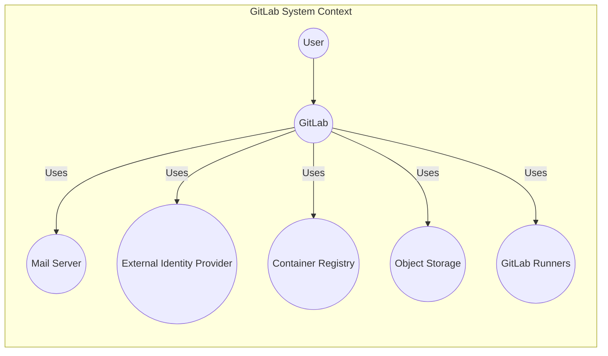
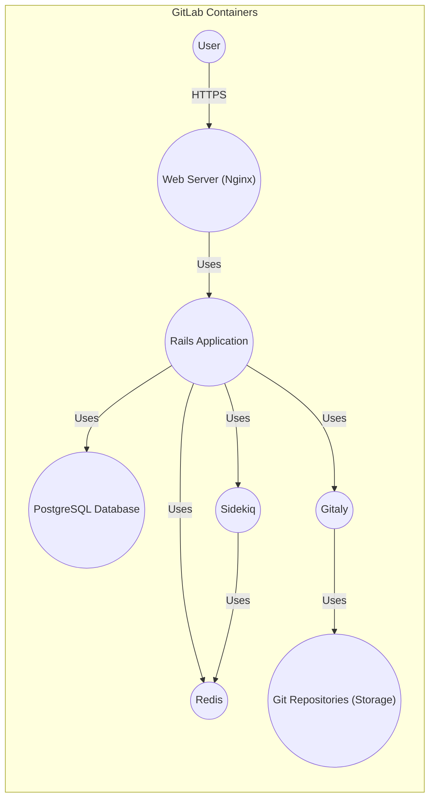
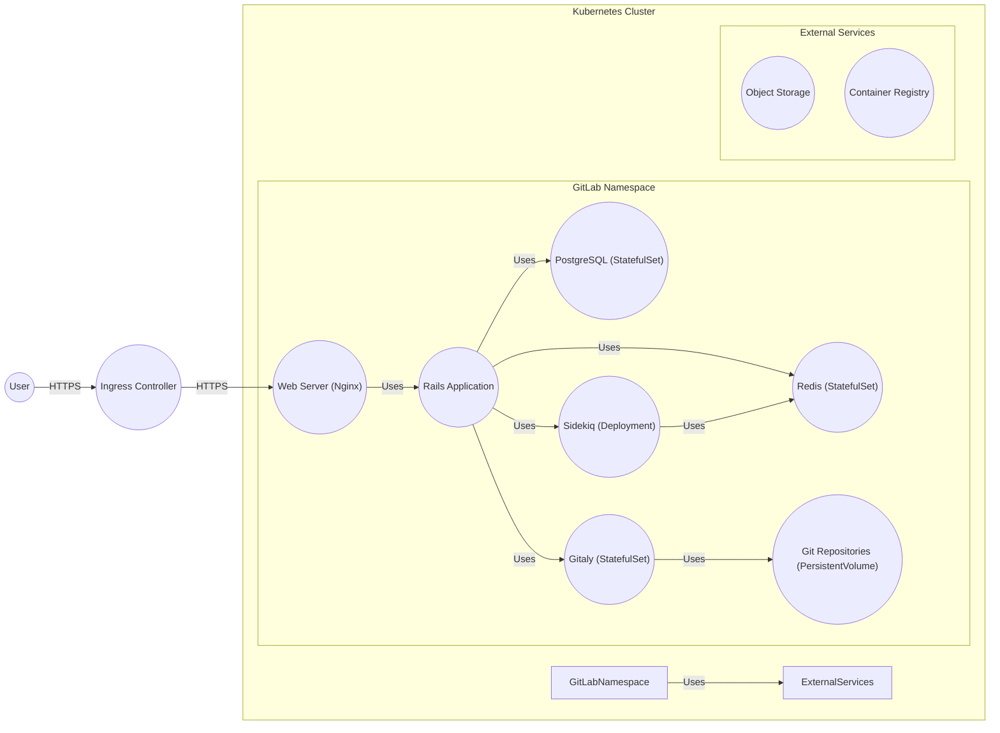
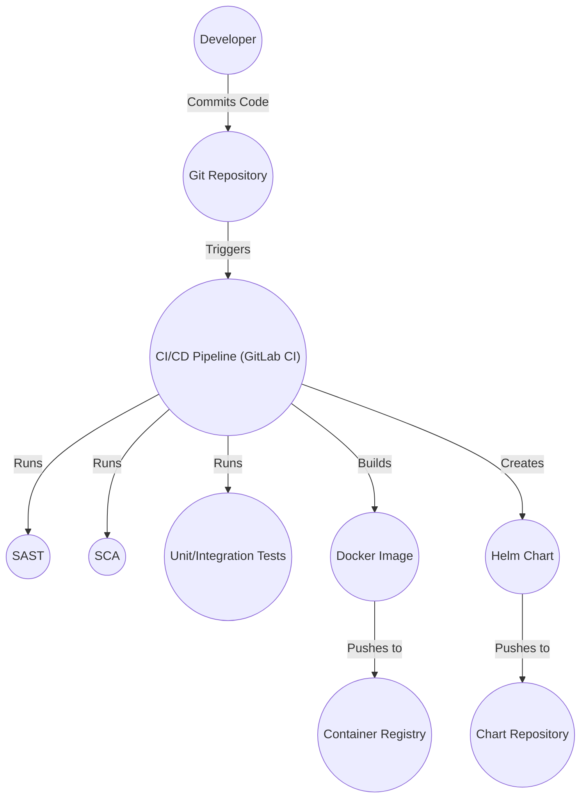

Okay, let's create a design document for the GitLab project, focusing on aspects relevant for threat modeling.

# BUSINESS POSTURE

GitLab is a web-based DevOps lifecycle tool that provides a Git-repository manager providing wiki, issue-tracking and CI/CD pipeline features. It's a critical tool for many organizations, from small startups to large enterprises, for managing their software development processes.

Priorities:

*   Enable efficient and collaborative software development.
*   Provide a secure and reliable platform for storing and managing code.
*   Offer a comprehensive suite of tools for the entire DevOps lifecycle.
*   Maintain high availability and performance.
*   Protect user data and intellectual property.
*   Compliance with relevant industry standards and regulations.

Goals:

*   Become/maintain the leading DevOps platform.
*   Expand user base and market share.
*   Continuously improve the platform's features and capabilities.
*   Ensure customer satisfaction and trust.

Business Risks:

*   Data breaches or loss of source code: This is the most significant risk, as it could expose sensitive intellectual property and damage GitLab's reputation.
*   Service disruptions or downtime: GitLab is a critical tool for many organizations, and any downtime can significantly impact their operations.
*   Compliance violations: Failure to comply with relevant regulations (e.g., GDPR, SOC 2) could result in fines and legal issues.
*   Competition: The DevOps market is competitive, and GitLab must continuously innovate to stay ahead.
*   Supply chain attacks: Compromise of third-party dependencies or build processes could introduce vulnerabilities.
*   Insider threats: Malicious or negligent actions by employees or contractors could lead to data breaches or service disruptions.

# SECURITY POSTURE

Existing Security Controls (based on publicly available information and common practices):

*   security control: Authentication: GitLab offers various authentication methods, including username/password, multi-factor authentication (MFA/2FA), and integration with external identity providers (LDAP, SAML, etc.). Described in GitLab documentation and implemented in the codebase.
*   security control: Authorization: Role-Based Access Control (RBAC) is used to manage user permissions and access to resources. Described in GitLab documentation and implemented in the codebase.
*   security control: Input validation: GitLab likely implements input validation to prevent common web vulnerabilities like cross-site scripting (XSS) and SQL injection. Implemented in the codebase.
*   security control: Encryption: Data at rest and in transit is likely encrypted using industry-standard protocols (e.g., TLS/SSL, AES). Described in GitLab documentation and implemented in the codebase.
*   security control: Auditing: GitLab likely logs user activity and system events for security monitoring and incident response. Described in GitLab documentation and implemented in the codebase.
*   security control: Regular security assessments: GitLab likely undergoes regular penetration testing and vulnerability scanning. Publicly stated.
*   security control: Secure development practices: GitLab likely follows secure coding guidelines and incorporates security checks into their development process. Publicly stated.
*   security control: Incident response plan: GitLab likely has a documented incident response plan to handle security incidents. Publicly stated.
*   security control: Dependency scanning: GitLab likely uses tools to scan for known vulnerabilities in third-party dependencies. Implemented in the CI/CD pipelines.
*   security control: Static Application Security Testing (SAST): GitLab likely uses SAST tools to identify potential vulnerabilities in the codebase. Implemented in the CI/CD pipelines.
*   security control: Dynamic Application Security Testing (DAST): GitLab likely uses DAST tools to test the running application for vulnerabilities. Implemented in the CI/CD pipelines.

Accepted Risks:

*   accepted risk: Complexity: GitLab is a complex application with a large codebase, making it challenging to eliminate all potential vulnerabilities.
*   accepted risk: Third-party dependencies: GitLab relies on numerous third-party libraries and services, which may introduce vulnerabilities.
*   accepted risk: User error: Misconfiguration or misuse of GitLab features by users can lead to security risks.
*   accepted risk: Zero-day vulnerabilities: Unknown vulnerabilities may exist in GitLab or its dependencies.

Recommended Security Controls:

*   Implement a robust secrets management solution to securely store and manage API keys, passwords, and other sensitive credentials.
*   Enhance supply chain security by implementing software composition analysis (SCA) and software bill of materials (SBOM) generation.
*   Implement runtime application self-protection (RASP) to detect and prevent attacks at runtime.
*   Consider implementing a bug bounty program to incentivize external security researchers to find and report vulnerabilities.

Security Requirements:

*   Authentication:
    *   Support for strong password policies.
    *   Mandatory MFA/2FA for all users, or at least for privileged accounts.
    *   Integration with enterprise identity providers (e.g., Okta, Azure AD).
    *   Session management with appropriate timeouts and secure cookie handling.
*   Authorization:
    *   Fine-grained RBAC with granular permissions.
    *   Principle of least privilege enforced throughout the application.
    *   Regular review and auditing of user permissions.
*   Input Validation:
    *   Strict input validation on all user-supplied data, including URL parameters, form fields, and API requests.
    *   Output encoding to prevent XSS vulnerabilities.
    *   Protection against SQL injection, command injection, and other injection attacks.
*   Cryptography:
    *   Use of strong, industry-standard cryptographic algorithms and protocols.
    *   Proper key management practices, including secure storage and rotation of keys.
    *   Encryption of sensitive data at rest and in transit.
    *   Use of HTTPS for all communication.

# DESIGN

## C4 CONTEXT

Element Descriptions:

*   Element:
    *   Name: User
    *   Type: Person
    *   Description: A developer, project manager, or other user interacting with GitLab.
    *   Responsibilities: Interact with GitLab to manage code, issues, CI/CD pipelines, etc.
    *   Security controls: Authentication (MFA/2FA, password policies), authorization (RBAC).

*   Element:
    *   Name: GitLab
    *   Type: Software System
    *   Description: The GitLab platform itself.
    *   Responsibilities: Provide a web-based interface for Git repository management, issue tracking, CI/CD, and other DevOps features.
    *   Security controls: Input validation, output encoding, encryption, auditing, access controls.

*   Element:
    *   Name: Mail Server
    *   Type: Software System
    *   Description: An external mail server used for sending notifications.
    *   Responsibilities: Deliver email notifications to users.
    *   Security controls: Secure communication (TLS/SSL).

*   Element:
    *   Name: External Identity Provider
    *   Type: Software System
    *   Description: An external system for user authentication (e.g., LDAP, SAML).
    *   Responsibilities: Authenticate users.
    *   Security controls: Secure communication, strong authentication protocols.

*   Element:
    *   Name: Container Registry
    *   Type: Software System
    *   Description: A registry for storing and managing container images.
    *   Responsibilities: Store and serve container images.
    *   Security controls: Access controls, image signing, vulnerability scanning.

*   Element:
    *   Name: Object Storage
    *   Type: Software System
    *   Description: Storage for large files, artifacts, and backups.
    *   Responsibilities: Store and retrieve large files.
    *   Security controls: Access controls, encryption at rest.

*   Element:
    *   Name: GitLab Runners
    *   Type: Software System
    *   Description: Agents that execute CI/CD jobs.
    *   Responsibilities: Execute CI/CD pipelines.
    *   Security controls: Secure communication with GitLab, isolated execution environments.

## C4 CONTAINER

Element Descriptions:

*   Element:
    *   Name: Web Server (Nginx)
    *   Type: Web Server
    *   Description: Handles incoming HTTP requests and acts as a reverse proxy.
    *   Responsibilities: Load balancing, SSL termination, serving static content.
    *   Security controls: TLS/SSL configuration, access controls, request filtering.

*   Element:
    *   Name: Rails Application
    *   Type: Web Application
    *   Description: The core GitLab application logic.
    *   Responsibilities: Handle user requests, interact with the database and other services.
    *   Security controls: Input validation, output encoding, authentication, authorization, session management.

*   Element:
    *   Name: PostgreSQL Database
    *   Type: Database
    *   Description: Stores persistent data (users, projects, issues, etc.).
    *   Responsibilities: Data storage and retrieval.
    *   Security controls: Access controls, encryption at rest, auditing.

*   Element:
    *   Name: Redis
    *   Type: In-memory Data Store
    *   Description: Used for caching, session management, and background job queuing.
    *   Responsibilities: Caching, session storage, job queuing.
    *   Security controls: Access controls, authentication.

*   Element:
    *   Name: Sidekiq
    *   Type: Background Job Processor
    *   Description: Processes background jobs asynchronously.
    *   Responsibilities: Execute long-running tasks.
    *   Security controls: Secure communication with Redis.

*   Element:
    *   Name: Gitaly
    *   Type: Git RPC Service
    *   Description: Provides high-level access to Git repositories.
    *   Responsibilities: Manage Git operations.
    *   Security controls: Access controls, authentication.

*   Element:
    *   Name: Git Repositories (Storage)
    *   Type: File System
    *   Description: Stores the actual Git repositories.
    *   Responsibilities: Store Git data.
    *   Security controls: File system permissions, access controls.

## DEPLOYMENT

Possible Deployment Solutions:

1.  Omnibus GitLab: A package that includes all necessary components for running GitLab.
2.  GitLab Helm Chart: For deploying GitLab on Kubernetes.
3.  Source Installation: Manually installing and configuring each component.
4.  Docker Compose: Using Docker Compose to deploy GitLab.
5.  Cloud Native Install (using cloud provider managed services, e.g. GKE, Cloud SQL, Memorystore)

Chosen Solution: GitLab Helm Chart (Kubernetes)

Element Descriptions:

*   Element:
    *   Name: Kubernetes Cluster
    *   Type: Infrastructure
    *   Description: The Kubernetes cluster where GitLab is deployed.
    *   Responsibilities: Orchestrate and manage containers.
    *   Security controls: Network policies, RBAC, pod security policies.

*   Element:
    *   Name: GitLab Namespace
    *   Type: Logical Grouping
    *   Description: A Kubernetes namespace for isolating GitLab resources.
    *   Responsibilities: Provide isolation and resource management.
    *   Security controls: Network policies, resource quotas.

*   Element:
    *   Name: Ingress Controller
    *   Type: Load Balancer
    *   Description: Manages external access to the GitLab web server.
    *   Responsibilities: Route external traffic to the web server.
    *   Security controls: TLS/SSL termination, access controls.

*   Element:
    *   Name: Web Server (Nginx)
    *   Type: Web Server (Pod)
    *   Description: Handles incoming HTTP requests.
    *   Responsibilities: Load balancing, SSL termination, serving static content.
    *   Security controls: TLS/SSL configuration, access controls, request filtering.

*   Element:
    *   Name: Rails Application
    *   Type: Web Application (Pod)
    *   Description: The core GitLab application logic.
    *   Responsibilities: Handle user requests, interact with the database and other services.
    *   Security controls: Input validation, output encoding, authentication, authorization, session management.

*   Element:
    *   Name: PostgreSQL (StatefulSet)
    *   Type: Database
    *   Description: Stores persistent data.
    *   Responsibilities: Data storage and retrieval.
    *   Security controls: Access controls, encryption at rest, auditing.

*   Element:
    *   Name: Redis (StatefulSet)
    *   Type: In-memory Data Store
    *   Description: Used for caching and session management.
    *   Responsibilities: Caching, session storage.
    *   Security controls: Access controls, authentication.

*   Element:
    *   Name: Sidekiq (Deployment)
    *   Type: Background Job Processor (Pod)
    *   Description: Processes background jobs asynchronously.
    *   Responsibilities: Execute long-running tasks.
    *   Security controls: Secure communication with Redis.

*   Element:
    *   Name: Gitaly (StatefulSet)
    *   Type: Git RPC Service (Pod)
    *   Description: Provides high-level access to Git repositories.
    *   Responsibilities: Manage Git operations.
    *   Security controls: Access controls, authentication.

*   Element:
    *   Name: Git Repositories (PersistentVolume)
    *   Type: Storage
    *   Description: Stores the actual Git repositories.
    *   Responsibilities: Store Git data.
    *   Security controls: Access controls, encryption at rest.

*   Element:
    *   Name: Object Storage
    *   Type: External Service
    *   Description: External object storage (e.g., AWS S3, Google Cloud Storage).
    *   Responsibilities: Store large files and artifacts.
    *   Security controls: Access controls, encryption at rest.

*   Element:
    *   Name: Container Registry
    *   Type: External Service
    *   Description: External container registry (e.g., Docker Hub, GitLab Container Registry).
    *   Responsibilities: Store and serve container images.
    *   Security controls: Access controls, image signing, vulnerability scanning.

## BUILD

Build Process Description:

1.  Developers commit code to the Git repository.
2.  The commit triggers a CI/CD pipeline in GitLab CI.
3.  The pipeline runs various security checks, including:
    *   SAST (Static Application Security Testing): Analyzes the source code for vulnerabilities.
    *   SCA (Software Composition Analysis): Identifies known vulnerabilities in third-party dependencies.
    *   Unit/Integration Tests: Ensures code functionality and security.
4.  If all checks pass, the pipeline builds a Docker image.
5.  The Docker image is pushed to a container registry.
6.  The pipeline creates a Helm chart for deploying the application.
7.  The Helm chart is pushed to a chart repository.

Security Controls:

*   security control: SAST: Static analysis of the source code to identify vulnerabilities.
*   security control: SCA: Scanning of dependencies for known vulnerabilities.
*   security control: Code review: Manual review of code changes to identify security issues.
*   security control: Build automation: Automated build process to ensure consistency and reduce manual errors.
*   security control: Signed commits: Verification of code commits using digital signatures.
*   security control: Image signing: Verification of container images using digital signatures.

# RISK ASSESSMENT

Critical Business Processes:

*   Software development and collaboration.
*   Code storage and version control.
*   Continuous integration and continuous delivery (CI/CD).
*   Issue tracking and project management.

Data Sensitivity:

*   Source code: Highly sensitive intellectual property.
*   User data: Personal information, email addresses, usernames, etc. (PII).
*   Project data: Issues, comments, wiki pages, etc. (Potentially sensitive).
*   Configuration data: Secrets, API keys, etc. (Highly sensitive).
*   Authentication data: Passwords, tokens. (Highly sensitive).

# QUESTIONS & ASSUMPTIONS

Questions:

*   What specific compliance requirements does GitLab need to meet (e.g., GDPR, SOC 2, HIPAA)?
*   What is the specific threat model for GitLab (e.g., targeted attacks, opportunistic attacks)?
*   What are the specific recovery time objectives (RTO) and recovery point objectives (RPO) for GitLab?
*   What are the existing monitoring and logging capabilities?
*   Are there any specific security concerns related to the use of third-party integrations?
*   What is the process for managing and rotating secrets?
*   What is the process for handling security vulnerabilities reported by external researchers?

Assumptions:

*   BUSINESS POSTURE: GitLab aims for high availability and reliability.
*   BUSINESS POSTURE: GitLab prioritizes the security of user data and intellectual property.
*   SECURITY POSTURE: GitLab follows secure development practices.
*   SECURITY POSTURE: GitLab has a dedicated security team.
*   DESIGN: GitLab uses a microservices architecture (to some extent).
*   DESIGN: GitLab Runners are configured securely and isolated from the main application.
*   DESIGN: The deployment environment (Kubernetes) is properly configured and secured.
*   DESIGN: Regular backups are performed and stored securely.