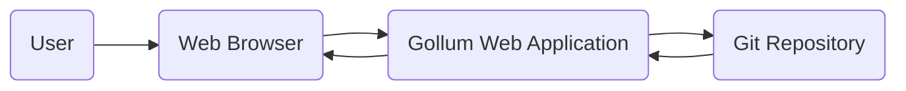
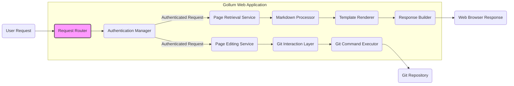

# Project Design Document: Gollum Wiki

**Version:** 1.1
**Date:** October 26, 2023
**Author:** AI Software Architect

## 1. Introduction

This document provides an enhanced design overview of the Gollum wiki project, building upon the previous version. Gollum is a lightweight, Git-backed wiki system implemented in Ruby using the Sinatra framework. This document details the system's architecture, key components, data flow, and security considerations, specifically tailored for subsequent threat modeling activities.

## 2. Goals and Objectives

The core objectives of the Gollum project are:

*   To offer a straightforward and intuitive wiki experience.
*   To utilize Git as the primary storage mechanism, providing inherent version control.
*   To be easily deployable and portable across different environments.
*   To facilitate collaborative content creation and editing.

## 3. System Architecture

Gollum's architecture is centered around a web application that interacts directly with a Git repository.

### 3.1. High-Level Architecture

*   **User:** The individual interacting with the wiki through a web interface.
*   **Web Browser:** The client application used to access and interact with the Gollum web application.
*   **Gollum Web Application:** The central component responsible for handling requests, rendering content, and managing interactions with the Git repository.
*   **Git Repository:** The backend storage system where wiki pages are stored as files and their history is managed by Git.

### 3.2. Component-Level Architecture

A more detailed breakdown of the Gollum Web Application reveals the following components:

*   **Request Router:**  Receives incoming HTTP requests and directs them to the appropriate service.
*   **Authentication Manager:**  Handles user authentication (if enabled) and determines authorization levels for requested actions.
*   **Page Retrieval Service:**  Responsible for locating and retrieving the content of a requested wiki page from the Git repository.
*   **Page Editing Service:**  Handles the logic for creating, modifying, and deleting wiki pages.
*   **Markdown Processor:** Converts Markdown formatted wiki pages into HTML for display.
*   **Git Interaction Layer:** Provides an abstraction layer for interacting with the underlying Git repository, encapsulating Git commands.
*   **Template Renderer:**  Combines the processed page content with layout templates to generate the final HTML structure.
*   **Response Builder:** Constructs the HTTP response to be sent back to the user's web browser.
*   **Git Command Executor:** Executes specific Git commands (e.g., `git show`, `git commit`, `git push`) on the Git repository.

## 4. Data Flow

The following outlines the typical data flow for common user interactions, providing a clearer picture for threat analysis.

### 4.1. Viewing a Page

1. A user requests a specific wiki page via their **Web Browser**.
2. The **Request Router** in the Gollum application receives the HTTP request.
3. The **Authentication Manager** verifies the user's access rights (if authentication is configured).
4. The **Page Retrieval Service** uses the page name to locate the corresponding file within the **Git Repository**.
5. The content of the file is read from the **Git Repository**.
6. The **Markdown Processor** converts the Markdown content into HTML.
7. The **Template Renderer** merges the rendered HTML with the appropriate page template.
8. The **Response Builder** constructs the HTTP response containing the complete HTML page.
9. The response is sent back to the user's **Web Browser**.

### 4.2. Editing a Page

1. A user navigates to the edit interface for a specific wiki page through their **Web Browser**.
2. The **Request Router** receives the edit request.
3. The **Authentication Manager** verifies the user's editing permissions.
4. The **Page Retrieval Service** retrieves the current content of the page from the **Git Repository**.
5. The content is displayed in an editable form in the user's **Web Browser**.
6. The user modifies the content and submits the changes.
7. The **Request Router** receives the updated content.
8. The **Authentication Manager** re-verifies the user's editing permissions.
9. The **Page Editing Service** processes the changes.
10. The **Git Interaction Layer** stages the changes and commits them to the local **Git Repository** using the **Git Command Executor**.
11. The changes are typically pushed to a remote **Git Repository** (if configured).
12. The user is redirected to the updated wiki page in their **Web Browser**.

## 5. Security Considerations

This section details key security considerations relevant for threat modeling:

*   **Authentication and Authorization:**
    *   **Authentication Mechanisms:**  Identify the supported methods for user authentication (e.g., none, HTTP Basic Auth, potential for custom solutions).
    *   **Authorization Model:** Define how permissions are managed and enforced (e.g., global read/write, per-page permissions - if implemented).
    *   **Credential Storage:**  Understand how user credentials (if any) are stored and protected.
    *   **Brute-Force Protection:**  Assess the presence and effectiveness of mechanisms to prevent brute-force attacks against login attempts.
*   **Input Validation and Sanitization:**
    *   **Markdown Input:** Analyze how user-provided Markdown content is validated and sanitized to prevent XSS attacks.
    *   **File Uploads (if enabled):**  Determine if file uploads are supported and what measures are in place to prevent malicious file uploads.
    *   **Other Input Vectors:** Consider other potential input points, such as search queries or configuration settings.
*   **Output Encoding:**
    *   **HTML Encoding:** Verify that output is properly encoded to prevent XSS vulnerabilities when displaying user-generated content.
    *   **Contextual Encoding:**  Consider if encoding is context-aware (e.g., encoding for HTML attributes vs. HTML content).
*   **Git Repository Security:**
    *   **Repository Access Control:**  Understand how access to the underlying Git repository is controlled (e.g., file system permissions, SSH keys).
    *   **History Manipulation:**  Consider the potential for unauthorized modification of the Git history.
    *   **Sensitive Data in Git:**  Assess the risk of sensitive information being inadvertently stored within the Git repository.
*   **General Web Security:**
    *   **HTTPS:**  Determine if the application enforces HTTPS to protect data in transit.
    *   **Security Headers:**  Evaluate the presence and configuration of security headers like Content Security Policy (CSP), HTTP Strict Transport Security (HSTS), and X-Frame-Options.
    *   **Cross-Site Request Forgery (CSRF):**  Assess the application's vulnerability to CSRF attacks and the implemented countermeasures.
    *   **Session Management:**  Understand how user sessions are managed and if they are secure.
    *   **Dependency Management:**  Consider the process for keeping dependencies up-to-date to mitigate known vulnerabilities.
*   **Denial of Service (DoS) Considerations:**
    *   **Resource Exhaustion:**  Identify potential vulnerabilities that could lead to resource exhaustion (e.g., excessive requests, large file uploads, inefficient processing).
    *   **Git Repository Abuse:**  Consider how an attacker might abuse Git operations to cause a denial of service.

## 6. Deployment

Gollum's deployment typically involves running it as a Rack application. Common deployment strategies include:

*   Direct execution using a Ruby web server such as Webrick or Puma.
*   Deployment behind a reverse proxy server like Nginx or Apache, which can provide additional security features and load balancing.
*   Containerization using Docker for easier deployment and management across different environments.

The Git repository can be hosted locally on the same server as the Gollum application or on a remote Git hosting platform like GitHub, GitLab, or Bitbucket. The choice of deployment strategy impacts the overall security posture.

## 7. Technologies Used

*   **Ruby:** The primary programming language for the Gollum application.
*   **Sinatra:** A lightweight Ruby web framework used to build the application.
*   **Git:** The distributed version control system used for storing and managing wiki content.
*   **Markdown:** The markup language used for writing wiki pages.
*   **Various Ruby Gems:**  Including libraries for Markdown parsing, template rendering, and other functionalities. A detailed list of dependencies should be reviewed for potential vulnerabilities.

## 8. Future Considerations

*   Implementation of more sophisticated authentication and authorization models, potentially integrating with external identity providers.
*   Support for additional markup languages beyond Markdown.
*   Enhancements to the user interface and editing experience, potentially including WYSIWYG editors.
*   Integration with other services and platforms through APIs or plugins.
*   Ongoing security audits and penetration testing to identify and address potential vulnerabilities.
