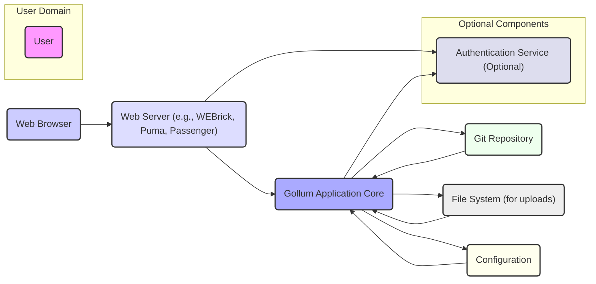

## Project Design Document: Gollum Wiki (Improved)

**1. Introduction**

This document provides an enhanced design overview of the Gollum wiki system, a lightweight, Git-based wiki built with Ruby. This detailed design serves as a robust foundation for subsequent threat modeling activities by clearly outlining the system's architecture, components, and data flow.

**2. Project Overview**

*   **Project Name:** Gollum
*   **Project Goal:** To offer a simple and user-friendly wiki platform that leverages a Git repository for content storage, enabling version control, straightforward backups, and collaborative editing workflows familiar to developers and technical users.
*   **Target Users:** Individuals, small to medium-sized teams, and organizations seeking a lightweight wiki solution with Git-backed persistence.
*   **Key Features:**
    *   Creation and editing of wiki pages using various markup languages (Markdown, Textile, MediaWiki, etc.).
    *   Comprehensive revision history and detailed diff views for tracking changes.
    *   File uploading and management capabilities, allowing users to embed assets in wiki pages.
    *   Robust link management, including support for internal linking between pages.
    *   Customizable user interface through theming and potentially custom stylesheets.
    *   Optional authentication and authorization mechanisms to control access to the wiki.

**3. Architectural Overview**

Gollum is typically deployed as a web application, with the core architecture involving a web server to handle user requests, the Gollum application to process these requests and interact with a Git repository for data persistence.



**4. Component Details**

*   **Web Server:**
    *   **Purpose:** Accepts incoming HTTP/HTTPS requests from user browsers and directs them to the Gollum application. Responsible for serving static assets.
    *   **Examples:** WEBrick (default for development), Puma, Unicorn, Phusion Passenger, Nginx (as a reverse proxy).
    *   **Responsibilities:**
        *   Handling network connections and protocol management (HTTP/HTTPS).
        *   TLS termination (if HTTPS is configured).
        *   Routing incoming requests based on URL paths.
        *   Serving static files (CSS, JavaScript, images, uploaded files).
        *   Potentially handling basic authentication or acting as a reverse proxy with authentication capabilities.
*   **Gollum Application Core:**
    *   **Purpose:** The central component containing the core logic of the wiki. Processes user requests, interacts with the Git repository, renders wiki pages, and manages file uploads.
    *   **Responsibilities:**
        *   Routing wiki-specific requests and actions.
        *   Reading, writing, and updating page content from the Git repository.
        *   Rendering wiki pages into HTML from various markup formats.
        *   Managing page history, diffs, and revisions.
        *   Handling file uploads, storage, and retrieval.
        *   Implementing search functionality across wiki content.
        *   Managing user sessions and authentication/authorization (if implemented internally).
        *   Interacting with the configuration settings.
*   **Git Repository:**
    *   **Purpose:** The primary and persistent storage mechanism for all wiki content, including page revisions, edit history, and potentially large uploaded files (depending on configuration).
    *   **Responsibilities:**
        *   Storing wiki pages as individual files within the repository.
        *   Maintaining a complete and immutable history of all changes made to the wiki.
        *   Providing mechanisms for retrieving specific versions of pages and comparing revisions.
        *   Potentially handling large file storage through Git LFS (Large File Storage).
*   **File System (for uploads):**
    *   **Purpose:**  Stores files uploaded by users. This can be a dedicated directory within the server's file system or an external storage service.
    *   **Responsibilities:**
        *   Persistently storing uploaded files.
        *   Providing access to these files for serving to users.
        *   Managing file permissions and access controls.
        *   Potentially integrating with Git LFS for larger files.
*   **Configuration:**
    *   **Purpose:** Holds settings and parameters that govern the behavior of the Gollum application.
    *   **Storage:** Typically stored in configuration files (e.g., `config.ru`, YAML files), environment variables, or a combination of both.
    *   **Examples of Configuration:**
        *   Path to the Git repository.
        *   Default markup language.
        *   Authentication method and credentials (if applicable).
        *   Theme settings and customizations.
        *   File upload limits and storage locations.
*   **Authentication Service (Optional):**
    *   **Purpose:**  Verifies the identity of users attempting to access protected parts of the wiki.
    *   **Implementation:** Can be internal to the Gollum application or delegated to external services.
    *   **Examples:**
        *   Basic HTTP Authentication.
        *   Password-based authentication managed by Gollum.
        *   Integration with OAuth providers (e.g., GitHub, Google).
        *   Integration with LDAP or Active Directory.
    *   **Responsibilities:**
        *   Verifying user credentials.
        *   Managing user sessions.
*   **Authorization (Part of Gollum Application or Authentication Service):**
    *   **Purpose:** Determines what actions authenticated users are permitted to perform (e.g., view, edit, delete pages).
    *   **Implementation:** Can be role-based or permission-based.
    *   **Responsibilities:**
        *   Enforcing access control policies.
        *   Granting or denying access to specific resources or actions.

**5. Data Flow Diagrams**

*   **Viewing a Page:**

    ```mermaid
    sequenceDiagram
        participant "User's Browser" as UserBrowser
        participant "Web Server" as WebServer
        participant "Gollum Application" as GollumApp
        participant "Git Repository" as GitRepo
        UserBrowser->>WebServer: Request for a wiki page
        WebServer->>GollumApp: Forward request
        GollumApp->>GitRepo: Retrieve page content from Git
        GitRepo-->>GollumApp: Page content (raw markup)
        GollumApp->>GollumApp: Render page to HTML
        GollumApp->>WebServer: Rendered HTML page
        WebServer-->>UserBrowser: Send HTML page
    ```

*   **Editing and Saving a Page:**

    ```mermaid
    sequenceDiagram
        participant "User's Browser" as UserBrowser
        participant "Web Server" as WebServer
        participant "Gollum Application" as GollumApp
        participant "Git Repository" as GitRepo
        UserBrowser->>WebServer: Request to edit a page
        WebServer->>GollumApp: Forward request
        GollumApp->>GitRepo: Retrieve current page content
        GitRepo-->>GollumApp: Current page content
        UserBrowser->>WebServer: Submit edited page content
        WebServer->>GollumApp: Forward edited content
        GollumApp->>GitRepo: Commit new page version
        GitRepo-->>GollumApp: Success/Failure of commit
        GollumApp->>WebServer: Confirmation/Error
        WebServer-->>UserBrowser: Confirmation/Error message
    ```

*   **Uploading a File:**

    ```mermaid
    sequenceDiagram
        participant "User's Browser" as UserBrowser
        participant "Web Server" as WebServer
        participant "Gollum Application" as GollumApp
        participant "File System" as FileSystem
        UserBrowser->>WebServer: Upload file request
        WebServer->>GollumApp: Forward request with file data
        GollumApp->>FileSystem: Store uploaded file
        FileSystem-->>GollumApp: File storage location/status
        GollumApp->>GitRepo: Optionally update Git with file information (e.g., through Git LFS)
        GitRepo-->>GollumApp: Confirmation (if Git LFS used)
        GollumApp->>WebServer: Confirmation
        WebServer-->>UserBrowser: Confirmation message
    ```

**6. Trust Boundaries**

These boundaries represent points where the level of trust changes between different components of the system.

*   **User's Browser <-> Web Server:** This is the primary boundary between the untrusted client and the server environment. All data crossing this boundary should be treated as potentially malicious and validated.
*   **Web Server <-> Gollum Application:** While often running on the same machine, this is a boundary between processes. The web server trusts the Gollum application to handle requests securely.
*   **Gollum Application <-> Git Repository:** The Gollum application trusts the integrity and accessibility of the Git repository. Compromise of the repository can lead to data loss or corruption. Secure access to the Git repository is crucial.
*   **Gollum Application <-> File System:** The Gollum application trusts the file system for storing uploaded files. Proper file permissions and sanitization are necessary to prevent malicious file execution or access.
*   **Web Server/Gollum Application <-> Authentication Service:**  Trust is placed in the authentication service to correctly verify user identities. Secure communication protocols (e.g., TLS) are essential.

**7. Security Considerations**

This section outlines key security considerations relevant to the Gollum architecture, which will be further explored during threat modeling.

*   **Cross-Site Scripting (XSS):** User-supplied content (wiki page content, file names) could contain malicious scripts that are executed in other users' browsers. Strict input sanitization and output encoding are paramount.
*   **Cross-Site Request Forgery (CSRF):** Malicious websites could trick authenticated users into performing unintended actions on the Gollum wiki. Implementing CSRF protection tokens is necessary.
*   **Authentication and Authorization Vulnerabilities:** Weak or improperly implemented authentication and authorization mechanisms can lead to unauthorized access, data breaches, or malicious modifications. Secure password hashing, session management, and robust access control policies are essential.
*   **Git Repository Security:** If the Git repository is publicly accessible or compromised, sensitive information could be exposed, or the wiki content could be maliciously altered. Proper repository access controls (e.g., using SSH keys, private repositories) are crucial.
*   **File Upload Vulnerabilities:** Allowing unrestricted file uploads can lead to various attacks, including malware uploads, path traversal vulnerabilities, and denial-of-service. Implementing file type validation, size limits, and storing uploaded files outside the webroot are important mitigations.
*   **Command Injection:** If Gollum interacts with the operating system (e.g., through Git commands or external tools), vulnerabilities could allow attackers to execute arbitrary commands on the server. Careful input validation and avoiding direct system calls with user-provided data are necessary.
*   **Denial of Service (DoS):** The application could be vulnerable to attacks that exhaust server resources, making the wiki unavailable. Implementing rate limiting, input validation, and potentially using a CDN for static assets can help mitigate DoS risks.
*   **Information Disclosure:** Error messages, debug information, or improperly configured access controls could inadvertently reveal sensitive information about the system or its users. Secure error handling and proper access control configurations are important.
*   **Dependency Vulnerabilities:** Gollum relies on various Ruby gems and potentially other system libraries. Regularly updating these dependencies is crucial to address known security vulnerabilities. Using dependency management tools and security scanners can help.
*   **Insecure Configuration:** Misconfigured web servers, application settings, or database credentials can introduce security vulnerabilities. Following security best practices for configuration management is essential.
*   **Error Handling and Logging:**  Insufficient or overly verbose error handling can expose sensitive information. Comprehensive and secure logging is crucial for detecting and responding to security incidents.

**8. Future Considerations**

*   Detailed specification of chosen authentication and authorization mechanisms, including specific technologies and configurations.
*   Detailed description of the deployment environment, including operating system, web server configuration, and any reverse proxies or load balancers.
*   Specific versions of Ruby, Gems, and other dependencies used in the project.
*   Detailed logging and monitoring strategies, including the types of events logged and the systems used for log aggregation and analysis.
*   Plans for regular security audits and penetration testing.

This improved design document provides a more comprehensive and detailed understanding of the Gollum wiki system. This enhanced information will be invaluable for conducting a thorough and effective threat modeling exercise to identify and mitigate potential security risks.