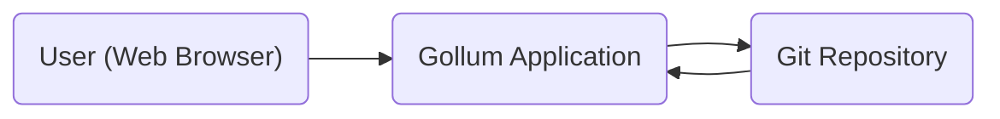
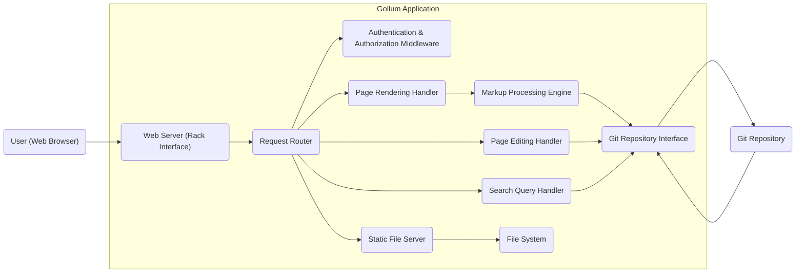

# Project Design Document: Gollum Wiki

**Version:** 1.1
**Date:** October 26, 2023
**Author:** Gemini (AI Language Model)

## 1. Introduction

This document provides an enhanced design specification for the Gollum wiki project, a lightweight, Git-backed wiki application developed in Ruby. This document aims to offer a detailed understanding of the system's architecture, its constituent components, and the flow of data within it. This detailed design will serve as a crucial input for subsequent threat modeling exercises and will guide future development efforts.

## 2. Goals and Objectives

*   To present a refined and more detailed overview of the Gollum architecture.
*   To clearly delineate the responsibilities and interactions of each component within the system.
*   To provide a precise description of the data flow for key user interactions.
*   To establish a robust foundation for identifying and mitigating potential security vulnerabilities.
*   To serve as a comprehensive and up-to-date reference for development, maintenance, and security analysis.

## 3. High-Level Architecture

Gollum's architecture is centered around a web application interacting with a Git repository for data persistence. Users access and interact with the wiki through standard web browsers.

*   **User (Web Browser):** Represents the end-user interacting with the Gollum wiki through a web browser, sending requests and receiving responses.
*   **Gollum Application:**  The core Ruby application, built using the Rack interface, responsible for processing user requests, rendering wiki content, managing edits, and interacting with the underlying Git repository.
*   **Git Repository:** The fundamental data store for the wiki, utilizing Git's version control capabilities to store page content, history, and associated assets.

## 4. Detailed Architecture

The Gollum application can be further decomposed into distinct logical components, each with specific responsibilities:

*   **User (Web Browser):** Initiates HTTP requests to interact with the Gollum application.
*   **Web Server (Rack Interface):**  Provides the interface between the web server (e.g., Puma, Unicorn) and the Gollum application. It receives HTTP requests and passes them to the application.
*   **Request Router:**  Analyzes incoming HTTP requests (based on URL paths and HTTP methods) and directs them to the appropriate handler within the Gollum application.
*   **Authentication & Authorization Middleware:**  Handles user authentication (if configured) and enforces authorization rules to control access to specific resources and actions. This might involve checking user credentials and permissions.
*   **Page Rendering Handler:**  Responsible for retrieving wiki page content from the Git repository, processing it through the markup engine, and rendering the final HTML to be sent to the user's browser.
*   **Page Editing Handler:**  Manages the process of editing wiki pages. This includes retrieving the current page content for editing, handling form submissions with updated content, validating the input, and committing changes back to the Git repository.
*   **Search Query Handler:**  Processes user-submitted search queries against the wiki content stored in the Git repository. It retrieves relevant pages based on the search terms and presents the results to the user.
*   **Static File Server:**  Serves static assets such as images, CSS files, and JavaScript files directly to the user's browser.
*   **Markup Processing Engine:**  Parses the text-based content of wiki pages written in various markup languages (e.g., Markdown, Textile, RDoc) and converts it into HTML for display.
*   **Git Repository Interface:**  Provides an abstraction layer for interacting with the underlying Git repository. This component encapsulates the logic for performing Git operations such as reading files, committing changes, viewing history, and managing branches.
*   **File System:**  Used by the Static File Server to access and serve static assets.
*   **Git Repository:** The persistent storage for all wiki content, history, and assets, leveraging Git's version control system.

## 5. Components

This section provides a more detailed description of the key components and their functionalities:

*   **Web Server (Rack Interface):**
    *   **Purpose:** Acts as the entry point for all HTTP requests, providing a standard interface for the Gollum application.
    *   **Technology:** Any Rack-compliant web server such as Puma, Unicorn, or Thin.
    *   **Responsibilities:** Handling network connections, receiving and parsing HTTP requests, forwarding requests to the Gollum application, and sending HTTP responses back to the client.
*   **Request Router:**
    *   **Purpose:**  Maps incoming requests to the appropriate handler based on defined routes.
    *   **Technology:**  Likely implemented using a routing library or framework within the Ruby application (e.g., Sinatra's routing capabilities if used directly, or routing provided by a larger framework if adopted).
    *   **Responsibilities:**  Parsing the request URL, matching it against defined routes, and invoking the corresponding handler function.
*   **Authentication & Authorization Middleware:**
    *   **Purpose:**  Secures the application by verifying user identities and controlling access to resources.
    *   **Technology:**  Could utilize Ruby gems like `Devise`, `OmniAuth`, or custom authentication logic. Authorization might be implemented using role-based access control (RBAC) or attribute-based access control (ABAC).
    *   **Responsibilities:**  Handling user login and logout, managing user sessions, verifying user credentials, checking user permissions before granting access to specific actions or data.
*   **Page Rendering Handler:**
    *   **Purpose:**  Retrieves and displays wiki pages to the user.
    *   **Technology:**  Ruby code interacting with the Git Repository Interface and a templating engine (e.g., ERB, Haml, or Slim).
    *   **Responsibilities:**  Fetching page content from the Git repository, determining the appropriate markup engine, converting the content to HTML, rendering the HTML within a layout template, and sending the response to the user.
*   **Page Editing Handler:**
    *   **Purpose:**  Allows users to modify and save changes to wiki pages.
    *   **Technology:**  Ruby code interacting with the Git Repository Interface. Form handling might involve processing data submitted via HTTP POST requests.
    *   **Responsibilities:**  Presenting an editing interface to the user, receiving and validating user input, committing changes to the Git repository (creating new commits), handling potential merge conflicts, and redirecting the user after saving.
*   **Search Query Handler:**
    *   **Purpose:**  Enables users to search for specific content within the wiki.
    *   **Technology:**  Could leverage Git's built-in search capabilities (e.g., `git grep`) or integrate with an external search indexing service for more advanced features.
    *   **Responsibilities:**  Receiving and parsing search queries, executing the search against the Git repository content, ranking and displaying search results to the user.
*   **Static File Server:**
    *   **Purpose:**  Efficiently serves static assets to the user's browser.
    *   **Technology:**  Often handled by the web server itself or through dedicated middleware in the Rack stack.
    *   **Responsibilities:**  Receiving requests for static files, locating the files on the file system, and sending them back to the user with appropriate HTTP headers.
*   **Markup Processing Engine:**
    *   **Purpose:**  Converts wiki page content from markup languages to HTML.
    *   **Technology:**  Libraries such as `Redcarpet` (for Markdown), `RDiscount`, `Maruku`, or `Textile`. The specific engine used might be configurable.
    *   **Responsibilities:**  Parsing the markup syntax and generating the corresponding HTML structure.
*   **Git Repository Interface:**
    *   **Purpose:**  Provides an abstraction layer for interacting with the Git repository, hiding the complexities of Git commands.
    *   **Technology:**  Ruby gems like `grit`, `rugged`, or `git` command-line wrappers.
    *   **Responsibilities:**  Performing Git operations such as reading file contents, committing changes, retrieving commit history, managing branches, and handling Git-related errors.
*   **File System:**
    *   **Purpose:**  Stores static assets served by the Static File Server.
    *   **Technology:**  The underlying operating system's file system.
    *   **Responsibilities:**  Storing and retrieving static files.
*   **Git Repository:**
    *   **Purpose:**  The primary data store for all wiki content, history, and assets.
    *   **Technology:**  Git version control system.
    *   **Responsibilities:**  Storing and managing versions of wiki pages, tracking changes, enabling collaboration, and providing a history of modifications.

## 6. Data Flow

This section details the data flow for key user interactions within the Gollum application:

### 6.1. Viewing a Wiki Page

1. The **User (Web Browser)** sends an HTTP GET request to the Gollum application for a specific wiki page URL.
2. The **Web Server (Rack Interface)** receives the request and forwards it to the **Request Router**.
3. The **Request Router** analyzes the URL and routes the request to the **Page Rendering Handler**.
4. The **Page Rendering Handler** utilizes the **Git Repository Interface** to fetch the content of the requested page from the **Git Repository**.
5. The **Page Rendering Handler** identifies the markup language used for the page and invokes the appropriate **Markup Processing Engine** to convert the content into HTML.
6. The **Page Rendering Handler** renders the generated HTML within a predefined template, creating the final HTML response.
7. The **Page Rendering Handler** sends the HTML response back to the **Web Server (Rack Interface)**.
8. The **Web Server (Rack Interface)** sends the HTML response to the **User (Web Browser)**.
9. The **User (Web Browser)** renders the received HTML, displaying the wiki page.

### 6.2. Editing a Wiki Page

1. The **User (Web Browser)** sends an HTTP GET request to the Gollum application to access the edit interface for a specific page.
2. The **Web Server (Rack Interface)** receives the request and forwards it to the **Request Router**.
3. The **Request Router** routes the request to the **Page Editing Handler**.
4. The **Page Editing Handler** uses the **Git Repository Interface** to retrieve the current content of the page from the **Git Repository**.
5. The **Page Editing Handler** generates an HTML form pre-filled with the current page content and sends it back to the **Web Server (Rack Interface)**.
6. The **Web Server (Rack Interface)** sends the HTML form to the **User (Web Browser)**.
7. The **User (Web Browser)** modifies the page content within the form and submits it via an HTTP POST request.
8. The **Web Server (Rack Interface)** receives the form submission and forwards it to the **Request Router**.
9. The **Request Router** routes the request to the **Page Editing Handler**.
10. The **Page Editing Handler** validates the submitted content.
11. The **Page Editing Handler** uses the **Git Repository Interface** to commit the changes to the **Git Repository**. This involves creating a new commit with the updated page content.
12. The **Page Editing Handler** redirects the **User (Web Browser)** to the view of the updated page.
13. The process for viewing the updated page (as described in section 6.1) is then followed.

## 7. Security Considerations

This section outlines potential security considerations based on the architecture. These points will be further explored during the threat modeling process.

*   **Git Repository Security:**
    *   **Concern:** Unauthorized access to the Git repository could lead to data breaches, content manipulation, or denial of service.
    *   **Mitigation:** Implement strong access controls on the repository, use secure protocols (SSH, HTTPS) for access, and regularly audit access logs.
*   **Authentication and Authorization Vulnerabilities:**
    *   **Concern:** Weak or missing authentication mechanisms could allow unauthorized users to access or modify content. Insufficient authorization controls could grant users excessive privileges.
    *   **Mitigation:** Enforce strong password policies, use multi-factor authentication, implement robust session management, and follow the principle of least privilege when assigning permissions.
*   **Cross-Site Scripting (XSS):**
    *   **Concern:** Malicious users could inject client-side scripts into wiki pages, which would then be executed in the browsers of other users.
    *   **Mitigation:** Implement robust input validation and output encoding/escaping to sanitize user-provided content before rendering it in HTML.
*   **Cross-Site Request Forgery (CSRF):**
    *   **Concern:** Attackers could trick authenticated users into performing unintended actions on the wiki.
    *   **Mitigation:** Implement CSRF protection mechanisms such as synchronizer tokens or the SameSite cookie attribute.
*   **Markup Engine Vulnerabilities:**
    *   **Concern:** Security flaws in the markup processing engines could be exploited to execute arbitrary code or bypass security restrictions.
    *   **Mitigation:** Keep markup engine libraries up-to-date with the latest security patches and consider sandboxing the rendering process.
*   **Git Injection:**
    *   **Concern:** If user input is directly incorporated into Git commands without proper sanitization, attackers could inject malicious Git commands.
    *   **Mitigation:** Avoid directly constructing Git commands from user input. Utilize the Git Repository Interface's methods to interact with Git in a safe manner.
*   **Denial of Service (DoS):**
    *   **Concern:** Attackers could overwhelm the application with requests, making it unavailable to legitimate users.
    *   **Mitigation:** Implement rate limiting, request throttling, and consider using a Content Delivery Network (CDN) to mitigate distributed attacks.
*   **Information Disclosure:**
    *   **Concern:** Sensitive information (e.g., internal file paths, error messages) could be unintentionally exposed to users.
    *   **Mitigation:** Configure the web server to prevent the display of sensitive information in error messages and ensure proper access controls on static files.

## 8. Deployment Considerations

Gollum can be deployed in various environments, each with its own considerations:

*   **Standalone Server:**
    *   **Considerations:** Requires manual installation and configuration of Ruby, Git, and a web server. Security hardening of the server is crucial.
*   **Containerized Environment (Docker):**
    *   **Considerations:** Provides a consistent and isolated environment. Requires building and managing Docker images. Simplifies deployment and scaling.
*   **Platform as a Service (PaaS) (e.g., Heroku, Render):**
    *   **Considerations:** Simplifies deployment and management but might introduce vendor lock-in. Requires understanding the specific PaaS platform's requirements and limitations.

General deployment considerations include:

*   **Web Server Configuration:**  Properly configuring the web server (e.g., setting up virtual hosts, configuring timeouts, enabling HTTPS).
*   **Git Repository Location and Access:**  Deciding where the Git repository will be hosted (local file system, remote service like GitHub/GitLab) and configuring access credentials securely.
*   **Environment Variables:**  Utilizing environment variables to manage sensitive configuration data (e.g., API keys, database credentials).
*   **SSL/TLS Certificate Management:**  Obtaining and configuring SSL/TLS certificates for secure HTTPS connections.
*   **Monitoring and Logging:**  Setting up monitoring tools and logging mechanisms to track application health and identify potential issues.
*   **Backup and Recovery:**  Implementing a strategy for backing up the Git repository and application data.

## 9. Non-Functional Requirements

While not explicitly functional, these requirements are crucial for the success and usability of Gollum:

*   **Performance:** The application should respond to user requests in a timely manner. Page load times should be minimized.
*   **Scalability:** The application should be able to handle an increasing number of users and content.
*   **Maintainability:** The codebase should be well-structured and documented to facilitate future maintenance and updates.
*   **Security:** The application should be designed and implemented with security best practices in mind to protect against potential threats.
*   **Usability:** The user interface should be intuitive and easy to use for both viewing and editing content.
*   **Accessibility:** The application should be accessible to users with disabilities, adhering to accessibility guidelines (e.g., WCAG).

## 10. Future Considerations

*   **Enhanced Search Capabilities:**  Integrating a more advanced search engine with features like indexing and full-text search.
*   **Fine-grained Access Control:**  Implementing more granular user roles and permissions to control access to specific pages or namespaces.
*   **Plugin Architecture:**  Developing a plugin system to allow for extending Gollum's functionality with custom features and integrations.
*   **Real-time Collaboration:**  Exploring options for real-time collaborative editing of wiki pages.
*   **Improved Media Handling:**  Enhancing the handling of images and other media assets.

This revised document provides a more detailed and comprehensive design specification for the Gollum wiki project, offering a solid foundation for development, maintenance, and security analysis.