# BUSINESS POSTURE

- Business Priorities and Goals:
  - Goal: Provide a simple, Git-backed wiki system for documentation, knowledge sharing, and collaborative content creation.
  - Priority: Ease of use and setup for developers and technical teams.
  - Priority: Data persistence and version control through Git.
  - Priority: Extensibility and customization.

- Business Risks:
  - Risk: Data loss or corruption due to misconfiguration or system failures.
  - Risk: Unauthorized access to sensitive information stored in the wiki.
  - Risk: Security vulnerabilities in the wiki software leading to data breaches or system compromise.
  - Risk: Lack of adoption if the system is not user-friendly or reliable.
  - Risk: Maintenance overhead and long-term support.

# SECURITY POSTURE

- Existing Security Controls:
  - security control: Git-based version control provides an audit trail of changes and rollback capabilities. Implemented by Git repository.
  - security control: Access control to the Git repository can be managed through Git hosting platforms or self-hosted Git servers. Implemented by Git hosting platform or Git server.
  - security control: Web server access logs can be used for monitoring and incident investigation. Implemented by Web server.

- Accepted Risks:
  - accepted risk: Reliance on Git repository security for wiki content protection.
  - accepted risk: Potential for vulnerabilities in Ruby gems and dependencies used by Gollum.
  - accepted risk: Security configuration of the underlying web server and Ruby environment is the responsibility of the deployer.

- Recommended Security Controls:
  - security control: Implement HTTPS for all web traffic to protect data in transit.
  - security control: Regularly update Gollum and its dependencies to patch security vulnerabilities.
  - security control: Implement input validation and output encoding to prevent injection attacks.
  - security control: Implement authentication and authorization to control access to wiki editing and viewing functionalities.
  - security control: Conduct regular security audits and penetration testing to identify and remediate vulnerabilities.
  - security control: Implement a Web Application Firewall (WAF) to protect against common web attacks.
  - security control: Implement security scanning in the build process to identify vulnerabilities in dependencies and code.

- Security Requirements:
  - Authentication:
    - Requirement: The system should support authentication to restrict access to editing and potentially viewing content.
    - Requirement: Consider supporting multiple authentication methods (e.g., username/password, OAuth).
  - Authorization:
    - Requirement: The system should implement authorization to control who can view, edit, and administer the wiki.
    - Requirement: Role-based access control (RBAC) should be considered for managing permissions.
  - Input Validation:
    - Requirement: All user inputs, including page content, search queries, and configuration settings, must be validated to prevent injection attacks (e.g., XSS, SQL injection if applicable, command injection).
    - Requirement: Input validation should be performed on both client-side and server-side.
  - Cryptography:
    - Requirement: Sensitive data at rest (if any, e.g., API keys, configuration secrets) should be encrypted.
    - Requirement: HTTPS must be enforced to encrypt data in transit between users and the wiki.
    - Requirement: Consider using Content Security Policy (CSP) to mitigate XSS attacks.

# DESIGN

## C4 CONTEXT

```mermaid
flowchart LR
    subgraph "Organization"
        U["User"]
    end
    W["Gollum Wiki"]
    GR["Git Repository"]
    WS["Web Server"]

    U --> W: Uses
    W --> GR: Stores pages in
    W --> WS: Deployed on
    style W fill:#f9f,stroke:#333,stroke-width:2px
```

- Context Diagram Elements:
  - Element:
    - Name: User
    - Type: Person
    - Description: Individuals who access and use the Gollum Wiki to view, create, and edit content.
    - Responsibilities: Read and write wiki content, search for information, manage wiki settings (if authorized).
    - Security controls: Authentication to access editing features, authorization based on roles to manage content.
  - Element:
    - Name: Gollum Wiki
    - Type: Software System
    - Description: The Gollum Wiki application itself, providing the web interface and logic for managing wiki content stored in a Git repository.
    - Responsibilities: Render wiki pages, handle user requests, interact with the Git repository, manage user sessions, enforce security controls.
    - Security controls: Input validation, output encoding, authentication, authorization, session management, HTTPS enforcement, security logging.
  - Element:
    - Name: Git Repository
    - Type: External System
    - Description: A Git repository that stores all wiki pages as files, providing version control and history.
    - Responsibilities: Store wiki content, manage versions, provide access control to content (through Git permissions).
    - Security controls: Repository access controls (e.g., SSH keys, access tokens), branch protection, audit logging of Git operations.
  - Element:
    - Name: Web Server
    - Type: External System
    - Description: A web server (e.g., Nginx, Apache) that hosts the Gollum Wiki application and serves it to users.
    - Responsibilities: Serve static files, proxy requests to the Gollum application, handle HTTPS termination, provide basic security features (e.g., rate limiting, request filtering).
    - Security controls: HTTPS configuration, web server hardening, access logging, WAF (optional), rate limiting.

## C4 CONTAINER

```mermaid
flowchart LR
    subgraph "Gollum Wiki System"
        direction TB
        WUI["Web User Interface (Ruby/Sinatra)"]
        WA["Wiki Application (Ruby/Gollum)"]
        GR_C["Git Repository Client (Git gem)"]
        DB["File System (Markdown, etc.)"]
    end
    WS_EXT["Web Server (Nginx/Apache)"]
    GR_EXT["Git Repository (GitHub, GitLab, etc.)"]
    U_EXT["User"]

    U_EXT --> WS_EXT: Accesses via HTTPS
    WS_EXT --> WUI: Proxies requests
    WUI --> WA: Handles requests
    WA --> GR_C: Interacts with
    GR_C --> GR_EXT: Accesses via Git protocol (HTTPS/SSH)
    WA --> DB: Stores and retrieves pages

    style WUI fill:#fbb,stroke:#333,stroke-width:2px
    style WA fill:#fbb,stroke:#333,stroke-width:2px
    style GR_C fill:#fbb,stroke:#333,stroke-width:2px
    style DB fill:#fbb,stroke:#333,stroke-width:2px
    style WS_EXT fill:#ccf,stroke:#333,stroke-width:2px
    style GR_EXT fill:#ccf,stroke:#333,stroke-width:2px
```

- Container Diagram Elements:
  - Element:
    - Name: Web User Interface
    - Type: Container - Web Application
    - Description: The web interface of Gollum, built using Ruby and Sinatra framework. It handles user interactions, renders pages, and provides editing functionalities.
    - Responsibilities: Handle HTTP requests, render wiki pages (HTML, CSS, JavaScript), manage user sessions, implement authentication and authorization logic, interact with the Wiki Application component.
    - Security controls: Session management, input validation, output encoding, authentication and authorization mechanisms, protection against common web attacks (XSS, CSRF).
  - Element:
    - Name: Wiki Application
    - Type: Container - Application Logic
    - Description: The core logic of Gollum, responsible for interacting with the Git repository, managing wiki content, and processing user requests. Built using Ruby and the Gollum library.
    - Responsibilities: Interact with the Git repository client, store and retrieve wiki pages, process markup languages, handle wiki operations (create, edit, delete pages), implement business logic.
    - Security controls: Input validation, secure interaction with Git repository, handling of file system operations securely, protection against command injection vulnerabilities.
  - Element:
    - Name: Git Repository Client
    - Type: Container - Library
    - Description: A Ruby library (e.g., Git gem) used by the Wiki Application to interact with the Git repository.
    - Responsibilities: Provide an interface to interact with Git commands, manage Git operations (clone, pull, push, commit), handle Git repository access.
    - Security controls: Secure configuration of Git client, proper handling of Git credentials, protection against Git-related vulnerabilities.
  - Element:
    - Name: File System
    - Type: Container - Data Store
    - Description: The local file system where Gollum stores wiki pages as files (e.g., Markdown, Textile).
    - Responsibilities: Persist wiki content, provide file storage and retrieval.
    - Security controls: File system permissions, access control to the server's file system, secure storage of sensitive data (if any).
  - Element:
    - Name: Web Server (External)
    - Type: External Container - Web Server
    - Description: An external web server (e.g., Nginx, Apache) that serves as a reverse proxy for the Gollum Web User Interface.
    - Responsibilities: Handle incoming HTTP/HTTPS requests, terminate SSL/TLS, proxy requests to the Gollum Web User Interface, serve static assets, implement security features like rate limiting and WAF.
    - Security controls: HTTPS configuration, web server hardening, access logging, WAF (optional), rate limiting, request filtering.
  - Element:
    - Name: Git Repository (External)
    - Type: External Container - Data Store
    - Description: An external Git repository (e.g., hosted on GitHub, GitLab, or a self-hosted Git server) that stores the wiki content.
    - Responsibilities: Store wiki content, manage versions, provide access control to the repository, handle Git operations.
    - Security controls: Repository access controls (e.g., SSH keys, access tokens), branch protection, audit logging of Git operations, security features provided by the Git hosting platform.

## DEPLOYMENT

- Deployment Options:
  - Option 1: Standalone deployment on a single server (simplest for small wikis).
  - Option 2: Deployment behind a reverse proxy (recommended for production, allows HTTPS termination and load balancing).
  - Option 3: Containerized deployment (using Docker, Kubernetes, etc., for scalability and isolation).

- Detailed Deployment (Option 2: Deployment behind a reverse proxy):

```mermaid
flowchart LR
    subgraph "User's Network"
        User["User's Browser"]
    end
    subgraph "Deployment Environment"
        LB["Load Balancer (Optional)"]
        RP["Reverse Proxy (Nginx/Apache)"]
        AppServer["Application Server"]
        GollumApp["Gollum Application"]
        GitClient["Git Client"]
        GitRepo["Git Repository"]
    end

    User --> LB: HTTPS Requests
    LB --> RP: HTTPS Requests
    RP --> AppServer: HTTP Requests
    AppServer --> GollumApp: Application Logic
    AppServer --> GitClient: Git Operations
    GitClient --> GitRepo: Git Protocol (HTTPS/SSH)

    style RP fill:#ccf,stroke:#333,stroke-width:2px
    style AppServer fill:#fbb,stroke:#333,stroke-width:2px
    style GollumApp fill:#fbb,stroke:#333,stroke-width:2px
    style GitClient fill:#fbb,stroke:#333,stroke-width:2px
    style GitRepo fill:#ccf,stroke:#333,stroke-width:2px
```

- Deployment Diagram Elements:
  - Element:
    - Name: User's Browser
    - Type: Client
    - Description: User's web browser used to access the Gollum Wiki.
    - Responsibilities: Render web pages, send HTTP requests, handle user interactions.
    - Security controls: Browser security features, user awareness of phishing and XSS attacks.
  - Element:
    - Name: Load Balancer (Optional)
    - Type: Infrastructure
    - Description: A load balancer distributing traffic across multiple Reverse Proxy instances (for high availability and scalability).
    - Responsibilities: Distribute incoming traffic, health checks, session persistence (optional).
    - Security controls: DDoS protection, SSL termination, access control lists.
  - Element:
    - Name: Reverse Proxy (Nginx/Apache)
    - Type: Infrastructure
    - Description: A reverse proxy server handling HTTPS termination, request routing, and serving static content.
    - Responsibilities: HTTPS termination, request routing to Application Server, serving static files, implementing security policies (WAF, rate limiting).
    - Security controls: HTTPS configuration, web server hardening, WAF, rate limiting, access logging, request filtering.
  - Element:
    - Name: Application Server
    - Type: Infrastructure
    - Description: Server hosting the Gollum Application and Git Client.
    - Responsibilities: Run the Gollum application, manage Git client processes, provide runtime environment.
    - Security controls: Server hardening, operating system security patches, access control, security monitoring.
  - Element:
    - Name: Gollum Application
    - Type: Software Component
    - Description: Instance of the Gollum Wiki application running on the Application Server.
    - Responsibilities: Execute Gollum application logic, handle wiki operations, interact with Git Client.
    - Security controls: Application-level security controls (authentication, authorization, input validation), secure configuration.
  - Element:
    - Name: Git Client
    - Type: Software Component
    - Description: Git client installed on the Application Server, used by Gollum to interact with the Git Repository.
    - Responsibilities: Execute Git commands, manage Git repository access.
    - Security controls: Secure configuration of Git client, proper handling of Git credentials, access control to Git repository.
  - Element:
    - Name: Git Repository
    - Type: External System
    - Description: External Git repository storing wiki content.
    - Responsibilities: Store wiki content, manage versions, provide access control.
    - Security controls: Repository access controls, branch protection, security features of Git hosting platform.

## BUILD

```mermaid
flowchart LR
    Developer["Developer"] --> CodeChanges["Code Changes (Git)"]
    CodeChanges --> VCS["Version Control System (GitHub)"]
    VCS --> CI["CI Server (GitHub Actions)"]
    CI --> BuildProcess["Build Process"]
    BuildProcess --> SecurityScans["Security Scans (SAST, Dependency Check)"]
    SecurityScans --> BuildArtifacts["Build Artifacts (e.g., Ruby Gems)"]
    BuildArtifacts --> DeploymentEnv["Deployment Environment"]

    subgraph "Build Process Steps"
        direction TB
        GetCode["Get Code from VCS"]
        InstallDeps["Install Dependencies"]
        RunTests["Run Unit & Integration Tests"]
        RunLinters["Run Linters & Code Analysis"]
        Package["Package Application"]
    end
    BuildProcess --> GetCode
    GetCode --> InstallDeps
    InstallDeps --> RunTests
    RunTests --> RunLinters
    RunLinters --> Package
    Package --> SecurityScans

    style CI fill:#ccf,stroke:#333,stroke-width:2px
    style SecurityScans fill:#fbb,stroke:#333,stroke-width:2px
    style BuildArtifacts fill:#fbb,stroke:#333,stroke-width:2px
```



- Build Process Description:
  - Developer commits code changes to a Version Control System (VCS) like GitHub.
  - A CI server (e.g., GitHub Actions, Jenkins) is triggered by code changes.
  - The CI server executes the Build Process, which includes:
    - Get Code from VCS: Clones the repository.
    - Install Dependencies: Installs required Ruby gems and other dependencies.
    - Run Tests: Executes unit and integration tests to ensure code quality.
    - Run Linters & Code Analysis: Performs static code analysis and linting to identify code style issues and potential bugs.
    - Package Application: Packages the application into deployable artifacts (e.g., a bundle of Ruby files and assets).
  - Security Scans are performed on the build artifacts and dependencies:
    - SAST (Static Application Security Testing): Scans the source code for security vulnerabilities.
    - Dependency Check: Checks for known vulnerabilities in third-party dependencies.
  - Build Artifacts are produced, which are ready for deployment to the Deployment Environment.

- Build Process Security Controls:
  - security control: Use of a Version Control System (VCS) to track code changes and provide an audit trail. Implemented by Git and GitHub.
  - security control: Automated CI/CD pipeline to ensure consistent and repeatable builds. Implemented by GitHub Actions.
  - security control: Dependency scanning to identify and mitigate vulnerabilities in third-party libraries. Implemented by dependency check tools in CI.
  - security control: Static Application Security Testing (SAST) to identify code-level vulnerabilities. Implemented by SAST tools in CI.
  - security control: Code linting and static analysis to enforce code quality and security best practices. Implemented by linters and code analysis tools in CI.
  - security control: Secure storage of build artifacts. Implemented by CI server and artifact repository.
  - security control: Access control to the CI/CD pipeline and build artifacts. Implemented by CI server and artifact repository access controls.
  - security control: Regular updates of build tools and dependencies to patch vulnerabilities. Implemented by CI environment maintenance.

# RISK ASSESSMENT

- Critical Business Processes:
  - Process: Knowledge Management and Documentation. The wiki is used to store and share important information, documentation, and knowledge within the organization or team.
  - Process: Collaboration and Communication. The wiki facilitates collaborative content creation and communication among team members.

- Data Sensitivity:
  - Data: Wiki Content (Documents, Pages). Sensitivity depends on the content stored in the wiki. It can range from public information to internal, confidential, or sensitive data.
  - Sensitivity Levels:
    - Public: Information intended for public consumption. Low sensitivity.
    - Internal: Information for internal use within the organization. Medium sensitivity.
    - Confidential: Sensitive business information, trade secrets, or personal data. High sensitivity.

- Data to Protect:
  - Wiki content (pages, attachments).
  - User credentials (if authentication is implemented).
  - Configuration settings (potentially containing sensitive information).
  - Git repository data.

# QUESTIONS & ASSUMPTIONS

- BUSINESS POSTURE Questions:
  - Question: What is the intended audience for the wiki (internal team, external users, public)?
  - Question: What type of information will be stored in the wiki, and what is its sensitivity level?
  - Question: What are the compliance requirements for data security and privacy?

- BUSINESS POSTURE Assumptions:
  - Assumption: The primary goal is to provide a simple and easy-to-use wiki for internal teams.
  - Assumption: Data sensitivity is likely to be internal or confidential business information.
  - Assumption: Basic security controls are required to protect data confidentiality and integrity.

- SECURITY POSTURE Questions:
  - Question: What authentication and authorization mechanisms are required?
  - Question: Are there specific security compliance requirements (e.g., GDPR, HIPAA)?
  - Question: What is the organization's risk tolerance for security vulnerabilities?

- SECURITY POSTURE Assumptions:
  - Assumption: Authentication and authorization will be required to control access to editing and potentially viewing content.
  - Assumption: HTTPS will be enforced for all web traffic.
  - Assumption: Regular security updates and vulnerability patching will be performed.

- DESIGN Questions:
  - Question: What is the expected scale and performance requirements for the wiki?
  - Question: What are the preferred deployment environments (cloud, on-premises, containerized)?
  - Question: Are there any specific integrations with other systems required?

- DESIGN Assumptions:
  - Assumption: Deployment will be behind a reverse proxy for security and scalability.
  - Assumption: A standard web server (Nginx or Apache) will be used as a reverse proxy.
  - Assumption: Git repository will be hosted on a platform like GitHub or GitLab.