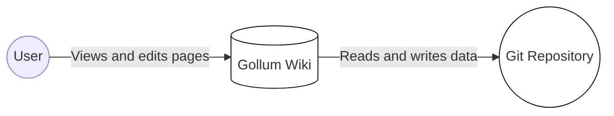
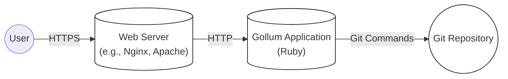
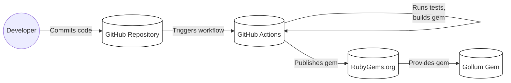

Okay, let's create a design document for the Gollum project, focusing on aspects relevant for threat modeling.

# BUSINESS POSTURE

Gollum is a simple, Git-powered wiki system.  The primary business goal is to provide an easy-to-use and easy-to-deploy wiki that leverages the power and familiarity of Git for version control.  It prioritizes simplicity and ease of integration with existing Git workflows over extensive features or enterprise-level scalability.  It appears to be targeted at smaller teams or individual users who need a lightweight, flexible wiki solution.

Business Priorities:

*   Ease of Use:  The wiki should be simple to use for both readers and editors, with minimal technical expertise required.
*   Git Integration:  Seamless integration with Git is crucial, allowing users to leverage their existing Git knowledge and workflows.
*   Easy Deployment:  The wiki should be easy to deploy and maintain, with minimal dependencies and configuration.
*   Flexibility:  Support for various markup languages and customization options.
*   Open Source: Maintain the project as a healthy, community-driven open-source project.

Business Risks:

*   Data Loss/Corruption:  Since all data is stored in a Git repository, corruption of the repository or accidental deletion of branches/commits could lead to data loss.
*   Unauthorized Access:  If the underlying Git repository or the web server hosting Gollum is compromised, unauthorized users could gain access to the wiki content, potentially modifying or deleting it.
*   Reputation Damage: Vulnerabilities in Gollum, especially those leading to data breaches or unauthorized access, could damage the reputation of the project and its maintainers.
*   Lack of Maintenance: As an open-source project, there's a risk of the project becoming unmaintained, leading to unpatched vulnerabilities and lack of support for newer Git versions or features.
*   Supply Chain Attacks: Compromise of dependencies used by Gollum could introduce vulnerabilities into the system.

# SECURITY POSTURE

Existing Security Controls:

*   security control: Git Version Control:  All wiki content is stored in a Git repository, providing inherent version control, history tracking, and the ability to revert to previous versions. (Implemented in Git itself)
*   security control: Authentication (Optional): Gollum itself does not provide built-in authentication. Authentication is typically handled by the web server (e.g., Apache, Nginx) or a reverse proxy placed in front of Gollum, or by the Git hosting provider (e.g., GitHub, GitLab) if the repository is accessed directly. (Implemented externally)
*   security control: Markup Sanitization: Gollum uses libraries (like `github-markup`) to render various markup languages (Markdown, AsciiDoc, etc.). These libraries typically include sanitization mechanisms to prevent cross-site scripting (XSS) vulnerabilities. (Implemented in libraries used by Gollum)
*   security control: File Access Control: Access to the underlying Git repository can be controlled using standard file system permissions or through Git hosting provider's access control mechanisms. (Implemented externally)

Accepted Risks:

*   accepted risk: Lack of Built-in Authentication: Gollum relies on external mechanisms for authentication, meaning that if these mechanisms are not configured correctly, the wiki could be publicly accessible.
*   accepted risk: Limited Authorization: Gollum does not have fine-grained authorization mechanisms. Access control is primarily based on access to the Git repository.
*   accepted risk: Dependency Vulnerabilities: Gollum relies on several external libraries, which could potentially contain vulnerabilities.
*   accepted risk: No Input Validation on Git Operations: Gollum doesn't directly validate Git operations performed by users, relying on Git's internal integrity checks.

Recommended Security Controls:

*   security control: Implement robust authentication using a reverse proxy (e.g., Nginx with HTTP Basic Auth or OAuth) or a dedicated authentication service.
*   security control: Regularly update Gollum and its dependencies to patch any known vulnerabilities.
*   security control: Implement a Content Security Policy (CSP) to mitigate XSS and other code injection attacks.
*   security control: Consider using a Git hosting provider with strong security features, such as two-factor authentication and access controls.
*   security control: Regularly back up the Git repository to a separate location.
*   security control: Monitor server logs for suspicious activity.

Security Requirements:

*   Authentication:
    *   The system MUST provide a mechanism for authenticating users before granting access to edit the wiki.
    *   The system SHOULD support integration with existing authentication systems (e.g., LDAP, OAuth).
*   Authorization:
    *   The system SHOULD allow administrators to control access to specific pages or sections of the wiki.  (Currently limited by Git repository access).
*   Input Validation:
    *   The system MUST sanitize all user input to prevent XSS and other code injection attacks. (Handled by markup libraries).
    *   The system SHOULD validate file uploads to prevent malicious files from being uploaded.
*   Cryptography:
    *   If sensitive data is stored in the wiki, the system SHOULD encrypt the data at rest. (This would need to be handled at the Git repository level or using encrypted files within the repository).
    *   The system MUST use HTTPS to protect data in transit. (Handled by the web server).

# DESIGN

## C4 CONTEXT



Element Descriptions:

*   Element:
    *   Name: User
    *   Type: Person
    *   Description: A person who interacts with the Gollum Wiki to view or edit content.
    *   Responsibilities:
        *   View wiki pages.
        *   Edit wiki pages.
        *   Create new wiki pages.
        *   Potentially manage the Git repository (depending on access rights).
    *   Security controls:
        *   Authentication (handled externally, e.g., by web server or Git hosting provider).
        *   Authorization (limited, based on Git repository access).

*   Element:
    *   Name: Gollum Wiki
    *   Type: Software System
    *   Description: The Gollum Wiki application, which provides a web interface for interacting with the Git repository.
    *   Responsibilities:
        *   Serve wiki pages to users.
        *   Handle user input for editing pages.
        *   Interact with the Git repository to read and write data.
        *   Render markup languages into HTML.
    *   Security controls:
        *   Markup sanitization (via libraries).
        *   Potentially, CSP (recommended).

*   Element:
    *   Name: Git Repository
    *   Type: Data Store
    *   Description: The Git repository that stores the wiki content and history.
    *   Responsibilities:
        *   Store wiki pages and their history.
        *   Provide version control functionality.
    *   Security controls:
        *   Git's internal integrity checks.
        *   File system permissions or Git hosting provider's access controls.
        *   Potentially, encryption at rest (if implemented).

## C4 CONTAINER



Element Descriptions:

*   Element:
    *   Name: User
    *   Type: Person
    *   Description: A person who interacts with the Gollum Wiki.
    *   Responsibilities: View and edit wiki pages.
    *   Security controls: Authentication and authorization (handled by Web Server).

*   Element:
    *   Name: Web Server
    *   Type: Container (Web Server)
    *   Description: A web server (e.g., Nginx, Apache) that serves the Gollum application.
    *   Responsibilities:
        *   Handle incoming HTTP requests.
        *   Terminate SSL/TLS.
        *   Potentially handle authentication.
        *   Reverse proxy requests to the Gollum application.
    *   Security controls:
        *   HTTPS configuration.
        *   Authentication (e.g., HTTP Basic Auth, OAuth).
        *   Firewall rules.

*   Element:
    *   Name: Gollum Application
    *   Type: Container (Ruby Application)
    *   Description: The Gollum application, written in Ruby, which processes requests and interacts with the Git repository.
    *   Responsibilities:
        *   Process user requests.
        *   Render wiki pages.
        *   Execute Git commands.
    *   Security controls:
        *   Markup sanitization.
        *   Potentially, CSP (recommended).

*   Element:
    *   Name: Git Repository
    *   Type: Container (Data Store)
    *   Description: The Git repository that stores the wiki content.
    *   Responsibilities: Store wiki pages and their history.
    *   Security controls:
        *   Git's internal integrity checks.
        *   File system permissions.

## DEPLOYMENT

Possible Deployment Solutions:

1.  Local Machine: Gollum can be run directly on a user's local machine for personal use.
2.  Dedicated Server: Gollum can be deployed on a dedicated server, accessible within a private network or over the internet.
3.  Cloud Server (VM): Gollum can be deployed on a virtual machine in a cloud environment (e.g., AWS EC2, Google Compute Engine, Azure VM).
4.  Containerized (Docker): Gollum can be containerized using Docker and deployed to any Docker-compatible environment (e.g., Kubernetes, Docker Swarm).

Chosen Deployment Solution (Dedicated Server):

```mermaid
graph LR
    Internet((Internet))
    Firewall[("Firewall")]
    WebServer[("Web Server\n(e.g., Nginx, Apache)")]
    GollumApp[("Gollum Application")]
    GitRepository(("Git Repository"))
    Server[("Server")]

    Internet -- "HTTPS" --> Firewall
    Firewall -- "HTTPS" --> WebServer
    WebServer -- "HTTP" --> GollumApp
    GollumApp -- "Git Commands" --> GitRepository
    WebServer --""--> Server
    GollumApp --""--> Server
    GitRepository --""--> Server
    classDef element stroke:#000,fill:#fff;
    class Firewall,WebServer,GollumApp,GitRepository,Server element;
```

Element Descriptions:

*   Element:
    *   Name: Internet
    *   Type: External Entity
    *   Description: The public internet.
    *   Responsibilities: N/A
    *   Security controls: N/A

*   Element:
    *   Name: Firewall
    *   Type: Infrastructure Node
    *   Description: A network firewall that protects the server.
    *   Responsibilities:
        *   Filter incoming and outgoing network traffic.
        *   Block unauthorized access attempts.
    *   Security controls:
        *   Firewall rules configured to allow only necessary traffic (e.g., HTTPS on port 443).

*   Element:
    *   Name: Web Server
    *   Type: Software System
    *   Description: A web server (e.g., Nginx, Apache) running on the server.
    *   Responsibilities:
        *   Handle incoming HTTP requests.
        *   Terminate SSL/TLS.
        *   Potentially handle authentication.
        *   Reverse proxy requests to the Gollum application.
    *   Security controls:
        *   HTTPS configuration.
        *   Authentication (e.g., HTTP Basic Auth, OAuth).

*   Element:
    *   Name: Gollum Application
    *   Type: Software System
    *   Description: The Gollum application running on the server.
    *   Responsibilities:
        *   Process user requests.
        *   Render wiki pages.
        *   Execute Git commands.
    *   Security controls:
        *   Markup sanitization.

*   Element:
    *   Name: Git Repository
    *   Type: Data Store
    *   Description: The Git repository stored on the server's file system.
    *   Responsibilities:
        *   Store wiki pages and their history.
    *   Security controls:
        *   Git's internal integrity checks.
        *   File system permissions.

*   Element:
    *   Name: Server
    *   Type: Infrastructure Node
    *   Description: Physical or virtual server.
    *   Responsibilities: Host all services.
    *   Security controls: OS hardening, SSH access control.

## BUILD

Gollum is a Ruby application and uses `rake` as build tool. It doesn't have dedicated CI environment, but relies on GitHub Actions for some checks.



Build Process Description:

1.  Developer commits code changes to the Gollum repository on GitHub.
2.  GitHub Actions workflow is triggered.
3.  GitHub Actions runs tests (using `rake test`) and builds the Gollum gem (using `rake build`).
4.  If the tests pass and the gem is built successfully, GitHub Actions can be configured to publish the gem to RubyGems.org.
5.  Users can then install the Gollum gem using `gem install gollum`.

Security Controls:

*   security control: GitHub Actions: Uses GitHub Actions for automated testing and building.
*   security control: `rake test`: Runs unit tests to ensure code quality and prevent regressions.
*   security control: Dependency Management: Uses Bundler to manage dependencies and ensure consistent versions.
*   security control: (Recommended) Implement SAST (Static Application Security Testing) tools in the GitHub Actions workflow to scan for vulnerabilities in the code.
*   security control: (Recommended) Implement SCA (Software Composition Analysis) tools to scan for vulnerabilities in dependencies.
*   security control: (Recommended) Use signed commits to ensure the integrity of the code.

# RISK ASSESSMENT

Critical Business Processes:

*   Wiki Content Creation and Editing:  The primary business process is the ability for users to create, edit, and view wiki content.
*   Version Control:  Maintaining a history of changes and allowing users to revert to previous versions is crucial.
*   Collaboration: Allowing multiple users to collaborate on the wiki content.

Data Sensitivity:

*   Wiki Content: The sensitivity of the wiki content depends on what is stored in the wiki. It could range from publicly available information to highly confidential data.  Gollum itself does not provide any mechanisms for classifying or protecting data based on sensitivity. This must be handled externally (e.g., by encrypting sensitive data before storing it in the wiki, or by using a Git hosting provider with appropriate access controls).
*   Git Repository Metadata: The Git repository metadata (commit messages, author information, etc.) could potentially contain sensitive information.

# QUESTIONS & ASSUMPTIONS

Questions:

*   What is the expected number of users and the expected growth rate? This will influence scalability requirements.
*   What are the specific security requirements of the organization deploying Gollum? (e.g., compliance requirements, internal policies).
*   What level of access control is required? (e.g., read-only access for some users, edit access for others).
*   Will the wiki contain any sensitive data that requires encryption at rest?
*   What is the acceptable downtime for the wiki? This will influence the deployment and backup strategy.
*   Are there any specific markup languages that need to be supported or disallowed?
*   What is the process for managing and updating dependencies?
*   Is there a budget for security tools or services?

Assumptions:

*   BUSINESS POSTURE: The primary goal is to provide a simple, Git-powered wiki, prioritizing ease of use and Git integration over advanced features.
*   SECURITY POSTURE: Authentication and authorization will be handled externally to Gollum (e.g., by a web server or Git hosting provider).
*   DESIGN: The deployment will be on a dedicated server, with a web server (e.g., Nginx) acting as a reverse proxy. The Git repository will be stored locally on the server.
*   The wiki content is not inherently highly sensitive, but users may choose to store sensitive information within it, requiring them to take appropriate precautions.
*   Basic security measures (HTTPS, firewall) will be implemented.
*   Regular updates and backups will be performed.
*   The project is maintained by volunteers and might not have dedicated security resources.