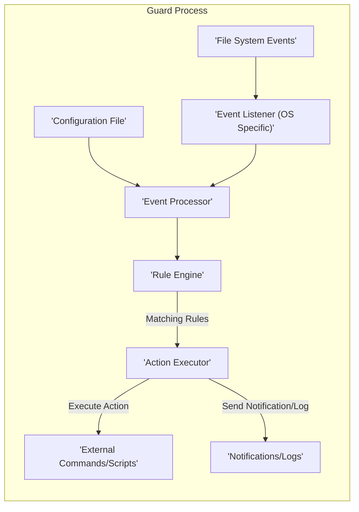

# Project Design Document: Guard - File System Event Monitor

**Version:** 1.1
**Date:** October 26, 2023
**Author:** AI Software Architect

## 1. Introduction

This document provides an enhanced and detailed design overview of the Guard project, a command-line tool designed to monitor file system events and trigger predefined actions based on a flexible rule set. This document is intended to serve as a comprehensive resource for understanding the system's architecture, individual components, and the flow of data, making it a crucial artifact for subsequent threat modeling exercises.

## 2. Goals and Objectives

The core goals and objectives of the Guard project are:

- To offer a straightforward and highly configurable method for observing changes within the file system.
- To empower users to define specific actions that are automatically executed when particular file system events are detected.
- To implement a versatile and expressive rule definition system, allowing for fine-grained control over event monitoring and action triggering.
- To be designed for extensibility, facilitating the integration of new functionalities through plugins or extensions.
- To maintain a high level of performance and efficiency in resource utilization.

## 3. System Architecture

Guard operates as a command-line application, requiring a configuration file as its primary input. It relies on operating system-specific APIs to subscribe to and receive notifications of file system events. Upon the detection of an event, Guard evaluates it against the configured rules and, if a match is found, initiates the associated actions.

## 4. Components

Guard is composed of the following essential components, each with a specific responsibility:

- **Configuration Loader:**
    - **Functionality:** Responsible for the initial task of reading and parsing the user-provided configuration file. This file typically adheres to a structured format like YAML or JSON.
    - **Key Actions:**
        - Reads the configuration file from the specified path.
        - Parses the file content into an internal data structure.
        - Performs validation checks on the configuration structure, ensuring all required fields are present and correctly formatted.
        - Validates individual rule definitions, checking for syntax errors and logical inconsistencies.
        - Handles any errors encountered during the loading process, providing informative error messages to the user to aid in debugging.

- **Event Listener (OS Specific):**
    - **Functionality:** Acts as the interface between Guard and the underlying operating system's file system event notification system.
    - **Key Actions:**
        - Utilizes OS-specific APIs such as `inotify` (Linux), `FSEvents` (macOS), or `ReadDirectoryChangesW` (Windows) to subscribe to file system events.
        - Receives raw event data from the operating system kernel.
        - Translates these OS-specific event representations into a standardized, platform-independent internal format that can be processed by other Guard components.
        - Manages the lifecycle of the event monitoring subscriptions.

- **Event Processor:**
    - **Functionality:**  Serves as an intermediary, receiving normalized file system events from the Event Listener and preparing them for rule evaluation.
    - **Key Actions:**
        - Receives the standardized file system event objects.
        - Applies initial filtering based on the configured paths and event types. This helps to reduce the number of events that need to be evaluated by the Rule Engine, improving efficiency.
        - May perform additional processing or enrichment of the event data before passing it to the next stage.

- **Rule Engine:**
    - **Functionality:** The core logic component responsible for evaluating incoming events against the user-defined rules.
    - **Key Actions:**
        - Maintains an in-memory representation of the rules loaded from the configuration file.
        - For each incoming event, iterates through the defined rules and attempts to find a match.
        - Rule matching typically involves comparing event attributes (e.g., file path, event type) against the criteria specified in the rule.
        - Rules can include:
            - **Path or Pattern Matching:** Specifying the file paths or patterns to be monitored (e.g., using wildcards or regular expressions).
            - **Event Type Filtering:** Defining the specific types of events to trigger on (e.g., file creation, modification, deletion, attribute changes).
            - **Conditional Logic (Optional):**  More advanced rules might include conditions based on file attributes (e.g., file size, modification time) or other event details.
        - Upon finding a matching rule, the Rule Engine identifies the associated actions that need to be executed.

- **Action Executor:**
    - **Functionality:** Responsible for carrying out the actions associated with a matched rule.
    - **Key Actions:**
        - Executes the actions defined in the matching rule.
        - Supports a variety of action types, including:
            - **External Command/Script Execution:**  Spawning new processes to run external commands or scripts. This involves constructing the command line, managing arguments, and setting environment variables.
            - **Notification Sending:** Sending notifications via various channels (e.g., email, Slack, custom webhooks). This requires handling authentication and formatting the notification message.
            - **Logging:** Writing event details or action outcomes to a log file or system log.
            - **Internal Function Calls (Potentially):** In more complex scenarios, actions might trigger other internal functions within Guard.
        - Handles the execution of external commands, including capturing their output and error streams.
        - Implements error handling for action execution failures.

- **Logger:**
    - **Functionality:** Provides a mechanism for recording Guard's operational activity and any significant events.
    - **Key Actions:**
        - Records various events throughout Guard's lifecycle, including:
            - Successful and failed configuration loading attempts.
            - Detection of file system events.
            - Instances of rules being matched.
            - Initiation and completion of action executions, along with their outcomes (success or failure).
            - Any errors, warnings, or informational messages generated by Guard.
        - Supports different logging levels (e.g., debug, info, warning, error) to control the verbosity of the logs.
        - Allows configuration of the logging output destination (e.g., console, a specific file, system logs).

## 5. Data Flow

The typical flow of data within the Guard system proceeds as follows:

- The user initiates the Guard application, providing the path to the desired configuration file as an argument.
- The **Configuration Loader** component takes over, reading and parsing the specified configuration file.
- The **Event Listener** component is then initialized, establishing connections with the operating system's file system event notification mechanisms for the paths specified in the configuration.
- When a file system event occurs within a monitored path, the operating system notifies the **Event Listener**.
- The **Event Listener** receives this OS-specific event data and translates it into a standardized internal representation.
- The **Event Processor** receives the normalized event. It applies configured filters based on paths and event types, discarding events that do not meet the criteria.
- Events that pass the filtering stage are then passed to the **Rule Engine**.
- The **Rule Engine** compares the attributes of the incoming event against the conditions defined in each loaded rule.
- If a rule's conditions are met by the event, a match is identified, and the **Rule Engine** determines the actions associated with that rule.
- The **Action Executor** receives the instructions for the matched rule's actions and proceeds to execute them. This might involve spawning external processes, sending network requests for notifications, or writing to log files.
- Throughout this process, the **Logger** component records significant events, actions, and any errors encountered, providing an audit trail of Guard's activity.

## 6. Security Considerations (For Threat Modeling)

This section outlines potential security vulnerabilities and threats that should be thoroughly examined during the threat modeling process:

- **Configuration File Handling:**
    - **Threat:** **Arbitrary Command Execution via Malicious Configuration:** An attacker could craft a malicious configuration file that, when parsed by Guard, leads to the execution of arbitrary commands on the system.
    - **Threat:** **Denial of Service through Resource Exhaustion:** A large or deeply nested configuration file could consume excessive resources during parsing, leading to a denial of service.
    - **Threat:** **Exposure of Sensitive Information:** If the configuration file contains sensitive information like API keys or passwords, improper handling could lead to their exposure.
    - **Mitigation Considerations:**
        - Implement secure parsing techniques to prevent injection vulnerabilities.
        - Enforce limits on the size and complexity of the configuration file.
        - Employ secure storage and handling practices for sensitive credentials, potentially using encryption or environment variables.

- **External Command Execution:**
    - **Threat:** **Command Injection:** If user-provided data or event details are directly incorporated into the commands being executed, an attacker could inject malicious commands.
    - **Threat:** **Privilege Escalation:** If Guard runs with elevated privileges, vulnerabilities in external command execution could be exploited to gain higher privileges.
    - **Threat:** **Unintended System Modification:**  Maliciously crafted commands could be used to modify or delete critical system files.
    - **Mitigation Considerations:**
        - Sanitize and validate all input used in constructing external commands.
        - Avoid directly incorporating user-provided data into commands.
        - Implement a whitelist of allowed commands or restrict command execution to specific directories.
        - Run external commands with the least necessary privileges.
        - Carefully manage environment variables passed to external commands.

- **File System Access:**
    - **Threat:** **Unauthorized File Access:** If Guard is compromised, it could be used to read sensitive files that it is monitoring.
    - **Threat:** **Path Traversal:** Vulnerabilities in how Guard handles file paths could allow an attacker to monitor or access files outside the intended scope.
    - **Threat:** **Data Modification/Deletion:** A compromised Guard instance could be used to modify or delete files within the monitored directories.
    - **Mitigation Considerations:**
        - Adhere to the principle of least privilege when granting file system permissions to the Guard process.
        - Implement robust path validation and sanitization to prevent path traversal attacks.
        - Clearly define and enforce the scope of file system monitoring.

- **Event Handling and Processing:**
    - **Threat:** **Denial of Service through Event Flooding:** An attacker could generate a large volume of file system events to overwhelm Guard's processing capabilities.
    - **Threat:** **Exploitation of Race Conditions:** Concurrency issues in event processing could lead to unexpected behavior or vulnerabilities.
    - **Threat:** **Bypassing Security Checks:**  Maliciously crafted events could potentially bypass rule matching logic or other security checks.
    - **Mitigation Considerations:**
        - Implement rate limiting or throttling mechanisms to prevent event flooding.
        - Employ secure coding practices to avoid race conditions and concurrency issues.
        - Thoroughly test event processing logic with various types of events, including potentially malicious ones.

- **Notification Mechanisms:**
    - **Threat:** **Exposure of Sensitive Information in Notifications:** Notifications might inadvertently contain sensitive data.
    - **Threat:** **Abuse of Notification Channels:** An attacker could potentially abuse Guard's notification functionality to send spam or phishing messages.
    - **Threat:** **Compromise of Notification Credentials:** If notification credentials (e.g., API keys) are stored insecurely, they could be compromised.
    - **Mitigation Considerations:**
        - Carefully consider the information included in notifications.
        - Implement authentication and authorization for notification channels.
        - Securely store and manage notification credentials, potentially using encryption or secrets management tools.

- **Logging:**
    - **Threat:** **Information Disclosure through Logs:** Logs might contain sensitive information that could be exposed if the log files are not properly secured.
    - **Threat:** **Log Tampering:** An attacker could modify log files to cover their tracks.
    - **Threat:** **Denial of Service through Log Flooding:** Excessive logging could consume disk space and impact performance.
    - **Mitigation Considerations:**
        - Avoid logging sensitive information. If necessary, redact or mask it.
        - Restrict access to log files to authorized personnel only.
        - Implement log rotation and archiving to manage log file size.
        - Consider using centralized logging solutions for enhanced security and auditability.

## 7. Deployment

Guard is typically deployed as a command-line application directly on the systems requiring file system monitoring. It can be executed as a foreground process, a background process managed by tools like `nohup` or `screen`, or as a system service managed by `systemd` (Linux) or similar service management frameworks. Key deployment considerations include:

- **Installation:**  The process for installing Guard on the target system (e.g., using package managers, manual binary deployment).
- **Permissions:**  The necessary user and file system permissions required for Guard to function correctly. It's crucial to adhere to the principle of least privilege.
- **Resource Usage:**  Estimating the expected CPU, memory, and disk I/O usage of Guard under normal and peak load conditions to ensure adequate resource allocation.
- **Dependencies:**  Identifying any external software libraries or operating system features that Guard relies on.
- **Configuration Management:**  Strategies for managing and distributing the Guard configuration file across multiple deployments.

## 8. Future Considerations

Potential future enhancements to the Guard project that could introduce new design considerations and security implications include:

- **Plugin/Extension System:**  Developing a robust plugin or extension architecture to allow users to add custom event handlers, rule conditions, and actions. This would necessitate careful consideration of plugin security, isolation, and potential vulnerabilities introduced by third-party code.
- **Centralized Management Interface:**  Implementing a centralized platform for managing and monitoring multiple Guard instances across a network. This would require secure communication protocols, authentication mechanisms, and authorization controls.
- **Web-Based User Interface:**  Providing a web interface for configuring rules, viewing events, and managing Guard instances. This would introduce typical web application security concerns such as cross-site scripting (XSS), cross-site request forgery (CSRF), and authentication vulnerabilities.
- **Integration with Security Information and Event Management (SIEM) Systems:**  Adding the capability to forward detected events and alerts to SIEM systems for centralized security monitoring and analysis. This would require secure communication channels and standardized event formats.

This enhanced design document provides a more detailed and comprehensive overview of the Guard project, specifically focusing on aspects relevant to threat modeling. It aims to facilitate a thorough analysis of potential security risks and inform the development of appropriate mitigation strategies.
