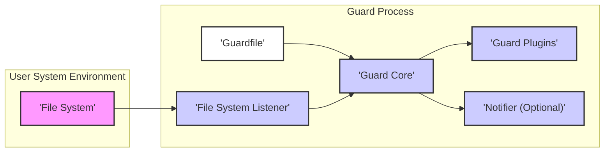

# Project Design Document: Guard - File System Event Listener

**Version:** 1.1
**Date:** October 26, 2023
**Author:** Gemini (AI Language Model)

## 1. Introduction

This document provides an enhanced and more detailed design overview of the Guard project (as found at [https://github.com/guard/guard](https://github.com/guard/guard)). This revised document aims to provide an even clearer and more comprehensive articulation of the system's architecture, components, data flow, and interactions, specifically tailored for effective threat modeling.

### 1.1. Purpose

The primary purpose of this document is to provide a highly detailed and easily understandable design description of the Guard tool. This enhanced description will empower stakeholders, especially security engineers and analysts, with a deeper understanding of the system's inner workings, enabling more precise identification of potential security vulnerabilities and attack vectors.

### 1.2. Scope

This document encompasses the core functionality of the Guard application, including its event monitoring mechanisms, configuration loading process, and the execution lifecycle of plugins. The focus remains on the logical architecture, key components, and the finer details of their interactions, crucial for security analysis.

### 1.3. Audience

This document is primarily intended for:

*   Security Engineers and Analysts: To perform thorough threat modeling, security assessments, and penetration testing.
*   Software Developers: To gain a detailed understanding of the system architecture for maintenance, debugging, and future feature development.
*   Operations and DevOps Teams: To understand the deployment, operational behavior, and potential security implications in production environments.

## 2. System Overview

Guard is a command-line interface (CLI) tool designed to monitor file system events and trigger predefined actions based on those events. It relies on a configuration file named `Guardfile` to specify the directories and files to observe, the types of events to track, and the corresponding actions (implemented as "guards" or plugins) to execute when these events occur.

### 2.1. High-Level Architecture Diagram

### 2.2. Key Components

*   **File System:** The underlying operating system's file system that Guard actively monitors for changes and events.
*   **Guard Process:** The active runtime instance of the Guard application, executing within the user's environment.
*   **Guardfile:** A configuration file, typically located in the project's root directory, written using a Ruby Domain Specific Language (DSL) to define monitoring rules and associated actions.
*   **Guard Core:** The central orchestrator within the Guard process. It manages the event loop, parses the `Guardfile`, receives events from the listener, and triggers the execution of relevant plugins.
*   **File System Listener:** A platform-specific component responsible for interacting with the operating system's file system event notification system (e.g., `inotify` on Linux, `FSEvents` on macOS, `ReadDirectoryChangesW` on Windows).
*   **Guard Plugins:** Modular units of code (either built-in or external gems) that implement specific actions to be performed when triggered by file system events. These plugins encapsulate the logic for tasks like running tests, triggering builds, or restarting services.
*   **Notifier (Optional):** A component that provides feedback to the user about the actions triggered by Guard, often through desktop notifications or console messages.

## 3. Detailed Component Description

### 3.1. Guard Core

*   **Responsibilities:**
    *   **Configuration Management:** Loads, parses, and validates the `Guardfile` to establish monitoring rules and plugin configurations.
    *   **Listener Management:** Initializes, starts, and stops the File System Listener, configuring it based on the `Guardfile` settings.
    *   **Event Reception and Routing:** Receives file system event notifications from the File System Listener.
    *   **Rule Matching:** Matches incoming events against the defined watch patterns and rules specified in the `Guardfile`.
    *   **Plugin Orchestration:** Loads, initializes, and executes the appropriate Guard plugins based on matched events. Manages the lifecycle of plugins.
    *   **Error Handling:** Manages exceptions and errors that occur during the process, including `Guardfile` parsing errors, plugin execution failures, and listener issues.
    *   **Logging:** Provides logging capabilities for debugging and monitoring the Guard process.
    *   **CLI Interface:** Handles user commands and interactions via the command line (e.g., `start`, `stop`, `reload`, `pause`).
    *   **Concurrency Management:** Potentially manages concurrent execution of plugins or handles events in a non-blocking manner.

### 3.2. Guardfile Parser

*   **Responsibilities:**
    *   **File Reading:** Reads the content of the `Guardfile` from the file system.
    *   **DSL Interpretation:** Evaluates the Ruby DSL code within the `Guardfile`. This involves executing Ruby code, which can introduce security risks if the `Guardfile` is untrusted.
    *   **Configuration Extraction:** Extracts key configuration parameters, including:
        *   Watched directories and specific files.
        *   Regular expressions or patterns for file matching.
        *   Types of file system events to monitor (e.g., `:modified`, `:added`, `:removed`).
        *   Associations between watch rules and specific Guard plugins.
        *   Plugin-specific configuration options passed to the plugins.
    *   **Syntax and Semantic Validation:** Checks the `Guardfile` for syntax errors and ensures the configuration is semantically correct.
    *   **Error Reporting:** Provides informative error messages for invalid `Guardfile` syntax or configuration.

### 3.3. File System Listener

*   **Responsibilities:**
    *   **OS API Interaction:** Interacts directly with the operating system's file system event notification API (e.g., `inotify`, `FSEvents`, `ReadDirectoryChangesW`).
    *   **Watch Registration:** Registers interest in specific directories and files with the operating system's event notification system.
    *   **Event Capture:** Receives raw file system event notifications from the operating system kernel.
    *   **Event Filtering (Optional):** May perform initial filtering of events based on configured parameters to reduce the number of events passed to the Guard Core.
    *   **Event Formatting:** Transforms the raw operating system event data into a standardized format that can be consumed by the Guard Core.
    *   **Resource Management:** Manages the resources associated with file system watching (e.g., file descriptors, memory).

### 3.4. Guard Plugins

*   **Responsibilities:**
    *   **Action Implementation:** Contains the specific logic to be executed when triggered by a file system event. This can involve running shell commands, interacting with other software, or performing custom tasks.
    *   **Event Data Consumption:** Receives information about the triggering file system event from the Guard Core, including the file path, event type, and other relevant details.
    *   **Configuration Handling:** Accepts configuration parameters passed from the `Guardfile`.
    *   **External System Interaction:** May interact with external systems, tools, or APIs based on their defined functionality. This interaction can introduce security risks depending on the plugin's implementation and the security of the external systems.
    *   **Feedback Provision:** May provide feedback or status updates to the Guard Core, which can then be relayed to the user via the Notifier.
    *   **Error Handling (Plugin-Specific):** Handles errors that occur during the plugin's execution.

### 3.5. Notifier

*   **Responsibilities:**
    *   **Notification Reception:** Receives notification messages from the Guard Core or individual plugins.
    *   **User Interface Presentation:** Displays notifications to the user through various channels, such as:
        *   Desktop notifications (using OS-specific APIs).
        *   Terminal output.
        *   Log files.
        *   Potentially other notification services.
    *   **Message Formatting:** Formats the notification messages for clear presentation to the user.

## 4. Data Flow

The flow of data within Guard can be broken down into the following key stages:

1. **Guardfile Loading and Parsing:**
    *   When the Guard process starts, the Guard Core initiates the configuration loading process.
    *   The Guard Core reads the `Guardfile` from the file system.
    *   The content of the `Guardfile` (Ruby DSL code) is passed to the Guardfile Parser.
    *   The Guardfile Parser evaluates the Ruby code and extracts configuration data, including watch rules, plugin assignments, and plugin options.
    *   The parsed configuration data is then passed back to the Guard Core.

2. **File System Watch Setup:**
    *   The Guard Core uses the parsed configuration to instruct the File System Listener about which directories and files to monitor and for what types of events.
    *   The File System Listener communicates with the operating system's file system event API to register these watches.

3. **Event Detection and Notification:**
    *   The operating system monitors the registered file system paths.
    *   When a relevant file system event occurs (e.g., a file is modified), the operating system's kernel sends a notification to the File System Listener.
    *   The File System Listener receives this raw event data from the OS.

4. **Event Processing and Plugin Triggering:**
    *   The File System Listener formats the raw event data (e.g., file path, event type) and passes it to the Guard Core.
    *   The Guard Core receives the formatted event data.
    *   The Guard Core compares the received event data against the rules defined in the loaded configuration from the `Guardfile`.
    *   If a match is found, the Guard Core identifies the associated Guard plugin(s).
    *   The Guard Core loads the identified plugin (if not already loaded).
    *   The Guard Core invokes the relevant methods of the plugin, passing the event data and any configured options as arguments.

5. **Plugin Execution and Potential External Interaction:**
    *   The Guard plugin receives the event data and configuration.
    *   The plugin executes its defined logic, which may involve:
        *   Executing shell commands.
        *   Interacting with other processes or services.
        *   Modifying files on the file system.
        *   Making network requests.
    *   The results or output of the plugin's execution may be passed back to the Guard Core.

6. **User Notification (Optional):**
    *   The Guard Core or a Guard plugin may send a notification message to the Notifier component.
    *   The Notifier formats the message and displays it to the user through the configured notification method.

## 5. Interactions

The interactions between the components are critical to understand the system's behavior and potential vulnerabilities:

*   **User <-> Guard Core (via CLI):** The user interacts with Guard by issuing commands through the command-line interface. This interaction involves passing commands and arguments to the Guard Core, which then interprets and executes them.
*   **Guard Core <-> Guardfile Parser (Data Exchange):** The Guard Core passes the raw content of the `Guardfile` to the Guardfile Parser and receives the parsed configuration data in return. This interaction involves the transfer of potentially untrusted code.
*   **Guard Core <-> File System Listener (Control and Data):** The Guard Core sends control information to the File System Listener (e.g., which paths to watch) and receives file system event notifications from it.
*   **Guard Core <-> Guard Plugins (Invocation and Data Passing):** The Guard Core invokes methods on Guard plugins, passing event data and configuration options. Plugins may also return data or status information to the Guard Core.
*   **Guard Core <-> Notifier (Notification Messages):** The Guard Core sends formatted notification messages to the Notifier for display to the user.
*   **File System Listener <-> Operating System (API Calls and Event Reception):** The File System Listener interacts directly with the operating system's file system event notification API to register watches and receive event notifications.
*   **Guard Plugins <-> External Systems (Command Execution, API Calls, etc.):** Guard plugins can initiate interactions with external systems, such as executing shell commands, making HTTP requests, or interacting with databases. The nature and security of these interactions are highly dependent on the specific plugin.

## 6. Trust Boundaries

Identifying trust boundaries is essential for effective threat modeling. In the context of Guard:

*   **Trust Boundary 1: User-Provided `Guardfile`:** The `Guardfile` contains Ruby code provided by the user. This is a significant trust boundary because the Guard process executes this code with the privileges of the user running Guard. Malicious or poorly written code in the `Guardfile` can lead to arbitrary code execution, privilege escalation, or other security compromises.
*   **Trust Boundary 2: The File System:** Guard interacts with the file system by monitoring for changes and potentially triggering actions that modify files. This boundary involves trusting the integrity of the file system and the operating system's access controls. Vulnerabilities in the file system or OS could be exploited.
*   **Trust Boundary 3: Guard Plugins:** Guard plugins are often external and can execute arbitrary code. This represents a major trust boundary, as malicious plugins could perform any action the user running Guard has permissions for. The source and trustworthiness of plugins are critical security considerations.
*   **Trust Boundary 4: External Processes Executed by Plugins:** When plugins execute external commands, a trust boundary exists between the Guard process and the executed processes. The security of these interactions depends on the commands being executed and the integrity of the external tools. Input sanitization and proper command construction are crucial.
*   **Trust Boundary 5: Communication with Notifier:** If the Notifier interacts with external services or displays user-controlled content, a trust boundary exists. For example, if the Notifier sends notifications over a network, the security of that communication channel needs to be considered.

## 7. Assumptions and Constraints

*   Guard relies on the correct and secure implementation of the underlying operating system's file system event notification mechanisms.
*   The security of Guard is heavily dependent on the trustworthiness of the `Guardfile` and the loaded Guard plugins.
*   Users running Guard have the necessary file system permissions to monitor the specified directories and execute the actions defined in the plugins.
*   The Ruby environment in which Guard runs is assumed to be secure and free from known vulnerabilities.
*   The performance and stability of Guard can be affected by the number of files and directories being monitored and the frequency of file system events.
*   Error handling within plugins is the responsibility of the plugin developers. Guard Core provides basic error handling for plugin execution failures but cannot anticipate all potential plugin-specific issues.

## 8. Future Considerations (Out of Scope for this Document)

*   Implementation of security features like sandboxing or isolation for Guard plugins to limit their potential impact.
*   Mechanisms for verifying the integrity and authenticity of Guard plugins.
*   Advanced input validation and sanitization techniques for the `Guardfile` to mitigate the risks of malicious code injection.
*   Secure communication protocols for any potential future features involving remote monitoring or control.
*   Resource management and throttling mechanisms to prevent denial-of-service scenarios due to excessive file system events or plugin activity.

This enhanced design document provides a more granular and detailed understanding of the Guard project, specifically tailored to facilitate thorough and effective threat modeling activities. By clearly outlining the components, data flows, interactions, and trust boundaries, security analysts can more effectively identify potential vulnerabilities and develop appropriate mitigation strategies.