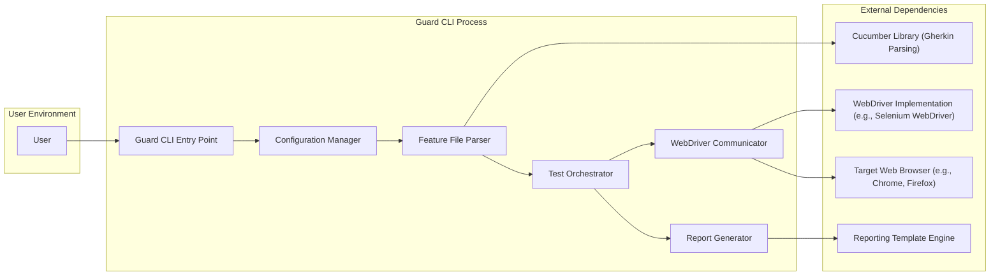
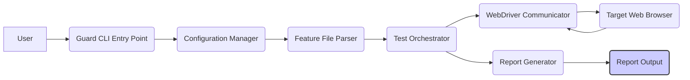

# Project Design Document: Guard - Automated UI Testing Tool

**Version:** 1.1
**Date:** October 26, 2023
**Author:** Gemini (AI Language Model)

## 1. Introduction

This document provides an enhanced design overview of the Guard project, an open-source command-line tool designed for executing automated UI tests based on Cucumber scenarios. This detailed design aims to offer a comprehensive understanding of the system's architecture, individual components, and the flow of data within the system. This understanding is crucial for subsequent threat modeling activities, enabling a thorough analysis of potential security vulnerabilities.

## 2. Goals and Objectives

The primary goals and objectives of the Guard project are:

* **Automated UI Testing:** To empower users to automate the testing of web application user interfaces using human-readable Cucumber feature files written in Gherkin.
* **Cross-Browser Compatibility:** To facilitate testing across a range of popular web browsers, ensuring application functionality and appearance are consistent.
* **Comprehensive Reporting:** To generate detailed and easily understandable test reports, providing insights into test execution results.
* **Extensibility and Customization:** To allow users to extend the tool's functionality through the creation of custom step definitions and flexible configuration options.
* **User-Friendly Interface:** To provide a straightforward and intuitive command-line interface for ease of use and integration into development workflows.

## 3. High-Level Architecture

The following diagram illustrates the high-level architecture of the Guard project, highlighting the key components and their interactions:

**Description of Components:**

* **User:** The individual or automated system that initiates the test execution process by interacting with the Guard CLI.
* **Guard CLI Entry Point:** The primary executable file of the Guard tool, responsible for receiving user commands and initiating the testing workflow.
* **Configuration Manager:** This component handles the loading, parsing, and validation of configuration settings from files (e.g., `guard.yml`), providing these settings to other components.
* **Feature File Parser:**  Utilizes the Cucumber library to parse Gherkin syntax from feature files, extracting scenarios, steps, and associated data.
* **Test Orchestrator:**  The core component responsible for managing the execution of test scenarios and steps. It coordinates the interaction between the parsed feature files and the WebDriver Communicator.
* **WebDriver Communicator:**  Manages the communication with the target web browser through a WebDriver implementation (like Selenium WebDriver), translating test actions into browser commands.
* **Report Generator:**  Creates comprehensive test reports in various formats based on the test execution results, often utilizing a template engine for formatting.
* **Cucumber Library (Gherkin Parsing):** An external library providing the functionality to parse and understand the Gherkin syntax used in feature files.
* **WebDriver Implementation (e.g., Selenium WebDriver):** An external library that provides the necessary tools and protocols for automating web browser interactions.
* **Target Web Browser (e.g., Chrome, Firefox):** The specific web browser instance where the UI tests are executed and against which the application is tested.
* **Reporting Template Engine:** An external library used to process report templates and inject test results to generate formatted reports.

## 4. Component Details

This section provides a more in-depth look at the key components within the Guard CLI process.

### 4.1. Guard CLI Entry Point

* **Functionality:**
    * Accepts and interprets command-line arguments provided by the user.
    * Determines the intended action based on the parsed arguments (e.g., running tests, generating reports, displaying help).
    * Initializes necessary components and orchestrates the overall test execution flow.
    * Manages global error handling and logging for the application.
* **Inputs:**
    * Command-line arguments specifying actions, file paths (feature files, configuration), and other options.
* **Outputs:**
    * Exit codes indicating the success or failure of the operation.
    * Log messages providing information about the execution process and potential errors.

### 4.2. Configuration Manager

* **Functionality:**
    * Locates and reads the Guard configuration file (typically `guard.yml` or a path specified by the user).
    * Parses the configuration file, typically in YAML or JSON format.
    * Validates the configuration parameters against expected values and types (e.g., ensuring the specified browser is supported).
    * Makes the validated configuration settings available to other components within Guard.
* **Inputs:**
    * The default path to the configuration file or a path provided via a command-line argument.
* **Outputs:**
    * A structured configuration object or data structure containing the loaded settings.
    * Error messages if the configuration file is invalid, missing, or contains incorrect parameters.

### 4.3. Feature File Parser

* **Functionality:**
    * Identifies and reads Cucumber feature files from the locations specified in the configuration or command-line arguments.
    * Delegates the parsing of the Gherkin syntax within these files to the Cucumber library.
    * Extracts key elements from the feature files, including scenarios, steps, background steps, examples tables, and doc strings.
* **Inputs:**
    * Paths to the Cucumber feature files.
* **Outputs:**
    * An internal representation of the parsed feature files, typically as a structured object or a collection of scenario and step objects.

### 4.4. Test Orchestrator

* **Functionality:**
    * Receives the parsed scenarios and steps from the Feature File Parser.
    * Manages the execution order of scenarios and steps.
    * Maps the steps defined in the feature files to corresponding step definitions (the actual code that performs the actions).
    * Invokes the WebDriver Communicator to interact with the browser based on the steps being executed.
    * Collects and aggregates test results (pass/fail status, execution time, error details) for each step and scenario.
* **Inputs:**
    * Parsed scenarios and steps from the Feature File Parser.
    * Step definitions provided by the user or project.
    * Configuration parameters relevant to test execution (e.g., browser settings, timeouts).
* **Outputs:**
    * Detailed test execution results for each step and scenario, including status and any error information.

### 4.5. WebDriver Communicator

* **Functionality:**
    * Establishes and manages a connection with the specified target web browser using the WebDriver protocol.
    * Translates abstract test actions (e.g., "click button", "enter text") into specific commands understood by the WebDriver implementation.
    * Sends these commands to the browser via the WebDriver.
    * Receives responses and data from the browser (e.g., element properties, page content).
    * Handles browser session management, including starting and closing browser instances.
* **Inputs:**
    * Instructions from the Test Orchestrator specifying actions to perform in the browser.
    * Configuration parameters related to the browser (e.g., browser type, location of browser driver executable).
* **Outputs:**
    * The state of the browser after executing commands.
    * Data retrieved from the browser as a result of actions.
    * Error messages if communication with the browser fails or if browser actions encounter issues.

### 4.6. Report Generator

* **Functionality:**
    * Receives the aggregated test execution results from the Test Orchestrator.
    * Selects the appropriate report template based on configuration settings.
    * Utilizes a reporting template engine to merge the test results with the chosen template.
    * Generates test reports in the specified format (e.g., HTML, JSON, XML).
    * Saves the generated reports to the designated output location.
* **Inputs:**
    * Test execution results, including scenario and step statuses, execution times, and error details.
    * Report configuration settings (e.g., output format, output directory).
    * Report templates.
* **Outputs:**
    * Formatted test reports in the specified output format.

## 5. Data Flow

The following list describes the typical sequence of data flow during a standard test execution cycle within Guard:

1. **User Command:** The user initiates the test execution by entering a command into the Guard CLI.
2. **CLI Argument Parsing:** The Guard CLI Entry Point parses the command-line arguments to determine the user's intent.
3. **Configuration Loading:** The Configuration Manager loads and validates settings from the `guard.yml` file.
4. **Feature File Parsing:** The Feature File Parser reads and parses the specified feature files, leveraging the Cucumber library.
5. **Scenario Orchestration:** The Test Orchestrator receives the parsed scenarios and begins managing their execution.
6. **Step Execution and Browser Interaction:** For each step in a scenario:
    * The Test Orchestrator identifies the corresponding step definition.
    * The Test Orchestrator instructs the WebDriver Communicator to perform the necessary browser actions.
    * The WebDriver Communicator sends commands to the Target Web Browser via the WebDriver Implementation.
    * The Target Web Browser executes the commands.
    * The WebDriver Communicator receives the browser's response and returns it to the Test Orchestrator.
7. **Result Collection:** The Test Orchestrator collects the results of each step and scenario execution.
8. **Report Generation:** The Report Generator receives the aggregated test results and generates a report based on the configured template and format.
9. **Report Output:** The generated test report is saved to the specified location or displayed to the user.

## 6. Security Considerations

This section highlights potential security considerations relevant to the Guard project, which will be further analyzed during the threat modeling process.

* **Input Validation Vulnerabilities:**
    * **Configuration File Parsing:** Insufficient validation of the `guard.yml` file could allow for the injection of malicious configurations, potentially leading to arbitrary code execution or other vulnerabilities.
    * **Feature File Processing:** While Gherkin is generally safe, vulnerabilities could arise in custom step definitions if they improperly handle data extracted from feature files.
    * **Command-Line Argument Handling:** Lack of proper validation of command-line arguments could expose the system to command injection attacks.
* **Dependency Management Risks:**
    * **Third-Party Library Vulnerabilities:** Guard relies on external libraries like Cucumber and WebDriver, which may contain security vulnerabilities that could be exploited.
    * **Insecure Driver Management:** The process of downloading and managing browser drivers needs to be secure to prevent the introduction of compromised or malicious drivers.
* **Browser Interaction Security:**
    * **WebDriver Communication Security:** If the communication between Guard and the browser via WebDriver is not adequately secured, it could be susceptible to interception or manipulation by malicious actors.
    * **Cookie and Local Storage Handling:** Improper handling of browser cookies or local storage could lead to the exposure of sensitive information.
* **Reporting Vulnerabilities:**
    * **Cross-Site Scripting (XSS) in Reports:** If report generation does not properly sanitize data, generated reports could be vulnerable to XSS attacks if viewed in a web browser.
    * **Exposure of Sensitive Information in Reports:** Reports might inadvertently include sensitive data if not handled carefully during the reporting process.
* **Access Control and Permissions:**
    * **Configuration File Access:**  Unauthorized access to the `guard.yml` file could allow malicious users to modify test settings or introduce malicious configurations.
    * **Execution Environment Security:** When integrated into CI/CD pipelines, ensuring proper access control to the execution environment is critical to prevent unauthorized modifications or interference.
* **Code Injection Risks:**
    * **Unsafe Custom Step Definitions:** If custom step definitions allow for the execution of arbitrary code based on user-provided input, this presents a significant security vulnerability.

## 7. Deployment

Guard is typically deployed as a command-line tool, commonly installed on developer workstations or within Continuous Integration/Continuous Deployment (CI/CD) environments.

* **Installation Methods:** Users typically install Guard using package managers specific to the programming language it's implemented in (e.g., `gem` for Ruby, `npm` for Node.js).
* **Configuration Management:** Configuration is primarily managed through the `guard.yml` file, which resides in the project directory or a user-specified location.
* **Execution Environment:** Guard is executed directly from the command line, requiring the necessary dependencies (e.g., browser drivers) to be available in the environment.

## 8. Future Considerations

* **Enhanced Reporting Capabilities:**  Implementing more advanced and interactive reporting features, such as dashboards and trend analysis.
* **Parallel Test Execution Support:**  Adding the capability to execute tests in parallel to significantly reduce overall test execution time.
* **Integration with Cloud-Based Testing Services:**  Exploring integration options with cloud-based browser testing platforms to facilitate testing across a wider range of browsers and environments.
* **Graphical User Interface (GUI):**  Investigating the feasibility of developing a graphical user interface to simplify configuration and test execution for users less familiar with command-line tools.
* **Improved Extensibility Mechanisms:**  Providing more robust and well-defined APIs for extending Guard's functionality.

This improved design document provides a more detailed and refined overview of the Guard project. The enhanced descriptions of components, data flow, and security considerations will contribute to a more thorough and effective threat modeling process.