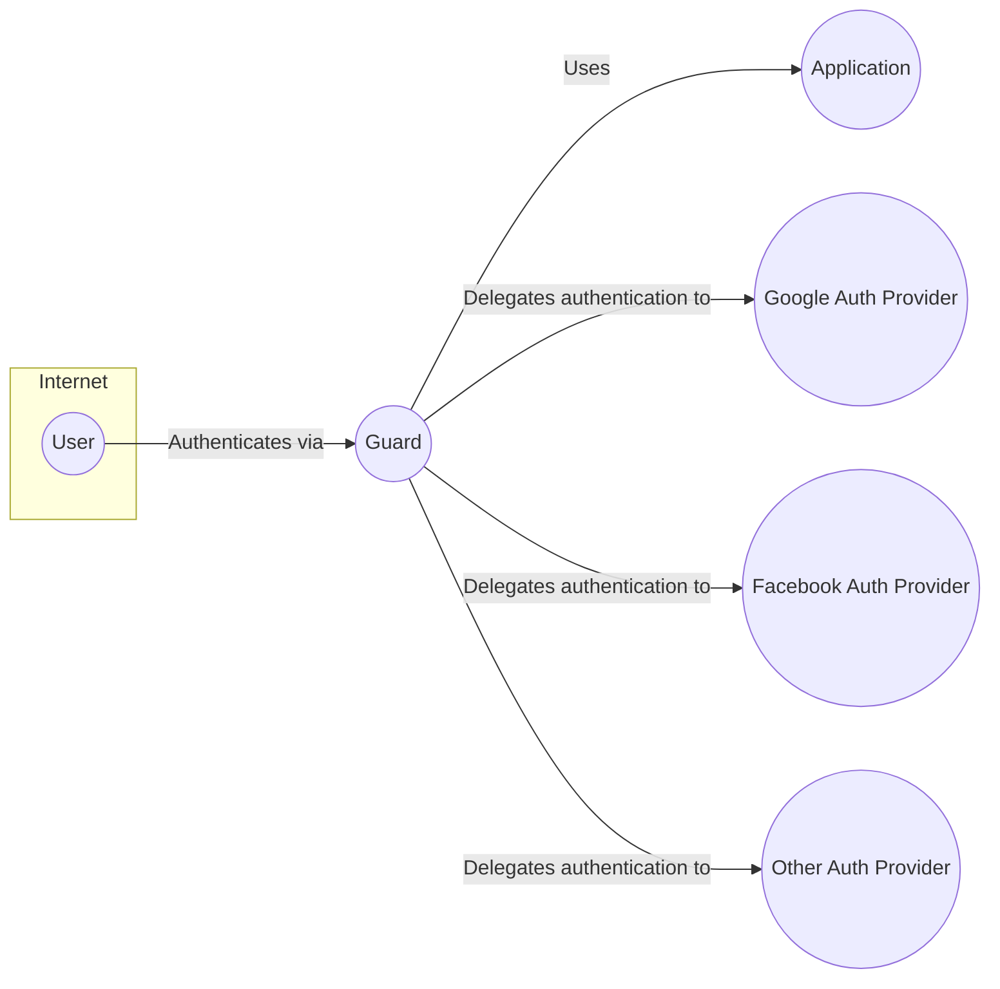
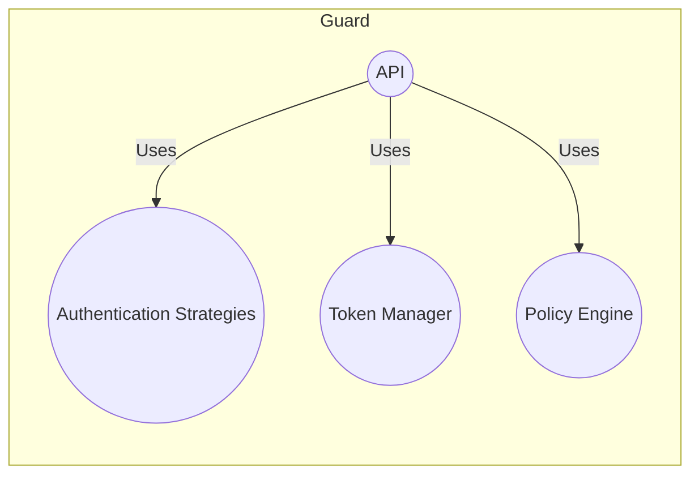
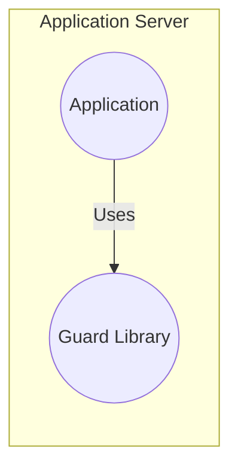
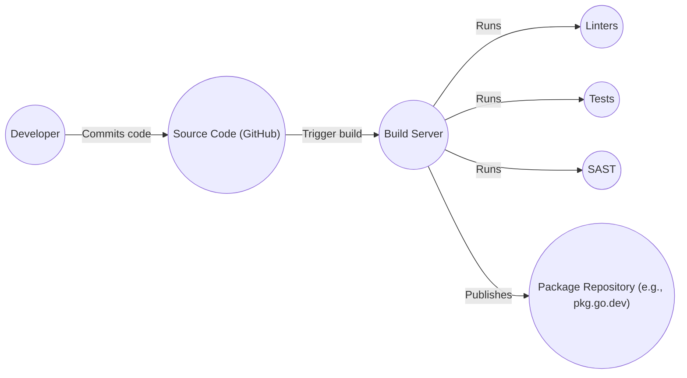

Okay, let's create a design document for the `guard/guard` GitHub repository.

# BUSINESS POSTURE

Business Priorities and Goals:

*   Provide a simple, user-friendly authentication and authorization solution.
*   Offer a lightweight, easily integrable alternative to more complex identity management systems.
*   Support various authentication methods, including social logins and custom strategies.
*   Enable developers to quickly implement secure access control in their applications.
*   Minimize external dependencies to reduce the attack surface and simplify deployment.
*   Provide clear and comprehensive documentation to facilitate adoption and usage.

Business Risks:

*   Compromise of user credentials due to vulnerabilities in the authentication process.
*   Unauthorized access to protected resources due to flaws in the authorization logic.
*   Denial of service attacks targeting the authentication service.
*   Data breaches resulting from inadequate protection of user data.
*   Reputational damage due to security incidents.
*   Integration challenges with existing systems and applications.
*   Lack of support for emerging authentication standards and technologies.

# SECURITY POSTURE

Existing Security Controls:

*   security control: Support for multiple authentication strategies (e.g., OAuth2, SAML, JWT, etc.) - described in repository documentation and examples.
*   security control: Use of established cryptographic libraries for secure handling of credentials and tokens - visible in source code.
*   security control: Implementation of common security best practices, such as input validation and parameterized queries (where applicable) - visible in source code.
*   security control: Provision of examples and documentation to guide secure implementation - described in repository documentation and examples.
*   security control: Regular updates and maintenance to address security vulnerabilities - visible in commit history.

Accepted Risks:

*   accepted risk: Reliance on third-party authentication providers (e.g., Google, Facebook) introduces a dependency on their security posture.
*   accepted risk: The project's simplicity may limit its ability to handle complex authorization scenarios.
*   accepted risk: The project's scope does not include advanced features like multi-factor authentication (MFA) or adaptive authentication.

Recommended Security Controls:

*   security control: Implement robust input validation and sanitization to prevent injection attacks.
*   security control: Enforce secure password policies, including complexity requirements and account lockout mechanisms.
*   security control: Provide options for integrating with existing security infrastructure, such as SIEM systems and threat intelligence feeds.
*   security control: Conduct regular security audits and penetration testing to identify and address vulnerabilities.
*   security control: Implement rate limiting and other measures to mitigate denial-of-service attacks.
*   security control: Offer guidance on secure storage and handling of user data, including encryption at rest and in transit.
*   security control: Implement comprehensive logging and monitoring to detect and respond to security incidents.

Security Requirements:

*   Authentication:
    *   Support for multiple authentication methods, including username/password, social logins, and API keys.
    *   Secure storage of user credentials using strong hashing algorithms.
    *   Protection against brute-force and credential stuffing attacks.
    *   Session management with secure session tokens and timeouts.
*   Authorization:
    *   Role-based access control (RBAC) to restrict access to resources based on user roles.
    *   Fine-grained access control using attributes or claims.
    *   Centralized policy management for consistent enforcement of authorization rules.
*   Input Validation:
    *   Strict validation of all user inputs to prevent injection attacks (e.g., SQL injection, cross-site scripting).
    *   Use of whitelisting or allow-listing to restrict input to known safe values.
    *   Encoding or escaping of output to prevent cross-site scripting vulnerabilities.
*   Cryptography:
    *   Use of strong, industry-standard cryptographic algorithms for encryption, hashing, and digital signatures.
    *   Secure key management practices to protect cryptographic keys.
    *   Protection of data in transit using TLS/SSL.
    *   Consideration of data at rest encryption for sensitive data.

# DESIGN

## C4 CONTEXT

Element Descriptions:

*   Element:
    *   Name: User
    *   Type: Person
    *   Description: A user who needs to authenticate to access the application.
    *   Responsibilities: Initiates the authentication process, provides credentials or uses social login.
    *   Security controls: Strong password, potentially MFA (managed by auth providers).

*   Element:
    *   Name: Guard
    *   Type: Software System
    *   Description: The authentication and authorization library.
    *   Responsibilities: Handles authentication requests, validates credentials, issues tokens, enforces authorization policies.
    *   Security controls: Input validation, secure credential handling, secure token generation, authorization checks.

*   Element:
    *   Name: Application
    *   Type: Software System
    *   Description: The application that uses Guard for authentication and authorization.
    *   Responsibilities: Integrates with Guard, protects resources based on Guard's authorization decisions.
    *   Security controls: Relies on Guard for authentication and authorization.

*   Element:
    *   Name: Google Auth Provider
    *   Type: Software System
    *   Description: Google's authentication service.
    *   Responsibilities: Authenticates users using Google accounts.
    *   Security controls: Managed by Google.

*   Element:
    *   Name: Facebook Auth Provider
    *   Type: Software System
    *   Description: Facebook's authentication service.
    *   Responsibilities: Authenticates users using Facebook accounts.
    *   Security controls: Managed by Facebook.

*   Element:
    *   Name: Other Auth Provider
    *   Type: Software System
    *   Description: Any other supported authentication provider.
    *   Responsibilities: Authenticates users using their respective accounts.
    *   Security controls: Managed by the respective provider.

## C4 CONTAINER

Element Descriptions:

*   Element:
    *   Name: API
    *   Type: API
    *   Description: The interface exposed by Guard for application integration.
    *   Responsibilities: Receives authentication and authorization requests, interacts with other components.
    *   Security controls: Input validation, authentication, authorization.

*   Element:
    *   Name: Authentication Strategies
    *   Type: Component
    *   Description: Handles different authentication methods (OAuth2, SAML, JWT, etc.).
    *   Responsibilities: Validates credentials, interacts with external providers.
    *   Security controls: Secure handling of credentials, secure communication with providers.

*   Element:
    *   Name: Token Manager
    *   Type: Component
    *   Description: Manages the generation, validation, and revocation of tokens.
    *   Responsibilities: Creates secure tokens, verifies token signatures, handles token expiration.
    *   Security controls: Secure token generation, secure storage of signing keys.

*   Element:
    *   Name: Policy Engine
    *   Type: Component
    *   Description: Enforces authorization policies.
    *   Responsibilities: Evaluates access requests against defined policies, determines access permissions.
    *   Security controls: Secure policy storage, consistent policy enforcement.

## DEPLOYMENT

Possible Deployment Solutions:

1.  **Library Integration:** Guard is primarily a library, so the most common deployment is direct integration into the target application. The application developer includes Guard as a dependency and configures it within their application code.
2.  **Standalone Service (Less Common):** While designed as a library, Guard *could* be wrapped in a thin service layer to create a standalone authentication/authorization service. This is less typical but possible.

Chosen Solution (Library Integration):

Element Descriptions:

*   Element:
    *   Name: Application Server
    *   Type: Server
    *   Description: The server hosting the application that uses Guard.
    *   Responsibilities: Runs the application code, handles HTTP requests.
    *   Security controls: Standard server security measures (firewall, OS hardening, etc.).

*   Element:
    *   Name: Application
    *   Type: Application
    *   Description: The application that integrates Guard.
    *   Responsibilities: Provides application functionality, uses Guard for authentication and authorization.
    *   Security controls: Relies on Guard for authentication and authorization.

*   Element:
    *   Name: Guard Library
    *   Type: Library
    *   Description: The Guard library integrated into the application.
    *   Responsibilities: Handles authentication and authorization within the application.
    *   Security controls: Input validation, secure credential handling, secure token generation, authorization checks.

## BUILD

The build process for Guard focuses on creating a distributable library package. Since it's a Go library, the primary build artifact is the compiled library itself, along with its dependencies.

Build Process Description:

1.  **Code Commit:** A developer commits code changes to the GitHub repository.
2.  **Build Trigger:** A continuous integration (CI) system (e.g., GitHub Actions, Travis CI, CircleCI) detects the code change and triggers a build.
3.  **Build Server:** The CI system spins up a build server.
4.  **Linting:** Code linters (e.g., `golangci-lint`) are run to check for code style and potential errors.
5.  **Testing:** Unit tests and integration tests are executed to verify the functionality of the code.
6.  **SAST (Static Application Security Testing):** A SAST tool (e.g., `gosec`) is run to scan the code for potential security vulnerabilities.
7.  **Package:** If all checks pass, the library is built and packaged.
8.  **Publish:** The packaged library is published to a package repository (e.g., `pkg.go.dev`).

Security Controls in Build Process:

*   security control: Code linters enforce coding standards and help prevent common errors.
*   security control: Automated testing ensures code quality and helps catch bugs early.
*   security control: SAST tools identify potential security vulnerabilities in the code.
*   security control: CI/CD pipeline automates the build process, ensuring consistency and reducing manual errors.
*   security control: Dependency management tools (e.g., Go Modules) help manage and track dependencies, reducing the risk of using vulnerable libraries.

# RISK ASSESSMENT

Critical Business Processes:

*   User authentication: Ensuring only legitimate users can access the application.
*   Authorization: Controlling access to resources based on user roles and permissions.
*   Data protection: Safeguarding user data and preventing unauthorized access.

Data Sensitivity:

*   User credentials (passwords, tokens): Highly sensitive.
*   User profile information (email, name, etc.): Potentially sensitive, depending on the application.
*   Application data: Sensitivity varies depending on the application's purpose.

# QUESTIONS & ASSUMPTIONS

Questions:

*   What specific authentication providers are required beyond Google and Facebook?
*   What are the specific authorization requirements (e.g., roles, permissions)?
*   Are there any existing identity management systems that Guard needs to integrate with?
*   What are the performance requirements for the authentication and authorization processes?
*   What level of logging and auditing is required?
*   Are there any specific regulatory compliance requirements (e.g., GDPR, HIPAA)?

Assumptions:

*   BUSINESS POSTURE: The primary goal is to provide a simple and secure authentication/authorization solution. Cost and complexity are important considerations.
*   SECURITY POSTURE: The project prioritizes ease of use and integration, but security is a critical requirement. A balance between simplicity and security is needed.
*   DESIGN: The library integration deployment model is the most common and appropriate approach. The CI/CD pipeline will include security checks (linting, testing, SAST).